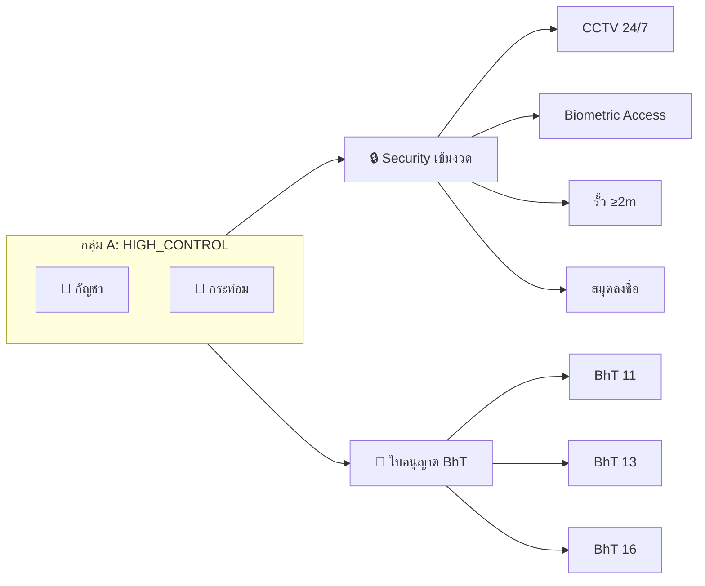
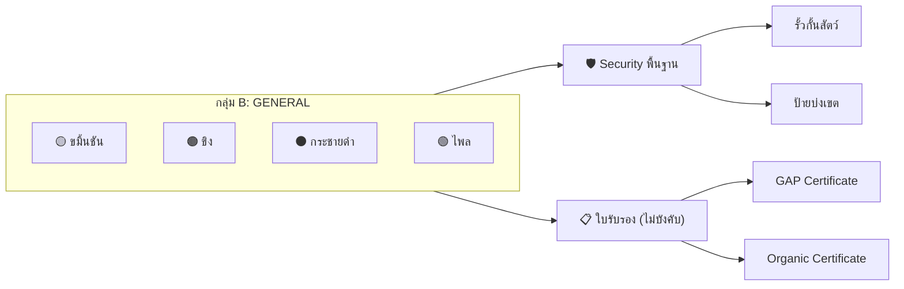
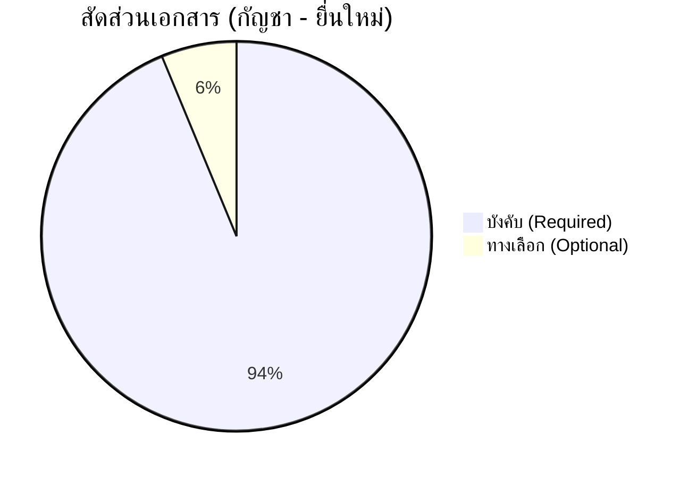

# GACP Document Requirements Research
## รายงานวิจัยเอกสารที่ต้องใช้ในการขออนุญาตสมุนไพรควบคุม

> **อ้างอิงกฎหมาย**: พ.ร.บ. คุ้มครองและส่งเสริมภูมิปัญญาการแพทย์แผนไทย พ.ศ. 2542 (มาตรา 44, 45, 46)  
> **วันที่วิจัย**: 10 ธันวาคม 2568

---

## 📋 สารบัญ
1. [บทนำและขอบเขต](#1-บทนำและขอบเขต)
2. [การจำแนกประเภทพืช](#2-การจำแนกประเภทพืช)
3. [เอกสารตามหมวดหมู่](#3-เอกสารตามหมวดหมู่)
4. [เอกสารแยกตามพันธุ์พืช](#4-เอกสารแยกตามพันธุ์พืช)
5. [เอกสารตัวอย่าง (Templates)](#5-เอกสารตัวอย่าง)
6. [ข้อผิดพลาดที่พบบ่อย](#6-ข้อผิดพลาดที่พบบ่อย)
7. [การจัดเล่มเอกสาร](#7-การจัดเล่มเอกสาร)

---

## 1. บทนำและขอบเขต

### 1.1 หัวใจสำคัญ

> [!IMPORTANT]
> การขออนุญาตสมุนไพรควบคุมไม่ได้ใช้แค่ "แบบฟอร์ม" ใบเดียว แต่ต้องเขียน **"แผนการดำเนินงาน"** และ **"เอกสารประกอบสถานที่"** ที่รัดกุม เพื่อแสดงให้ผู้อนุญาตเห็นว่าคุณมีการควบคุมความปลอดภัยที่ดี

### 1.2 พืชที่อยู่ภายใต้การควบคุม (ปัจจุบัน)

| รหัส | ชื่อไทย | ชื่ออังกฤษ | กลุ่ม | ระดับการควบคุม |
|------|---------|------------|-------|----------------|
| CAN | กัญชา | Cannabis | HIGH_CONTROL | เข้มงวดสูง (ใช้ ภ.ท. 12) |
| KRA | กระท่อม | Kratom | HIGH_CONTROL | เข้มงวดสูง |
| TUR | ขมิ้นชัน | Turmeric | GENERAL | ทั่วไป |
| GIN | ขิง | Ginger | GENERAL | ทั่วไป |
| GAL | กระชายดำ | Black Galingale | GENERAL | ทั่วไป |
| PLA | ไพล | Plai | GENERAL | ทั่วไป |

---

## 2. การจำแนกประเภทพืช

### 2.1 กลุ่ม A: HIGH_CONTROL (สมุนไพรควบคุมเข้มงวด)



#### ข้อกำหนดความปลอดภัย (กลุ่ม A)

| รายการ | กัญชา | กระท่อม | หมายเหตุ |
|--------|-------|---------|----------|
| CCTV 24/7 | ✅ **บังคับ** | ✅ **บังคับ** | Medical Grade |
| รั้ว ≥2 เมตร | ✅ **บังคับ** | ✅ **บังคับ** | High Security |
| สมุดลงชื่อ | ✅ **บังคับ** | ✅ **บังคับ** | Access Log |
| Biometric/Key Card | ✅ **บังคับ** | ❓ ทางเลือก | ระบบสแกนนิ้ว/บัตร |
| เจ้าหน้าที่รักษาความปลอดภัย | ❓ ทางเลือก | ❓ ทางเลือก | Security Guard |

### 2.2 กลุ่ม B: GENERAL (สมุนไพรทั่วไป)



---

## 3. เอกสารตามหมวดหมู่

### 3.1 ตารางหมวดหมู่เอกสาร

| หมวดหมู่ | ชื่อไทย | คำอธิบาย |
|----------|---------|----------|
| **IDENTITY** | เอกสารระบุตัวตน | บัตร ปชช., ทะเบียนบ้าน, หนังสือรับรองนิติบุคคล |
| **LICENSE** | ใบอนุญาต | BhT 11/13/16, ใบรับจดแจ้ง |
| **PROPERTY** | เอกสารสถานที่ | โฉนด, สัญญาเช่า, แผนที่, รูปถ่าย |
| **COMPLIANCE** | เอกสาร SOP/ความปลอดภัย | มาตรการรักษาความปลอดภัย, SOP, CCTV Plan |
| **FINANCIAL** | เอกสารการเงิน | ใบเสร็จ, สัญญาซื้อขาย |
| **OTHER** | เอกสารอื่นๆ | ผลแล็บ, ใบรับรอง GAP/Organic |

### 3.2 เอกสารบังคับ vs ทางเลือก



---

## 4. เอกสารแยกตามพันธุ์พืช

### 4.1 กัญชา (Cannabis - CAN)

> [!CAUTION]
> กัญชาเป็นสมุนไพรควบคุมที่ต้องใช้กระบวนการขออนุญาตที่เข้มงวดที่สุด

#### 4.1.1 เอกสารสำหรับยื่นใหม่ (NEW)

| ลำดับ | เอกสาร | หมวด | บังคับ |
|-------|--------|------|--------|
| 1 | ใบอนุญาต BhT 11/13/16 | LICENSE | ✅ |
| 2 | โฉนด/สัญญาเช่า | PROPERTY | ✅ |
| 3 | แผนที่ตั้ง/พิกัด GPS | PROPERTY | ✅ |
| 4 | แบบแปลนโรงเรือน | PROPERTY | ✅ |
| 5 | ภาพถ่ายภายนอก | PROPERTY | ✅ |
| 6 | ภาพถ่ายภายใน | PROPERTY | ✅ |
| 7 | แผนผังกล้อง CCTV | COMPLIANCE | ✅ |
| 8 | มาตรการรักษาความปลอดภัย | COMPLIANCE | ✅ |
| 9 | เอกสาร SOP (ครอบคลุม: เพาะ, เก็บเกี่ยว, ทำแห้ง, ทริม, บรรจุ, จัดเก็บ, กำจัดของเสีย) | COMPLIANCE | ✅ |
| 10 | แผนการผลิต | COMPLIANCE | ✅ |
| 11 | ตารางวิเคราะห์ CP/CCP | COMPLIANCE | ✅ |
| 12 | ผลตรวจวัสดุปลูก (Soil) | OTHER | ✅ |
| 13 | ผลตรวจน้ำ (Water) | OTHER | ✅ |
| 14 | ผลตรวจช่อดอก (Flower) | OTHER | ✅ |
| 15 | หนังสือรับรองอบรม GACP | OTHER | ✅ |
| 16 | ลิงค์วิดีโอสถานที่ | OTHER | ❌ |

#### 4.1.2 เอกสารสำหรับต่ออายุ (RENEW)

| ลำดับ | เอกสาร | หมวด | บังคับ |
|-------|--------|------|--------|
| 1 | ต้นฉบับใบรับรองเก่า | LICENSE | ✅ |
| 2 | รายงานผลการดำเนินงาน | COMPLIANCE | ✅ |
| 3 | SOP ฉบับปรับปรุง (ถ้ามี) | COMPLIANCE | ❌ |
| 4 | ผลตรวจวิเคราะห์ปัจจุบัน | OTHER | ✅ |

#### 4.1.3 เอกสารสำหรับขอใบแทน (AMEND/REPLACEMENT)

| ลำดับ | เอกสาร | กรณี | บังคับ |
|-------|--------|------|--------|
| 1 | ใบแจ้งความ | สูญหาย | ✅ (ถ้าสูญหาย) |
| 2 | ภาพถ่ายใบรับรองเดิม | ชำรุด | ✅ (ถ้าชำรุด) |
| 3 | สำเนาบัตรประชาชน | ทุกกรณี | ✅ |

---

### 4.2 กระท่อม (Kratom - KRA)

#### เอกสารสำหรับยื่นใหม่ (NEW)

| ลำดับ | เอกสาร | หมวด | บังคับ |
|-------|--------|------|--------|
| 1 | ใบอนุญาต | LICENSE | ✅ |
| 2 | โฉนด/สัญญาเช่า | PROPERTY | ✅ |
| 3 | แผนที่ตั้ง | PROPERTY | ✅ |
| 4 | เอกสาร SOP | COMPLIANCE | ✅ |
| 5 | หนังสือรับรองสายพันธุ์ | OTHER | ✅ |

---

### 4.3 ขมิ้นชัน (Turmeric - TUR)

#### เอกสารสำหรับยื่นใหม่/ต่ออายุ

| ลำดับ | เอกสาร | หมวด | บังคับ |
|-------|--------|------|--------|
| 1 | โฉนด/สัญญาเช่า | PROPERTY | ✅ |
| 2 | แผนที่ตั้ง | PROPERTY | ✅ |
| 3 | SOP พื้นฐาน | COMPLIANCE | ✅ |
| 4 | ผลวิเคราะห์ดิน/น้ำ | OTHER | ❌ (เฉพาะ NEW) |
| 5 | ใบรับรอง GAP | OTHER | ❌ |
| 6 | ใบรับรอง Organic | OTHER | ❌ |

> [!TIP]
> สำหรับขมิ้นชันที่มีเหง้า (Rhizome/Tuber) ต้องตรวจ **ผลวิเคราะห์สารหนู (Arsenic Test)** เพิ่มเติม

---

### 4.4 ขิง (Ginger - GIN)

#### เอกสารสำหรับยื่นใหม่/ต่ออายุ

| ลำดับ | เอกสาร | หมวด | บังคับ |
|-------|--------|------|--------|
| 1 | โฉนด/สัญญาเช่า | PROPERTY | ✅ |
| 2 | แผนที่ตั้ง | PROPERTY | ✅ |
| 3 | SOP พื้นฐาน | COMPLIANCE | ✅ |
| 4 | ใบรับรอง GAP | OTHER | ❌ |

---

### 4.5 กระชายดำ (Black Galingale - GAL)

#### เอกสารสำหรับยื่นใหม่/ต่ออายุ

| ลำดับ | เอกสาร | หมวด | บังคับ |
|-------|--------|------|--------|
| 1 | โฉนด/สัญญาเช่า | PROPERTY | ✅ |
| 2 | แผนที่ตั้ง | PROPERTY | ✅ |
| 3 | SOP พื้นฐาน | COMPLIANCE | ✅ |

---

### 4.6 ไพล (Plai - PLA)

#### เอกสารสำหรับยื่นใหม่/ต่ออายุ

| ลำดับ | เอกสาร | หมวด | บังคับ |
|-------|--------|------|--------|
| 1 | โฉนด/สัญญาเช่า | PROPERTY | ✅ |
| 2 | แผนที่ตั้ง | PROPERTY | ✅ |
| 3 | SOP พื้นฐาน | COMPLIANCE | ✅ |

---

## 5. เอกสารตัวอย่าง (Templates)

### 5.1 หนังสือนำส่ง (Cover Letter)

> **วัตถุประสงค์**: ปะหน้าแฟ้มเอกสาร สรุปใจความสำคัญให้เจ้าหน้าที่เห็นภาพรวม  
> **สไตล์**: ทางการ (Official Correspondence)

```
[หัวกระดาษบริษัท/โลโก้ (ถ้ามี)]

วันที่: [ระบุวันที่] เดือน [.......] พ.ศ. 25[..]

เรื่อง: ขอส่งเอกสารประกอบคำขอรับใบอนุญาตจำหน่ายหรือแปรรูปสมุนไพรควบคุม (กัญชา) 
       เพื่อการค้า

เรียน: นายแพทย์สาธารณสุขจังหวัด [ชื่อจังหวัด] / 
       ผู้อำนวยการกองการแพทย์ทางเลือก (กรณี กทม.)

สิ่งที่ส่งมาด้วย:
    1. แบบคำขอรับใบอนุญาต (แบบ ภ.ท. 12) จำนวน 1 ฉบับ
    2. เอกสารแสดงตัวตนผู้ขออนุญาต และนิติบุคคล จำนวน 1 ชุด
    3. เอกสารแสดงสิทธิ์และรายละเอียดสถานที่ประกอบการ จำนวน 1 ชุด
    4. แผนการดำเนินงานและมาตรการรักษาความปลอดภัย จำนวน 1 ชุด

    ข้าพเจ้า [ชื่อ-นามสกุล หรือ ชื่อบริษัท] มีความประสงค์จะขอรับใบอนุญาต
เพื่อดำเนินกิจการเกี่ยวกับสมุนไพรควบคุม (ช่อดอกกัญชา) ณ สถานที่ตั้งเลขที่ 
[ระบุที่ตั้งร้านอย่างละเอียด] โดยมีความมุ่งมั่นที่จะปฏิบัติตามกฎกระทรวงและ
ประกาศกระทรวงสาธารณสุข เรื่อง สมุนไพรควบคุม (กัญชา) พ.ศ. 2565 อย่างเคร่งครัด

    ในการนี้ ข้าพเจ้าได้จัดเตรียมเอกสารหลักฐานและแผนการดำเนินงานตามระเบียบ
ของทางราชการเรียบร้อยแล้ว จึงใคร่ขอความอนุเคราะห์จากท่านโปรดพิจารณาอนุญาต

    จึงเรียนมาเพื่อโปรดพิจารณา

                                        ขอแสดงความนับถือ

                            (ลงชื่อ).......................................................
                                    ([พิมพ์ชื่อ-นามสกุล ตัวบรรจง])
                            ตำแหน่ง: [กรรมการผู้จัดการ / เจ้าของกิจการ]
                            เบอร์โทรศัพท์ติดต่อ: [..........................]
```

---

### 5.2 หนังสือยินยอมใช้สถานที่ (Landlord Consent)

> [!WARNING]
> **สำคัญมาก!** ต้องระบุคำว่า "สมุนไพรควบคุม/กัญชา" ให้ชัดเจน เพื่อป้องกันปัญหาทางกฎหมาย

```
                    หนังสือยินยอมให้ใช้สถานที่
                เพื่อประกอบกิจการสมุนไพรควบคุม

ทำที่: [........................................]
วันที่: [.....] เดือน [...........] พ.ศ. [.......]

    ข้าพเจ้า [ชื่อเจ้าของที่ดิน/ผู้ให้เช่า] 
    เลขที่บัตรประชาชน [................................]
    อยู่บ้านเลขที่ [...............................................................................................]

    ในฐานะเจ้าของกรรมสิทธิ์/ผู้มีสิทธิครอบครอง ในอาคาร/สถานที่
    เลขที่ [...........................................................................]

    ขอทำหนังสือฉบับนี้ขึ้นเพื่อแสดงว่า:

    ข้าพเจ้ายินยอมให้ [ชื่อผู้ขออนุญาต/บริษัทผู้เช่า] ใช้สถานที่ดังกล่าว
ข้างต้น เพื่อใช้เป็นที่ตั้งสถานประกอบการในการ "จำหน่าย สะสม และแปรรูป
สมุนไพรควบคุม (กัญชา)" รวมถึงประกอบกิจการพาณิชย์ที่เกี่ยวข้อง

    ทั้งนี้ ข้าพเจ้ารับทราบถึงการดำเนินกิจการดังกล่าวและไม่มีข้อขัดข้องแต่อย่างใด 
หนังสือยินยอมนี้ให้มีผลบังคับใช้ตลอดระยะเวลาที่สัญญาเช่ายังคงมีผล หรือจนกว่า
จะมีการแจ้งยกเลิกเป็นลายลักษณ์อักษร


(ลงชื่อ)....................................................... ผู้ให้ความยินยอม
        ([ชื่อตัวบรรจงเจ้าของที่])

(ลงชื่อ)....................................................... ผู้ขออนุญาต
        ([ชื่อตัวบรรจงผู้ขอ])

(ลงชื่อ)....................................................... พยาน
```

---

### 5.3 แผนมาตรการความปลอดภัย (Security & Operations Plan)

> **วัตถุประสงค์**: อธิบายรูปถ่ายร้าน แสดงให้เห็นว่าเราควบคุมไม่ให้ของหายหรือขายให้เด็ก

```
        แผนการดำเนินงานและมาตรการรักษาความปลอดภัย
        สถานที่ประกอบการ: [ชื่อร้าน]

1. พื้นที่การจำหน่ายและการจัดเก็บ (Zoning)
─────────────────────────────────────────────
พื้นที่จำหน่าย: 
- มีการจัดแบ่งพื้นที่เป็นสัดส่วนชัดเจน 
- สินค้าสมุนไพรควบคุม (ช่อดอกกัญชา) จะถูกจัดวางในตู้กระจก/ชั้นวาง
  ที่มีประตูปิดมิดชิดด้านหลังเคาน์เตอร์พนักงาน (Point of Sale) 
- ลูกค้าไม่สามารถหยิบจับสินค้าได้เองโดยตรง

คลังสินค้า (Storage): 
- สินค้าคงคลังจะถูกเก็บรักษาใน [ระบุ เช่น ตู้เซฟ / ห้องสต็อกที่มีประตูล็อค] 
- กุญแจจะถูกถือโดยผู้จัดการร้านหรือผู้ได้รับมอบอำนาจเท่านั้น

2. มาตรการคัดกรองผู้ซื้อ (Screening Measure)
─────────────────────────────────────────────
ทางร้านมีนโยบายเคร่งครัดในการตรวจสอบคุณสมบัติผู้ซื้อ ดังนี้:
  ✓ ตรวจบัตรประชาชนผู้ซื้อทุกครั้งก่อนจำหน่าย
  ✗ ไม่จำหน่าย ให้แก่ผู้ที่มีอายุต่ำกว่า 20 ปี
  ✗ ไม่จำหน่าย ให้แก่สตรีมีครรภ์ หรือสตรีให้นมบุตร
  ✓ มีป้ายแจ้งเตือนข้อห้ามตามกฎหมายติดไว้ในจุดที่เห็นได้ชัดเจน

3. การควบคุมบัญชี (Inventory Control)
─────────────────────────────────────────────
- ทางร้านจะจัดทำบัญชีระบุข้อมูล รายการรับ-จ่ายสินค้า (Stock Card)
- มีการรายงานข้อมูลต้นทาง (แหล่งที่มา) ของสมุนไพรควบคุมทุกรายการ 
  เพื่อความโปร่งใสและตรวจสอบได้
```

---

### 5.4 บัญชีรายการแหล่งที่มา (Sourcing Record)

> **วัตถุประสงค์**: ยืนยันว่าสินค้าถูกกฎหมาย (ซื้อจากผู้ได้รับอนุญาต)

```
        บัญชีรายการแหล่งที่มาของสมุนไพรควบคุม
        สำหรับประกอบการยื่นขออนุญาต (แบบ ภ.ท. 12)

ข้าพเจ้าขอรับรองว่า สมุนไพรควบคุมที่จะนำมาจำหน่าย/แปรรูป 
มีแหล่งที่มาที่ถูกต้องตามกฎหมาย ดังนี้:

┌────┬──────────────────────────┬─────────────────┬─────────────────────┬───────────┐
│ลำดับ│ชื่อผู้ผลิต/ฟาร์มต้นทาง   │เลขที่ใบอนุญาต   │ประเภทสมุนไพร         │หมายเหตุ   │
│    │(Source Name)            │(License No.)    │(เช่น ช่อดอกแห้ง)     │           │
├────┼──────────────────────────┼─────────────────┼─────────────────────┼───────────┤
│ 1  │[ชื่อฟาร์ม/บริษัทคู่ค้า]   │[เช่น กท 1/2565] │ช่อดอกกัญชาแห้ง       │           │
├────┼──────────────────────────┼─────────────────┼─────────────────────┼───────────┤
│ 2  │[ชื่อฟาร์ม/บริษัทคู่ค้า]   │[ระบุเลขใบอนุญาต]│.....................│           │
├────┼──────────────────────────┼─────────────────┼─────────────────────┼───────────┤
│ 3  │                          │                 │                     │           │
└────┴──────────────────────────┴─────────────────┴─────────────────────┴───────────┘

หมายเหตุ: แนบสำเนาใบอนุญาตของผู้ผลิตต้นทาง/ใบเสร็จรับเงินประกอบท้ายเอกสารนี้
```

---

## 6. ข้อผิดพลาดที่พบบ่อย

> [!CAUTION]
> จากการวิจัย พบว่าจุดอ่อนที่ทำให้เอกสารตีกลับบ่อยคือ **"หนังสือยินยอมให้ใช้สถานที่"** และ **"รูปถ่ายไม่สื่อความหมาย"**

### 6.1 ปัญหาที่พบบ่อย

| ปัญหา | สาเหตุ | วิธีแก้ไข |
|-------|--------|----------|
| หนังสือยินยอมตีกลับ | ไม่ระบุว่าใช้สำหรับ "สมุนไพรควบคุม/กัญชา" | ใช้ Template ที่ระบุคำชัดเจน |
| รูปถ่ายไม่ชัด | ไม่มีคำบรรยาย, ไม่เห็นจุดสำคัญ | ใส่คำบรรยายใต้ภาพ, ใช้ลูกศรชี้ |
| แผนที่หาไม่เจอ | พิกัดไม่ชัด | ใช้ Google Maps + ปักหมุด GPS |
| SOP ไม่ครบ | ขาดขั้นตอนสำคัญ | ต้องครอบคลุม 7 ขั้นตอนหลัก |
| ผลแล็บหมดอายุ | ใช้ผลเก่าเกิน 6 เดือน | ตรวจวันที่ก่อนยื่น |

### 6.2 Checklist ก่อนยื่น

- [ ] ชื่อ-นามสกุล ตรงกันทุกเอกสาร (รวมถึง จุด และ วรรค)
- [ ] ที่อยู่ตรงกันทุกฉบับ
- [ ] ลายเซ็นครบทุกจุด
- [ ] รูปถ่ายมีคำบรรยาย
- [ ] หนังสือยินยอมระบุ "สมุนไพรควบคุม/กัญชา"
- [ ] ผลแล็บยังไม่หมดอายุ
- [ ] SOP ครอบคลุมทุกขั้นตอน

---

## 7. การจัดเล่มเอกสาร

### 7.1 โครงสร้างแฟ้มที่แนะนำ

```
📂 แฟ้มขออนุญาตสมุนไพรควบคุม
│
├── 📄 Cover Letter (หนังสือนำส่ง)
│
├── 📁 ส่วนที่ 1: ใบคำขอ
│   └── แบบ ภ.ท. 12 (กรอกครบถ้วน)
│
├── 📁 ส่วนที่ 2: ข้อมูลผู้ขอ
│   ├── สำเนาบัตรประชาชน
│   ├── สำเนาทะเบียนบ้าน
│   ├── ใบรับรองแพทย์
│   └── หนังสือรับรองนิติบุคคล (กรณีบริษัท)
│
├── 📁 ส่วนที่ 3: ข้อมูลสถานที่
│   ├── สำเนาโฉนดที่ดิน
│   ├── สัญญาเช่า/หนังสือยินยอม
│   ├── แผนที่สังเขป (Hand-drawn)
│   ├── แผนที่ Google Maps + GPS
│   └── รูปถ่ายสถานที่ (พร้อมคำบรรยาย)
│
├── 📁 ส่วนที่ 4: แผนงานและแหล่งที่มา
│   ├── แผนมาตรการความปลอดภัย
│   ├── บัญชีแหล่งที่มาสมุนไพร
│   ├── สำเนาใบอนุญาตผู้ผลิตต้นทาง
│   └── รูปถ่ายตู้เก็บของ/คลังสินค้า
│
└── 📁 ส่วนที่ 5: เอกสารเพิ่มเติม (ถ้ามี)
    ├── ผลตรวจแล็บ
    ├── ใบรับรอง GAP/Organic
    └── หนังสือรับรองอบรม GACP
```

### 7.2 เคล็ดลับการจัดทำ

> [!TIP]
> - ใช้ฟอนต์ **TH Sarabun New ขนาด 16** (มาตรฐานราชการไทย)
> - แทรกรูปถ่ายจริงประกอบคำบรรยายใน "เอกสารมาตรการความปลอดภัย"
> - ใช้กระดาษคั่นหน้า (Divider) แบ่งแต่ละส่วน
> - ทำสารบัญหน้าแรก พร้อมเลขหน้า

---

## 📚 อ้างอิง

1. พ.ร.บ. คุ้มครองและส่งเสริมภูมิปัญญาการแพทย์แผนไทย พ.ศ. 2542
2. ประกาศกระทรวงสาธารณสุข เรื่อง สมุนไพรควบคุม (กัญชา) พ.ศ. 2565
3. กฎกระทรวง กำหนดหลักเกณฑ์ วิธีการ และเงื่อนไขในการขออนุญาต (มาตรา 44, 45, 46)

---

*เอกสารนี้จัดทำโดยระบบ GACP Certification Application | อัปเดตล่าสุด: 10 ธันวาคม 2568*
