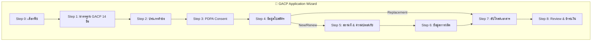
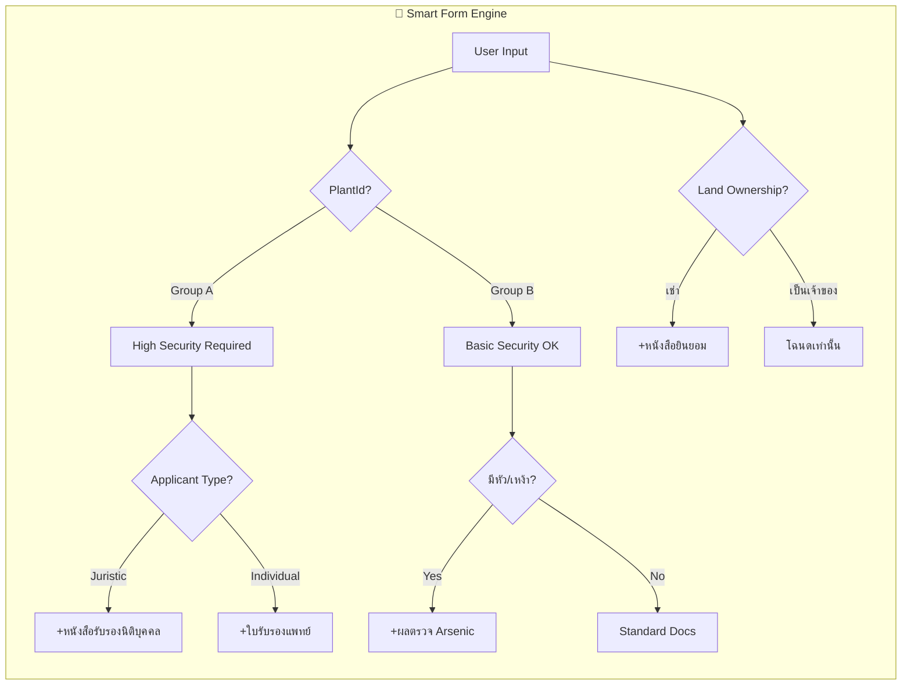

# Smart Application Flow Analysis & Improvement Plan
## วิเคราะห์และปรับปรุงระบบยื่นคำขออัจฉริยะ

> **วันที่วิเคราะห์**: 10 ธันวาคม 2568  
> **Codebase Version**: GACP Mobile App + Backend V2

---

## 📋 สารบัญ
1. [สถานะปัจจุบัน (Current State)](#1-สถานะปัจจุบัน)
2. [Gap Analysis เทียบกับกฎหมาย](#2-gap-analysis)
3. [ข้อเสนอปรับปรุง Smart Logic](#3-ข้อเสนอปรับปรุง)
4. [แผนงาน Implementation](#4-แผนงาน)

---

## 1. สถานะปัจจุบัน (Current State)

### 1.1 ภาพรวม Wizard Flow ปัจจุบัน



### 1.2 Smart Features ที่มีอยู่แล้ว ✅

| Feature | สถานะ | รายละเอียด |
|---------|--------|------------|
| **Adaptive Forms by Plant Group** | ✅ มีแล้ว | Group A แสดง License Info, Group B แสดง GAP/Organic |
| **Replacement Shortcut** | ✅ มีแล้ว | ข้ามไป Step 7 โดยตรง |
| **Strategy Pattern** | ✅ มีแล้ว | `PlantStrategy` สำหรับ security validation |
| **Dynamic Document List** | ✅ มีแล้ว | `_generateDocList()` ใน Step 7 |
| **FormValidator** | ✅ มีแล้ว | Validation ก่อนข้ามขั้นตอน |
| **Backend DocumentAnalysisService** | ✅ มีแล้ว | วิเคราะห์เอกสารจาก API |

### 1.3 ข้อมูลที่เก็บในแต่ละ Step

| Step | Model Class | Fields หลัก |
|------|-------------|-------------|
| 0 | `plantId` | รหัสพืช (CAN, KRA, TUR, etc.) |
| 1 | `acceptedStandards` | Boolean |
| 2 | `ServiceType` | newApplication, renewal, replacement |
| 3 | `consentedPDPA` | Boolean |
| 4A | `ApplicantProfile` | applicantType, name, idCard, address, mobile, responsibleName, qualification |
| 4B | `LegalLicense` | plantingStatus, notifyNumber, licenseNumber, licenseType |
| 4C | `ReplacementReason` | reason (Lost/Damaged), policeReportNo, policeStation |
| 5 | `SiteLocation`, `SecurityChecklist` | name, address, lat/lng, N/S/E/W, hasFence, hasCCTV, etc. |
| 6 | `ProductionPlan` | plantParts, sourceType, treeCount/areaSizeRai, estimatedYield, farmInputs, postHarvest |
| 7 | Documents (uploads) | Dynamic list |
| 8 | `signatureBase64` | E-Signature |

---

## 2. Gap Analysis เทียบกับกฎหมาย

### 2.1 เอกสารตามกฎหมาย vs แอพปัจจุบัน

| หมวด | ตามกฎหมาย ภ.ท. 12 | แอพปัจจุบัน | Gap |
|------|-------------------|------------|-----|
| **IDENTITY** |
| สำเนาบัตร ปชช. | ✅ บังคับ | ✅ เก็บ idCard | ❌ ไม่มีอัปโหลดภาพ |
| สำเนาทะเบียนบ้าน | ✅ บังคับ | ❌ ไม่มี | ⚠️ ขาด Field |
| ใบรับรองแพทย์ | ✅ บังคับ (Group A) | ❌ ไม่มี | ⚠️ ขาด Field |
| หนังสือรับรองนิติบุคคล | ⚠️ กรณี Juristic | ❌ ไม่มี | ⚠️ Conditional Logic |
| **PROPERTY** |
| โฉนด/สัญญาเช่า | ✅ บังคับ | ✅ Step 7 | ✅ OK |
| หนังสือยินยอมให้ใช้สถานที่ | ✅ บังคับ (ถ้าเช่า) | ❌ ไม่มี | ⚠️ ขาด |
| แผนที่ + GPS | ✅ บังคับ | ✅ lat/lng (partial) | ⚠️ ขาด Hand-drawn Map |
| รูปถ่ายสถานที่ (ภายนอก+ภายใน) | ✅ บังคับ | ❌ ไม่มีแยกชัด | ⚠️ ต้องเพิ่ม |
| **COMPLIANCE** |
| SOP Document | ✅ บังคับ | ✅ Step 7 | ⚠️ ไม่มีคำแนะนำ |
| CCTV Plan | ✅ บังคับ (Group A) | ✅ Conditional | ✅ OK |
| Security Plan | ✅ บังคับ | ⚠️ Checkbox only | ⚠️ ขาดรายละเอียด |
| **OTHER** |
| ผลตรวจดิน/น้ำ/ช่อดอก | ✅ บังคับ | ✅ Step 7 | ✅ OK |
| บัญชีแหล่งที่มา (Sourcing) | ✅ บังคับ | ✅ sourceType/sourceDetail | ⚠️ ไม่มี Template |

### 2.2 Summary: 7 Gaps ที่ต้องแก้ไข

| # | Gap | ความสำคัญ | Solution |
|---|-----|----------|----------|
| 1 | ไม่มีอัปโหลดสำเนาบัตร ปชช. | 🔴 สูง | เพิ่มใน Step 7 |
| 2 | ไม่มีสำเนาทะเบียนบ้าน | 🔴 สูง | เพิ่มใน Step 7 |
| 3 | ไม่มีใบรับรองแพทย์ (Group A) | 🔴 สูง | เพิ่มใน Step 7 (conditional) |
| 4 | ไม่มีหนังสือยินยอมใช้สถานที่ | 🔴 สูง | เพิ่ม Template + อัปโหลด |
| 5 | ไม่มีรูปถ่ายแยกภายใน/ภายนอก | 🟡 กลาง | เพิ่มใน Step 7 |
| 6 | ไม่มีคำแนะนำ/Template SOP | 🟡 กลาง | เพิ่ม Helper Text |
| 7 | ไม่ตรวจ Arsenic สำหรับหัว/เหง้า | 🟡 กลาง | เพิ่ม Conditional |

---

## 3. ข้อเสนอปรับปรุง Smart Logic

### 3.1 Enhanced Smart Form Logic (ที่แนะนำ)



### 3.2 Proposed Improvements (6 Items)

#### 🎯 Improvement 1: Land Ownership Smart Logic

**ปัญหา**: ไม่ถามว่าเป็นเจ้าของหรือเช่า  
**Solution**: เพิ่ม Field ใน Step 5  

```dart
// Add to SiteLocation model
final String landOwnership; // 'Own' | 'Rent' | 'Consent'
```

**Smart Rule**:
- ถ้า `landOwnership == 'Rent'` → เพิ่ม "สัญญาเช่า" ในรายการเอกสาร
- ถ้า `landOwnership == 'Consent'` → เพิ่ม "หนังสือยินยอม" ในรายการเอกสาร

---

#### 🎯 Improvement 2: Applicant Type Smart Logic

**ปัญหา**: ไม่แยกเอกสารตามประเภทผู้ยื่น  
**Solution**: เพิ่ม Logic ใน Step 7  

**Smart Rule**:
- ถ้า `applicantType == 'Juristic'` → เพิ่ม "หนังสือรับรองนิติบุคคล"
- ถ้า `applicantType == 'Individual'` AND `Group A` → เพิ่ม "ใบรับรองแพทย์"

---

#### 🎯 Improvement 3: Site Photo Categorization

**ปัญหา**: รูปถ่ายไม่แยกหมวด  
**Solution**: แยก Document Slots ใน Step 7  

```javascript
// Document slots for site photos
const sitePhotoSlots = [
  { id: 'exterior_photo', label: 'รูปถ่ายภายนอก (ด้านหน้า)' },
  { id: 'interior_photo', label: 'รูปถ่ายภายใน' },
  { id: 'storage_photo', label: 'รูปถ่ายคลังเก็บ' },
  { id: 'signage_photo', label: 'รูปถ่ายป้ายร้าน' },
];
```

---

#### 🎯 Improvement 4: Real-time Validation Helper

**ปัญหา**: เกษตรกรไม่รู้ว่ากรอกถูกหรือไม่  
**Solution**: เพิ่ม Inline Validation + Helper Text  

**Example for GPS Coordinate**:
```dart
TextFormField(
  decoration: InputDecoration(
    labelText: 'พิกัด GPS (Latitude)',
    helperText: 'เช่น 13.756331 (ดูจาก Google Maps)',
    errorText: _validateGPS(value) ? null : 'รูปแบบไม่ถูกต้อง',
  ),
)
```

---

#### 🎯 Improvement 5: Pre-submission Checklist

**ปัญหา**: เอกสารตีกลับบ่อยเพราะไม่ครบ  
**Solution**: เพิ่ม Checklist ก่อน Submit  

```dart
class PreSubmissionCheck {
  final bool allRequiredDocsUploaded;
  final bool allFieldsFilled;
  final bool licenseValid;
  final bool securityComplete;
  final List<String> missingItems;
}
```

**UI**: แสดง Warning หาก `missingItems.isNotEmpty`

---

#### 🎯 Improvement 6: Document Template Auto-Fill

**ปัญหา**: เกษตรกรไม่รู้จะเขียนอะไรใน "หนังสือยินยอม"  
**Solution**: สร้าง Template Pre-filled จากข้อมูลที่กรอก  

**Flow**:
1. เกษตรกรกรอกข้อมูลครบ
2. กดปุ่ม "ดาวน์โหลด Template"
3. ระบบสร้าง PDF/Word พร้อมข้อมูลที่กรอกไว้
4. เกษตรกรพิมพ์ → เซ็น → Scan → อัปโหลด

---

## 4. แผนงาน Implementation

### 4.1 Priority Matrix

| # | Item | Impact | Effort | Priority |
|---|------|--------|--------|----------|
| 1 | Land Ownership Field | 🔴 สูง | 🟢 ต่ำ | **P1** |
| 2 | Applicant Type Logic | 🔴 สูง | 🟢 ต่ำ | **P1** |
| 3 | Site Photo Slots | 🟡 กลาง | 🟢 ต่ำ | **P2** |
| 4 | Real-time Validation | 🟡 กลาง | 🟡 กลาง | **P2** |
| 5 | Pre-submission Check | 🔴 สูง | 🟡 กลาง | **P1** |
| 6 | Template Auto-Fill | 🟡 กลาง | 🔴 สูง | **P3** |

### 4.2 Files ที่ต้องแก้ไข

```
📁 Mobile App Changes
├── models/gacp_application_models.dart
│   ├── + SiteLocation.landOwnership
│   └── + ApplicantProfile.requiresMedicalCert
│
├── screens/wizard_steps/step_4_application_data.dart
│   └── + เพิ่ม Logic ตาม Applicant Type
│
├── screens/wizard_steps/step_5_security.dart
│   └── + เพิ่ม Land Ownership Radio
│
├── screens/wizard_steps/step_7_documents.dart
│   ├── + แยก Photo Slots
│   ├── + Land Ownership Conditional
│   └── + Applicant Type Conditional
│
└── screens/wizard_steps/step_8_review.dart
    └── + Pre-submission Checklist Widget

📁 Backend Changes
├── services/DocumentAnalysisService.js
│   ├── + landOwnership condition
│   └── + applicantType condition
│
└── models/DocumentRequirementModel.js
    └── + New slots for site photos
```

### 4.3 Estimated Timeline

| Phase | Duration | Deliverables |
|-------|----------|--------------|
| **Phase 1**: Core Logic | 2 days | Land Ownership + Applicant Type |
| **Phase 2**: UI Polish | 2 days | Photo Slots + Validation Helpers |
| **Phase 3**: Pre-submission | 1 day | Checklist Component |
| **Phase 4**: Templates | 3 days | PDF Generation (ถ้าอนุมัติ) |

---

## 5. สรุป

### ✅ จุดแข็งปัจจุบัน
- Strategy Pattern ดี ขยายง่าย
- มี Adaptive Logic สำหรับ Group A/B
- Backend DocumentAnalysis พร้อมใช้งาน

### ⚠️ จุดที่ต้องปรับปรุง
- ขาด Land Ownership Logic
- ขาด Applicant Type Logic
- รูปถ่ายไม่แยกหมวด
- ไม่มี Pre-submission Check

### 🚀 Next Steps
1. ✅ อนุมัติ Implementation Plan
2. 🔄 เริ่ม Phase 1 (Land Ownership + Applicant Type)
3. 🧪 Test กับข้อมูลจริง

---

*Document generated by GACP Platform Analysis | 10 ธันวาคม 2568*
