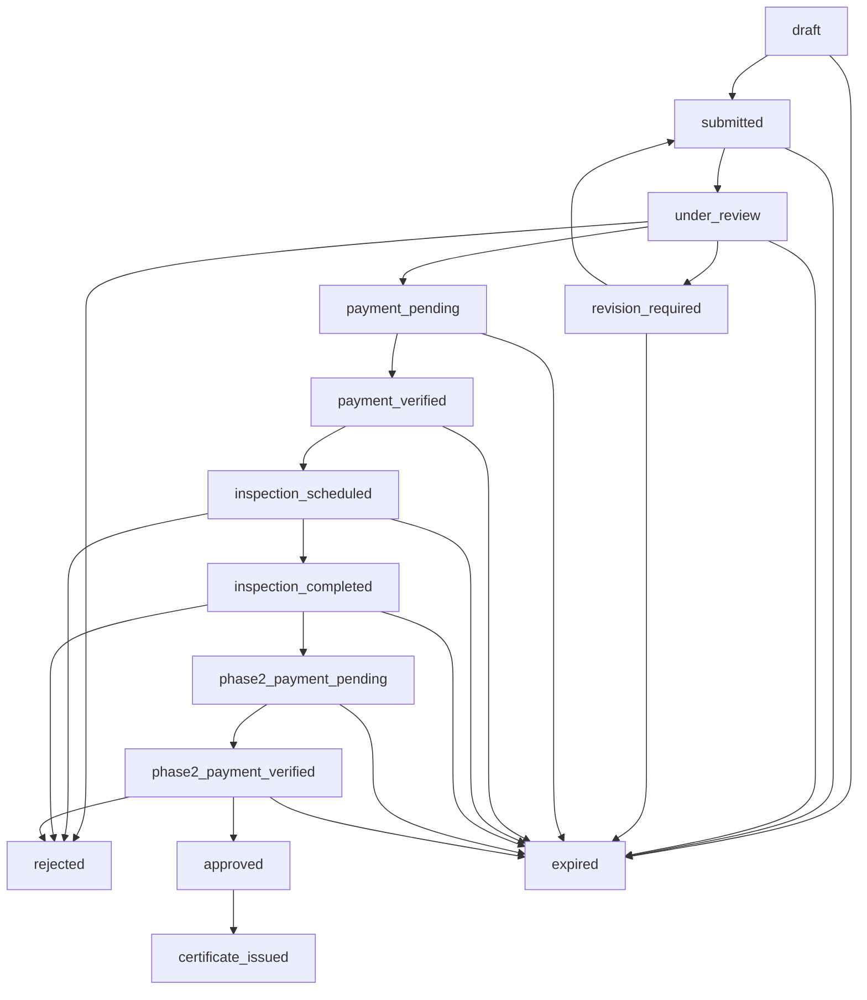

# 📋 Application Workflow Module Documentation

## Overview

The Application Workflow Module is the core component of the GACP (Good Agricultural and Collection Practice) certification platform. It manages the complete lifecycle of certification applications from initial draft to certificate issuance using a sophisticated Finite State Machine (FSM) architecture.

## 🏗️ Architecture

The module follows Clean Architecture principles with clear separation of concerns:

```
apps/backend/modules/application-workflow/
├── domain/                     # Business Logic Layer
│   ├── StateMachine.js        # Finite State Machine
│   └── WorkflowEngine.js      # Business Process Orchestrator
├── infrastructure/            # Data Access Layer
│   ├── models/
│   │   └── Application.js     # Mongoose Schema
│   └── repositories/
│       └── ApplicationRepository.js
├── presentation/              # API Layer
│   ├── controllers/
│   │   └── ApplicationController.js
│   └── routes/
│       └── applicationRoutes.js
├── tests/                     # Test Layer
│   └── StateMachine.test.js
├── README.md                  # This file
└── index.js                   # Module Export
```

## 🔄 State Machine Workflow

The application workflow is implemented as a Finite State Machine (FSM) with 14 defined states covering the complete certification process:

### States

| State                     | Description                        | Owner          | Timeout | Payment Required |
| ------------------------- | ---------------------------------- | -------------- | ------- | ---------------- |
| `draft`                   | Farmer creating application        | FARMER         | 30 days | No               |
| `submitted`               | Application submitted for review   | SYSTEM         | 3 days  | No               |
| `under_review`            | DTAM reviewing documents           | DTAM_REVIEWER  | 14 days | No               |
| `revision_required`       | Changes requested                  | FARMER         | 30 days | No               |
| `payment_pending`         | Awaiting Phase 1 payment (฿5,000)  | FARMER         | 7 days  | Yes              |
| `payment_verified`        | Payment confirmed                  | DTAM_INSPECTOR | 14 days | No               |
| `inspection_scheduled`    | Farm inspection scheduled          | DTAM_INSPECTOR | 30 days | No               |
| `inspection_completed`    | Inspection completed               | FARMER         | 7 days  | No               |
| `phase2_payment_pending`  | Awaiting Phase 2 payment (฿25,000) | FARMER         | 7 days  | Yes              |
| `phase2_payment_verified` | Final payment confirmed            | DTAM_ADMIN     | 14 days | No               |
| `approved`                | Application approved               | SYSTEM         | 1 day   | No               |
| `certificate_issued`      | Certificate generated              | FARMER         | -       | No               |
| `rejected`                | Application rejected               | FARMER         | -       | No               |
| `expired`                 | Application expired                | FARMER         | -       | No               |

### State Transitions



## 🎯 Core Components

### 1. Application State Machine

**File:** `domain/StateMachine.js`

**Purpose:** Defines business rules for state transitions, user permissions, and validation logic.

**Key Methods:**

```javascript
// Check if transition is valid
isValidTransition(fromState, toState);

// Check user permissions
canUserTransition(role, fromState, toState);

// Validate with business rules
validateTransition(application, toState, userRole, context);

// Get state information
getStateMetadata(state);
```

**Example Usage:**

```javascript
const stateMachine = new ApplicationStateMachine();

// Check if farmer can submit draft
const canSubmit = stateMachine.canUserTransition('FARMER', 'draft', 'submitted');

// Validate submission with business rules
const validation = stateMachine.validateTransition(application, 'submitted', 'FARMER', {
  documents: application.documents,
});
```

### 2. Workflow Engine

**File:** `domain/WorkflowEngine.js`

**Purpose:** Orchestrates the complete business process including notifications, payments, and job creation.

**Key Methods:**

```javascript
// Create new application
createApplication(applicationData, farmerId);

// Submit for review
submitApplication(applicationId, userId);

// Reviewer actions
approveForPayment(applicationId, reviewerId, reviewData);
requestRevision(applicationId, reviewerId, revisionData);

// Inspector actions
scheduleInspection(applicationId, inspectorId, scheduleData);
completeInspection(applicationId, inspectorId, inspectionReport);

// Admin actions
finalApproval(applicationId, adminId, approvalData);

// General actions
rejectApplication(applicationId, userId, rejectionData);
getWorkflowStatus(applicationId);
```

### 3. Application Repository

**File:** `infrastructure/repositories/ApplicationRepository.js`

**Purpose:** Data access layer with MongoDB operations, pagination, and complex queries.

**Key Methods:**

```javascript
// Basic CRUD
create(applicationData);
findById(id, options);
update(id, updateData, options);

// Business queries
findByFarmerId(farmerId, options);
findByStatus(status, options);
findRequiringAction(role, options);
findExpired(options);
getDashboardStats(filters);

// Advanced queries
findWithPagination(filters, options);
```

### 4. Application Controller

**File:** `presentation/controllers/ApplicationController.js`

**Purpose:** RESTful API controller handling HTTP requests and responses.

**Key Endpoints:**

```javascript
// Farmer endpoints
POST   /api/applications
GET    /api/applications/:id
PUT    /api/applications/:id
POST   /api/applications/:id/submit
GET    /api/farmers/me/applications

// DTAM endpoints
POST   /api/dtam/applications/:id/approve-payment
POST   /api/dtam/applications/:id/request-revision
POST   /api/dtam/applications/:id/schedule-inspection
POST   /api/dtam/applications/:id/complete-inspection
POST   /api/dtam/applications/:id/final-approval
POST   /api/dtam/applications/:id/reject
```

## 🔐 Role-Based Access Control

### User Roles and Permissions

| Role               | Permissions                                                             |
| ------------------ | ----------------------------------------------------------------------- |
| **FARMER**         | Create applications, submit for review, handle revisions, make payments |
| **DTAM_REVIEWER**  | Review documents, approve for payment, request revisions, reject        |
| **DTAM_INSPECTOR** | Schedule inspections, complete inspections, reject based on compliance  |
| **DTAM_ADMIN**     | Final approval, certificate issuance, system-wide rejection authority   |
| **SYSTEM**         | Automatic state transitions, expiration handling                        |

### Authorization Matrix

| Transition                              | FARMER | REVIEWER | INSPECTOR | ADMIN | SYSTEM |
| --------------------------------------- | ------ | -------- | --------- | ----- | ------ |
| draft → submitted                       | ✅     | ❌       | ❌        | ❌    | ❌     |
| under_review → payment_pending          | ❌     | ✅       | ❌        | ❌    | ❌     |
| payment_verified → inspection_scheduled | ❌     | ❌       | ✅        | ❌    | ❌     |
| phase2_payment_verified → approved      | ❌     | ❌       | ❌        | ✅    | ❌     |
| approved → certificate_issued           | ❌     | ❌       | ❌        | ❌    | ✅     |

## 💰 Payment Integration

### Payment Phases

**Phase 1: Document Review Fee**

- Amount: ฿5,000
- Required after: Document approval
- Purpose: Processing fee for inspection
- Method: PromptPay QR Code

**Phase 2: Certification Fee**

- Amount: ฿25,000
- Required after: Successful inspection
- Purpose: Certificate issuance fee
- Method: PromptPay QR Code

### Payment Flow

```javascript
// Generate payment
const paymentData = await paymentService.generatePayment({
  applicationId,
  amount: 5000,
  phase: 1,
  description: `GACP Certification Phase 1 - ${applicationNumber}`,
});

// Handle payment confirmation
await workflowEngine.confirmPayment(applicationId, {
  transactionId: 'TXN-123456',
  amount: 5000,
  phase: 1,
});
```

## 📄 Document Management

### Required Documents

| Document Type  | Required | Description                |
| -------------- | -------- | -------------------------- |
| `farm_license` | Yes      | Official farm registration |
| `land_deed`    | Yes      | Land ownership or lease    |
| `farmer_id`    | Yes      | Farmer identification      |
| `farm_photos`  | Yes      | Current farm photos        |
| `water_test`   | No       | Water quality analysis     |
| `soil_test`    | No       | Soil composition test      |

### Document Validation

```javascript
// Check missing documents
const missingDocs = application.getMissingDocuments();

// Validate submission readiness
const isReady = application.isReadyForSubmission();
```

## 🔍 Inspection Process

### Inspection Types

- **On-site Inspection**: Physical farm visit by inspector
- **Virtual Inspection**: Video call-based inspection

### Compliance Checklist

```javascript
const checklist = {
  siteSelection: { passed: true, notes: 'Appropriate location' },
  waterQuality: { passed: true, notes: 'Test results acceptable' },
  soilTesting: { passed: true, notes: 'Soil composition good' },
  seedCertification: { passed: true, notes: 'Certified seeds used' },
  inputMaterials: { passed: true, notes: 'Approved materials only' },
  pestManagement: { passed: true, notes: 'IPM practices followed' },
  harvestTiming: { passed: true, notes: 'Proper timing' },
  postHarvestHandling: { passed: true, notes: 'Good practices' },
  storageConditions: { passed: true, notes: 'Adequate storage' },
  recordKeeping: { passed: true, notes: 'Complete records' },
};
```

### Compliance Scoring

- Minimum passing score: 70%
- Score calculation: (Passed items / Total items) × 100
- Failed inspection results in application rejection
  Authorization: Bearer <token>

Request Body:
{
"farmName": "Green Valley Farm",
"cropType": "cannabis",
"farmArea": 2.5,
"province": "Chiang Mai"
}

Response: 201 Created
{
"success": true,
"message": "Application created successfully",
"data": {
"id": "uuid",
"applicationNumber": "APP-20250110-1234",
"status": "draft",
"workflowState": "draft"
}
}

````

#### List Applications
```http
GET /api/applications?status=submitted
Authorization: Bearer <token>

Response: 200 OK
{
  "success": true,
  "data": {
    "applications": [...],
    "total": 5
  }
}
````

#### Get Application Details

```http
GET /api/applications/:id
Authorization: Bearer <token>

Response: 200 OK
```

#### Update Step Data

```http
PUT /api/applications/:id/step/:stepId
Authorization: Bearer <token>

Request Body:
{
  "stepData": {
    "field1": "value1",
    "field2": "value2"
  }
}

Response: 200 OK
```

### Workflow Actions

#### Submit Application

```http
POST /api/applications/:id/submit
Authorization: Bearer <token>
Role: farmer

Response: 200 OK
```

#### Start Document Review

```http
POST /api/applications/:id/review
Authorization: Bearer <token>
Role: admin, reviewer

Response: 200 OK
```

#### Complete Document Review

```http
POST /api/applications/:id/review/complete
Authorization: Bearer <token>
Role: admin, reviewer

Request Body:
{
  "approved": true,
  "findings": ["All documents complete", "Farm information verified"]
}

Response: 200 OK
```

#### Start Field Inspection

```http
POST /api/applications/:id/inspection/start
Authorization: Bearer <token>
Role: admin, inspector

Response: 200 OK
```

#### Complete Field Inspection

```http
POST /api/applications/:id/inspection/complete
Authorization: Bearer <token>
Role: admin, inspector

Request Body:
{
  "passed": true,
  "complianceScore": 92,
  "findings": [
    "Excellent water management",
    "GACP standards fully met"
  ]
}

Response: 200 OK
```

#### Approve Application

```http
POST /api/applications/:id/approve
Authorization: Bearer <token>
Role: admin

Request Body:
{
  "note": "All requirements met"
}

Response: 200 OK
{
  "success": true,
  "message": "Application approved successfully",
  "data": {
    "certificateNumber": "CERT-2025-1234",
    "status": "approved"
  }
}
```

#### Reject Application

```http
POST /api/applications/:id/reject
Authorization: Bearer <token>
Role: admin

Request Body:
{
  "reason": "Insufficient documentation"
}

Response: 200 OK
```

### Statistics

#### Get Workflow Statistics

```http
GET /api/applications/statistics
Authorization: Bearer <token>
Role: admin

Response: 200 OK
{
  "success": true,
  "data": {
    "total": 150,
    "byStatus": {
      "draft": 20,
      "submitted": 15,
      "in_review": 10,
      "in_inspection": 8,
      "pending_approval": 5,
      "approved": 85,
      "rejected": 7
    },
    "avgProcessingTime": 14
  }
}
```

## Role-Based Access Control

| Role          | Create | View Own | View All | Submit | Review | Inspect | Approve/Reject |
| ------------- | ------ | -------- | -------- | ------ | ------ | ------- | -------------- |
| **Farmer**    | ✅     | ✅       | ❌       | ✅     | ❌     | ❌      | ❌             |
| **Reviewer**  | ❌     | ❌       | ✅       | ❌     | ✅     | ❌      | ❌             |
| **Inspector** | ❌     | ❌       | ✅       | ❌     | ❌     | ✅      | ❌             |
| **Admin**     | ✅     | ✅       | ✅       | ✅     | ✅     | ✅      | ✅             |

## Usage Example

```javascript
const { initializeApplicationWorkflow } = require('./modules/application-workflow');

// Initialize module
const workflowModule = initializeApplicationWorkflow({
  db: mongoDatabase,
  auth: authMiddleware,
});

// Mount routes
app.use('/api', workflowModule.router);

// Use service directly
const workflowService = workflowModule.service;
const application = await workflowService.createApplication({
  farmerId: 'farmer-123',
  farmerEmail: 'farmer@example.com',
  farmName: 'Green Valley',
  cropType: 'cannabis',
});
```

## Integration with Other Modules

### Auth Farmer Module

- Uses farmer JWT authentication
- Farmers create and submit applications
- Farmers view only their own applications

### Auth DTAM Module

- Integrates with DTAM staff roles (reviewer, inspector, admin)
- Reviewers conduct document reviews
- Inspectors conduct field inspections
- Admins have full approval authority

### Farm Management Module

- Links applications to cultivation cycles
- Uses compliance scores from farm inspections
- Quality test results inform approval decisions

### Certificate Management Module

- Approved applications trigger certificate generation
- Certificate number assigned on approval
- Validity period tracking

## Data Model

### Application Schema

```javascript
{
  id: String (UUID),
  applicationNumber: String (APP-YYYYMMDD-XXXX),
  farmerId: String (required, indexed),
  farmerEmail: String (required),

  status: 'draft' | 'submitted' | 'in_review' | 'in_inspection' | 'pending_approval' | 'approved' | 'rejected' | 'revision_required',

  workflowState: String,
  currentStep: Number,
  completedSteps: Array<Number>,

  review: {
    startedAt: Date,
    completedAt: Date,
    reviewerId: String,
    approved: Boolean,
    findings: Array<String>
  },

  inspection: {
    startedAt: Date,
    completedAt: Date,
    inspectorId: String,
    passed: Boolean,
    complianceScore: Number,
    findings: Array<String>
  },

  certificateNumber: String,
  approvedAt: Date,
  approvedBy: String,

  rejectedAt: Date,
  rejectedBy: String,
  rejectionReason: String,

  history: Array<{
    action: String,
    timestamp: Date,
    userId: String,
    note: String,
    details: Object
  }>,

  metadata: {
    createdAt: Date,
    updatedAt: Date,
    version: Number
  }
}
```

## Validation Rules

- **Submission**: All 7 steps must be completed
- **Review Approval**: Reviewer must provide findings
- **Inspection Pass**: Compliance score must be ≥ 80
- **Final Approval**: Only admin can approve
- **Rejection**: Reason must be provided

## Testing

```bash
npm test -- application-workflow
```

## Dependencies

- `express` - Web framework
- `uuid` - UUID generation
- Shared module utilities (logger, response, error handling)

## Migration Notes

**Source**: `routes/api/application-workflow.js` (444 lines)  
**Migration Date**: Phase 5 - Core Modules  
**Changes**:

- Separated routes, controllers, and services
- Added comprehensive workflow state management
- Enhanced role-based access control
- Integrated with auth-farmer and auth-dtam
- Added audit trail (history tracking)
- Standardized response format

---

**Module Version**: 1.0.0  
**Last Updated**: Phase 5 Migration  
**Maintainer**: GACP Development Team
