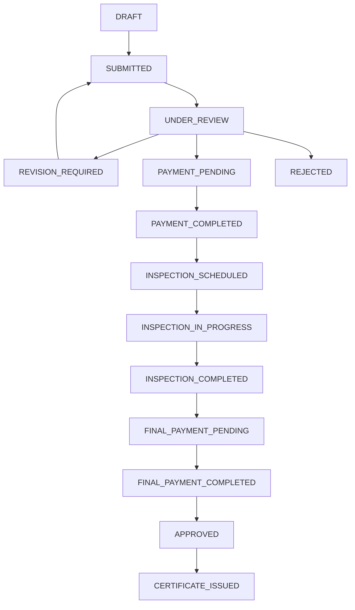

# GACP Application Workflow Process Documentation

## Business Process Flow Overview

### Complete Workflow States & Transitions



## Detailed Process Logic

### Phase 1: Application Submission (FARMER)

**State: DRAFT → SUBMITTED**

```javascript
// Business Rules:
1. Farmer must be active and verified
2. Required documents must be uploaded
3. Farm location must be valid
4. Contact information must be complete
5. Compliance checklist must be filled

// Process Flow:
createApplication() → validateRequirements() → submitApplication()
```

### Phase 2: Document Review (DTAM_REVIEWER)

**State: SUBMITTED → UNDER_REVIEW → (PAYMENT_PENDING | REVISION_REQUIRED | REJECTED)**

```javascript
// Business Rules:
1. Only assigned reviewer can process
2. All documents must be verified
3. Farm eligibility must be confirmed
4. Maximum 3 revision attempts allowed
5. SLA: 3 business days for review

// Decision Matrix:
if (documents_complete && eligibility_confirmed) {
    → PAYMENT_PENDING (Generate PromptPay QR ฿5,000)
} else if (revision_count < 3) {
    → REVISION_REQUIRED (Send detailed feedback)
} else {
    → REJECTED (Auto-reject after 3 revisions)
}
```

### Phase 3: Payment Processing (FARMER)

**State: PAYMENT_PENDING → PAYMENT_COMPLETED**

```javascript
// Business Rules:
1. Payment amount: ฿5,000 (Phase 1)
2. Payment method: PromptPay QR Code
3. Payment timeout: 7 days
4. Webhook verification required
5. Auto-expire if not paid

// Process Flow:
generatePaymentQR() → farmerPays() → webhookReceived() → verifyPayment() → updateStatus()
```

### Phase 4: Inspection Management (DTAM_INSPECTOR)

**State: PAYMENT_COMPLETED → INSPECTION_SCHEDULED → INSPECTION_IN_PROGRESS → INSPECTION_COMPLETED**

```javascript
// Business Rules:
1. Inspector assignment based on location
2. Inspection must be scheduled within 14 days
3. Farm visit duration: 4-6 hours
4. Compliance checklist must be completed
5. Photo evidence required

// Process Flow:
assignInspector() → scheduleInspection() → conductInspection() → uploadReport()
```

### Phase 5: Final Payment & Approval (FARMER + DTAM_ADMIN)

**State: INSPECTION_COMPLETED → FINAL_PAYMENT_PENDING → FINAL_PAYMENT_COMPLETED → APPROVED**

```javascript
// Business Rules:
1. Inspection report must pass minimum score
2. Final payment: ฿25,000 (Phase 2)
3. Admin approval required for certification
4. Quality assurance check

// Process Flow:
reviewInspectionReport() → generateFinalPayment() → adminApproval() → generateCertificate()
```

### Phase 6: Certificate Issuance (SYSTEM)

**State: APPROVED → CERTIFICATE_ISSUED**

```javascript
// Business Rules:
1. Digital certificate with blockchain verification
2. PDF generation with QR code
3. Certificate valid for 3 years
4. Automatic renewal notification

// Process Flow:
generateCertificateNumber() → createPDF() → blockchainRecord() → sendToFarmer()
```

## Actor Responsibilities

### FARMER

- Create and submit application
- Upload required documents
- Make payments (Phase 1: ฿5,000, Phase 2: ฿25,000)
- Respond to revision requests
- Coordinate inspection schedule

### DTAM_REVIEWER

- Review submitted documents
- Verify farm eligibility
- Request revisions or approve for payment
- Maintain SLA compliance (3 business days)

### DTAM_INSPECTOR

- Schedule farm inspections
- Conduct on-site compliance verification
- Upload inspection reports with photos
- Complete compliance checklist

### DTAM_ADMIN

- Final approval for certification
- Quality assurance review
- System configuration management
- Escalation handling

## Business Rules & Validations

### Document Requirements

```javascript
const REQUIRED_DOCUMENTS = {
  FARM_REGISTRATION: { mandatory: true, formats: ['PDF', 'JPG'] },
  FARM_MAP: { mandatory: true, formats: ['PDF', 'JPG'] },
  WATER_TEST_REPORT: { mandatory: true, validityDays: 90 },
  SOIL_TEST_REPORT: { mandatory: true, validityDays: 180 },
  PESTICIDE_RECORD: { mandatory: true, minMonths: 6 },
  HARVEST_RECORD: { mandatory: false, recommended: true },
};
```

### Payment Rules

```javascript
const PAYMENT_RULES = {
  PHASE_1: {
    amount: 5000,
    currency: 'THB',
    trigger: 'DOCUMENT_APPROVED',
    timeout: 7 * 24 * 60 * 60 * 1000, // 7 days
    method: 'PROMPTPAY',
  },
  PHASE_2: {
    amount: 25000,
    currency: 'THB',
    trigger: 'INSPECTION_PASSED',
    timeout: 14 * 24 * 60 * 60 * 1000, // 14 days
    method: 'PROMPTPAY',
  },
};
```

### SLA & Timeouts

```javascript
const SLA_RULES = {
  DOCUMENT_REVIEW: 3 * 24 * 60 * 60 * 1000, // 3 business days
  INSPECTION_SCHEDULING: 14 * 24 * 60 * 60 * 1000, // 14 days
  FINAL_APPROVAL: 5 * 24 * 60 * 60 * 1000, // 5 business days
  CERTIFICATE_GENERATION: 2 * 24 * 60 * 60 * 1000, // 2 days

  WARNING_THRESHOLD: 0.8, // 80% of SLA time
  ESCALATION_THRESHOLD: 1.2, // 120% of SLA time (overdue)
};
```

## Integration Points

### External Services

1. **PromptPay Payment Gateway** - Two-phase payment processing
2. **Document Storage (AWS S3)** - Secure document management
3. **Notification Service** - Email/SMS alerts
4. **Blockchain Service** - Certificate verification
5. **Geographic Service** - Farm location validation

### Internal Dependencies

1. **User Management** - Authentication & authorization
2. **Document Management** - File upload & validation
3. **Audit Service** - Compliance logging
4. **Job Ticket Service** - Task assignment
5. **Dashboard Service** - Real-time monitoring

## Error Handling & Recovery

### Common Error Scenarios

```javascript
const ERROR_SCENARIOS = {
  PAYMENT_FAILED: {
    action: 'RETRY_PAYMENT',
    maxRetries: 3,
    fallback: 'MANUAL_VERIFICATION',
  },
  DOCUMENT_CORRUPTED: {
    action: 'REQUEST_REUPLOAD',
    notification: 'FARMER',
    resetToState: 'REVISION_REQUIRED',
  },
  INSPECTION_CANCELLED: {
    action: 'RESCHEDULE',
    maxReschedules: 2,
    escalation: 'DTAM_ADMIN',
  },
  SYSTEM_TIMEOUT: {
    action: 'AUTO_RETRY',
    backoffStrategy: 'EXPONENTIAL',
    maxWaitTime: 300000, // 5 minutes
  },
};
```

### Data Consistency

```javascript
// Transactional operations for critical state changes
async function transitionWithRollback(applicationId, newState, actor) {
  const transaction = await startTransaction();
  try {
    await updateApplicationState(applicationId, newState, { transaction });
    await createAuditLog(applicationId, 'STATE_CHANGED', { transaction });
    await sendNotification(actor, 'STATE_UPDATED', { transaction });
    await commitTransaction(transaction);
  } catch (error) {
    await rollbackTransaction(transaction);
    throw new Error(`State transition failed: ${error.message}`);
  }
}
```

## Monitoring & Analytics

### Key Performance Indicators (KPIs)

1. **Application Processing Time** - End-to-end duration
2. **State Transition Success Rate** - % of successful transitions
3. **Payment Success Rate** - % of completed payments
4. **Inspection Completion Rate** - % of scheduled inspections completed
5. **Certificate Issuance Time** - Time from approval to certificate

### Real-time Dashboards

- Applications by state (real-time counts)
- SLA compliance monitoring
- Payment processing status
- Inspector workload distribution
- System health metrics

This documentation ensures that every aspect of the workflow has clear logic, defined processes, and traceable decision points for maximum transparency and maintainability.
