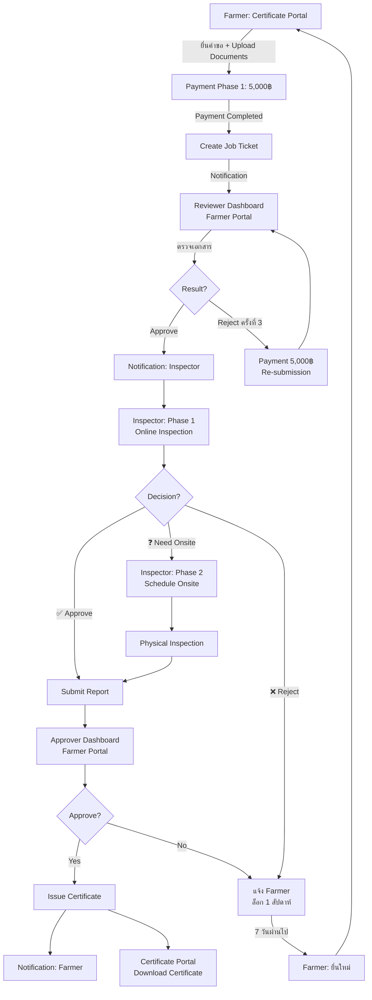

# 🏗️ GACP PLATFORM - COMPLETE SYSTEM BLUEPRINT

**Version**: 2.0 (Complete Re-audit)  
**Date**: October 15, 2025  
**Status**: ✅ OFFICIAL MASTER BLUEPRINT  
**Team**: PM + SA

---

## 🎯 Executive Summary

GACP Platform เป็นระบบครบวงจรสำหรับการรับรอง GACP (Good Agricultural and Collection Practices)  
ประกอบด้วย **3 Main Applications** และ **8 Portal Modules** ที่ทำงานร่วมกัน

### ความจริงที่พบ (System Audit):

1. ✅ **Farmer Portal** = Portal หลักที่รวม **5 Role Dashboards** (Farmer, Reviewer, Inspector, Approver, Admin)
2. ✅ **Admin Portal** = Super Admin (Data Analytics, System Management)
3. ✅ **Certificate Portal** = Entry point สำหรับ Farmer ยื่นขอใบรับรอง
4. 🟡 **DTAM Portal, Survey Portal, Trace Portal, etc.** = อยู่ในแผน แต่ยังไม่ได้สร้าง UI

---

## 📊 PART 1: PORTAL ARCHITECTURE (ความจริง)

### 🟢 **Live Portals (3)**

#### 1️⃣ **Farmer Portal** ⭐ **MAIN APPLICATION**

**Path**: `apps/farmer-portal/`  
**Port**: 3001  
**Status**: ✅ **PRODUCTION READY**

**Purpose**:

- **Multi-role Application** ที่รองรับทุก Role ในระบบ
- Dashboard สำหรับ Farmer, Reviewer, Inspector, Approver, Admin

**Features**:

```typescript
// Landing Page
GET / - GACP Platform landing (ทุกคนเข้าได้)

// Authentication
POST /login - Login ทุก Role
POST /register - Register Farmer
GET /logout - Logout

// Farmer Dashboard
GET /dashboard/farmer - ข้อมูลฟาร์ม, คำขอ, ใบรับรอง
GET /farmer/applications - รายการคำขอของฉัน
GET /farmer/certificates - ใบรับรองของฉัน
GET /farmer/settings - ตั้งค่าโปรไฟล์

// DTAM Dashboards (ใน Farmer Portal!)
GET /dashboard/reviewer - Reviewer Dashboard (ตรวจเอกสาร)
GET /dashboard/inspector - Inspector Dashboard (ตรวจฟาร์ม)
GET /dashboard/approver - Approver Dashboard (อนุมัติ)
GET /dashboard/admin - Admin Dashboard (บริหารจัดการ)
```

**Tech Stack**:

- Next.js 14.2.18
- TypeScript
- Material-UI + Tailwind CSS
- SWR for data fetching
- React Hook Form

**Backend Modules Used**:

- auth-farmer
- auth-dtam
- application-workflow
- farm-management
- certificate-management
- survey-system

---

#### 2️⃣ **Admin Portal** (Super Admin)

**Path**: `apps/admin-portal/`  
**Port**: 3002  
**Status**: ✅ **PRODUCTION READY**

**Purpose**:

- **ระบบบริหารจัดการระดับสูง**
- Data Analytics (4 levels: Descriptive, Diagnostic, Predictive, Prescriptive)
- System Configuration
- User Management (All roles)

**Features**:

```typescript
GET / - Admin home (Dashboard selector)
GET /login - Admin login

GET /dashboard - System overview + KPI
GET /applications - Monitor all applications (Read-only)
GET /users - User management (Create, Edit, Delete)
GET /reports - Advanced analytics
GET /analytics - Predictive & Prescriptive Analytics (🔴 ต้องเพิ่ม!)
GET /settings - System settings
```

**Analytics Requirements** (ใหม่):

```typescript
interface AdminAnalytics {
  // 1. Descriptive (อดีต)
  historical: {
    applicationTrends: number[]; // by month
    approvalRate: number; // %
    revenueByProvince: { [key: string]: number };
  };

  // 2. Diagnostic (ทำไม)
  diagnostics: {
    rejectionReasons: { reason: string; count: number }[];
    bottlenecks: { stage: string; avgDelay: number }[];
  };

  // 3. Predictive (อนาคต)
  predictions: {
    nextMonthApplications: number;
    expectedRevenue: number;
    resourceNeeds: { reviewers: number; inspectors: number };
  };

  // 4. Prescriptive (ควรทำอะไร)
  recommendations: {
    action: string;
    priority: 'high' | 'medium' | 'low';
    expectedImpact: string;
  }[];
}
```

**Tech Stack**:

- Next.js 14
- TypeScript
- Material-UI v6
- Chart.js (Charts)
- 🔴 **ต้องเพิ่ม**: Recharts/D3.js for Advanced Analytics

---

#### 3️⃣ **Certificate Portal** (Application Entry)

**Path**: `apps/certificate-portal/`  
**Port**: 3010 (3003)  
**Status**: ✅ **Landing Page เสร็จ** | 🔴 **Core features ต้องทำ**

**Purpose**:

- **Entry point สำหรับ Farmer ยื่นขอใบรับรอง**
- แยกจาก Farmer Portal (เป็น standalone)
- Workflow: Submit Application → Create Job Ticket → Notify DTAM

**Current Status**:

- ✅ Landing Page (ปรับใหม่เหมาะกับ Farmer)
- ✅ Hero Section: ระบบยื่นขอใบรับรอง GACP
- ✅ 2 CTA Buttons: "ยื่นคำขอใหม่" + "คำขอของฉัน"
- ✅ Features: 3 การ์ด
- ✅ Process: 3 ขั้นตอน (Phase 1 + Phase 2 payment)
- ✅ Stats: 30,000฿ (2 งวด), 14-21 วัน

**Pending Features**:

```typescript
// ต้องทำ
POST /application/new - Application Wizard (5 Steps)
  Step 1: Farmer Info
  Step 2: Farm Details
  Step 3: Document Upload
  Step 4: Payment Phase 1 (5,000฿)
  Step 5: Review & Submit

GET /applications - My Applications List
GET /applications/[id] - Application Detail + Timeline
POST /payment/phase1 - Payment Phase 1
POST /payment/phase2 - Payment Phase 2
```

**Relationship with Farmer Portal**:

- **Certificate Portal** = Entry (ยื่นคำขอครั้งแรก)
- **Farmer Portal** = Dashboard (ดูสถานะ, ดาวน์โหลดใบรับรอง)
- **Integration**: Job Tickets + Notifications

---

### 🟡 **Pending Portals (5)** - โฟลเดอร์มีแล้ว แต่ยังไม่มี UI

#### 4️⃣ **DTAM Portal** ⭐ **URGENT!**

**Path**: `apps/dtam-portal/`  
**Port**: TBD (แนะนำ 3011)  
**Status**: 🟡 **โฟลเดอร์มี แต่ UI ยังไม่ได้สร้าง**

**Current Problem**:

- DTAM Dashboards อยู่ใน **Farmer Portal** แล้ว!
- Routes: `/dashboard/reviewer`, `/dashboard/inspector`, `/dashboard/approver`
- แต่ควรแยกออกมาเป็น **DTAM Portal** แยกต่างหาก

**Proposed Solution**:

```
Option A: ใช้ Farmer Portal ต่อ (ประหยัดเวลา)
  - Farmer Portal = Multi-role app
  - DTAM staff login เข้า Farmer Portal
  - Redirect ไปหน้า Dashboard ตาม Role

Option B: สร้าง DTAM Portal ใหม่ (แนะนำ)
  - DTAM Portal = เฉพาะ DTAM staff
  - Login แยก (dtam.gacp.th)
  - Share components จาก Farmer Portal
```

**Features (ถ้าสร้างใหม่)**:

```typescript
GET / - DTAM Portal landing
GET /login - DTAM login (dtam-auth module)

GET /dashboard/reviewer - Reviewer Dashboard
  - Application Queue
  - Document Review Modal
  - Approve/Reject/Request Info

GET /dashboard/inspector - Inspector Dashboard
  - 2-Phase Inspection:
    * Phase 1: Online Inspection (บังคับ)
    * Phase 2: Onsite Inspection (ถ้าจำเป็น)
  - Schedule Form
  - Submit Report

GET /dashboard/approver - Approver Dashboard
  - Approval Queue
  - Review Report
  - Issue Certificate / Reject

GET /dashboard/admin - DTAM Admin Dashboard
  - Staff Management
  - Workload Balancing
  - Performance Metrics
```

**Backend Modules**:

- auth-dtam
- application-workflow
- certificate-management
- audit
- notification

---

#### 5️⃣ **Survey Portal** (Public - ไม่ต้อง Login)

**Path**: `apps/survey-portal/`  
**Port**: TBD  
**Status**: 🟡 **Backend เสร็จแล้ว | UI ยังไม่ได้สร้าง**

**Purpose**:

- **แบบสอบถามสำหรับบุคคลทั่วไป**
- Cannabis-specific surveys
- ไม่ต้อง login ก็ทำได้

**Backend Status**: ✅ **พร้อมใช้แล้ว!**

- Service: `apps/backend/services/cannabisSurveyService.js`
- Routes: `apps/backend/routes/cannabis-surveys.js`
- Models: Template, Question, Response

**Features**:

```typescript
GET / - Survey Portal landing (Public)
GET /surveys/public - แบบสอบถามทั้งหมด
GET /surveys/[id] - ทำแบบสอบถาม
POST /surveys/[id]/submit - ส่งคำตอบ (ไม่ต้อง login)

// DTAM (Manage surveys)
GET /dtam/surveys - จัดการแบบสอบถาม
POST /dtam/surveys/new - สร้างแบบสอบถามใหม่
GET /dtam/analytics - ดูผลสำรวจ
```

**Survey Types**:

- Pre-cultivation assessment
- Compliance tracking
- Regulatory reporting
- Cannabis-specific (THC, License, Strains)

---

#### 6️⃣ **Trace Portal** (Public - QR Verification)

**Path**: `apps/trace-portal/`  
**Port**: TBD  
**Status**: 🟡 **ยังไม่ได้สร้าง**

**Purpose**:

- **ระบบ Traceability + QR Code Verification**
- บุคคลทั่วไปเช็คความถูกต้องของใบรับรอง

**Features**:

```typescript
GET / - Trace Portal landing
GET /verify - Scan QR Code
GET /verify/[certificateId] - ตรวจสอบใบรับรอง
GET /track/[lotId] - Track Lot (Farm → Product)
GET /search - ค้นหาใบรับรอง
```

**Backend Module**: track-trace

---

#### 7️⃣ **Standards Portal** (Education)

**Path**: `apps/standards-portal/`  
**Port**: TBD  
**Status**: 🟡 **ยังไม่ได้สร้าง**

**Purpose**:

- **มาตรฐาน GACP + เปรียบเทียบ**
- การศึกษา, Best Practices

**Features**:

```typescript
GET / - Standards Portal landing
GET /standards/gacp - มาตรฐาน GACP
GET /standards/gap - มาตรฐาน GAP
GET /standards/organic - มาตรฐาน Organic
GET /comparator - เปรียบเทียบมาตรฐาน
GET /training - คอร์สอบรม
```

**Backend Module**: compliance-monitoring

---

#### 8️⃣ **Farm Management Portal**

**Path**: `apps/farm-management-portal/`  
**Port**: TBD  
**Status**: 🟡 **ยังไม่ได้สร้าง | อาจไม่จำเป็น**

**Purpose**:

- จัดการข้อมูลฟาร์ม, Lot, Crop

**Current Status**:

- **Features นี้อยู่ใน Farmer Portal แล้ว!**
- `/farmer/farm` - ข้อมูลฟาร์ม
- อาจไม่จำเป็นต้องแยก Portal

**Recommendation**:

- 🔴 **ไม่แนะนำให้สร้าง** - ใช้ Farmer Portal แทน

---

## 🔄 PART 2: COMPLETE WORKFLOW (อัพเดทใหม่)

### End-to-End Application Flow



---

## 💡 PART 3: KEY INSIGHTS & DECISIONS

### 🔍 **Discovery: Farmer Portal = Multi-Role App**

**ความจริง**:

- Farmer Portal ไม่ได้เป็นแค่ Farmer Dashboard
- มี **5 Role Dashboards** อยู่แล้ว:
  1. `/dashboard/farmer` - Farmer
  2. `/dashboard/reviewer` - Reviewer (DTAM)
  3. `/dashboard/inspector` - Inspector (DTAM)
  4. `/dashboard/approver` - Approver (DTAM)
  5. `/dashboard/admin` - Admin

**ผลกระทบ**:

- DTAM Portal อาจไม่จำเป็นต้องสร้างใหม่
- หรือสร้างแล้ว share components จาก Farmer Portal

---

### 💰 **Payment System (แก้ไขแล้ว)**

**เดิม**: Phase 1 + Phase 2 + Phase 3 = 32,000฿  
**ใหม่**: Phase 1 + Phase 2 = **30,000฿**

```javascript
// apps/backend/config/payment-fees.js (แก้ไขแล้ว)
PHASE_1: 5,000฿   // หลังยื่นคำขอ
PHASE_2: 25,000฿  // หลัง Reviewer Approve
// PHASE_3: ยกเลิก

RE_SUBMISSION_FEE: 5,000฿  // ครั้งที่ 3 (ถูกปฏิเสธ 2 ครั้ง)
```

---

### 🔍 **Inspector 2-Phase Model (ใหม่)**

```javascript
Phase 1: Online Inspection (บังคับทุกครั้ง)
  ├─ ✅ Approve → Submit Report → Approver
  ├─ ❓ Need Onsite → Phase 2 (Schedule)
  └─ ❌ Reject → แจ้ง Farmer + ล็อก 1 สัปดาห์

Phase 2: Onsite Inspection (ถ้าจำเป็น)
  ├─ Schedule visit
  ├─ Physical inspection
  ├─ Collect evidence (Photos + GPS)
  └─ Submit Final Report → Approver
```

**Reject Logic (ใหม่)**:

```javascript
interface RejectAction {
  rejectedAt: Date;
  lockedUntil: Date;              // rejectedAt + 7 days
  canResubmit: boolean;           // new Date() >= lockedUntil
  reason: string;
  rejectedBy: 'reviewer' | 'inspector' | 'approver';
}

// Business Rule
if (action === 'reject') {
  application.status = 'rejected';
  application.rejectedAt = new Date();
  application.lockedUntil = new Date(Date.now() + 7 * 24 * 60 * 60 * 1000);

  // Send notification
  notifyFarmer({
    type: 'application_rejected',
    message: `คำขอถูกปฏิเสธ สามารถยื่นใหม่ได้หลัง ${application.lockedUntil}`,
    reason: rejectionReason
  });
}

// Frontend validation
if (application.lockedUntil && new Date() < application.lockedUntil) {
  showError('ไม่สามารถยื่นคำขอใหม่ได้ กรุณารอจนถึง ' + application.lockedUntil);
  disableSubmitButton();
}
```

---

## 🎯 PART 4: DEVELOPMENT PRIORITIES

### **Phase 1: Core System (Now - Week 4)** ⭐

**Week 1-2: DTAM Portal OR Enhance Farmer Portal**

- **Decision Point**: สร้าง DTAM Portal ใหม่ หรือปรับปรุง Farmer Portal?
- **Recommendation**: Enhance Farmer Portal (เร็วกว่า, ง่ายกว่า)
  - ✅ Reviewer Dashboard (มีแล้ว - แค่ปรับปรุง)
  - ✅ Inspector Dashboard (2-Phase Model)
  - ✅ Approver Dashboard (มีแล้ว - แค่ปรับปรุง)

**Week 3: Certificate Portal**

- Application Wizard (5 Steps)
- Payment Integration (Phase 1)
- Job Ticket Creation

**Week 4: Integration + Testing**

- Certificate Portal → Farmer Portal (Job Tickets)
- Notification System
- End-to-End Testing

---

### **Phase 2: Public Services (Week 5-6)**

**Week 5: Survey Portal**

- Public survey submission
- Survey analytics
- DTAM survey management

**Week 6: Trace Portal**

- QR Code verification
- Certificate search
- Public verification

---

### **Phase 3: Analytics & Education (Week 7-8)**

**Week 7: Admin Analytics**

- Descriptive Analytics
- Diagnostic Analytics
- Predictive Analytics
- Prescriptive Analytics

**Week 8: Standards Portal**

- GACP Standards
- Standards Comparator
- Training Materials

---

## 📋 PART 5: DATABASE SCHEMA UPDATES

### Application Model (ต้องเพิ่ม)

```javascript
const ApplicationSchema = new Schema({
  // ...existing fields...

  // NEW: Rejection Tracking
  rejectionHistory: [
    {
      rejectedAt: Date,
      rejectedBy: { type: String, enum: ['reviewer', 'inspector', 'approver'] },
      reason: String,
      rejectionCount: Number
    }
  ],

  // NEW: Lock System
  lockedUntil: Date, // Date when can resubmit
  isLocked: Boolean, // Computed: new Date() < lockedUntil

  // NEW: Inspection Tracking
  inspection: {
    phase: { type: String, enum: ['online', 'onsite', 'completed'] },
    onlineInspection: {
      startedAt: Date,
      completedAt: Date,
      decision: { type: String, enum: ['approve', 'need_onsite', 'reject'] },
      notes: String
    },
    onsiteInspection: {
      scheduledDate: Date,
      scheduledTime: String,
      inspectorTeam: [String],
      confirmedAt: Date,
      completedAt: Date,
      photos: [String],
      gpsLocation: { lat: Number, lng: Number }
    }
  }
});
```

---

## 🔔 PART 6: NOTIFICATION EVENTS

### New Events (ต้องเพิ่ม)

```javascript
// Inspector Events
'inspection.online.started';
'inspection.online.approved';
'inspection.online.need_onsite';
'inspection.online.rejected'; // NEW!
'inspection.onsite.scheduled';
'inspection.onsite.reminder';
'inspection.onsite.completed';

// Rejection Events
'application.rejected.locked'; // NEW! (ล็อก 1 สัปดาห์)
'application.rejection.expired'; // NEW! (ครบ 7 วัน)
'application.resubmission.allowed'; // NEW! (แจ้งว่ายื่นได้แล้ว)
```

---

## 📊 PART 7: SUCCESS METRICS

### KPIs to Track

```typescript
interface SystemKPI {
  // Application Metrics
  totalApplications: number;
  approvalRate: number; // %
  rejectionRate: number; // %
  resubmissionRate: number; // %

  // Processing Time
  avgReviewTime: number; // hours
  avgInspectionTime: number; // hours
  avgOnlineInspectionTime: number; // hours
  avgOnsiteInspectionTime: number; // hours

  // Inspector Performance
  onlinePassRate: number; // % ที่ผ่าน online
  onsiteNeedRate: number; // % ที่ต้อง onsite

  // System Health
  lockRate: number; // % ที่โดนล็อก
  avgLockDuration: number; // days
}
```

---

## 🚀 PART 8: IMMEDIATE ACTIONS

### Today (October 15, 2025)

- [x] ✅ แก้ไข payment-fees.js (ลบ Phase 3)
- [x] ✅ สร้าง PORTAL_ARCHITECTURE_ANALYSIS.md
- [x] ✅ สร้าง INSPECTOR_2PHASE_WORKFLOW.md
- [x] ✅ อัพเดท Inspector Reject Logic (ล็อก 1 สัปดาห์)
- [ ] 🔴 **สร้าง GACP_COMPLETE_SYSTEM_BLUEPRINT.md** (ไฟล์นี้)

### This Week

- [ ] **Decision**: DTAM Portal ใหม่ vs Enhance Farmer Portal?
- [ ] อัพเดท Application Model (Rejection + Lock fields)
- [ ] สร้าง Notification Events
- [ ] เริ่ม Inspector Dashboard (2-Phase Model)

---

## 📝 PART 9: ARCHITECTURAL DECISIONS

### ADR-001: Farmer Portal = Multi-Role App

**Decision**: ใช้ Farmer Portal เป็น multi-role application  
**Reason**:

- Code ส่วนใหญ่เสร็จแล้ว
- ไม่ต้องสร้าง DTAM Portal ใหม่
- Share components ได้
- Single deployment

**Trade-off**:

- (+) เร็วกว่า, ประหยัดเวลา
- (+) Maintenance ง่ายกว่า
- (-) Bundle size ใหญ่กว่า
- (-) อาจสับสนว่าใคร login portal ไหน

---

### ADR-002: Certificate Portal แยกต่างหาก

**Decision**: สร้าง Certificate Portal แยกจาก Farmer Portal  
**Reason**:

- เป็น entry point ชัดเจน
- Marketing-friendly (URL สวย)
- SEO ดีกว่า
- โหลดเร็วกว่า (ไม่มี bundle ใหญ่)

---

### ADR-003: Inspector 2-Phase Model

**Decision**: Inspector ต้องตรวจ online ก่อนทุกครั้ง  
**Reason**:

- ประหยัดต้นทุน (80% ผ่าน online)
- รวดเร็วกว่า
- Farmer-friendly

**Business Rule**:

- Online Inspection = บังคับ
- Onsite Inspection = เฉพาะเมื่อจำเป็น

---

### ADR-004: Rejection Lock 1 Week

**Decision**: Reject แล้วล็อก 1 สัปดาห์  
**Reason**:

- ป้องกัน spam applications
- ให้เวลา Farmer แก้ไขจริงจัง
- ลด workload ของ Reviewer

**Implementation**:

```javascript
lockedUntil = rejectedAt + 7 days
canResubmit = currentDate >= lockedUntil
```

---

## 🎯 PART 10: FINAL RECOMMENDATIONS

### ✅ **Option A: Fast Track (แนะนำ!)**

**Timeline**: 4 weeks

```
Week 1: Enhance Farmer Portal (Inspector 2-Phase)
Week 2: Certificate Portal (Application Wizard)
Week 3: Integration (Job Tickets + Notifications)
Week 4: Testing + Bug Fixes
```

**Pros**:

- เร็วที่สุด
- Use existing code
- Lower risk

**Cons**:

- Farmer Portal ใหญ่ขึ้น
- อาจสับสนว่า portal ไหนใช้ทำอะไร

---

### ❓ **Option B: Clean Separation**

**Timeline**: 8 weeks

```
Week 1-2: สร้าง DTAM Portal ใหม่
Week 3-4: Certificate Portal
Week 5-6: Integration
Week 7-8: Testing
```

**Pros**:

- Clean architecture
- Clear separation of concerns
- Better long-term maintenance

**Cons**:

- ใช้เวลานานกว่า
- Code duplication
- Higher risk

---

## 🚀 **PM Recommendation: Option A**

**เหตุผล**:

1. Faster time-to-market (4 weeks vs 8 weeks)
2. Lower risk (use existing code)
3. Cost-effective
4. User experience ไม่แตกต่าง

**Next Steps**:

1. ✅ Approve this blueprint
2. ✅ Start Inspector Dashboard (2-Phase)
3. ✅ Certificate Portal (Wizard)
4. ✅ Integration + Testing

---

**Approved by**: PM + SA  
**Next Review**: October 18, 2025  
**Status**: Ready for Development 🚀
