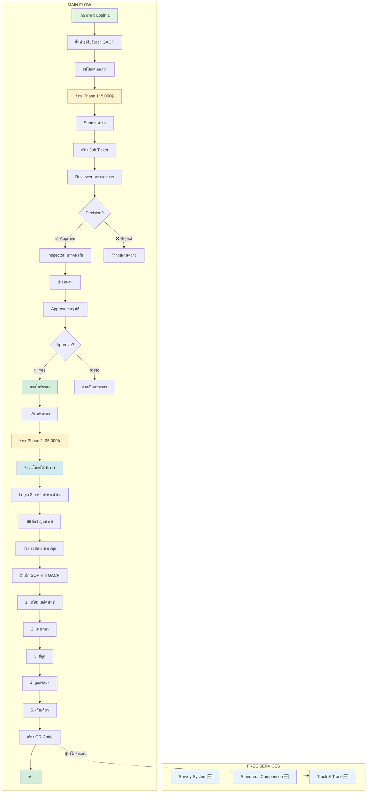

# 🎯 ระบบบริหารจัดการกัญชาทางการแพทย์ - ความเข้าใจที่ถูกต้อง 100% (Final)

**เอกสาร**: ความเข้าใจสุดท้ายที่ถูกต้อง (แก้ไขครั้งสุดท้าย)  
**Team**: PM + SA  
**Date**: October 15, 2025  
**Status**: ✅ FINAL CORRECT VERSION V2

---

## ✅ ความจริงที่ถูกต้อง 100%

### 1. **มีระบบ Payment** ✅

- **มี Payment**: 30,000฿
- **มี Phase 1-2**:
  - Phase 1: 5,000฿ (หลังกดอนุมัติการยื่นคำขอ)
  - Phase 2: 25,000฿ (หลังการตรวจสอบและอนุมัติเอกสารยื่นคำขอ ก่อนตรวจสอบฟาร์มแบบออนไลน์)

### 2. **DTAM Staff = 3 แผนก** ✅

- **Reviewer** (แผนกตรวจเอกสาร)
- **Inspector** (แผนกตรวจฟาร์ม)
- **Approver** (แผนกอนุมัติ)
- **Admin** (ผู้จัดการ DTAM)

**ทำงานผ่าน**:

- Job Tickets
- Notifications

### 3. **Government Portal (DTAM Portal)**

- **ไม่ใช่ portal แยก**
- คือ **Build 2** - Admin Panel/Dashboard
- สำหรับทีมงาน DTAM ทั้งหมด

### 4. **Free Services (ไม่อยู่ใน Flow)** 🆓

**3 ระบบฟรี - ไม่เกี่ยวกับการยื่นคำขอ**:

1. **Survey System** (แบบสอบถาม) 🆓
   - บุคคลทั่วไปเข้าถึงได้
   - ไม่ต้อง Login
   - ไม่เกี่ยวกับ Flow หลัก

2. **Standards Comparison** (เปรียบเทียบมาตรฐาน GACP) 🆓
   - บุคคลทั่วไปเข้าถึงได้
   - ไม่ต้อง Login
   - ไม่เกี่ยวกับ Flow หลัก

3. **Track & Trace** (ตรวจสอบย้อนกลับ) 🆓
   - **ตรวจสอบซีเรียลหรือ QR Code**
   - บุคคลทั่วไปสแกน QR Code
   - ดูข้อมูลย้อนกลับสินค้า
   - ไม่ต้อง Login
   - ไม่เกี่ยวกับ Flow หลัก

### 5. **Login 2: ระบบบริหารฟาร์ม (Seed to Sale)**

**Flow ที่ถูกต้อง**:

```
Login 2 → บันทึกข้อมูลฟาร์ม → สร้าง QR Code
  ↓
บันทึก SOP การปลูกกัญชาตาม GACP
  ↓
Seed to Sale (จบที่เก็บเกี่ยว)
  ├─ เตรียมเมล็ดพันธุ์
  ├─ เพาะกล้า
  ├─ ปลูก
  ├─ ดูแลรักษา
  ├─ เก็บเกี่ยว
  └─ จบ (ไม่มีขั้นต่อไป)
```

---

## 📊 โครงสร้างระบบที่ถูกต้อง

```
┌─────────────────────────────────────────────────────┐
│    ระบบบริหารจัดการกัญชาทางการแพทย์                │
└─────────────────────────────────────────────────────┘
                        │
        ┌───────────────┴───────────────┐
        ▼                               ▼
   ┌─────────┐                    ┌──────────┐
   │ BUILD 1 │                    │ BUILD 2  │
   │ Farmer  │◄──Job Tickets─────►│Government│
   │ Portal  │   Notifications    │  (DTAM)  │
   └─────────┘                    └──────────┘
        │
        │
   ┌────┴────────┐
   ▼             ▼
Free Services  Main Flow
(Survey,       (Login 1+2)
Standards,
Track&Trace)
```

---

## 📱 BUILD 1: Farmer Portal

### 🔐 2 ระบบ Login แยกกัน

#### **Login 1: ระบบยื่นเอกสาร + ใบรับรอง GACP**

**Purpose**:

- ยื่นคำขอใบรับรอง GACP
- ชำระเงิน Phase 1 + Phase 2
- ติดตามสถานะ
- ดาวน์โหลดใบรับรอง

**Features**:

1. **Member Management System** (ระบบสมาชิก)
   - สมัครสมาชิกเกษตรกร
   - จัดการข้อมูลส่วนตัว

2. **License Application System** (ระบบยื่นคำขอใบรับรอง GACP)
   - ยื่นคำขอใบรับรอง
   - อัปโหลดเอกสาร
   - **ชำระเงิน Phase 1** (5,000฿)
   - ติดตามสถานะคำขอ
   - รับ Notifications
   - **ชำระเงิน Phase 2** (25,000฿) - หลังได้รับอนุมัติ
   - ดาวน์โหลดใบรับรอง GACP

**Routes**:

```typescript
// Public
GET / - Landing page
GET /register - สมัครสมาชิก
GET /login - Login ระบบยื่นเอกสาร

// Farmer (after login)
GET /dashboard - Dashboard หลัก
GET /application/new - ยื่นคำขอใหม่
  → Step 1: ข้อมูลเกษตรกร
  → Step 2: ข้อมูลฟาร์ม
  → Step 3: อัปโหลดเอกสาร
  → Step 4: ชำระ Phase 1 (5,000฿)
  → Step 5: ยืนยัน + Submit

GET /applications - คำขอของฉัน
GET /applications/:id - รายละเอียดคำขอ + Timeline
GET /applications/:id/payment - ชำระเงิน Phase 2 (25,000฿)

GET /certificates - ใบรับรองของฉัน
GET /certificates/:id - รายละเอียดใบรับรอง
GET /certificates/:id/download - ดาวน์โหลด PDF

GET /profile - โปรไฟล์
GET /notifications - การแจ้งเตือน
```

**Workflow (Login 1)**:

```
1. สมัครสมาชิก + Login
   ↓
2. ยื่นคำขอใบรับรอง GACP
   ↓
3. ชำระเงิน Phase 1 (5,000฿)
   ↓
4. Submit → สร้าง Job Ticket → แจ้ง DTAM
   ↓
5. DTAM ตรวจสอบ (Reviewer → Inspector → Approver)
   ↓
6. ได้รับอนุมัติ → แจ้งชำระ Phase 2
   ↓
7. ชำระเงิน Phase 2 (25,000฿)
   ↓
8. ดาวน์โหลดใบรับรอง GACP
```

---

#### **Login 2: ระบบบริหารฟาร์ม (Farm Management + SOP)**

**Purpose**:

- จัดการฟาร์มกัญชา
- **บันทึก SOP การปลูกกัญชาตาม GACP** (Seed to Sale)
- ออก QR Code

**Features**:

1. **Cannabis Farm Management System** (ระบบบริหารจัดการฟาร์ม)
   - จัดการข้อมูลฟาร์ม
   - บันทึกรอบการเพาะปลูก
   - **ออก QR Code** สำหรับสินค้า

2. **SOP Tracking System** (ระบบบันทึก SOP ตาม GACP) ⭐ **MAIN FEATURE**

   **Seed to Sale (จบที่เก็บเกี่ยว)**:

   **ขั้นตอนที่ 1: เตรียมเมล็ดพันธุ์ (Seed Preparation)**
   - แหล่งที่มาของเมล็ดพันธุ์
   - ชนิดพันธุ์
   - วันที่รับเมล็ด
   - จำนวนเมล็ด
   - ภาพถ่ายเมล็ดพันธุ์

   **ขั้นตอนที่ 2: เพาะกล้า (Germination/Seedling)**
   - วันที่เพาะกล้า
   - วิธีการเพาะกล้า
   - อุณหภูมิและความชื้น
   - จำนวนต้นที่รอดชีวิต
   - ภาพถ่ายกล้า
   - บันทึก pH ดิน/น้ำ

   **ขั้นตอนที่ 3: ปลูก (Planting)**
   - วันที่ปลูก
   - พื้นที่ปลูก (ไร่)
   - จำนวนต้น
   - ระยะห่าง
   - ภาพถ่ายการปลูก
   - GPS Location

   **ขั้นตอนที่ 4: ดูแลรักษา (Cultivation & Maintenance)**

   **4.1 การให้น้ำ (Irrigation)**:
   - วันที่และเวลา
   - ปริมาณน้ำ (ลิตร)
   - แหล่งน้ำ
   - คุณภาพน้ำ

   **4.2 การใส่ปุ๋ย (Fertilization)**:
   - วันที่
   - ชนิดปุ๋ย (อินทรีย์/เคมี)
   - ปริมาณ
   - วิธีการใส่
   - ภาพถ่ายฉลากปุ๋ย

   **4.3 การควบคุมศัตรูพืช (Pest Control)**:
   - วันที่พบศัตรูพืช
   - ชนิดศัตรูพืช
   - วิธีการควบคุม
   - สารที่ใช้ (ถ้ามี)
   - ภาพถ่ายศัตรูพืช

   **4.4 การตัดแต่งกิ่ง (Pruning)**:
   - วันที่ตัดแต่ง
   - วิธีการตัดแต่ง
   - ภาพถ่าย

   **4.5 การตรวจสอบสุขภาพต้น (Health Check)**:
   - วันที่ตรวจ
   - สุขภาพโดยรวม (ดี/พอใช้/ไม่ดี)
   - ความสูงต้น (cm)
   - จำนวนกิ่ง
   - สีใบ
   - ภาพถ่าย

   **ขั้นตอนที่ 5: เก็บเกี่ยว (Harvesting)** ⭐ **จบ**
   - วันที่เก็บเกี่ยว
   - จำนวนต้นที่เก็บ
   - **น้ำหนักสด** (กิโลกรัม)
   - **น้ำหนักแห้ง** (กิโลกรัม)
   - วิธีการเก็บเกี่ยว
   - ภาพถ่ายผลผลิต
   - **สร้าง QR Code** สำหรับผลผลิต

   **จบที่นี่!** (ไม่มี Processing, Storage, Distribution)

**Routes**:

```typescript
// Public
GET /farm - Landing page
GET /farm/register - สมัครระบบฟาร์ม
GET /farm/login - Login ระบบบริหารฟาร์ม

// Farmer (after login)
GET /farm/dashboard - Dashboard ฟาร์ม

// Farm Management
GET /farm/management - จัดการฟาร์ม
GET /farm/cycles - รอบการเพาะปลูก
POST /farm/cycles - สร้างรอบใหม่
GET /farm/cycles/:id - รายละเอียดรอบ

// SOP Tracking (Seed to Sale) ⭐ MAIN
GET /farm/sop/:cycleId - SOP Dashboard

// Step 1: เตรียมเมล็ดพันธุ์
POST /farm/sop/:cycleId/seed - บันทึกเมล็ดพันธุ์
GET /farm/sop/:cycleId/seed - ดูข้อมูลเมล็ด

// Step 2: เพาะกล้า
POST /farm/sop/:cycleId/germination - บันทึกการเพาะกล้า
GET /farm/sop/:cycleId/germination - ดูข้อมูลเพาะกล้า

// Step 3: ปลูก
POST /farm/sop/:cycleId/planting - บันทึกการปลูก
GET /farm/sop/:cycleId/planting - ดูข้อมูลการปลูก

// Step 4: ดูแลรักษา
POST /farm/sop/:cycleId/irrigation - บันทึกการให้น้ำ
POST /farm/sop/:cycleId/fertilization - บันทึกการใส่ปุ๋ย
POST /farm/sop/:cycleId/pest-control - บันทึกการควบคุมศัตรูพืช
POST /farm/sop/:cycleId/pruning - บันทึกการตัดแต่งกิ่ง
POST /farm/sop/:cycleId/health-check - บันทึกการตรวจสุขภาพ
GET /farm/sop/:cycleId/maintenance - ดูข้อมูลการดูแลทั้งหมด

// Step 5: เก็บเกี่ยว (จบ!)
POST /farm/sop/:cycleId/harvest - บันทึกการเก็บเกี่ยว
GET /farm/sop/:cycleId/harvest - ดูข้อมูลการเก็บเกี่ยว

// QR Code Generation
POST /farm/qrcode/generate - Generate QR Code สำหรับผลผลิต
  Body: { cycleId, harvestId, weight, photos }
GET /farm/qrcode/:code - ดู QR Code
```

**Workflow (Login 2 - ที่ถูกต้อง)**:

```
1. Login ระบบบริหารฟาร์ม
   ↓
2. สร้างรอบการเพาะปลูก (Cycle)
   ↓
3. บันทึก SOP ตาม GACP (Seed to Sale):

   ▼ Step 1: เตรียมเมล็ดพันธุ์
     - แหล่งที่มา, ชนิดพันธุ์, จำนวน

   ▼ Step 2: เพาะกล้า
     - วิธีการเพาะ, อุณหภูมิ, ความชื้น

   ▼ Step 3: ปลูก
     - วันที่ปลูก, พื้นที่, GPS

   ▼ Step 4: ดูแลรักษา (บันทึกต่อเนื่อง)
     - ให้น้ำ (ทุกวัน/ทุกสัปดาห์)
     - ใส่ปุ๋ย (ตามกำหนด)
     - ควบคุมศัตรูพืช (เมื่อพบ)
     - ตัดแต่งกิ่ง (ตามความเหมาะสม)
     - ตรวจสุขภาพ (สัปดาห์ละครั้ง)

   ▼ Step 5: เก็บเกี่ยว (จบ!)
     - บันทึกน้ำหนักสด + แห้ง
     - ถ่ายรูปผลผลิต
     - สร้าง QR Code

   ✅ จบ! (ไม่มีขั้นต่อไป)
```

---

## 🆓 FREE SERVICES (ไม่อยู่ใน Flow)

### 1️⃣ **Survey System** (แบบสอบถาม) 🆓

**Purpose**: แบบสอบถามสาธารณะ (ไม่เกี่ยวกับ Flow หลัก)

**Users**: บุคคลทั่วไป (ไม่ต้อง Login)

**Routes**:

```typescript
// Public (Free Service)
GET /survey - Survey portal landing
GET /survey/list - รายการแบบสอบถาม
GET /survey/:id - ทำแบบสอบถาม
POST /survey/:id/submit - ส่งคำตอบ (ไม่ต้อง login!)
GET /survey/:id/results - ดูผลสำรวจ
```

**ตัวอย่างแบบสอบถาม**:

- แบบสอบถามความพึงพอใจ
- แบบสอบถามความต้องการ
- แบบสอบถามการใช้กัญชาทางการแพทย์

---

### 2️⃣ **Standards Comparison** (เปรียบเทียบมาตรฐาน) 🆓

**Purpose**: ให้ข้อมูลมาตรฐาน GACP (ไม่เกี่ยวกับ Flow หลัก)

**Users**: บุคคลทั่วไป (ไม่ต้อง Login)

**Routes**:

```typescript
// Public (Free Service)
GET /standards - Standards portal landing
GET /standards/gacp - มาตรฐาน GACP
GET /standards/who-fda - มาตรฐาน WHO/FDA
GET /standards/asean - มาตรฐาน ASEAN
GET /standards/compare - เปรียบเทียบมาตรฐาน
POST /standards/compare - ทำการเปรียบเทียบ
  Body: { standards: ['GACP', 'WHO', 'ASEAN'] }
GET /standards/checklist - Checklist มาตรฐาน
```

**Features**:

- อธิบายมาตรฐาน GACP
- เปรียบเทียบ GACP vs WHO/FDA vs ASEAN
- Checklist ตรวจสอบมาตรฐาน
- ดาวน์โหลดเอกสาร

---

### 3️⃣ **Track & Trace** (ตรวจสอบย้อนกลับ) 🆓

**Purpose**: ตรวจสอบซีเรียลหรือ QR Code (ไม่เกี่ยวกับ Flow หลัก)

**Users**: บุคคลทั่วไป (ไม่ต้อง Login)

**Routes**:

```typescript
// Public (Free Service)
GET /trace - Trace portal landing
GET /trace/verify - หน้าสแกน QR Code / ใส่ซีเรียล
GET /trace/:code - ตรวจสอบ QR Code / Serial
  → แสดง Timeline:
    - เมล็ดพันธุ์
    - เพาะกล้า
    - ปลูก
    - ดูแลรักษา (ทุกขั้นตอน)
    - เก็บเกี่ยว
GET /trace/:code/timeline - Timeline แบบละเอียด
GET /trace/:code/photos - รูปภาพทั้งหมด
```

**Features**:

- สแกน QR Code
- ใส่ซีเรียล (Serial Number)
- ดู Timeline ตั้งแต่ Seed → Harvest
- ดูรูปภาพแต่ละขั้นตอน
- ดู GPS Location
- ดูข้อมูล SOP ทั้งหมด

**Example**:

```
ผู้บริโภคสแกน QR Code
  ↓
แสดงข้อมูล:
  ├─ เมล็ดพันธุ์: ชนิด "XXX" วันที่ "1 ม.ค. 2025"
  ├─ เพาะกล้า: วันที่ "5 ม.ค. 2025"
  ├─ ปลูก: วันที่ "15 ม.ค. 2025" พื้นที่ 5 ไร่
  ├─ ดูแลรักษา:
  │   ├─ ให้น้ำ: 50 ครั้ง
  │   ├─ ใส่ปุ๋ย: 10 ครั้ง
  │   ├─ ควบคุมศัตรูพืช: 3 ครั้ง
  │   └─ ตรวจสุขภาพ: 12 ครั้ง
  └─ เก็บเกี่ยว: วันที่ "15 เม.ย. 2025"
      น้ำหนักสด: 500 กก.
      น้ำหนักแห้ง: 100 กก.
```

---

## 🏛️ BUILD 2: Government Portal (DTAM)

**Port**: 3002  
**URL**: https://dtam.gacp.th

### 🔐 1 Login สำหรับทีมงาน DTAM

**Users**:

- Reviewer (แผนกตรวจเอกสาร)
- Inspector (แผนกตรวจฟาร์ม)
- Approver (แผนกอนุมัติ)
- Admin (ผู้จัดการ DTAM)

---

### 👔 **Role 1: Reviewer** (แผนกตรวจเอกสาร)

**หน้าที่**:

1. รับ Job Ticket เมื่อเกษตรกร Submit
2. ตรวจสอบเอกสารทั้งหมด
3. ตัดสินใจ:
   - ✅ Approve → ส่งต่อ Inspector
   - ❌ Reject → ส่งกลับเกษตรกร
   - ❓ Request Info → รอข้อมูลเพิ่ม

**Routes**:

```typescript
GET /dtam/login - Login DTAM
GET /dtam/dashboard/reviewer - Reviewer dashboard

GET /dtam/reviewer/queue - คิวรอตรวจสอบ
GET /dtam/reviewer/pending - รอตรวจสอบ
GET /dtam/reviewer/inprogress - กำลังตรวจสอบ
GET /dtam/reviewer/completed - ตรวจเสร็จแล้ว

GET /dtam/reviewer/application/:id - รายละเอียดคำขอ
POST /dtam/reviewer/application/:id/approve - อนุมัติ
POST /dtam/reviewer/application/:id/reject - ปฏิเสธ
POST /dtam/reviewer/application/:id/request-info - ขอข้อมูลเพิ่ม
```

---

### 👔 **Role 2: Inspector** (แผนกตรวจฟาร์ม)

**หน้าที่**:

1. รับ Job Ticket จาก Reviewer
2. ตรวจสอบฟาร์ม
3. ส่งรายงานไป Approver

**Routes**:

```typescript
GET /dtam/dashboard/inspector - Inspector dashboard

GET /dtam/inspector/queue - คิวรอตรวจสอบ
GET /dtam/inspector/pending - รอตรวจสอบ
GET /dtam/inspector/inprogress - กำลังตรวจสอบ
GET /dtam/inspector/completed - ตรวจเสร็จแล้ว

GET /dtam/inspector/application/:id - รายละเอียดคำขอ
POST /dtam/inspector/application/:id/inspect - ตรวจฟาร์ม
POST /dtam/inspector/application/:id/submit-report - ส่งรายงาน
```

---

### 👔 **Role 3: Approver** (แผนกอนุมัติ)

**หน้าที่**:

1. รับรายงานจาก Inspector
2. ตัดสินใจขั้นสุดท้าย:
   - ✅ Approve → ออกใบรับรอง
   - ❌ Reject → ส่งกลับ

**Routes**:

```typescript
GET /dtam/dashboard/approver - Approver dashboard

GET /dtam/approver/queue - คิวรออนุมัติ
GET /dtam/approver/pending - รออนุมัติ
GET /dtam/approver/completed - อนุมัติแล้ว

GET /dtam/approver/application/:id - รายละเอียดคำขอ
POST /dtam/approver/application/:id/approve - อนุมัติ
POST /dtam/approver/application/:id/reject - ปฏิเสธ
POST /dtam/approver/application/:id/issue-certificate - ออกใบรับรอง
```

---

### 👔 **Role 4: Admin** (ผู้จัดการ DTAM)

**หน้าที่**:

1. ดูภาพรวมระบบทั้งหมด
2. จัดการทีม DTAM
3. รายงานและสถิติ

**Routes**:

```typescript
GET /dtam/dashboard/admin - Admin dashboard

// Team Management
GET /dtam/admin/staff - จัดการทีม DTAM
GET /dtam/admin/workload - Workload distribution
GET /dtam/admin/performance - Performance metrics

// Monitoring
GET /dtam/admin/farmers - เกษตรกรทั้งหมด
GET /dtam/admin/farms - ฟาร์มทั้งหมด
GET /dtam/admin/applications - คำขอทั้งหมด

// SOP Monitoring (ใหม่!)
GET /dtam/admin/sop - ตรวจสอบ SOP ของเกษตรกร
GET /dtam/admin/sop/:farmId - ดู SOP ของฟาร์ม
GET /dtam/admin/sop/:cycleId - ดู SOP ของรอบการเพาะปลูก

// Reports
GET /dtam/admin/reports - รายงานและสถิติ

// Settings
GET /dtam/admin/settings - ตั้งค่าระบบ
```

---

## 🔄 Complete Workflow (ที่ถูกต้อง 100%)



---

## 💰 Payment System

### ✅ มีระบบ Payment

**File**: `apps/backend/config/payment-fees.js`

```javascript
PHASE_1: 5,000฿   // หลังยื่นคำขอ
PHASE_2: 25,000฿  // หลังได้รับอนุมัติ

TOTAL_STANDARD_FEE: 30,000฿
RE_SUBMISSION_FEE: 5,000฿  // ครั้งที่ 3
```

---

## 📋 System Features Summary

### BUILD 1: Farmer Portal

#### Login 1: ระบบยื่นเอกสาร

1. ✅ Member Management
2. ✅ License Application (GACP)
3. ✅ Payment System (Phase 1 + Phase 2)
4. ✅ Certificate Download

#### Login 2: ระบบบริหารฟาร์ม

5. ✅ Farm Management
6. ✅ **SOP Tracking (Seed to Sale - จบที่เก็บเกี่ยว)** ⭐
7. ✅ QR Code Generation

---

### FREE SERVICES (ไม่อยู่ใน Flow)

8. 🆓 **Survey System** (แบบสอบถาม)
9. 🆓 **Standards Comparison** (เปรียบเทียบมาตรฐาน)
10. 🆓 **Track & Trace** (ตรวจสอบซีเรียล/QR Code)

---

### BUILD 2: Government Portal (DTAM)

11. ✅ Reviewer Dashboard
12. ✅ Inspector Dashboard
13. ✅ Approver Dashboard
14. ✅ Admin Dashboard
15. ✅ Job Ticket System
16. ✅ Notification System

---

## 🔧 Backend Modules

### ✅ Modules ที่ใช้งาน:

1. **auth-farmer** ✅
2. **auth-dtam** ✅
3. **application-workflow** ✅
4. **payment** ✅
5. **certificate-management** ✅
6. **farm-management** ✅
7. **sop-tracking** ✅ (Seed to Sale)
8. **track-trace** ✅ (QR Code Verification)
9. **survey-system** 🆓 (Free Service)
10. **cannabis-survey** 🆓
11. **standards-comparison** 🆓 (Free Service)
12. **dashboard** ✅
13. **document** ✅
14. **report** ✅
15. **audit** ✅
16. **notification** ✅
17. **job-assignment** ✅

---

## 🚀 Development Priority

### Phase 1: Application + Payment (Week 1-2) ⭐⭐⭐

**BUILD 1 - Login 1**:

- [ ] Member Registration
- [ ] License Application Form
- [ ] Payment Phase 1 + Phase 2
- [ ] Application Tracking
- [ ] Certificate Download

**BUILD 2 - DTAM Portal**:

- [ ] DTAM Login
- [ ] Reviewer Dashboard
- [ ] Inspector Dashboard
- [ ] Approver Dashboard
- [ ] Job Ticket System

---

### Phase 2: Farm Management + SOP (Week 3-4) ⭐⭐⭐

**BUILD 1 - Login 2**:

- [ ] Farm Registration
- [ ] Farm Management
- [ ] **SOP Tracking System** ⭐ (Seed to Sale):
  - [ ] 1. เตรียมเมล็ดพันธุ์
  - [ ] 2. เพาะกล้า
  - [ ] 3. ปลูก
  - [ ] 4. ดูแลรักษา (ให้น้ำ, ปุ๋ย, ศัตรูพืช, ตัดแต่ง, ตรวจสุขภาพ)
  - [ ] 5. เก็บเกี่ยว (จบ!)
- [ ] QR Code Generator

---

### Phase 3: Free Services (Week 5-6) ⭐

**Free Services**:

- [ ] 🆓 **Survey System**
- [ ] 🆓 **Standards Comparison**
- [ ] 🆓 **Track & Trace** (Public QR Verification)

---

### Phase 4: Admin + Reports (Week 7-8) ⭐

**BUILD 2 - Admin**:

- [ ] Admin Dashboard
- [ ] Team Management
- [ ] SOP Monitoring
- [ ] Reports & Analytics

---

## ✅ สรุปความเข้าใจที่ถูกต้อง 100%

### 1. Login 2 (ระบบบริหารฟาร์ม)

✅ **บันทึก SOP ตาม GACP (Seed to Sale)**

- Seed → Germination → Planting → Maintenance → **Harvest (จบ!)**
- ไม่มี Processing, Storage, Distribution

### 2. Free Services (ไม่อยู่ใน Flow)

✅ **3 ระบบฟรี**:

- 🆓 Survey (แบบสอบถาม)
- 🆓 Standards (เปรียบเทียบมาตรฐาน)
- 🆓 Track & Trace (ตรวจสอบซีเรียล/QR Code)

### 3. Track & Trace

✅ **ผู้บริโภคสแกน QR Code**

- ดู Timeline: Seed → Harvest
- ดูข้อมูล SOP ทั้งหมด
- ดูรูปภาพแต่ละขั้นตอน

---

**Approved by**: PM + SA  
**Status**: ✅ FINAL CORRECT VERSION V2  
**Next Steps**: Start Development 🚀
