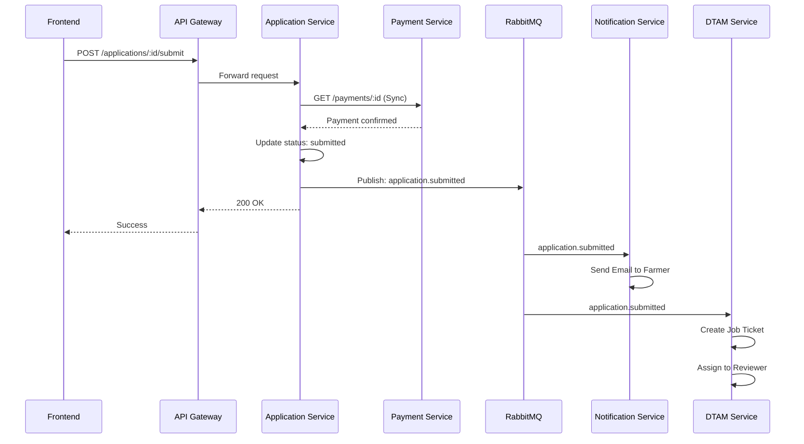

# 🏗️ Microservices Architecture Guide - GACP / DTAM Platform

**Document Version**: 1.0  
**Last Updated**: October 15, 2025  
**Status**: ✅ Production Ready

---

## 📋 Table of Contents

1. [Microservices Overview](#1-microservices-overview)
2. [Migration Strategy (Monolith → Microservices)](#2-migration-strategy)
3. [Service Decomposition](#3-service-decomposition)
4. [Communication Patterns](#4-communication-patterns)
5. [Data Management](#5-data-management)
6. [Service Implementation](#6-service-implementation)
7. [API Gateway](#7-api-gateway)
8. [Service Discovery](#8-service-discovery)
9. [Deployment & Orchestration](#9-deployment--orchestration)
10. [Monitoring & Observability](#10-monitoring--observability)
11. [Best Practices](#11-best-practices)

---

## 1. Microservices Overview

### 1.1 ทำไมต้อง Microservices?

**ข้อดี ✅**

- **Independent Scaling** - Scale แต่ละ service ได้อิสระตามความต้องการ
- **Technology Flexibility** - แต่ละ service ใช้ tech stack ต่างกันได้
- **Faster Deployment** - Deploy service ทีละตัวโดยไม่กระทบส่วนอื่น
- **Team Autonomy** - แต่ละทีมดูแล service ของตัวเองได้
- **Fault Isolation** - ถ้า service หนึ่งล้ม ไม่กระทบ service อื่น
- **Better Performance** - แยก resource ตามความต้องการจริง

**ข้อเสี่ย ❌**

- **Complexity** - มี services เยอะ จัดการยาก
- **Network Latency** - มีการเรียกผ่าน network
- **Data Consistency** - ยากกว่า ACID transaction
- **Testing** - ต้องทดสอบหลาย services พร้อมกัน
- **Deployment** - ต้องมี CI/CD ที่ดี
- **Monitoring** - ต้อง track หลาย services

---

### 1.2 GACP Platform Services (16 Services)

```
┌─────────────────────────────────────────────────────────────┐
│                      API Gateway (Kong)                      │
│                         Port 8000                            │
└─────────────────────────────────────────────────────────────┘
                              │
        ┌─────────────────────┼─────────────────────┐
        │                     │                     │
┌───────▼────────┐    ┌──────▼──────┐    ┌────────▼────────┐
│  Auth Service  │    │User Service │    │Application Svc  │
│   Port 3001    │    │  Port 3002  │    │   Port 3003     │
└────────────────┘    └─────────────┘    └─────────────────┘

┌────────────────┐    ┌─────────────┐    ┌─────────────────┐
│  Farm Service  │    │DTAM Service │    │ Payment Service │
│   Port 3004    │    │  Port 3005  │    │   Port 3006     │
└────────────────┘    └─────────────┘    └─────────────────┘

┌────────────────┐    ┌─────────────┐    ┌─────────────────┐
│Notification Svc│    │Document Svc │    │Certificate Svc  │
│   Port 3007    │    │  Port 3008  │    │   Port 3009     │
└────────────────┘    └─────────────┘    └─────────────────┘

┌────────────────┐    ┌─────────────┐    ┌─────────────────┐
│   QR Service   │    │Survey Svc   │    │ Standards Svc   │
│   Port 3010    │    │  Port 3011  │    │   Port 3012     │
└────────────────┘    └─────────────┘    └─────────────────┘

┌────────────────┐    ┌─────────────┐    ┌─────────────────┐
│Analytics Svc   │    │ Audit Svc   │    │ Workflow Svc    │
│   Port 3013    │    │  Port 3014  │    │   Port 3015     │
└────────────────┘    └─────────────┘    └─────────────────┘

┌─────────────────────────────────────────────────────────────┐
│              Integration Service (Port 3016)                 │
└─────────────────────────────────────────────────────────────┘

┌─────────────────────────────────────────────────────────────┐
│                    Message Queue (RabbitMQ)                  │
│                         Port 5672                            │
└─────────────────────────────────────────────────────────────┘

┌──────────────┐  ┌──────────────┐  ┌──────────────┐
│   MongoDB    │  │     Redis    │  │ElasticSearch │
│  Port 27017  │  │  Port 6379   │  │  Port 9200   │
└──────────────┘  └──────────────┘  └──────────────┘
```

---

## 2. Migration Strategy (Monolith → Microservices)

### 2.1 แผนการย้าย (3 Phases)

**Phase 1: Monolith (เดือนที่ 1-3)** ⭐ เริ่มที่นี่

- สร้าง Monolith แบบ Modular
- แยก Module ชัดเจนภายใน
- ใช้ Event Bus ภายใน (RabbitMQ)
- เตรียมพร้อมสำหรับการแยก

**Phase 2: Hybrid (เดือนที่ 4-6)** 🔄

- แยก Services สำคัญออกมาก่อน:
  - Auth Service
  - Payment Service
  - Notification Service
- Monolith ยังทำงานอยู่
- ค่อยๆ โยกข้อมูล

**Phase 3: Full Microservices (เดือนที่ 7-12)** 🚀

- แยกทุก Service
- ลบ Monolith
- Full Microservices Architecture

---

### 2.2 Strangler Fig Pattern

**หลักการ**: ค่อยๆ "รัด" Monolith จนตาย

```
Step 1: Monolith ทำทุกอย่าง
┌──────────────────────────────┐
│                              │
│         Monolith             │
│                              │
└──────────────────────────────┘

Step 2: แยก Auth Service ออกมา
┌─────────────┐  ┌──────────────┐
│Auth Service │  │   Monolith   │
│             │  │  (ลดลง)      │
└─────────────┘  └──────────────┘

Step 3: แยก Payment Service
┌────────┐ ┌────────┐ ┌─────────┐
│  Auth  │ │Payment │ │Monolith │
│        │ │        │ │(ลดลง)   │
└────────┘ └────────┘ └─────────┘

Step 4: แยกทุก Service
┌────┐ ┌────┐ ┌────┐ ┌────┐
│Auth│ │Pay │ │Farm│ │... │
└────┘ └────┘ └────┘ └────┘
```

---

### 2.3 การตัดสินใจแยก Service

**ตัดสินจาก Factors เหล่านี้:**

| Factor                   | คำอธิบาย                                | ตัวอย่าง                       |
| ------------------------ | --------------------------------------- | ------------------------------ |
| **Business Capability**  | แยกตาม Business Function                | Auth, Payment, Farm Management |
| **Data Ownership**       | แต่ละ service มี database เป็นของตัวเอง | Users DB, Applications DB      |
| **Independent Scaling**  | Scale แยกได้                            | Payment ต้อง scale บ่อย        |
| **Team Structure**       | 1 ทีม = 1-3 services                    | Team Auth ดูแล Auth + User     |
| **Deployment Frequency** | Deploy บ่อย = แยก                       | Notification ต้อง deploy บ่อย  |

---

## 3. Service Decomposition

### 3.1 Service ทั้งหมด (16 Services)

#### 🔐 **1. Auth Service** (Port 3001)

**Responsibility**: Authentication & Authorization

**Features**:

- ✅ User Login/Logout
- ✅ JWT Token Management (Access + Refresh)
- ✅ OTP Verification
- ✅ 2FA Management
- ✅ Session Management
- ✅ Password Reset

**Database**: `auth_db` (MongoDB)

- Collections: `users`, `sessions`, `otp_codes`, `refresh_tokens`

**API Endpoints**:

```
POST   /auth/register
POST   /auth/login
POST   /auth/logout
POST   /auth/refresh-token
POST   /auth/otp/send
POST   /auth/otp/verify
POST   /auth/password/reset
GET    /auth/me
```

**Dependencies**:

- ➡️ User Service (Get user profile)
- ➡️ Notification Service (Send OTP)
- ➡️ Audit Service (Log login attempts)

**Tech Stack**:

- Node.js + Express
- JWT (jsonwebtoken)
- bcrypt (Password hashing)
- Redis (Session storage)

---

#### 👤 **2. User Service** (Port 3002)

**Responsibility**: User Profile Management

**Features**:

- ✅ User CRUD
- ✅ Profile Management
- ✅ Role Management
- ✅ Settings & Preferences

**Database**: `user_db` (MongoDB)

- Collections: `users`, `profiles`, `roles`, `permissions`

**API Endpoints**:

```
GET    /users/:id
PUT    /users/:id
DELETE /users/:id
GET    /users/:id/profile
PUT    /users/:id/profile
GET    /users/:id/roles
PUT    /users/:id/roles
```

**Dependencies**:

- ⬅️ Auth Service (Verify token)
- ➡️ Audit Service (Log changes)

---

#### 📝 **3. Application Service** (Port 3003)

**Responsibility**: GACP Certification Applications

**Features**:

- ✅ Application CRUD
- ✅ Status Tracking
- ✅ Timeline Management
- ✅ Resubmission Handling

**Database**: `application_db` (MongoDB)

- Collections: `applications`, `application_history`, `rejection_counters`

**API Endpoints**:

```
POST   /applications
GET    /applications
GET    /applications/:id
PUT    /applications/:id
DELETE /applications/:id
PUT    /applications/:id/submit
GET    /applications/:id/timeline
GET    /applications/:id/history
```

**Dependencies**:

- ➡️ Payment Service (Check payment status)
- ➡️ Document Service (Get documents)
- ➡️ Workflow Service (Update workflow state)
- ➡️ Notification Service (Send notifications)
- ➡️ DTAM Service (Create job ticket)

**Events Published**:

- `application.created`
- `application.submitted`
- `application.status_changed`

---

#### 🌱 **4. Farm Service** (Port 3004)

**Responsibility**: Farm Management + SOP Tracking

**Features**:

- ✅ Farm Management
- ✅ SOP Tracking (5 Steps)
- ✅ Activity Logging
- ✅ Chemical Registry
- ✅ Compliance Check

**Database**: `farm_db` (MongoDB)

- Collections: `farms`, `crops`, `sop_activities`, `chemicals`

**API Endpoints**:

```
POST   /farms
GET    /farms
GET    /farms/:id
PUT    /farms/:id
POST   /farms/:id/crops
POST   /farms/:id/sop/seed
POST   /farms/:id/sop/planting
POST   /farms/:id/sop/growing
POST   /farms/:id/sop/pest-control
POST   /farms/:id/sop/harvest
GET    /farms/:id/sop
GET    /farms/:id/dashboard
GET    /farms/compliance
```

**Dependencies**:

- ➡️ Certificate Service (Check certificate)
- ➡️ QR Service (Generate QR on harvest)
- ➡️ Standards Service (Check chemical compliance)
- ➡️ Document Service (Upload photos)

**Events Published**:

- `farm.created`
- `sop.step_completed`
- `harvest.completed`

---

#### 🏛️ **5. DTAM Service** (Port 3005)

**Responsibility**: DTAM Staff Operations

**Features**:

- ✅ Job Queue Management
- ✅ Document Review (Reviewer)
- ✅ Farm Inspection (Inspector)
- ✅ Final Approval (Approver)
- ✅ System Admin (Admin)

**Database**: `dtam_db` (MongoDB)

- Collections: `job_tickets`, `reviews`, `inspections`, `approvals`

**API Endpoints**:

```
# Reviewer
GET    /dtam/reviewer/queue
GET    /dtam/reviewer/applications/:id
PUT    /dtam/reviewer/applications/:id/review

# Inspector
GET    /dtam/inspector/queue
POST   /dtam/inspector/schedule
PUT    /dtam/inspector/applications/:id/inspect

# Approver
GET    /dtam/approver/queue
PUT    /dtam/approver/applications/:id/approve

# Admin
GET    /dtam/admin/dashboard
GET    /dtam/admin/stats
```

**Dependencies**:

- ➡️ Application Service (Get application details)
- ➡️ Farm Service (Get farm details)
- ➡️ Workflow Service (Update workflow)
- ➡️ Notification Service (Send notifications)
- ➡️ Certificate Service (Issue certificate)

**Events Published**:

- `review.completed`
- `inspection.scheduled`
- `inspection.completed`
- `approval.granted`

---

#### 💳 **6. Payment Service** (Port 3006)

**Responsibility**: Payment Processing

**Features**:

- ✅ Payment Gateway Integration
- ✅ Transaction Management
- ✅ Invoice Generation
- ✅ Refund Processing

**Database**: `payment_db` (MongoDB)

- Collections: `payments`, `transactions`, `invoices`, `refunds`

**API Endpoints**:

```
POST   /payments
GET    /payments/:id
POST   /payments/:id/confirm
POST   /payments/:id/refund
GET    /payments/history
GET    /payments/:id/invoice
```

**Dependencies**:

- ➡️ Application Service (Update payment status)
- ➡️ Notification Service (Send invoice)
- ➡️ Integration Service (Payment Gateway API)

**Events Published**:

- `payment.created`
- `payment.confirmed`
- `payment.failed`
- `payment.refunded`

**External Integrations**:

- PromptPay API
- 2C2P API
- Omise API

---

#### 📧 **7. Notification Service** (Port 3007)

**Responsibility**: Multi-channel Notifications

**Features**:

- ✅ Email Notifications
- ✅ SMS Notifications
- ✅ In-app Notifications
- ✅ Template Management

**Database**: `notification_db` (MongoDB + Redis)

- MongoDB: `notifications`, `templates`
- Redis: Queue for async processing

**API Endpoints**:

```
POST   /notifications/send
GET    /notifications
GET    /notifications/:id
PUT    /notifications/:id/read
DELETE /notifications/:id
POST   /notifications/bulk
```

**Dependencies**:

- ➡️ Integration Service (SMTP, SMS Gateway)
- ➡️ User Service (Get user preferences)

**Events Subscribed**:

- `application.submitted`
- `payment.confirmed`
- `review.completed`
- `inspection.scheduled`
- `certificate.issued`

**External Integrations**:

- SendGrid (Email)
- AWS SES (Email)
- Thai SMS Provider (SMS)

---

#### 📂 **8. Document Service** (Port 3008)

**Responsibility**: File Management

**Features**:

- ✅ File Upload/Download
- ✅ Virus Scanning
- ✅ Version Control
- ✅ Access Control

**Database**: `document_db` (MongoDB)

- Collections: `documents`, `document_versions`

**Storage**: AWS S3 / MinIO

**API Endpoints**:

```
POST   /documents/upload
GET    /documents/:id
DELETE /documents/:id
GET    /documents/:id/versions
GET    /documents/:id/download
POST   /documents/:id/sign
```

**Dependencies**:

- ➡️ Integration Service (S3 API)
- ➡️ Virus Scanner (ClamAV)

**File Types Supported**:

- PDF: Max 10MB
- Images (JPG, PNG): Max 5MB
- Videos (MP4): Max 50MB

---

#### 📜 **9. Certificate Service** (Port 3009)

**Responsibility**: Certificate Management

**Features**:

- ✅ Certificate Generation
- ✅ Digital Signature
- ✅ Expiry Management
- ✅ Renewal Process

**Database**: `certificate_db` (MongoDB)

- Collections: `certificates`, `renewals`

**API Endpoints**:

```
POST   /certificates/generate
GET    /certificates/:id
GET    /certificates/:id/download
POST   /certificates/:id/renew
GET    /certificates/:id/verify
GET    /certificates/expiring
```

**Dependencies**:

- ➡️ Application Service (Get application data)
- ➡️ Document Service (Generate PDF)
- ➡️ QR Service (Embed QR code)
- ➡️ Notification Service (Expiry reminders)

**Events Published**:

- `certificate.issued`
- `certificate.expiring_soon`
- `certificate.renewed`

---

#### 🏷️ **10. QR Service** (Port 3010)

**Responsibility**: QR Code Management

**Features**:

- ✅ QR Code Generation
- ✅ Track & Trace Data
- ✅ Scan Statistics

**Database**: `qr_db` (MongoDB)

- Collections: `qr_codes`, `scan_history`

**API Endpoints**:

```
POST   /qr/generate
GET    /qr/:code
GET    /qr/:code/verify
GET    /qr/:code/timeline
GET    /qr/:code/stats
```

**Dependencies**:

- ➡️ Farm Service (Get SOP data)
- ➡️ Certificate Service (Get certificate data)
- ➡️ Document Service (Store QR image)

**Events Subscribed**:

- `harvest.completed`

---

#### 📋 **11. Survey Service** (Port 3011)

**Responsibility**: Survey Management

**Features**:

- ✅ Survey CRUD
- ✅ Response Collection
- ✅ Analytics

**Database**: `survey_db` (MongoDB)

- Collections: `surveys`, `questions`, `responses`

**API Endpoints**:

```
GET    /surveys (Public)
GET    /surveys/:id (Public)
POST   /surveys/:id/submit (Public)
GET    /surveys/:id/results (Admin)
POST   /surveys (Admin)
PUT    /surveys/:id (Admin)
```

---

#### ⚖️ **12. Standards Service** (Port 3012)

**Responsibility**: Standards Information

**Features**:

- ✅ Standards Database
- ✅ Comparison Engine
- ✅ Document Library

**Database**: `standards_db` (MongoDB)

- Collections: `standards`, `chemicals`, `guidelines`

**API Endpoints**:

```
GET    /standards (Public)
GET    /standards/:id (Public)
GET    /standards/compare (Public)
GET    /standards/chemicals (Public)
GET    /standards/:id/download (Public)
```

---

#### 📊 **13. Analytics Service** (Port 3013)

**Responsibility**: Reporting & Analytics

**Features**:

- ✅ KPI Dashboard
- ✅ Custom Reports
- ✅ Data Visualization

**Database**: ElasticSearch

- Indices: `applications`, `payments`, `farms`

**API Endpoints**:

```
GET    /analytics/dashboard
GET    /analytics/reports
GET    /analytics/kpis
POST   /analytics/custom-report
GET    /analytics/export
```

**Dependencies**:

- ➡️ All Services (Pull data)

---

#### 🔍 **14. Audit Service** (Port 3014)

**Responsibility**: Audit Logging

**Features**:

- ✅ Activity Logging
- ✅ Compliance Tracking
- ✅ Search & Filter

**Database**: ElasticSearch

- Indices: `audit_logs`

**API Endpoints**:

```
GET    /audit/logs
GET    /audit/logs/:id
GET    /audit/logs/search
GET    /audit/logs/export
```

**Events Subscribed**: All events from all services

---

#### 🔄 **15. Workflow Service** (Port 3015)

**Responsibility**: State Machine Management

**Features**:

- ✅ State Management
- ✅ Workflow Engine
- ✅ Auto-assignment
- ✅ SLA Monitoring

**Database**: `workflow_db` (MongoDB)

- Collections: `workflows`, `states`, `transitions`

**API Endpoints**:

```
POST   /workflows
GET    /workflows/:id
PUT    /workflows/:id/transition
GET    /workflows/:id/history
GET    /workflows/sla-violations
```

**Dependencies**:

- ➡️ All Services (Update states)

---

#### 🔌 **16. Integration Service** (Port 3016)

**Responsibility**: External API Integration

**Features**:

- ✅ Payment Gateway Integration
- ✅ Email/SMS Gateway
- ✅ Cloud Storage Integration
- ✅ Video Conference APIs

**API Endpoints**:

```
POST   /integrations/payment
POST   /integrations/email
POST   /integrations/sms
POST   /integrations/storage
POST   /integrations/video-call
```

**External APIs**:

- PromptPay / 2C2P / Omise
- SendGrid / AWS SES
- AWS S3 / MinIO
- Zoom / Blizz

---

## 4. Communication Patterns

### 4.1 Synchronous Communication (REST API)

**ใช้เมื่อ**:

- ✅ ต้องการ Response ทันที
- ✅ CRUD Operations
- ✅ Query Data

**ตัวอย่าง**:

```javascript
// Frontend → API Gateway → Application Service
GET /api/v1/applications/:id

// Application Service → Document Service
GET http://document-service:3008/documents/:docId
```

**Pros**:

- ✅ เข้าใจง่าย
- ✅ Response ทันที
- ✅ Error handling ชัดเจน

**Cons**:

- ❌ Tight coupling
- ❌ Network latency
- ❌ ถ้า service ล้ม ระบบพัง

---

### 4.2 Asynchronous Communication (Message Queue)

**ใช้เมื่อ**:

- ✅ ไม่ต้องการ Response ทันที
- ✅ Event-driven
- ✅ Background Jobs
- ✅ Notifications

**ตัวอย่าง**:

```javascript
// Application Service → RabbitMQ
publish('application.submitted', {
  application_id: 'APP-001',
  farmer_id: 'F-123'
});

// Notification Service ← RabbitMQ
subscribe('application.submitted', async data => {
  await sendEmail(data.farmer_id, 'คำขอของคุณถูกส่งแล้ว');
});
```

**Pros**:

- ✅ Loose coupling
- ✅ Fault tolerance
- ✅ Scalability

**Cons**:

- ❌ Eventual consistency
- ❌ Debugging ยาก
- ❌ Message ordering

---

### 4.3 Event Types

| Event                   | Publisher           | Subscribers                         |
| ----------------------- | ------------------- | ----------------------------------- |
| `application.submitted` | Application Service | Notification, Workflow, DTAM        |
| `payment.confirmed`     | Payment Service     | Application, Notification           |
| `review.completed`      | DTAM Service        | Application, Workflow, Notification |
| `inspection.completed`  | DTAM Service        | Application, Workflow, Notification |
| `certificate.issued`    | Certificate Service | Notification, QR                    |
| `harvest.completed`     | Farm Service        | QR, Analytics                       |

---

### 4.4 Communication Flow Example

**Scenario**: Farmer ยื่นเอกสาร



---

## 5. Data Management

### 5.1 Database Per Service Pattern

**หลักการ**: แต่ละ service มี database เป็นของตัวเอง

```
┌────────────────┐     ┌────────────────┐
│  Auth Service  │────▶│    auth_db     │
└────────────────┘     └────────────────┘

┌────────────────┐     ┌────────────────┐
│  User Service  │────▶│    user_db     │
└────────────────┘     └────────────────┘

┌────────────────┐     ┌────────────────┐
│Application Svc │────▶│application_db  │
└────────────────┘     └────────────────┘
```

**Pros**:

- ✅ Loose coupling
- ✅ Independent scaling
- ✅ Technology flexibility

**Cons**:

- ❌ ไม่มี JOIN ข้าม database
- ❌ Eventual consistency
- ❌ Data duplication

---

### 5.2 Data Consistency Patterns

#### Pattern 1: Saga Pattern

**ใช้สำหรับ**: Distributed Transactions

**ตัวอย่าง**: การชำระเงิน + สร้าง Application

```
Step 1: Payment Service → Reserve Money
  ↓ Success
Step 2: Application Service → Create Application
  ↓ Success
Step 3: Payment Service → Confirm Payment
  ↓
Done ✅

ถ้า Step 2 Fail:
  → Compensating Transaction: Payment Service → Refund
```

**Implementation**:

```javascript
// Saga Orchestrator
class ApplicationSaga {
  async execute(data) {
    try {
      // Step 1: Reserve payment
      const payment = await paymentService.reserve(data.amount);

      // Step 2: Create application
      const app = await applicationService.create(data.application);

      // Step 3: Confirm payment
      await paymentService.confirm(payment.id);

      return { success: true, app };
    } catch (error) {
      // Compensate
      if (payment) {
        await paymentService.refund(payment.id);
      }
      throw error;
    }
  }
}
```

---

#### Pattern 2: Event Sourcing

**ใช้สำหรับ**: Audit Trail + State Reconstruction

**ตัวอย่าง**: Application Status Changes

```
Event 1: ApplicationCreated
  → State: draft

Event 2: PaymentConfirmed
  → State: submitted

Event 3: ReviewCompleted
  → State: under_inspection

Event 4: ApprovalGranted
  → State: approved
```

---

#### Pattern 3: CQRS (Command Query Responsibility Segregation)

**แยก**: Write (Command) และ Read (Query)

```
Write Side (Normalized):
┌────────────────┐
│  Applications  │ (Write optimized)
└────────────────┘

Read Side (Denormalized):
┌────────────────┐
│Application View│ (Read optimized)
│ - application  │
│ - farmer       │
│ - documents    │
│ - payments     │
└────────────────┘
```

---

### 5.3 Data Duplication Strategy

**ข้อมูลที่อนุญาตให้ซ้ำ**:

- ✅ User Basic Info (name, email) - ทุก service ที่ต้องใช้
- ✅ Application Basic Info - DTAM Service, Certificate Service
- ✅ Certificate Info - QR Service

**ข้อมูลที่ห้ามซ้ำ**:

- ❌ Password Hash - Auth Service เท่านั้น
- ❌ Payment Transactions - Payment Service เท่านั้น
- ❌ Audit Logs - Audit Service เท่านั้น

---

## 6. Service Implementation

### 6.1 Project Structure (Per Service)

```
auth-service/
├── src/
│   ├── controllers/
│   │   └── auth.controller.ts
│   ├── services/
│   │   ├── auth.service.ts
│   │   ├── jwt.service.ts
│   │   └── otp.service.ts
│   ├── repositories/
│   │   └── user.repository.ts
│   ├── models/
│   │   ├── user.model.ts
│   │   └── session.model.ts
│   ├── middlewares/
│   │   ├── auth.middleware.ts
│   │   └── validation.middleware.ts
│   ├── routes/
│   │   └── auth.routes.ts
│   ├── events/
│   │   ├── publishers/
│   │   │   └── user.publisher.ts
│   │   └── subscribers/
│   │       └── user.subscriber.ts
│   ├── utils/
│   │   ├── logger.ts
│   │   └── response.ts
│   ├── config/
│   │   ├── database.ts
│   │   └── rabbitmq.ts
│   ├── types/
│   │   └── index.d.ts
│   ├── app.ts
│   └── server.ts
├── tests/
│   ├── unit/
│   ├── integration/
│   └── e2e/
├── Dockerfile
├── docker-compose.yml
├── package.json
├── tsconfig.json
└── README.md
```

---

### 6.2 Service Template

#### `src/server.ts`

```typescript
import express from 'express';
import cors from 'cors';
import helmet from 'helmet';
import morgan from 'morgan';
import { connectDatabase } from './config/database';
import { connectRabbitMQ } from './config/rabbitmq';
import authRoutes from './routes/auth.routes';
import { errorHandler } from './middlewares/error.middleware';
import { logger } from './utils/logger';

const app = express();
const PORT = process.env.PORT || 3001;

// Middleware
app.use(helmet());
app.use(cors());
app.use(express.json());
app.use(morgan('combined'));

// Health check
app.get('/health', (req, res) => {
  res.json({ status: 'OK', service: 'auth-service', timestamp: new Date() });
});

// Routes
app.use('/api/v1/auth', authRoutes);

// Error handler
app.use(errorHandler);

// Start server
async function start() {
  try {
    await connectDatabase();
    await connectRabbitMQ();

    app.listen(PORT, () => {
      logger.info(`Auth Service listening on port ${PORT}`);
    });
  } catch (error) {
    logger.error('Failed to start server:', error);
    process.exit(1);
  }
}

start();
```

---

#### `src/config/database.ts`

```typescript
import mongoose from 'mongoose';
import { logger } from '../utils/logger';

export async function connectDatabase() {
  const MONGO_URI = process.env.MONGO_URI || 'mongodb://localhost:27017/auth_db';

  try {
    await mongoose.connect(MONGO_URI, {
      useNewUrlParser: true,
      useUnifiedTopology: true
    });

    logger.info('✅ Connected to MongoDB (auth_db)');
  } catch (error) {
    logger.error('❌ MongoDB connection error:', error);
    throw error;
  }
}
```

---

#### `src/config/rabbitmq.ts`

```typescript
import amqp from 'amqplib';
import { logger } from '../utils/logger';

let connection: amqp.Connection;
let channel: amqp.Channel;

export async function connectRabbitMQ() {
  const RABBITMQ_URL = process.env.RABBITMQ_URL || 'amqp://localhost:5672';

  try {
    connection = await amqp.connect(RABBITMQ_URL);
    channel = await connection.createChannel();

    // Create exchanges
    await channel.assertExchange('gacp.events', 'topic', { durable: true });

    logger.info('✅ Connected to RabbitMQ');
  } catch (error) {
    logger.error('❌ RabbitMQ connection error:', error);
    throw error;
  }
}

export function getChannel(): amqp.Channel {
  if (!channel) {
    throw new Error('RabbitMQ channel not initialized');
  }
  return channel;
}

// Publish event
export async function publish(eventName: string, data: any) {
  const channel = getChannel();
  const message = JSON.stringify({
    event: eventName,
    data,
    timestamp: new Date()
  });

  channel.publish('gacp.events', eventName, Buffer.from(message));
  logger.info(`📤 Published event: ${eventName}`);
}

// Subscribe to event
export async function subscribe(eventName: string, handler: (data: any) => Promise<void>) {
  const channel = getChannel();

  const queue = await channel.assertQueue('', { exclusive: true });
  await channel.bindQueue(queue.queue, 'gacp.events', eventName);

  channel.consume(queue.queue, async msg => {
    if (msg) {
      const content = JSON.parse(msg.content.toString());
      logger.info(`📥 Received event: ${eventName}`);

      try {
        await handler(content.data);
        channel.ack(msg);
      } catch (error) {
        logger.error(`Error handling event ${eventName}:`, error);
        channel.nack(msg, false, true); // Requeue
      }
    }
  });
}
```

---

#### `src/controllers/auth.controller.ts`

```typescript
import { Request, Response } from 'express';
import { AuthService } from '../services/auth.service';
import { publish } from '../config/rabbitmq';
import { logger } from '../utils/logger';

export class AuthController {
  private authService: AuthService;

  constructor() {
    this.authService = new AuthService();
  }

  async login(req: Request, res: Response) {
    try {
      const { email, password } = req.body;

      const result = await this.authService.login(email, password);

      // Publish event
      await publish('user.logged_in', {
        user_id: result.user.id,
        email: result.user.email
      });

      res.json({
        success: true,
        data: result
      });
    } catch (error) {
      logger.error('Login error:', error);
      res.status(401).json({
        success: false,
        error: { message: 'Invalid credentials' }
      });
    }
  }

  async register(req: Request, res: Response) {
    try {
      const userData = req.body;

      const user = await this.authService.register(userData);

      // Publish event
      await publish('user.registered', {
        user_id: user.id,
        email: user.email
      });

      res.status(201).json({
        success: true,
        data: user
      });
    } catch (error) {
      logger.error('Register error:', error);
      res.status(400).json({
        success: false,
        error: { message: error.message }
      });
    }
  }
}
```

---

### 6.3 Dockerfile (Per Service)

```dockerfile
# auth-service/Dockerfile
FROM node:20-alpine AS builder

WORKDIR /app

# Install dependencies
COPY package*.json ./
RUN npm ci --only=production

# Copy source
COPY . .

# Build TypeScript
RUN npm run build

# Production stage
FROM node:20-alpine

WORKDIR /app

# Copy from builder
COPY --from=builder /app/dist ./dist
COPY --from=builder /app/node_modules ./node_modules
COPY --from=builder /app/package.json ./

# Expose port
EXPOSE 3001

# Health check
HEALTHCHECK --interval=30s --timeout=3s --start-period=40s --retries=3 \
  CMD node -e "require('http').get('http://localhost:3001/health', (r) => {process.exit(r.statusCode === 200 ? 0 : 1)})"

# Start
CMD ["node", "dist/server.js"]
```

---

### 6.4 docker-compose.yml (Development)

```yaml
version: '3.9'

services:
  # Auth Service
  auth-service:
    build: ./auth-service
    ports:
      - '3001:3001'
    environment:
      - NODE_ENV=development
      - PORT=3001
      - MONGO_URI=mongodb://mongo:27017/auth_db
      - REDIS_URL=redis://redis:6379
      - RABBITMQ_URL=amqp://rabbitmq:5672
      - JWT_SECRET=${JWT_SECRET}
    depends_on:
      - mongo
      - redis
      - rabbitmq
    volumes:
      - ./auth-service:/app
      - /app/node_modules

  # User Service
  user-service:
    build: ./user-service
    ports:
      - '3002:3002'
    environment:
      - NODE_ENV=development
      - PORT=3002
      - MONGO_URI=mongodb://mongo:27017/user_db
      - RABBITMQ_URL=amqp://rabbitmq:5672
    depends_on:
      - mongo
      - rabbitmq

  # Application Service
  application-service:
    build: ./application-service
    ports:
      - '3003:3003'
    environment:
      - NODE_ENV=development
      - PORT=3003
      - MONGO_URI=mongodb://mongo:27017/application_db
      - RABBITMQ_URL=amqp://rabbitmq:5672
    depends_on:
      - mongo
      - rabbitmq

  # ... (other services)

  # MongoDB
  mongo:
    image: mongo:7.0
    ports:
      - '27017:27017'
    volumes:
      - mongo-data:/data/db

  # Redis
  redis:
    image: redis:7.2-alpine
    ports:
      - '6379:6379'

  # RabbitMQ
  rabbitmq:
    image: rabbitmq:3.12-management
    ports:
      - '5672:5672'
      - '15672:15672'
    environment:
      - RABBITMQ_DEFAULT_USER=admin
      - RABBITMQ_DEFAULT_PASS=admin

volumes:
  mongo-data:
```

---

## 7. API Gateway

### 7.1 Why API Gateway?

**Problems Without Gateway**:

- ❌ Frontend ต้องรู้ URL ของทุก service
- ❌ Authentication ซ้ำในทุก service
- ❌ Rate limiting ซ้ำ
- ❌ Logging ซ้ำ

**Solutions With Gateway**:

- ✅ Single entry point
- ✅ Centralized authentication
- ✅ Centralized rate limiting
- ✅ Request routing
- ✅ Load balancing

---

### 7.2 Kong API Gateway Setup

#### `kong.yml` (Declarative Config)

```yaml
_format_version: '3.0'

services:
  # Auth Service
  - name: auth-service
    url: http://auth-service:3001
    routes:
      - name: auth-routes
        paths:
          - /api/v1/auth
        strip_path: false
    plugins:
      - name: rate-limiting
        config:
          minute: 100
          policy: local
      - name: cors
        config:
          origins:
            - https://gacp.go.th
            - https://dtam.gacp.go.th

  # Application Service
  - name: application-service
    url: http://application-service:3003
    routes:
      - name: application-routes
        paths:
          - /api/v1/applications
        strip_path: false
    plugins:
      - name: jwt
        config:
          claims_to_verify:
            - exp
      - name: rate-limiting
        config:
          minute: 200

  # ... (other services)

plugins:
  # Global plugins
  - name: correlation-id
    config:
      header_name: X-Request-ID
      generator: uuid

  - name: request-transformer
    config:
      add:
        headers:
          - X-Gateway: Kong

  - name: response-transformer
    config:
      add:
        headers:
          - X-Response-Time: $(latency)
```

---

### 7.3 Request Flow Through Gateway

```
1. Client Request
   POST https://gacp.go.th/api/v1/applications
   Authorization: Bearer <JWT>
   ↓
2. API Gateway (Kong)
   - Verify JWT ✅
   - Check Rate Limit ✅
   - Add Headers (X-Request-ID, X-User-ID)
   - Route to application-service
   ↓
3. Application Service
   - Process request
   - Return response
   ↓
4. API Gateway
   - Add response headers
   - Return to client
   ↓
5. Client Response
   200 OK
   X-Request-ID: abc-123
   X-Response-Time: 150ms
```

---

## 8. Service Discovery

### 8.1 Kubernetes Service Discovery

**Automatic**: Kubernetes DNS

```yaml
# Service definition
apiVersion: v1
kind: Service
metadata:
  name: auth-service
spec:
  selector:
    app: auth-service
  ports:
    - port: 3001
      targetPort: 3001
```

**Usage in Code**:

```typescript
// Other services can call:
const response = await axios.get('http://auth-service:3001/health');
```

---

### 8.2 Consul Service Discovery (Alternative)

```javascript
const consul = require('consul')();

// Register service
await consul.agent.service.register({
  name: 'auth-service',
  address: '10.0.0.1',
  port: 3001,
  check: {
    http: 'http://10.0.0.1:3001/health',
    interval: '10s'
  }
});

// Discover service
const services = await consul.health.service('auth-service');
const serviceUrl = `http://${services[0].Service.Address}:${services[0].Service.Port}`;
```

---

## 9. Deployment & Orchestration

### 9.1 Kubernetes Deployment

#### `k8s/auth-service.yaml`

```yaml
apiVersion: apps/v1
kind: Deployment
metadata:
  name: auth-service
  namespace: gacp-production
spec:
  replicas: 3
  selector:
    matchLabels:
      app: auth-service
  template:
    metadata:
      labels:
        app: auth-service
        version: v1.0.0
    spec:
      containers:
        - name: auth-service
          image: gcr.io/gacp/auth-service:1.0.0
          ports:
            - containerPort: 3001
          env:
            - name: NODE_ENV
              value: 'production'
            - name: PORT
              value: '3001'
            - name: MONGO_URI
              valueFrom:
                secretKeyRef:
                  name: gacp-secrets
                  key: auth-mongo-uri
            - name: JWT_SECRET
              valueFrom:
                secretKeyRef:
                  name: gacp-secrets
                  key: jwt-secret
          resources:
            requests:
              memory: '512Mi'
              cpu: '250m'
            limits:
              memory: '1Gi'
              cpu: '500m'
          livenessProbe:
            httpGet:
              path: /health
              port: 3001
            initialDelaySeconds: 30
            periodSeconds: 10
          readinessProbe:
            httpGet:
              path: /health
              port: 3001
            initialDelaySeconds: 10
            periodSeconds: 5

---
apiVersion: v1
kind: Service
metadata:
  name: auth-service
  namespace: gacp-production
spec:
  selector:
    app: auth-service
  ports:
    - port: 3001
      targetPort: 3001
  type: ClusterIP

---
apiVersion: autoscaling/v2
kind: HorizontalPodAutoscaler
metadata:
  name: auth-service-hpa
  namespace: gacp-production
spec:
  scaleTargetRef:
    apiVersion: apps/v1
    kind: Deployment
    name: auth-service
  minReplicas: 3
  maxReplicas: 10
  metrics:
    - type: Resource
      resource:
        name: cpu
        target:
          type: Utilization
          averageUtilization: 70
    - type: Resource
      resource:
        name: memory
        target:
          type: Utilization
          averageUtilization: 80
```

---

### 9.2 Helm Chart (Recommended)

```
gacp-helm/
├── Chart.yaml
├── values.yaml
└── templates/
    ├── auth-service/
    │   ├── deployment.yaml
    │   ├── service.yaml
    │   └── hpa.yaml
    ├── application-service/
    ├── ...
    └── ingress.yaml
```

**Deploy**:

```bash
helm install gacp-platform ./gacp-helm --namespace gacp-production
```

---

## 10. Monitoring & Observability

### 10.1 Distributed Tracing (Jaeger)

```javascript
const { initTracer } = require('jaeger-client');

// Initialize tracer
const tracer = initTracer(
  {
    serviceName: 'auth-service',
    sampler: {
      type: 'const',
      param: 1
    },
    reporter: {
      agentHost: 'jaeger-agent',
      agentPort: 6831
    }
  },
  {}
);

// Middleware
app.use((req, res, next) => {
  const span = tracer.startSpan(`${req.method} ${req.path}`);
  req.span = span;

  res.on('finish', () => {
    span.finish();
  });

  next();
});
```

---

### 10.2 Metrics (Prometheus)

```javascript
const client = require('prom-client');

// Create metrics
const httpRequestDuration = new client.Histogram({
  name: 'http_request_duration_seconds',
  help: 'Duration of HTTP requests in seconds',
  labelNames: ['method', 'route', 'status_code']
});

const httpRequestTotal = new client.Counter({
  name: 'http_requests_total',
  help: 'Total number of HTTP requests',
  labelNames: ['method', 'route', 'status_code']
});

// Middleware
app.use((req, res, next) => {
  const start = Date.now();

  res.on('finish', () => {
    const duration = (Date.now() - start) / 1000;

    httpRequestDuration.observe(
      { method: req.method, route: req.route?.path || req.path, status_code: res.statusCode },
      duration
    );

    httpRequestTotal.inc({
      method: req.method,
      route: req.route?.path || req.path,
      status_code: res.statusCode
    });
  });

  next();
});

// Expose metrics
app.get('/metrics', async (req, res) => {
  res.set('Content-Type', client.register.contentType);
  res.end(await client.register.metrics());
});
```

---

### 10.3 Centralized Logging (ELK Stack)

```javascript
const winston = require('winston');
const { ElasticsearchTransport } = require('winston-elasticsearch');

const logger = winston.createLogger({
  level: 'info',
  format: winston.format.json(),
  defaultMeta: {
    service: 'auth-service',
    environment: process.env.NODE_ENV
  },
  transports: [
    // Console
    new winston.transports.Console({
      format: winston.format.simple()
    }),

    // Elasticsearch
    new ElasticsearchTransport({
      level: 'info',
      clientOpts: {
        node: 'http://elasticsearch:9200'
      },
      index: 'gacp-logs'
    })
  ]
});

// Usage
logger.info('User logged in', {
  user_id: 'F-123',
  ip_address: req.ip,
  user_agent: req.get('User-Agent')
});
```

---

## 11. Best Practices

### 11.1 Service Design

✅ **DO**:

- Single Responsibility - แต่ละ service ทำอย่างเดียว
- Loose Coupling - ลด dependencies
- High Cohesion - ฟังก์ชันที่เกี่ยวข้องอยู่ใน service เดียวกัน
- Autonomous - Deploy อิสระได้
- Resilient - มี fallback / retry

❌ **DON'T**:

- Share database ระหว่าง services
- Synchronous call chains (A → B → C → D)
- Tight coupling
- Shared libraries ที่มี business logic

---

### 11.2 Communication

✅ **DO**:

- ใช้ REST สำหรับ synchronous
- ใช้ Message Queue สำหรับ asynchronous
- Implement retry mechanism
- Implement circuit breaker
- Use timeout

❌ **DON'T**:

- Synchronous call chains
- Assume network is reliable
- Ignore failures

---

### 11.3 Data Management

✅ **DO**:

- Database per service
- Use Saga pattern สำหรับ distributed transactions
- Implement eventual consistency
- Use event sourcing (ถ้าจำเป็น)

❌ **DON'T**:

- Share database
- Use distributed transactions (2PC)

---

### 11.4 Security

✅ **DO**:

- JWT authentication ที่ API Gateway
- HTTPS/TLS ทุก communication
- Secret management (Vault/Secrets Manager)
- Input validation
- Rate limiting

❌ **DON'T**:

- Store secrets in code
- Trust incoming data
- Skip authentication

---

### 11.5 Monitoring

✅ **DO**:

- Implement health checks
- Collect metrics (Prometheus)
- Distributed tracing (Jaeger)
- Centralized logging (ELK)
- Alerting (Slack/Email)

❌ **DON'T**:

- ปล่อยไว้โดยไม่มี monitoring
- Ignore metrics

---

## 12. สรุป (Summary)

### 12.1 Key Takeaways

1. **เริ่มจาก Monolith** - แล้วค่อย migrate ไป Microservices
2. **แยก Service ตาม Business Capability** - Auth, Payment, Application, ฯลฯ
3. **Database Per Service** - แยก database ของแต่ละ service
4. **Asynchronous Communication** - ใช้ RabbitMQ สำหรับ events
5. **API Gateway** - Single entry point (Kong)
6. **Container Orchestration** - ใช้ Kubernetes
7. **Monitoring & Observability** - Prometheus, Grafana, ELK, Jaeger
8. **CI/CD** - Automate deployment

---

### 12.2 Migration Roadmap

**Month 1-3**: Monolith MVP

- ✅ สร้าง Modular Monolith
- ✅ แยก modules ชัดเจน
- ✅ ใช้ Event Bus

**Month 4-6**: Hybrid

- ✅ แยก Auth Service
- ✅ แยก Payment Service
- ✅ แยก Notification Service

**Month 7-12**: Full Microservices

- ✅ แยก services ทั้งหมด
- ✅ Implement service mesh (Istio)
- ✅ Full observability

---

### 12.3 Resources

**Tools**:

- Docker: https://www.docker.com
- Kubernetes: https://kubernetes.io
- Kong: https://konghq.com
- RabbitMQ: https://www.rabbitmq.com
- Prometheus: https://prometheus.io
- Grafana: https://grafana.com
- Jaeger: https://www.jaegertracing.io

**Best Practices**:

- 12-Factor App: https://12factor.net
- Microservices Patterns: https://microservices.io

---

**Status**: ✅ Ready for Implementation  
**Next Steps**: Start with Modular Monolith → Gradually migrate to Microservices  
**Contact**: DevOps Team for infrastructure setup

---

🎉 **Good luck building your Microservices!** 🚀
