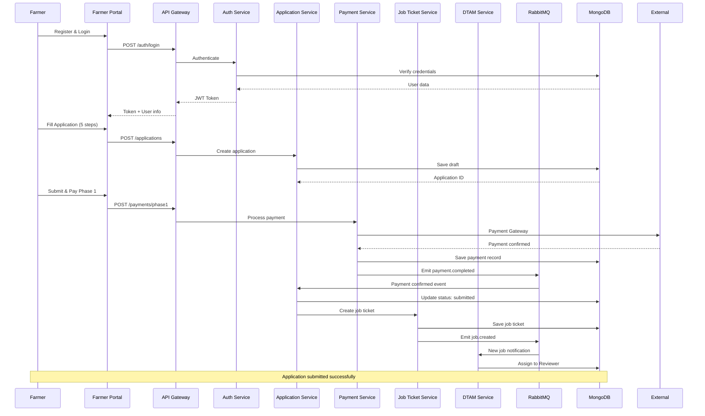
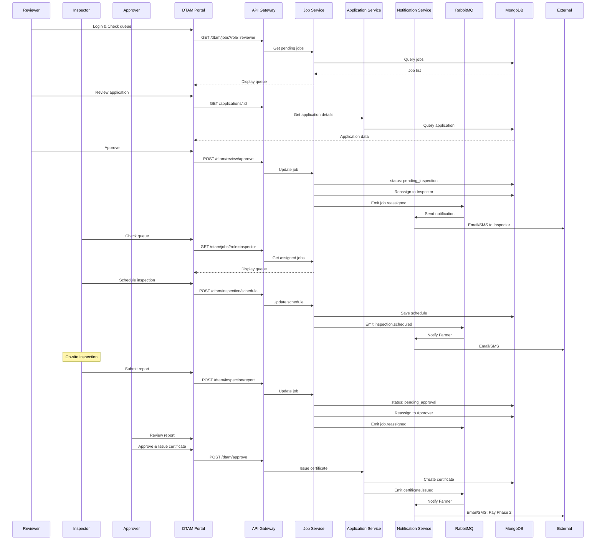
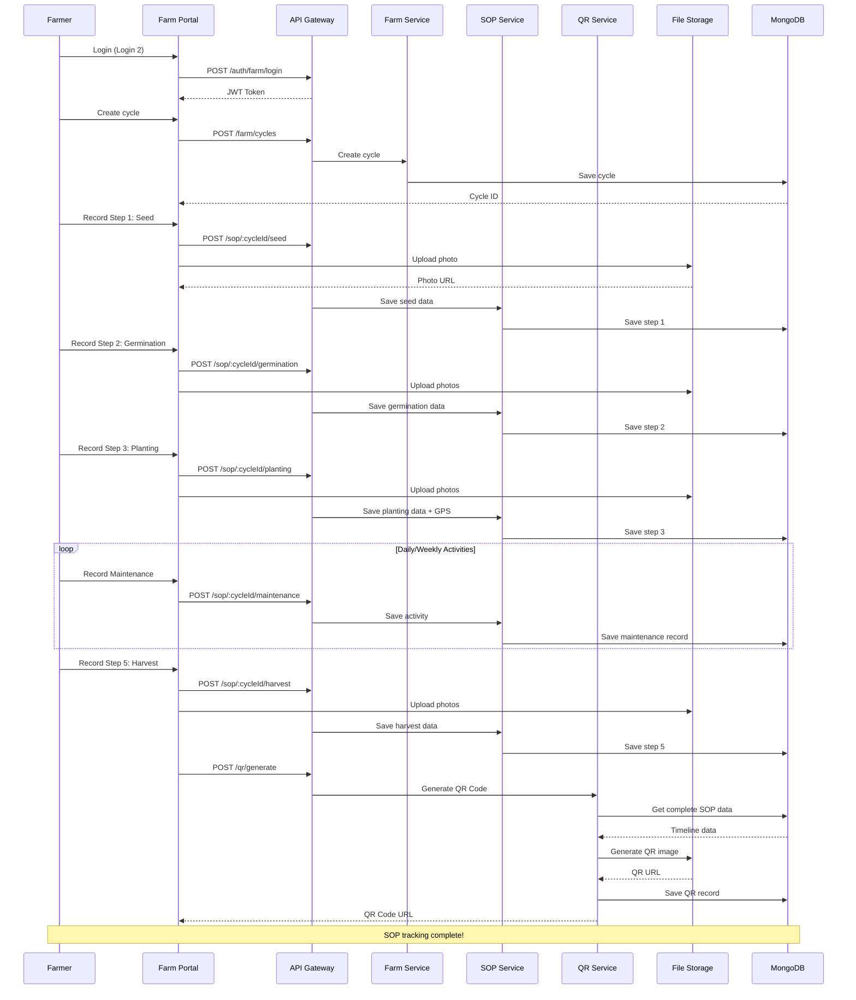
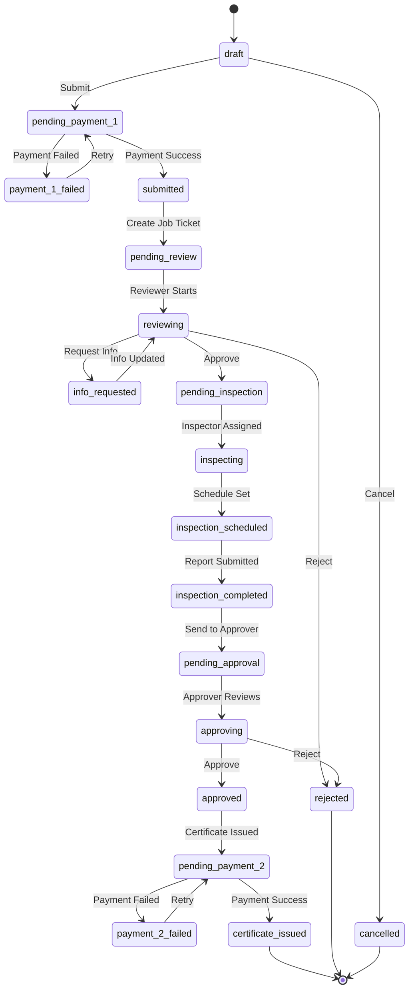
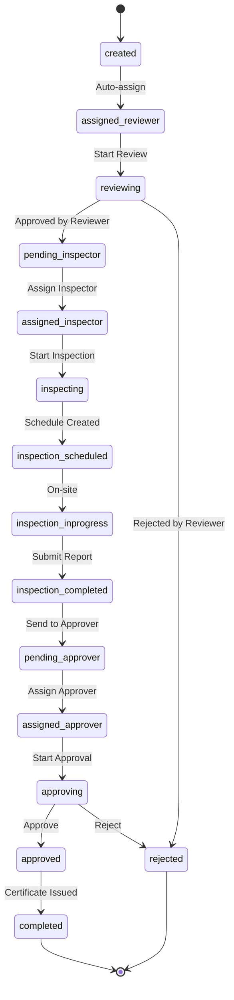

# 🏗️ SA + SE: System Design & Architecture Plan

**Meeting Date**: October 15, 2025  
**Presenters**: SA (System Analyst) + SE (Software Engineer)  
**Topic**: System Architecture & Implementation Strategy  
**Status**: ✅ Technical Design Document

---

## 📋 Table of Contents

1. [SA: System Analysis & Design](#sa-system-analysis--design)
2. [SE: Technical Architecture](#se-technical-architecture)
3. [Database Design](#database-design)
4. [API Architecture](#api-architecture)
5. [Security Architecture](#security-architecture)
6. [Implementation Strategy](#implementation-strategy)

---

# 🔍 SA: System Analysis & Design

**Presenter**: System Analyst

---

## 1. System Breakdown & Modules

### 1.1 Core Modules Overview

```
GACP Platform
├── Frontend (2 Portals)
│   ├── Farmer Portal (Port 3001)
│   │   ├── Login 1: Application Module
│   │   └── Login 2: Farm Management Module
│   └── DTAM Portal (Port 3002)
│       └── Single Login (4 Role Dashboards)
│
├── Backend Services (Monolith MVP → Microservices)
│   ├── Core Services
│   │   ├── Auth Service
│   │   ├── Application Service
│   │   ├── Farm Management Service
│   │   ├── SOP Tracking Service
│   │   ├── Payment Service
│   │   └── DTAM Service
│   ├── Supporting Services
│   │   ├── Job Ticket Service
│   │   ├── Notification Service
│   │   ├── Document Service
│   │   └── Certificate Service
│   └── Free Services
│       ├── Survey Service
│       ├── Standards Service
│       └── Track & Trace Service
│
└── Infrastructure
    ├── Database (MongoDB + Redis)
    ├── Message Queue (RabbitMQ)
    ├── File Storage (S3/MinIO)
    └── Monitoring (ELK + Prometheus)
```

---

## 2. Data Flow Architecture

### 2.1 Application Flow (Login 1)



### 2.2 DTAM Workflow



### 2.3 SOP Tracking Flow (Login 2)



---

## 3. State Machine Design

### 3.1 Application State Machine



### 3.2 Job Ticket State Machine



---

## 4. API Design Strategy

### 4.1 API Structure

```
/api/v1/
├── auth/
│   ├── POST /register
│   ├── POST /login
│   ├── POST /logout
│   ├── POST /refresh-token
│   └── GET /me
│
├── applications/
│   ├── GET /applications
│   ├── POST /applications
│   ├── GET /applications/:id
│   ├── PUT /applications/:id
│   ├── DELETE /applications/:id
│   ├── POST /applications/:id/submit
│   └── GET /applications/:id/timeline
│
├── payments/
│   ├── POST /payments/phase1
│   ├── POST /payments/phase2
│   ├── GET /payments/:id
│   └── GET /payments/:id/status
│
├── farm/
│   ├── GET /farm/cycles
│   ├── POST /farm/cycles
│   ├── GET /farm/cycles/:id
│   └── PUT /farm/cycles/:id
│
├── sop/
│   ├── POST /sop/:cycleId/seed
│   ├── POST /sop/:cycleId/germination
│   ├── POST /sop/:cycleId/planting
│   ├── POST /sop/:cycleId/maintenance
│   ├── POST /sop/:cycleId/harvest
│   └── GET /sop/:cycleId/timeline
│
├── dtam/
│   ├── GET /dtam/jobs
│   ├── GET /dtam/jobs/:id
│   ├── POST /dtam/review/:id/approve
│   ├── POST /dtam/review/:id/reject
│   ├── POST /dtam/review/:id/request-info
│   ├── POST /dtam/inspection/:id/schedule
│   ├── POST /dtam/inspection/:id/report
│   ├── POST /dtam/approval/:id/approve
│   └── POST /dtam/approval/:id/reject
│
├── certificates/
│   ├── GET /certificates
│   ├── GET /certificates/:id
│   └── GET /certificates/:id/download
│
├── qr/
│   ├── POST /qr/generate
│   └── GET /qr/:code
│
├── trace/
│   ├── GET /trace/:code
│   └── GET /trace/:code/timeline
│
├── survey/
│   ├── GET /survey
│   ├── GET /survey/:id
│   └── POST /survey/:id/submit
│
├── standards/
│   ├── GET /standards
│   └── POST /standards/compare
│
└── notifications/
    ├── GET /notifications
    ├── PUT /notifications/:id/read
    └── WebSocket /notifications/stream
```

### 4.2 API Response Format

```typescript
// Success Response
interface SuccessResponse<T> {
  success: true;
  data: T;
  meta: {
    timestamp: string;
    request_id: string;
    pagination?: {
      page: number;
      limit: number;
      total: number;
      total_pages: number;
    };
  };
}

// Error Response
interface ErrorResponse {
  success: false;
  error: {
    code: string;
    message: string;
    details?: any;
    stack?: string; // dev only
  };
  meta: {
    timestamp: string;
    request_id: string;
  };
}

// Example Success
{
  "success": true,
  "data": {
    "application_id": "APP-2025-0001",
    "status": "submitted",
    "created_at": "2025-01-15T10:30:00Z"
  },
  "meta": {
    "timestamp": "2025-01-15T10:30:01Z",
    "request_id": "req_abc123"
  }
}

// Example Error
{
  "success": false,
  "error": {
    "code": "PAYMENT_FAILED",
    "message": "Payment gateway timeout",
    "details": {
      "gateway": "omise",
      "transaction_id": "txn_xyz789"
    }
  },
  "meta": {
    "timestamp": "2025-01-15T10:30:01Z",
    "request_id": "req_abc123"
  }
}
```

---

## 5. Business Logic Rules

### 5.1 Application Rules

```yaml
Application Submission:
  - Must complete all 5 steps
  - Payment Phase 1 required before submit
  - Creates Job Ticket automatically on submit
  - Assigns to Reviewer via Round-robin

Review Rules:
  - Reviewer must check within 3 business days (SLA)
  - Can: Approve, Reject, Request Info
  - If Request Info: Farmer has 7 days to respond
  - After 3 rejections: New application required (+ 5,000฿)

Inspection Rules:
  - Must schedule within 2 days after Reviewer approval
  - On-site inspection within 7 business days (SLA)
  - Must upload photos and GPS verification
  - Can result in: Pass, Fail

Approval Rules:
  - Approver must decide within 2 business days (SLA)
  - If Approve: Issue certificate + notify Payment Phase 2
  - Certificate valid for 1 year
  - Renewal reminder sent 60 days before expiry

Payment Rules:
  - Phase 1: 5,000฿ (before submit)
  - Phase 2: 25,000฿ (after approval)
  - Grace period: 30 days for Phase 2
  - After 30 days: Certificate cancelled
  - Re-submission fee: 5,000฿ (after 3rd rejection)

Certificate Rules:
  - Unique certificate number: GACP-YYYY-XXXX
  - Valid for 1 year from issue date
  - Downloadable as PDF
  - QR Code embedded for verification
```

### 5.2 SOP Tracking Rules

```yaml
Cycle Creation:
  - Farmer must have valid GACP certificate
  - One cycle per season recommended
  - Can have multiple active cycles

SOP Recording Rules:
  Required Steps (Must complete):
    - Step 1: Seed Preparation
    - Step 2: Germination
    - Step 3: Planting (with GPS)
    - Step 5: Harvesting

  Optional Steps:
    - Step 4: Maintenance activities
    - Recommended: Minimum 10 records
    - Warning if < 5 records

Photo Requirements:
  - Format: JPG, PNG
  - Max size: 10 MB per photo
  - Max photos per step: 10
  - Stored in S3/MinIO

QR Code Generation:
  - Requires Steps 1, 2, 3, 5 completed
  - Format: GACP-YYYY-APPID-HID
  - Contains: Farm info, Certificate, Timeline
  - Permanent (until certificate expires)

Data Validation:
  - GPS coordinates must be in Thailand
  - Dates must be chronological
  - Weight must be > 0
  - Survival rate: 0-100%
```

---

# 💻 SE: Technical Architecture

**Presenter**: Software Engineer

---

## 1. Technology Stack Decision

### 1.1 Frontend Stack

```yaml
Framework: Next.js 15
  Why:
    - Server-side rendering (SEO)
    - API routes (BFF pattern)
    - File-based routing
    - TypeScript support
    - Great developer experience

Styling: TailwindCSS + Material-UI
  Why:
    - TailwindCSS: Utility-first, fast development
    - Material-UI: Pre-built components, consistent design
    - Responsive by default

State Management: Zustand
  Why:
    - Simple API
    - No boilerplate
    - TypeScript support
    - Small bundle size
  Alternative: React Context API (for simple states)

Form Handling: React Hook Form + Zod
  Why:
    - Performant (minimal re-renders)
    - TypeScript validation
    - Easy error handling

HTTP Client: Axios + React Query
  Why:
    - Automatic caching
    - Optimistic updates
    - Loading/error states
    - Retry logic

Real-time: Socket.io Client
  Why:
    - Bi-directional communication
    - Auto-reconnection
    - Room-based messaging
```

### 1.2 Backend Stack

```yaml
Runtime: Node.js 20 LTS
  Why:
    - Stable and long-term support
    - Async I/O (good for I/O-heavy operations)
    - Large ecosystem (npm)

Framework: Express.js
  Why:
    - Minimalist and flexible
    - Large middleware ecosystem
    - Easy to understand
    - Good for monolith and microservices

Language: TypeScript
  Why:
    - Type safety
    - Better IDE support
    - Catch errors at compile time
    - Better refactoring

ORM: Mongoose (MongoDB) + Prisma (if we add PostgreSQL)
  Why:
    - Mongoose: Schema validation, middleware hooks
    - Prisma: Type-safe queries, migrations

Message Queue: RabbitMQ
  Why:
    - Reliable message delivery
    - Support for multiple patterns (pub/sub, work queue)
    - Dead letter queue
    - Management UI

Caching: Redis
  Why:
    - In-memory (fast)
    - TTL support
    - Pub/Sub for real-time
    - Session storage

File Storage: AWS S3 / MinIO
  Why:
    - Scalable
    - S3-compatible API
    - Pre-signed URLs
    - Lifecycle policies
```

### 1.3 Database Strategy

```yaml
Primary Database: MongoDB 7.x
  Use Cases:
    - Applications (flexible schema)
    - SOP records (embedded documents)
    - Farm data
    - Notifications
    - Survey responses

  Why:
    - Flexible schema (evolving requirements)
    - Good for hierarchical data
    - Horizontal scaling (sharding)
    - Native JSON support

Secondary Database: PostgreSQL (Optional - if needed)
  Use Cases:
    - Payments (ACID transactions critical)
    - Certificates (reference data)
    - Audit logs (immutable)

  Why:
    - ACID transactions
    - Foreign key constraints
    - Complex queries
    - Data integrity

Cache: Redis
  Use Cases:
    - Session storage
    - API response caching
    - Rate limiting
    - Real-time pub/sub

  Why:
    - In-memory (fastest)
    - TTL support
    - Various data structures

Search: ElasticSearch (Later phase)
  Use Cases:
    - Full-text search
    - Log aggregation
    - Analytics queries

  Why:
    - Fast search
    - Aggregations
    - Kibana for visualization
```

---

## 2. Architecture Pattern: Monolith First

### 2.1 Why Monolith First?

```yaml
Advantages:
  ✅ Faster development (no network latency between services)
  ✅ Easier debugging (single codebase)
  ✅ Simpler deployment (one service)
  ✅ Lower infrastructure cost
  ✅ Easier to change (no API versioning issues)
  ✅ Good for MVP and learning business logic

Disadvantages:
  ❌ Harder to scale (scale entire app)
  ❌ Technology lock-in (same stack for everything)
  ❌ Longer build/deploy time
  ❌ Risk of tight coupling

Our Decision: Monolith First, Microservices Later
  - Phase 1 (MVP): Monolith
  - Phase 2: Extract critical services (Auth, Payment, Notification)
  - Phase 3: Full microservices (if needed)
```

### 2.2 Modular Monolith Structure

```
apps/backend/
├── src/
│   ├── modules/
│   │   ├── auth/
│   │   │   ├── auth.controller.ts
│   │   │   ├── auth.service.ts
│   │   │   ├── auth.repository.ts
│   │   │   ├── auth.validation.ts
│   │   │   ├── auth.types.ts
│   │   │   └── auth.routes.ts
│   │   │
│   │   ├── application/
│   │   │   ├── application.controller.ts
│   │   │   ├── application.service.ts
│   │   │   ├── application.repository.ts
│   │   │   ├── application.validation.ts
│   │   │   ├── application.types.ts
│   │   │   └── application.routes.ts
│   │   │
│   │   ├── farm/
│   │   ├── sop/
│   │   ├── payment/
│   │   ├── dtam/
│   │   ├── job/
│   │   ├── notification/
│   │   ├── certificate/
│   │   ├── qr/
│   │   ├── trace/
│   │   ├── survey/
│   │   └── standards/
│   │
│   ├── shared/
│   │   ├── middleware/
│   │   │   ├── auth.middleware.ts
│   │   │   ├── error.middleware.ts
│   │   │   ├── logging.middleware.ts
│   │   │   └── validation.middleware.ts
│   │   │
│   │   ├── utils/
│   │   │   ├── logger.ts
│   │   │   ├── response.ts
│   │   │   ├── encryption.ts
│   │   │   └── date.ts
│   │   │
│   │   ├── config/
│   │   │   ├── database.ts
│   │   │   ├── redis.ts
│   │   │   ├── rabbitmq.ts
│   │   │   └── env.ts
│   │   │
│   │   └── types/
│   │       ├── express.d.ts
│   │       └── global.d.ts
│   │
│   ├── database/
│   │   ├── models/
│   │   │   ├── user.model.ts
│   │   │   ├── application.model.ts
│   │   │   ├── farm.model.ts
│   │   │   └── ...
│   │   │
│   │   ├── migrations/
│   │   └── seeders/
│   │
│   ├── events/
│   │   ├── emitter.ts
│   │   ├── handlers/
│   │   │   ├── application.handler.ts
│   │   │   ├── payment.handler.ts
│   │   │   └── job.handler.ts
│   │   └── types.ts
│   │
│   ├── jobs/
│   │   ├── scheduler.ts
│   │   └── tasks/
│   │       ├── reminder.task.ts
│   │       └── cleanup.task.ts
│   │
│   ├── app.ts
│   └── server.ts
│
├── tests/
│   ├── unit/
│   ├── integration/
│   └── e2e/
│
├── package.json
├── tsconfig.json
├── .env.example
└── README.md
```

---

## 3. Database Schema Design

### 3.1 MongoDB Collections

#### Users Collection

```typescript
interface User {
  _id: ObjectId;
  email: string; // unique
  password_hash: string;
  role: 'farmer' | 'dtam_reviewer' | 'dtam_inspector' | 'dtam_approver' | 'dtam_admin';

  // Profile
  first_name: string;
  last_name: string;
  phone: string;

  // Farmer specific
  farmer_id?: string; // unique
  national_id?: string;
  address?: Address;

  // DTAM specific
  department?: string;
  position?: string;

  // Meta
  is_active: boolean;
  email_verified: boolean;
  phone_verified: boolean;
  created_at: Date;
  updated_at: Date;
  last_login_at?: Date;
}

interface Address {
  address_line1: string;
  address_line2?: string;
  subdistrict: string;
  district: string;
  province: string;
  postal_code: string;
  country: string;
}
```

#### Applications Collection

```typescript
interface Application {
  _id: ObjectId;
  application_number: string; // APP-YYYY-XXXX (unique)
  farmer_id: ObjectId; // ref: User

  // Application Data
  farm_info: {
    name: string;
    location: Address;
    gps: {
      latitude: number;
      longitude: number;
    };
    area_rai: number;
    area_sqm: number;
  };

  documents: Document[];

  // Status
  status: ApplicationStatus;
  current_stage: 'review' | 'inspection' | 'approval';

  // Payments
  payment_phase1: Payment;
  payment_phase2?: Payment;

  // Rejection tracking
  rejection_count: number;
  rejection_history: Rejection[];

  // Timeline
  submitted_at?: Date;
  reviewed_at?: Date;
  inspected_at?: Date;
  approved_at?: Date;
  rejected_at?: Date;

  // SLA
  sla_deadline?: Date;
  is_overdue: boolean;

  // Meta
  created_at: Date;
  updated_at: Date;
}

type ApplicationStatus =
  | 'draft'
  | 'pending_payment_1'
  | 'payment_1_failed'
  | 'submitted'
  | 'pending_review'
  | 'reviewing'
  | 'info_requested'
  | 'pending_inspection'
  | 'inspecting'
  | 'inspection_scheduled'
  | 'inspection_completed'
  | 'pending_approval'
  | 'approving'
  | 'approved'
  | 'pending_payment_2'
  | 'payment_2_failed'
  | 'certificate_issued'
  | 'rejected'
  | 'cancelled';

interface Document {
  type: 'national_id' | 'house_registration' | 'land_deed' | 'map' | 'other';
  file_url: string;
  file_name: string;
  file_size: number;
  mime_type: string;
  uploaded_at: Date;
}

interface Payment {
  amount: number;
  currency: 'THB';
  method:
    | 'credit_card'
    | 'internet_banking'
    | 'mobile_banking'
    | 'qr_code'
    | 'bank_transfer'
    | 'counter_service';
  status: 'pending' | 'processing' | 'completed' | 'failed' | 'refunded';
  transaction_id?: string;
  gateway: string;
  paid_at?: Date;
}

interface Rejection {
  rejected_by: ObjectId; // ref: User
  rejected_at: Date;
  reason: string;
  comments?: string;
}
```

#### Job Tickets Collection

```typescript
interface JobTicket {
  _id: ObjectId;
  ticket_number: string; // JT-YYYY-XXXX (unique)
  application_id: ObjectId; // ref: Application

  // Assignment
  assigned_to?: ObjectId; // ref: User (current assignee)
  assigned_role: 'reviewer' | 'inspector' | 'approver';
  assignment_history: Assignment[];

  // Status
  status: JobStatus;
  priority: 'low' | 'normal' | 'high' | 'urgent';

  // SLA
  due_at: Date;
  sla_status: 'on_time' | 'near_deadline' | 'overdue';

  // Tracking
  started_at?: Date;
  completed_at?: Date;
  duration_hours?: number;

  // Review data
  review?: {
    decision: 'approve' | 'reject' | 'request_info';
    comments?: string;
    reviewed_by: ObjectId;
    reviewed_at: Date;
  };

  // Inspection data
  inspection?: {
    scheduled_at?: Date;
    completed_at?: Date;
    result: 'pass' | 'fail';
    checklist: ChecklistItem[];
    photos: string[];
    gps_verified: boolean;
    inspector_notes?: string;
    inspector_id: ObjectId;
  };

  // Approval data
  approval?: {
    decision: 'approve' | 'reject';
    comments?: string;
    approved_by: ObjectId;
    approved_at: Date;
  };

  // Meta
  created_at: Date;
  updated_at: Date;
}

type JobStatus =
  | 'created'
  | 'assigned_reviewer'
  | 'reviewing'
  | 'pending_inspector'
  | 'assigned_inspector'
  | 'inspecting'
  | 'inspection_scheduled'
  | 'inspection_inprogress'
  | 'inspection_completed'
  | 'pending_approver'
  | 'assigned_approver'
  | 'approving'
  | 'approved'
  | 'rejected'
  | 'completed';

interface Assignment {
  assigned_to: ObjectId;
  role: string;
  assigned_at: Date;
  assigned_by?: ObjectId;
}

interface ChecklistItem {
  item: string;
  checked: boolean;
  notes?: string;
}
```

#### Farms Collection

```typescript
interface Farm {
  _id: ObjectId;
  farmer_id: ObjectId; // ref: User
  certificate_id?: ObjectId; // ref: Certificate

  name: string;
  description?: string;

  location: Address;
  gps: {
    latitude: number;
    longitude: number;
  };

  area_rai: number;
  area_sqm: number;

  // Cycles
  total_cycles: number;
  active_cycles: number;

  // Meta
  is_active: boolean;
  created_at: Date;
  updated_at: Date;
}
```

#### Cycles Collection

```typescript
interface Cycle {
  _id: ObjectId;
  cycle_number: string; // CYC-YYYY-XXXX (unique)
  farm_id: ObjectId; // ref: Farm
  farmer_id: ObjectId; // ref: User

  // Cycle info
  name: string;
  variety: string;
  season: string;

  // Status
  status: 'active' | 'completed' | 'cancelled';
  current_step: 1 | 2 | 3 | 4 | 5;

  // Steps completed
  seed_completed: boolean;
  germination_completed: boolean;
  planting_completed: boolean;
  harvest_completed: boolean;

  // SOP Data (embedded)
  sop: {
    seed?: SeedData;
    germination?: GerminationData;
    planting?: PlantingData;
    maintenance: MaintenanceActivity[];
    harvest?: HarvestData;
  };

  // QR Code
  qr_code?: string;
  qr_code_generated_at?: Date;

  // Timeline
  started_at: Date;
  completed_at?: Date;

  // Meta
  created_at: Date;
  updated_at: Date;
}

interface SeedData {
  source: string;
  variety: string;
  received_date: Date;
  quantity: number;
  certification_number?: string;
  photos: string[];
  notes?: string;
  recorded_at: Date;
}

interface GerminationData {
  germination_date: Date;
  method: string;
  temperature: number;
  humidity: number;
  survival_rate: number;
  survived_quantity: number;
  soil_ph?: number;
  water_ph?: number;
  photos: string[];
  notes?: string;
  recorded_at: Date;
}

interface PlantingData {
  planting_date: Date;
  area_rai: number;
  quantity: number;
  spacing: string;
  gps: {
    latitude: number;
    longitude: number;
  };
  photos: string[];
  notes?: string;
  recorded_at: Date;
}

interface MaintenanceActivity {
  _id: ObjectId;
  type: 'irrigation' | 'fertilization' | 'pest_control' | 'pruning' | 'health_check';
  date: Date;

  // Irrigation specific
  water_amount?: number;
  water_source?: string;

  // Fertilization specific
  fertilizer_type?: 'organic' | 'chemical';
  fertilizer_brand?: string;
  fertilizer_amount?: number;
  application_method?: string;

  // Pest control specific
  pest_type?: string;
  control_method?: string;
  chemical_used?: string;
  chemical_brand?: string;
  chemical_amount?: number;

  // Pruning specific
  pruning_method?: string;
  branches_removed?: number;

  // Health check specific
  overall_health?: 'good' | 'fair' | 'poor';
  plant_height?: number;
  branch_count?: number;
  leaf_color?: string;
  issues?: string[];

  photos: string[];
  notes?: string;
  recorded_at: Date;
}

interface HarvestData {
  harvest_date: Date;
  plants_harvested: number;
  fresh_weight: number;
  dry_weight: number;
  quality: 'A' | 'B' | 'C';
  harvest_method: string;
  photos: string[];
  notes?: string;
  recorded_at: Date;
}
```

#### Certificates Collection

```typescript
interface Certificate {
  _id: ObjectId;
  certificate_number: string; // GACP-YYYY-XXXX (unique)
  application_id: ObjectId; // ref: Application
  farmer_id: ObjectId; // ref: User
  farm_id: ObjectId; // ref: Farm

  // Certificate details
  issued_by: ObjectId; // ref: User (Approver)
  issued_at: Date;
  expires_at: Date;

  // Status
  status: 'active' | 'expired' | 'revoked' | 'suspended';

  // PDF
  pdf_url: string;
  pdf_generated_at: Date;

  // QR Code (for certificate verification)
  qr_code: string;

  // Renewal
  renewal_reminder_sent: boolean;
  renewal_application_id?: ObjectId;

  // Revocation
  revoked_at?: Date;
  revoked_by?: ObjectId;
  revocation_reason?: string;

  // Meta
  created_at: Date;
  updated_at: Date;
}
```

#### QR Codes Collection

```typescript
interface QRCode {
  _id: ObjectId;
  code: string; // GACP-YYYY-APPID-HID (unique)

  // References
  cycle_id: ObjectId; // ref: Cycle
  harvest_id: ObjectId; // ref to harvest in cycle.sop.harvest
  farm_id: ObjectId; // ref: Farm
  farmer_id: ObjectId; // ref: User
  certificate_id: ObjectId; // ref: Certificate

  // QR Image
  qr_image_url: string;

  // Statistics
  scan_count: number;
  last_scanned_at?: Date;

  // Status
  is_active: boolean;

  // Meta
  created_at: Date;
  updated_at: Date;
}
```

#### Notifications Collection

```typescript
interface Notification {
  _id: ObjectId;
  recipient_id: ObjectId; // ref: User

  // Content
  type: NotificationType;
  title: string;
  message: string;
  data?: any; // Additional data (e.g., application_id)

  // Channels
  channels: ('email' | 'sms' | 'in_app')[];

  // Status
  status: 'pending' | 'sent' | 'failed' | 'read';

  // Tracking
  sent_at?: Date;
  read_at?: Date;
  failed_reason?: string;

  // Meta
  created_at: Date;
  updated_at: Date;
}

type NotificationType =
  | 'application_submitted'
  | 'application_approved'
  | 'application_rejected'
  | 'info_requested'
  | 'inspection_scheduled'
  | 'payment_required'
  | 'payment_received'
  | 'certificate_issued'
  | 'certificate_expiring_soon'
  | 'job_assigned'
  | 'sla_near_deadline'
  | 'sla_overdue';
```

---

## 4. Security Architecture

### 4.1 Authentication Strategy

```typescript
// JWT Token Structure
interface JWTPayload {
  user_id: string;
  email: string;
  role: string;
  session_id: string;
  iat: number; // issued at
  exp: number; // expires at
}

// Access Token: Short-lived (15 minutes)
// Refresh Token: Long-lived (7 days)

// Token Storage:
// - Access Token: Memory (Frontend state)
// - Refresh Token: HTTP-only cookie (secure, sameSite)

// Authentication Flow:
// 1. User login → Generate Access + Refresh tokens
// 2. API requests → Send Access token in Authorization header
// 3. Access token expires → Use Refresh token to get new Access token
// 4. Refresh token expires → User must login again
```

### 4.2 Authorization Strategy

```typescript
// Role-Based Access Control (RBAC)

enum Permission {
  // Application permissions
  APPLICATION_CREATE = 'application:create',
  APPLICATION_READ = 'application:read',
  APPLICATION_UPDATE = 'application:update',
  APPLICATION_DELETE = 'application:delete',

  // DTAM permissions
  DTAM_REVIEW = 'dtam:review',
  DTAM_INSPECT = 'dtam:inspect',
  DTAM_APPROVE = 'dtam:approve',
  DTAM_ADMIN = 'dtam:admin',

  // Farm permissions
  FARM_CREATE = 'farm:create',
  FARM_READ = 'farm:read',
  FARM_UPDATE = 'farm:update',

  // SOP permissions
  SOP_CREATE = 'sop:create',
  SOP_READ = 'sop:read',
  SOP_UPDATE = 'sop:update',

  // Certificate permissions
  CERTIFICATE_READ = 'certificate:read',
  CERTIFICATE_ISSUE = 'certificate:issue',
  CERTIFICATE_REVOKE = 'certificate:revoke'
}

const RolePermissions: Record<string, Permission[]> = {
  farmer: [
    Permission.APPLICATION_CREATE,
    Permission.APPLICATION_READ,
    Permission.APPLICATION_UPDATE,
    Permission.FARM_CREATE,
    Permission.FARM_READ,
    Permission.FARM_UPDATE,
    Permission.SOP_CREATE,
    Permission.SOP_READ,
    Permission.SOP_UPDATE,
    Permission.CERTIFICATE_READ
  ],

  dtam_reviewer: [Permission.APPLICATION_READ, Permission.DTAM_REVIEW],

  dtam_inspector: [Permission.APPLICATION_READ, Permission.DTAM_INSPECT],

  dtam_approver: [
    Permission.APPLICATION_READ,
    Permission.DTAM_APPROVE,
    Permission.CERTIFICATE_ISSUE,
    Permission.CERTIFICATE_REVOKE
  ],

  dtam_admin: [
    // All permissions
    ...Object.values(Permission)
  ]
};

// Middleware Usage:
// app.get('/api/v1/applications/:id',
//   authenticate,
//   authorize([Permission.APPLICATION_READ]),
//   getApplication
// );
```

### 4.3 Data Encryption

```yaml
At-Rest Encryption:
  Database:
    - MongoDB: Encryption at rest enabled
    - Sensitive fields: Additional field-level encryption
      - password_hash: bcrypt (salt rounds: 12)
      - national_id: AES-256-GCM
      - phone: AES-256-GCM

  File Storage:
    - S3/MinIO: Server-side encryption (SSE-S3)
    - Client-side encryption for sensitive documents

In-Transit Encryption:
  HTTPS/TLS 1.3:
    - All API endpoints
    - WebSocket connections

  Database Connections:
    - MongoDB: TLS enabled
    - Redis: TLS enabled

Encryption Keys:
  Storage: AWS KMS / HashiCorp Vault
  Rotation: Every 90 days
  Access: Limited to backend services only
```

### 4.4 API Security

```yaml
Rate Limiting:
  Public endpoints:
    - 100 requests per 15 minutes per IP

  Authenticated endpoints:
    - 1000 requests per 15 minutes per user

  Payment endpoints:
    - 10 requests per 15 minutes per user

Input Validation:
  - All inputs validated using Zod schemas
  - SQL/NoSQL injection prevention
  - XSS prevention (sanitize HTML)
  - File upload validation (type, size, malware scan)

CORS Policy:
  Allowed Origins:
    - https://farmer.gacp.th
    - https://dtam.gacp.th
    - https://gacp.th (public services)

  Allowed Methods: GET, POST, PUT, DELETE, PATCH
  Allowed Headers: Content-Type, Authorization
  Credentials: true

CSRF Protection:
  - CSRF tokens for state-changing operations
  - SameSite cookies
  - Double submit cookie pattern

Security Headers:
  Strict-Transport-Security: max-age=31536000; includeSubDomains
  X-Content-Type-Options: nosniff
  X-Frame-Options: DENY
  X-XSS-Protection: 1; mode=block
  Content-Security-Policy: default-src 'self'
  Referrer-Policy: strict-origin-when-cross-origin
```

---

## 5. Implementation Strategy

### 5.1 Phase 1: MVP (6 weeks)

```yaml
Week 1-2: Foundation
  Backend:
    ✅ Project setup (TypeScript, Express, MongoDB)
    ✅ Database models (User, Application, Job)
    ✅ Auth module (Register, Login, JWT)
    ✅ Error handling middleware
    ✅ Logging setup (Winston)

  Frontend:
    ✅ Project setup (Next.js, TailwindCSS)
    ✅ Farmer Portal structure
    ✅ DTAM Portal structure
    ✅ Authentication UI (Login, Register)
    ✅ Layout components

Week 3-4: Core Features
  Backend:
    ✅ Application module (CRUD, Submit)
    ✅ Payment module (Phase 1)
    ✅ Job Ticket module (Create, Assign)
    ✅ DTAM module (Review, Inspect, Approve)
    ✅ Notification module (Email)

  Frontend:
    ✅ Application Wizard (5 steps)
    ✅ Payment integration UI
    ✅ Application listing & detail
    ✅ DTAM Dashboards (3 roles)
    ✅ Job queue UI

Week 5-6: Integration & Testing
  ✅ Payment gateway integration (Omise/2C2P)
  ✅ Email service integration (SendGrid)
  ✅ End-to-end testing
  ✅ Bug fixes
  ✅ Performance optimization
  ✅ Deployment to staging
  ✅ User acceptance testing (UAT)
```

### 5.2 Phase 2: Farm Management (4 weeks)

```yaml
Week 7-8: SOP Foundation
  Backend:
    ✅ Farm module
    ✅ Cycle module
    ✅ SOP module (5 steps)
    ✅ File upload (S3 integration)

  Frontend:
    ✅ Farm management UI
    ✅ Cycle creation UI
    ✅ SOP recording UI (5 steps)
    ✅ Photo upload UI

Week 9-10: QR & Certificate
  Backend:
    ✅ QR Code generation
    ✅ Certificate module
    ✅ Payment Phase 2
    ✅ PDF generation

  Frontend:
    ✅ QR Code display
    ✅ Certificate download UI
    ✅ Payment Phase 2 UI

  Testing:
    ✅ Full workflow testing
    ✅ QR Code scanning testing
    ✅ Deployment to staging
```

### 5.3 Phase 3: Free Services (3 weeks)

```yaml
Week 11-12: Public Services
  Backend:
    ✅ Survey module
    ✅ Standards module
    ✅ Track & Trace module (public API)

  Frontend:
    ✅ Survey UI (public)
    ✅ Standards comparison UI (public)
    ✅ Track & Trace UI (public)
    ✅ QR Code scanner

Week 13: Polish & Launch
  ✅ UI/UX improvements
  ✅ Performance optimization
  ✅ Security audit
  ✅ Load testing
  ✅ Production deployment
  ✅ Monitoring setup
```

---

## 6. Deployment Architecture

### 6.1 Development Environment

```yaml
Local Development:
  Docker Compose:
    - MongoDB (port 27017)
    - Redis (port 6379)
    - RabbitMQ (port 5672, UI: 15672)
    - MinIO (port 9000, UI: 9001)

  Frontend:
    - Farmer Portal: http://localhost:3001
    - DTAM Portal: http://localhost:3002

  Backend:
    - API: http://localhost:4000
```

### 6.2 Staging Environment

```yaml
Infrastructure: AWS / DigitalOcean

  Services:
    - EC2 / Droplet: Node.js application
    - MongoDB Atlas: Managed database
    - ElastiCache: Redis
    - CloudAMQP: RabbitMQ
    - S3: File storage

  URLs:
    - https://staging-farmer.gacp.th
    - https://staging-dtam.gacp.th
    - https://staging-api.gacp.th
```

### 6.3 Production Environment

```yaml
Infrastructure: AWS (Recommended)

  Compute:
    - ECS Fargate / EKS: Container orchestration
    - Application Load Balancer
    - Auto Scaling (2-10 instances)

  Database:
    - MongoDB Atlas (M30 cluster, 3 nodes)
    - ElastiCache Redis (Multi-AZ)

  Storage:
    - S3: File storage
    - CloudFront: CDN

  Messaging:
    - Amazon MQ / Self-hosted RabbitMQ

  Monitoring:
    - CloudWatch: Metrics & Logs
    - X-Ray: Tracing
    - Prometheus + Grafana: Custom metrics

  Security:
    - WAF: Web application firewall
    - Shield: DDoS protection
    - Secrets Manager: API keys & credentials
    - KMS: Encryption keys

  URLs:
    - https://farmer.gacp.th
    - https://dtam.gacp.th
    - https://api.gacp.th
```

---

## 7. Monitoring & Observability

### 7.1 Logging Strategy

```yaml
Levels:
  - ERROR: Errors that need immediate attention
  - WARN: Warnings (e.g., SLA near deadline)
  - INFO: Important events (application submitted)
  - DEBUG: Detailed debug info (dev only)

Log Format (JSON):
  {
    'timestamp': '2025-01-15T10:30:00Z',
    'level': 'INFO',
    'service': 'application-service',
    'message': 'Application submitted',
    'context':
      { 'application_id': 'APP-2025-0001', 'farmer_id': 'F-123', 'request_id': 'req_abc123' },
    'metadata': { 'environment': 'production', 'hostname': 'app-server-1', 'pid': 12345 }
  }

Log Storage:
  - Development: Console + File
  - Staging/Production: ElasticSearch
  - Retention: 90 days
```

### 7.2 Metrics

```yaml
Application Metrics:
  - Request rate (requests/second)
  - Response time (p50, p95, p99)
  - Error rate (errors/total requests)
  - Active connections

  Business Metrics:
    - Applications submitted (per day/week/month)
    - Applications approved/rejected
    - Average processing time
    - Payment success rate
    - SOP records created
    - QR Code scans

System Metrics:
  - CPU usage
  - Memory usage
  - Disk usage
  - Network I/O

  Database Metrics:
    - Query response time
    - Connection pool utilization
    - Index usage
    - Slow queries (> 100ms)

Dashboards:
  - Grafana: Real-time metrics
  - Kibana: Log analysis
  - Custom: Business KPIs
```

### 7.3 Alerting

```yaml
Critical Alerts (PagerDuty / Slack):
  - API down (> 5 min)
  - Database connection failed
  - Payment gateway error rate > 10%
  - Disk usage > 90%
  - Memory usage > 90%

Warning Alerts (Email):
  - Response time > 1s (p95)
  - Error rate > 5%
  - SLA near deadline (1 day left)
  - Certificate expiring soon (30 days)

Info Alerts (Slack):
  - Deployment completed
  - Daily report (applications, payments)
  - Weekly summary
```

---

## 8. Summary & Next Steps

### 8.1 Technical Decisions Summary

```yaml
✅ Architecture: Modular Monolith (MVP) → Microservices (later)
✅ Frontend: Next.js 15 + TailwindCSS + Material-UI
✅ Backend: Node.js 20 + Express + TypeScript
✅ Database: MongoDB (primary) + Redis (cache)
✅ Message Queue: RabbitMQ
✅ File Storage: AWS S3 / MinIO
✅ Authentication: JWT (Access + Refresh tokens)
✅ Authorization: RBAC (Role-Based Access Control)
✅ Deployment: Docker + AWS ECS/EKS
✅ Monitoring: ELK + Prometheus + Grafana
```

### 8.2 Risk Mitigation

```yaml
Technical Risks:
  Risk: Payment gateway downtime
  Mitigation: Fallback to manual payment, retry mechanism

  Risk: Database scaling issues
  Mitigation: MongoDB sharding, read replicas, caching

  Risk: File storage costs
  Mitigation: S3 lifecycle policies, image compression

  Risk: Real-time notification failures
  Mitigation: Fallback to email/SMS, retry queue

Performance Risks:
  Risk: Slow API response (> 1s)
  Mitigation: Redis caching, database indexing, CDN

  Risk: Large file uploads
  Mitigation: Chunked upload, pre-signed URLs, file size limits

Security Risks:
  Risk: Data breach
  Mitigation: Encryption at rest/transit, regular security audits

  Risk: DDoS attack
  Mitigation: Rate limiting, WAF, CDN protection
```

### 8.3 Action Items

```yaml
Immediate (This Week):
  SA:
    ✅ Finalize database schema
    ✅ Create API specifications (OpenAPI)
    ✅ Define event schemas (RabbitMQ)

  SE:
    ✅ Setup project structure (monorepo)
    ✅ Setup Docker Compose (dev environment)
    ✅ Initialize Next.js projects (2 portals)
    ✅ Initialize Express backend
    ✅ Setup MongoDB + Redis + RabbitMQ
    ✅ Implement Auth module
    ✅ Setup CI/CD pipeline

Next Week:
  ✅ Start Sprint 1: Application Module
  ✅ Daily standups (10 min)
  ✅ Code reviews
  ✅ Testing (unit + integration)
```

---

**Status**: ✅ ARCHITECTURE APPROVED  
**Confidence Level**: 95%  
**Ready for**: Development Sprint 1  
**Next Meeting**: Sprint Planning (October 16, 2025)

---

**SA + SE Team**: "เราพร้อมเริ่ม Development แล้วครับ! 🚀"
