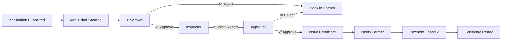

# 🎯 ภาพรวมระบบทั้งหมด - GACP Cannabis Management Platform

**Document**: System Overview Complete  
**Version**: 1.0  
**Date**: October 15, 2025  
**Status**: ✅ FINAL VERSION

---

## 📊 Executive Summary

ระบบบริหารจัดการกัญชาทางการแพทย์แบบครบวงจร ประกอบด้วย:

- **2 Builds หลัก** (Farmer Portal + Government Portal)
- **3 Free Services** (Survey, Standards, Track & Trace)
- **16 Backend Modules**
- **1 Payment System** (30,000฿)

---

## 🏗️ System Architecture (High-Level)

```
┌─────────────────────────────────────────────────────────────────┐
│              GACP Cannabis Management Platform                   │
│                  ระบบบริหารจัดการกัญชาทางการแพทย์                │
└─────────────────────────────────────────────────────────────────┘
                                │
                ┌───────────────┴───────────────┐
                ▼                               ▼
    ┌───────────────────────┐       ┌───────────────────────┐
    │      BUILD 1          │◄─────►│      BUILD 2          │
    │   FARMER PORTAL       │  Job  │  GOVERNMENT PORTAL    │
    │   (เกษตรกร)          │Ticket │      (DTAM)           │
    │                       │Notify │                       │
    │  Port: 3001          │       │  Port: 3002          │
    └───────────────────────┘       └───────────────────────┘
                │
        ┌───────┴────────┐
        ▼                ▼
    ┌────────┐      ┌──────────┐
    │Login 1 │      │ Login 2  │
    │ยื่นเอกสาร│      │บริหารฟาร์ม│
    └────────┘      └──────────┘

┌─────────────────────────────────────────────────────────────────┐
│                    FREE PUBLIC SERVICES 🆓                       │
│                     (ไม่ต้อง Login)                             │
├─────────────────────────────────────────────────────────────────┤
│  📊 Survey        │  📋 Standards      │  🔍 Track & Trace      │
│  แบบสอบถาม       │  เปรียบเทียบ       │  ตรวจสอบ QR Code       │
└─────────────────────────────────────────────────────────────────┘
```

---

## 🚀 BUILD 1: Farmer Portal (เกษตรกร)

**URL**: `https://farmer.gacp.th`  
**Port**: `3001`  
**Tech Stack**: Next.js + Material-UI + TypeScript

### 📋 Overview

Portal เดียว แต่มี **2 ระบบ Login แยกกัน**:

- **Login 1**: ระบบยื่นเอกสาร + ใบรับรอง GACP
- **Login 2**: ระบบบริหารฟาร์ม + SOP Tracking

---

### 🔐 Login 1: ระบบยื่นเอกสาร + ใบรับรอง GACP

#### **Purpose**

ยื่นคำขอใบรับรอง GACP และติดตามสถานะจนได้รับใบรับรอง

#### **User Journey**

```
สมัครสมาชิก
  ↓
Login เข้าระบบ
  ↓
ยื่นคำขอใบรับรอง GACP
  ├─ ข้อมูลเกษตรกร
  ├─ ข้อมูลฟาร์ม
  ├─ อัปโหลดเอกสาร
  └─ ชำระเงิน Phase 1 (5,000฿)
  ↓
Submit → สร้าง Job Ticket
  ↓
DTAM ตรวจสอบ (Reviewer → Inspector → Approver)
  ↓
ได้รับการอนุมัติ
  ↓
ชำระเงิน Phase 2 (25,000฿)
  ↓
ดาวน์โหลดใบรับรอง GACP ✅
```

#### **Features**

| Feature                  | Description                 | Status |
| ------------------------ | --------------------------- | ------ |
| **Member Management**    | สมัครสมาชิก, Login, Profile | ✅     |
| **License Application**  | ยื่นคำขอใบรับรอง GACP       | ✅     |
| **Payment Phase 1**      | ชำระ 5,000฿ หลังยื่นคำขอ    | ✅     |
| **Application Tracking** | ติดตามสถานะคำขอ             | ✅     |
| **Notifications**        | แจ้งเตือนความคืบหน้า        | ✅     |
| **Payment Phase 2**      | ชำระ 25,000฿ หลังอนุมัติ    | ✅     |
| **Certificate Download** | ดาวน์โหลดใบรับรอง PDF       | ✅     |

#### **Key Routes**

```typescript
// Public
GET / - Landing page
GET /register - สมัครสมาชิก
GET /login - Login

// Farmer (Login 1)
GET /dashboard - Dashboard หลัก
GET /application/new - ยื่นคำขอใหม่
GET /applications - คำขอทั้งหมด
GET /applications/:id - รายละเอียด + Timeline
GET /applications/:id/payment - ชำระเงิน Phase 2
GET /certificates - ใบรับรองของฉัน
GET /certificates/:id/download - ดาวน์โหลด PDF
GET /notifications - การแจ้งเตือน
GET /profile - โปรไฟล์
```

#### **Payment System** 💰

```javascript
Phase 1: 5,000฿  (After Submit)
Phase 2: 25,000฿ (After Approval)
─────────────────────────────────
Total:   30,000฿

Re-submission: 5,000฿ (ครั้งที่ 3+)
```

**Payment Methods**:

- Credit Card (บัตรเครดิต)
- Internet Banking (ธนาคารออนไลน์)
- Mobile Banking (ธนาคารมือถือ)
- QR Code (พร้อมเพย์)
- Bank Transfer (โอนเงิน)
- Counter Service (เคาน์เตอร์เซอร์วิส)

---

### 🔐 Login 2: ระบบบริหารฟาร์ม + SOP Tracking

#### **Purpose**

บริหารจัดการฟาร์มกัญชาและบันทึก SOP ตามมาตรฐาน GACP (Seed to Sale)

#### **User Journey**

```
Login เข้าระบบบริหารฟาร์ม
  ↓
สร้างรอบการเพาะปลูก (Cycle)
  ↓
บันทึก SOP ตาม GACP:
  ├─ Step 1: เตรียมเมล็ดพันธุ์
  ├─ Step 2: เพาะกล้า
  ├─ Step 3: ปลูก
  ├─ Step 4: ดูแลรักษา (ให้น้ำ, ปุ๋ย, ศัตรูพืช, ตัดแต่ง, ตรวจสุขภาพ)
  └─ Step 5: เก็บเกี่ยว ⭐ (จบ!)
  ↓
สร้าง QR Code สำหรับผลผลิต
  ↓
ผู้บริโภคสแกน QR Code → ดู Timeline (Track & Trace)
```

#### **Features**

| Feature               | Description                        | Status |
| --------------------- | ---------------------------------- | ------ |
| **Farm Management**   | จัดการข้อมูลฟาร์ม, พื้นที่ปลูก     | ✅     |
| **Cycle Management**  | สร้างรอบการเพาะปลูก                | ✅     |
| **SOP Tracking**      | บันทึก SOP ตาม GACP (Seed to Sale) | ⭐     |
| **QR Code Generator** | สร้าง QR Code สำหรับผลผลิต         | ✅     |
| **Photo Upload**      | อัปโหลดรูปภาพแต่ละขั้นตอน          | ✅     |
| **GPS Tracking**      | บันทึก GPS Location                | ✅     |

#### **SOP Tracking (Seed to Sale)** ⭐ **MAIN FEATURE**

##### **Step 1: เตรียมเมล็ดพันธุ์ (Seed Preparation)**

```typescript
{
  seedSource: string,        // แหล่งที่มา
  variety: string,           // ชนิดพันธุ์
  receivedDate: Date,        // วันที่รับเมล็ด
  quantity: number,          // จำนวนเมล็ด
  photos: string[],          // รูปภาพเมล็ดพันธุ์
  certificationNumber: string // เลขที่รับรองพันธุ์
}
```

##### **Step 2: เพาะกล้า (Germination/Seedling)**

```typescript
{
  germinationDate: Date,     // วันที่เพาะ
  method: string,            // วิธีการเพาะ
  temperature: number,       // อุณหภูมิ (°C)
  humidity: number,          // ความชื้น (%)
  survivalRate: number,      // อัตรารอดชีวิต (%)
  photos: string[],          // รูปภาพกล้า
  soilPH: number,            // pH ดิน
  waterPH: number            // pH น้ำ
}
```

##### **Step 3: ปลูก (Planting)**

```typescript
{
  plantingDate: Date,        // วันที่ปลูก
  area: number,              // พื้นที่ปลูก (ไร่)
  quantity: number,          // จำนวนต้น
  spacing: string,           // ระยะห่าง (เมตร)
  photos: string[],          // รูปภาพการปลูก
  gpsLocation: {
    latitude: number,
    longitude: number
  }
}
```

##### **Step 4: ดูแลรักษา (Cultivation & Maintenance)**

**4.1 การให้น้ำ (Irrigation)**

```typescript
{
  date: Date,                // วันที่
  time: string,              // เวลา
  amount: number,            // ปริมาณน้ำ (ลิตร)
  source: string,            // แหล่งน้ำ
  waterQuality: string       // คุณภาพน้ำ
}
```

**4.2 การใส่ปุ๋ย (Fertilization)**

```typescript
{
  date: Date,                // วันที่
  fertilizerType: string,    // ชนิดปุ๋ย (อินทรีย์/เคมี)
  brand: string,             // ยี่ห้อ
  amount: number,            // ปริมาณ (กก.)
  method: string,            // วิธีการใส่
  photos: string[]           // รูปฉลากปุ๋ย
}
```

**4.3 การควบคุมศัตรูพืช (Pest Control)**

```typescript
{
  date: Date,                // วันที่พบ
  pestType: string,          // ชนิดศัตรูพืช
  controlMethod: string,     // วิธีการควบคุม
  chemical: string,          // สารที่ใช้ (ถ้ามี)
  chemicalBrand: string,     // ยี่ห้อ
  amount: number,            // ปริมาณ
  photos: string[]           // รูปศัตรูพืช
}
```

**4.4 การตัดแต่งกิ่ง (Pruning)**

```typescript
{
  date: Date,                // วันที่ตัดแต่ง
  method: string,            // วิธีการตัดแต่ง
  branchesRemoved: number,   // จำนวนกิ่งที่ตัด
  photos: string[]           // รูปภาพ
}
```

**4.5 การตรวจสอบสุขภาพต้น (Health Check)**

```typescript
{
  date: Date,                // วันที่ตรวจ
  overallHealth: string,     // สุขภาพโดยรวม (ดี/พอใช้/ไม่ดี)
  height: number,            // ความสูง (cm)
  branchCount: number,       // จำนวนกิ่ง
  leafColor: string,         // สีใบ
  issues: string[],          // ปัญหาที่พบ
  photos: string[]           // รูปภาพ
}
```

##### **Step 5: เก็บเกี่ยว (Harvesting)** ⭐ **จบ!**

```typescript
{
  harvestDate: Date,         // วันที่เก็บเกี่ยว
  plantsHarvested: number,   // จำนวนต้นที่เก็บ
  freshWeight: number,       // น้ำหนักสด (กก.)
  dryWeight: number,         // น้ำหนักแห้ง (กก.)
  method: string,            // วิธีการเก็บเกี่ยว
  quality: string,           // คุณภาพ (A/B/C)
  photos: string[],          // รูปภาพผลผลิต
  qrCode: string             // QR Code ที่สร้าง
}
```

**✅ จบที่นี่!** (ไม่มี Processing, Storage, Distribution)

#### **Key Routes**

```typescript
// Public
GET /farm - Landing page
GET /farm/register - สมัคร
GET /farm/login - Login

// Farmer (Login 2)
GET /farm/dashboard - Dashboard ฟาร์ม
GET /farm/management - จัดการฟาร์ม
GET /farm/cycles - รอบการเพาะปลูก
POST /farm/cycles - สร้างรอบใหม่

// SOP Tracking (Seed to Sale)
GET /farm/sop/:cycleId - SOP Dashboard

// Step 1-5
POST /farm/sop/:cycleId/seed - บันทึกเมล็ดพันธุ์
POST /farm/sop/:cycleId/germination - บันทึกการเพาะกล้า
POST /farm/sop/:cycleId/planting - บันทึกการปลูก
POST /farm/sop/:cycleId/irrigation - บันทึกการให้น้ำ
POST /farm/sop/:cycleId/fertilization - บันทึกการใส่ปุ๋ย
POST /farm/sop/:cycleId/pest-control - บันทึกการควบคุมศัตรูพืช
POST /farm/sop/:cycleId/pruning - บันทึกการตัดแต่งกิ่ง
POST /farm/sop/:cycleId/health-check - บันทึกการตรวจสุขภาพ
POST /farm/sop/:cycleId/harvest - บันทึกการเก็บเกี่ยว

// QR Code
POST /farm/qrcode/generate - สร้าง QR Code
GET /farm/qrcode/:code - ดู QR Code
```

---

## 🏛️ BUILD 2: Government Portal (DTAM)

**URL**: `https://dtam.gacp.th`  
**Port**: `3002`  
**Tech Stack**: Next.js + Material-UI + TypeScript

### 📋 Overview

Portal เดียวสำหรับทีมงาน DTAM ทั้งหมด (1 Login)

**4 Roles**:

- **Reviewer** (แผนกตรวจเอกสาร)
- **Inspector** (แผนกตรวจฟาร์ม)
- **Approver** (แผนกอนุมัติ)
- **Admin** (ผู้จัดการ DTAM)

### 🔄 DTAM Workflow



---

### 👔 Role 1: Reviewer (แผนกตรวจเอกสาร)

#### **Responsibilities**

1. ตรวจสอบความครบถ้วนของเอกสาร
2. ตรวจสอบความถูกต้องของข้อมูล
3. ตัดสินใจเบื้องต้น (Approve/Reject/Request Info)

#### **Dashboard Components**

```
┌────────────────────────────────────────────┐
│         REVIEWER DASHBOARD                 │
├────────────────────────────────────────────┤
│                                            │
│  📊 Summary Cards                          │
│  ┌──────┐  ┌──────┐  ┌──────┐            │
│  │ 25   │  │  8   │  │ 12   │            │
│  │Pending│  │Review│  │Today │            │
│  └──────┘  └──────┘  └──────┘            │
│                                            │
│  📋 Application Queue                      │
│  ┌────────────────────────────────────┐   │
│  │ ID  │ Farmer │ Date │ Status │ ⚡ │   │
│  ├─────────────────────────────────────┤   │
│  │ #123│ นายA   │01/10 │Pending │[View]│   │
│  │ #124│ นายB   │02/10 │Pending │[View]│   │
│  └────────────────────────────────────┘   │
│                                            │
│  🔔 Notifications (Real-time)              │
│  • New application #125 submitted          │
│  • Application #120 info updated           │
│                                            │
└────────────────────────────────────────────┘
```

#### **Key Features**

| Feature                     | Description                 |
| --------------------------- | --------------------------- |
| **Queue Management**        | คิวรอตรวจสอบตามลำดับ        |
| **Document Review**         | ตรวจสอบเอกสารทั้งหมด        |
| **Decision Making**         | Approve/Reject/Request Info |
| **Comments**                | เพิ่มความเห็น/ข้อแนะนำ      |
| **Real-time Notifications** | แจ้งเตือนคำขอใหม่ทันที      |

#### **Routes**

```typescript
GET /dtam/login - Login DTAM
GET /dtam/dashboard/reviewer - Reviewer dashboard
GET /dtam/reviewer/queue - คิวทั้งหมด
GET /dtam/reviewer/pending - รอตรวจสอบ
GET /dtam/reviewer/inprogress - กำลังตรวจสอบ
GET /dtam/reviewer/completed - ตรวจเสร็จแล้ว
GET /dtam/reviewer/application/:id - รายละเอียดคำขอ
POST /dtam/reviewer/application/:id/approve - อนุมัติ
POST /dtam/reviewer/application/:id/reject - ปฏิเสธ
POST /dtam/reviewer/application/:id/request-info - ขอข้อมูลเพิ่ม
```

---

### 👔 Role 2: Inspector (แผนกตรวจฟาร์ม)

#### **Responsibilities**

1. ตรวจสอบฟาร์มจริง
2. ตรวจสอบความพร้อมของฟาร์ม
3. สรุปรายงานการตรวจสอบ

#### **Dashboard Components**

```
┌────────────────────────────────────────────┐
│        INSPECTOR DASHBOARD                 │
├────────────────────────────────────────────┤
│                                            │
│  📊 Summary Cards                          │
│  ┌──────┐  ┌──────┐  ┌──────┐            │
│  │ 15   │  │  5   │  │  8   │            │
│  │Pending│  │Inspect│  │Done │            │
│  └──────┘  └──────┘  └──────┘            │
│                                            │
│  📋 Inspection Queue                       │
│  ┌────────────────────────────────────┐   │
│  │ ID  │ Farm │ Location │ Status│ ⚡ │   │
│  ├─────────────────────────────────────┤   │
│  │ #123│ฟาร์มA│ เชียงใหม่│Pending│[View]│   │
│  │ #124│ฟาร์มB│ เชียงราย│Pending│[View]│   │
│  └────────────────────────────────────┘   │
│                                            │
│  📍 Map View                               │
│  ┌────────────────────────────────────┐   │
│  │       🗺️  Map with Pins            │   │
│  │     (Farms to be inspected)        │   │
│  └────────────────────────────────────┘   │
│                                            │
└────────────────────────────────────────────┘
```

#### **Key Features**

| Feature                 | Description               |
| ----------------------- | ------------------------- |
| **Farm Inspection**     | ตรวจสอบฟาร์มจริง          |
| **Checklist System**    | Checklist ตามมาตรฐาน GACP |
| **Photo Evidence**      | อัปโหลดรูปภาพหลักฐาน      |
| **GPS Verification**    | ตรวจสอบ GPS Location      |
| **Inspection Report**   | สรุปรายงานการตรวจสอบ      |
| **Schedule Management** | กำหนดวันตรวจสอบ           |

#### **Routes**

```typescript
GET /dtam/dashboard/inspector - Inspector dashboard
GET /dtam/inspector/queue - คิวทั้งหมด
GET /dtam/inspector/scheduled - กำหนดการตรวจสอบ
GET /dtam/inspector/completed - ตรวจเสร็จแล้ว
GET /dtam/inspector/application/:id - รายละเอียดคำขอ
POST /dtam/inspector/application/:id/schedule - กำหนดวันตรวจ
POST /dtam/inspector/application/:id/inspect - บันทึกการตรวจสอบ
POST /dtam/inspector/application/:id/submit-report - ส่งรายงาน
```

---

### 👔 Role 3: Approver (แผนกอนุมัติ)

#### **Responsibilities**

1. ตรวจสอบรายงานจาก Inspector
2. ตัดสินใจขั้นสุดท้าย
3. ออกใบรับรอง GACP

#### **Dashboard Components**

```
┌────────────────────────────────────────────┐
│         APPROVER DASHBOARD                 │
├────────────────────────────────────────────┤
│                                            │
│  📊 Summary Cards                          │
│  ┌──────┐  ┌──────┐  ┌──────┐            │
│  │ 10   │  │  3   │  │  5   │            │
│  │Pending│  │Review│  │Today │            │
│  └──────┘  └──────┘  └──────┘            │
│                                            │
│  📋 Approval Queue                         │
│  ┌────────────────────────────────────┐   │
│  │ ID  │ Farmer│Inspector│Result│ ⚡  │   │
│  ├─────────────────────────────────────┤   │
│  │ #123│ นายA  │ นายX    │Pass  │[View]│   │
│  │ #124│ นายB  │ นายY    │Pass  │[View]│   │
│  └────────────────────────────────────┘   │
│                                            │
│  📄 Recent Approvals                       │
│  • #120 - Approved - Certificate issued   │
│  • #119 - Approved - Certificate issued   │
│                                            │
└────────────────────────────────────────────┘
```

#### **Key Features**

| Feature                  | Description                |
| ------------------------ | -------------------------- |
| **Report Review**        | ตรวจสอบรายงานจาก Inspector |
| **Final Decision**       | ตัดสินใจขั้นสุดท้าย        |
| **Certificate Issuance** | ออกใบรับรอง GACP           |
| **Rejection Handling**   | จัดการกรณีปฏิเสธ           |
| **Approval History**     | ประวัติการอนุมัติ          |

#### **Routes**

```typescript
GET /dtam/dashboard/approver - Approver dashboard
GET /dtam/approver/queue - คิวทั้งหมด
GET /dtam/approver/pending - รออนุมัติ
GET /dtam/approver/approved - อนุมัติแล้ว
GET /dtam/approver/rejected - ปฏิเสธแล้ว
GET /dtam/approver/application/:id - รายละเอียดคำขอ
POST /dtam/approver/application/:id/approve - อนุมัติ
POST /dtam/approver/application/:id/reject - ปฏิเสธ
POST /dtam/approver/application/:id/issue-certificate - ออกใบรับรอง
```

---

### 👔 Role 4: Admin (ผู้จัดการ DTAM)

#### **Responsibilities**

1. ดูภาพรวมระบบทั้งหมด
2. จัดการทีมงาน DTAM
3. ตรวจสอบรายงานและสถิติ
4. **ตรวจสอบ SOP ของเกษตรกร** ⭐ NEW

#### **Dashboard Components**

```
┌────────────────────────────────────────────┐
│           ADMIN DASHBOARD                  │
├────────────────────────────────────────────┤
│                                            │
│  📊 Overall Statistics                     │
│  ┌──────┐ ┌──────┐ ┌──────┐ ┌──────┐     │
│  │ 150  │ │  45  │ │  32  │ │  12  │     │
│  │Farmers│ │Active│ │Pending│ │Today│     │
│  └──────┘ └──────┘ └──────┘ └──────┘     │
│                                            │
│  📈 Performance Chart                      │
│  ┌────────────────────────────────────┐   │
│  │  Application Flow (Monthly)        │   │
│  │  ▁▃▅▇█ (Chart)                    │   │
│  └────────────────────────────────────┘   │
│                                            │
│  👥 Team Workload                          │
│  ┌────────────────────────────────────┐   │
│  │ Reviewer:  ████████░░ 80%          │   │
│  │ Inspector: ██████░░░░ 60%          │   │
│  │ Approver:  ████░░░░░░ 40%          │   │
│  └────────────────────────────────────┘   │
│                                            │
│  🌱 SOP Monitoring (NEW!)                  │
│  • 25 Farms tracking SOP                   │
│  • 120 Active cycles                       │
│  • 450 Activities logged this week         │
│                                            │
└────────────────────────────────────────────┘
```

#### **Key Features**

| Feature                   | Description               |
| ------------------------- | ------------------------- |
| **System Overview**       | ภาพรวมระบบทั้งหมด         |
| **Team Management**       | จัดการทีม DTAM            |
| **Workload Distribution** | กระจายงานให้เหมาะสม       |
| **Performance Metrics**   | ประสิทธิภาพทีม            |
| **Reports & Analytics**   | รายงานและสถิติ            |
| **SOP Monitoring**        | ตรวจสอบ SOP ของเกษตรกร ⭐ |
| **Farm Monitoring**       | ติดตามฟาร์มทั้งหมด        |
| **System Settings**       | ตั้งค่าระบบ               |

#### **Routes**

```typescript
GET /dtam/dashboard/admin - Admin dashboard

// Team Management
GET /dtam/admin/staff - จัดการทีม
GET /dtam/admin/staff/:id - รายละเอียดเจ้าหน้าที่
GET /dtam/admin/workload - Workload distribution
GET /dtam/admin/performance - Performance metrics

// Monitoring
GET /dtam/admin/farmers - เกษตรกรทั้งหมด
GET /dtam/admin/farms - ฟาร์มทั้งหมด
GET /dtam/admin/applications - คำขอทั้งหมด

// SOP Monitoring (NEW!)
GET /dtam/admin/sop - ภาพรวม SOP
GET /dtam/admin/sop/:farmId - SOP ของฟาร์ม
GET /dtam/admin/sop/:cycleId - SOP ของรอบการเพาะปลูก
GET /dtam/admin/sop/:cycleId/timeline - Timeline SOP
GET /dtam/admin/sop/:cycleId/audit - ตรวจสอบ SOP

// Reports
GET /dtam/admin/reports - รายงานทั้งหมด
GET /dtam/admin/reports/monthly - รายงานรายเดือน
GET /dtam/admin/reports/performance - รายงานประสิทธิภาพ
GET /dtam/admin/reports/compliance - รายงานการปฏิบัติตามมาตรฐาน

// Settings
GET /dtam/admin/settings - ตั้งค่าระบบ
```

---

### 🎫 Job Ticket & Notification System

#### **Job Ticket Workflow**

```
Application Submitted
  ↓
Create Job Ticket
  ├─ Ticket ID: #JT-2025-0001
  ├─ Status: pending_review
  ├─ Assigned to: Reviewer
  └─ Priority: normal
  ↓
Reviewer completes review
  ├─ Update Status: pending_inspection
  └─ Reassign to: Inspector
  ↓
Inspector completes inspection
  ├─ Update Status: pending_approval
  └─ Reassign to: Approver
  ↓
Approver approves
  ├─ Update Status: approved
  └─ Issue Certificate
  ↓
Notify Farmer
  ├─ Send email
  ├─ Send SMS
  └─ In-app notification
```

#### **Job Ticket Status**

| Status               | Description              |
| -------------------- | ------------------------ |
| `pending_review`     | รอ Reviewer ตรวจสอบ      |
| `reviewing`          | Reviewer กำลังตรวจสอบ    |
| `pending_inspection` | รอ Inspector ตรวจฟาร์ม   |
| `inspecting`         | Inspector กำลังตรวจฟาร์ม |
| `pending_approval`   | รอ Approver อนุมัติ      |
| `approving`          | Approver กำลังพิจารณา    |
| `approved`           | อนุมัติแล้ว              |
| `rejected`           | ปฏิเสธ                   |
| `info_requested`     | ขอข้อมูลเพิ่มเติม        |

#### **Real-time Notifications**

**Technologies**:

- WebSocket (Socket.io)
- Server-Sent Events (SSE)

**Notification Types**:

```typescript
{
  type: 'application_submitted',   // คำขอใหม่
  type: 'application_approved',    // อนุมัติแล้ว
  type: 'application_rejected',    // ปฏิเสธ
  type: 'info_requested',          // ขอข้อมูลเพิ่ม
  type: 'payment_required',        // ต้องชำระเงิน
  type: 'certificate_ready',       // ใบรับรองพร้อม
  type: 'inspection_scheduled',    // กำหนดวันตรวจฟาร์ม
  type: 'job_assigned'             // มอบหมายงานใหม่
}
```

---

## 🆓 FREE PUBLIC SERVICES

### 1️⃣ Survey System (แบบสอบถาม)

**URL**: `https://gacp.th/survey`  
**Access**: ไม่ต้อง Login  
**Purpose**: แบบสอบถามสาธารณะ

#### **Features**

| Feature             | Description                 |
| ------------------- | --------------------------- |
| **Survey List**     | รายการแบบสอบถามทั้งหมด      |
| **Take Survey**     | ทำแบบสอบถาม (ไม่ต้อง Login) |
| **View Results**    | ดูผลสำรวจ                   |
| **Multiple Choice** | คำถามแบบเลือกตอบ            |
| **Text Input**      | คำถามแบบข้อความ             |
| **Rating Scale**    | คำถามแบบให้คะแนน            |

#### **Survey Types**

```typescript
surveys: [
  {
    id: 1,
    title: 'แบบสอบถามความพึงพอใจระบบ GACP',
    type: 'satisfaction',
    questions: 10,
    responses: 350
  },
  {
    id: 2,
    title: 'แบบสอบถามการใช้กัญชาทางการแพทย์',
    type: 'medical_cannabis',
    questions: 15,
    responses: 520
  },
  {
    id: 3,
    title: 'แบบสอบถามความต้องการของเกษตรกร',
    type: 'farmer_needs',
    questions: 12,
    responses: 280
  }
];
```

#### **Routes**

```typescript
// Public (No Login Required)
GET /survey - Survey landing page
GET /survey/list - รายการแบบสอบถาม
GET /survey/:id - ทำแบบสอบถาม
POST /survey/:id/submit - ส่งคำตอบ
GET /survey/:id/results - ดูผลสำรวจ
GET /survey/:id/statistics - สถิติแบบสอบถาม
```

---

### 2️⃣ Standards Comparison (เปรียบเทียบมาตรฐาน)

**URL**: `https://gacp.th/standards`  
**Access**: ไม่ต้อง Login  
**Purpose**: ให้ข้อมูลและเปรียบเทียบมาตรฐาน GACP

#### **Features**

| Feature               | Description                    |
| --------------------- | ------------------------------ |
| **GACP Standards**    | มาตรฐาน GACP กรมการแพทย์แผนไทย |
| **WHO/FDA Standards** | มาตรฐานสากล WHO/FDA            |
| **ASEAN Standards**   | มาตรฐาน ASEAN                  |
| **Comparison Tool**   | เครื่องมือเปรียบเทียบ          |
| **Checklist**         | Checklist ตรวจสอบมาตรฐาน       |
| **Document Download** | ดาวน์โหลดเอกสาร                |

#### **Standards Comparison Table**

```typescript
comparison: {
  topics: [
    {
      topic: 'Facility Requirements',
      gacp: 'ต้องมีพื้นที่ปลูกอย่างน้อย 5 ไร่',
      who: 'GMP facility requirements',
      asean: 'ASEAN GAP standards'
    },
    {
      topic: 'Cultivation Practices',
      gacp: 'บันทึก SOP ทุกขั้นตอน',
      who: 'WHO good cultivation practices',
      asean: 'ASEAN cultivation guidelines'
    },
    {
      topic: 'Quality Control',
      gacp: 'ตรวจสอบคุณภาพทุก 3 เดือน',
      who: 'WHO quality standards',
      asean: 'ASEAN quality requirements'
    }
  ];
}
```

#### **Routes**

```typescript
// Public (No Login Required)
GET /standards - Standards landing page
GET /standards/gacp - มาตรฐาน GACP
GET /standards/who-fda - มาตรฐาน WHO/FDA
GET /standards/asean - มาตรฐาน ASEAN
GET /standards/compare - เปรียบเทียบมาตรฐาน
POST /standards/compare - ทำการเปรียบเทียบ
GET /standards/checklist - Checklist มาตรฐาน
GET /standards/download/:type - ดาวน์โหลดเอกสาร
```

---

### 3️⃣ Track & Trace (ตรวจสอบย้อนกลับ)

**URL**: `https://gacp.th/trace`  
**Access**: ไม่ต้อง Login  
**Purpose**: ตรวจสอบซีเรียล/QR Code ย้อนกลับ (Seed to Sale)

#### **Features**

| Feature                      | Description          |
| ---------------------------- | -------------------- |
| **QR Code Scanner**          | สแกน QR Code         |
| **Serial Input**             | ใส่ซีเรียลแมนนวล     |
| **Timeline View**            | ดู Timeline ทั้งหมด  |
| **Photo Gallery**            | ดูรูปภาพแต่ละขั้นตอน |
| **GPS Location**             | ดูตำแหน่งฟาร์ม       |
| **Certificate Verification** | ตรวจสอบใบรับรอง GACP |

#### **Trace Information**

```typescript
traceData: {
  product: {
    qrCode: "GACP-2025-0001-H001",
    serialNumber: "SN-2025-0001",
    farmName: "ฟาร์มกัญชาดอยสุเทพ",
    certificateNumber: "GACP-2025-0001"
  },

  timeline: [
    {
      step: "เตรียมเมล็ดพันธุ์",
      date: "2025-01-01",
      variety: "กัญชาพันธุ์ XXX",
      quantity: 1000,
      photos: ["seed1.jpg", "seed2.jpg"]
    },
    {
      step: "เพาะกล้า",
      date: "2025-01-05",
      method: "เพาะในถาดเพาะ",
      survivalRate: 95,
      photos: ["seedling1.jpg"]
    },
    {
      step: "ปลูก",
      date: "2025-01-15",
      area: 5,
      quantity: 950,
      gps: { lat: 18.7883, lng: 98.9853 }
    },
    {
      step: "ดูแลรักษา",
      activities: [
        { type: "ให้น้ำ", count: 90, total: "45,000 L" },
        { type: "ใส่ปุ๋ย", count: 12, organic: true },
        { type: "ควบคุมศัตรูพืช", count: 3, method: "organic" },
        { type: "ตัดแต่งกิ่ง", count: 5 },
        { type: "ตรวจสุขภาพ", count: 15, health: "ดี" }
      ]
    },
    {
      step: "เก็บเกี่ยว",
      date: "2025-04-15",
      plantsHarvested: 950,
      freshWeight: 500,
      dryWeight: 100,
      quality: "A",
      photos: ["harvest1.jpg", "harvest2.jpg"]
    }
  ],

  certificate: {
    number: "GACP-2025-0001",
    issueDate: "2025-02-01",
    expiryDate: "2026-02-01",
    status: "active"
  }
}
```

#### **QR Code Format**

```
QR Code: GACP-2025-0001-H001
  │     │    │    │    └─ Harvest ID
  │     │    │    └─ Application ID
  │     │    └─ Year
  └─────┴─ System Prefix
```

#### **Routes**

```typescript
// Public (No Login Required)
GET /trace - Trace landing page
GET /trace/verify - หน้าสแกน QR Code
GET /trace/:code - ตรวจสอบ QR Code/Serial
GET /trace/:code/timeline - Timeline แบบละเอียด
GET /trace/:code/photos - รูปภาพทั้งหมด
GET /trace/:code/certificate - ตรวจสอบใบรับรอง
GET /trace/:code/farm - ข้อมูลฟาร์ม
GET /trace/:code/download - ดาวน์โหลด Report PDF
```

#### **Example Usage**

```
ผู้บริโภคซื้อสินค้ากัญชา
  ↓
สแกน QR Code บนฉลาก
  ↓
แสดงข้อมูล:
  ├─ ฟาร์ม: ฟาร์มกัญชาดอยสุเทพ
  ├─ ใบรับรอง: GACP-2025-0001 (Active)
  ├─ เมล็ดพันธุ์: พันธุ์ XXX (1 ม.ค. 2025)
  ├─ เพาะกล้า: อัตรารอด 95% (5 ม.ค. 2025)
  ├─ ปลูก: 5 ไร่, GPS (15 ม.ค. 2025)
  ├─ ดูแลรักษา: 90 ครั้งให้น้ำ, ปุ๋ยอินทรีย์
  ├─ เก็บเกี่ยว: 100 กก. คุณภาพ A (15 เม.ย. 2025)
  └─ รูปภาพ: 25 รูป
  ↓
ผู้บริโภคมั่นใจในคุณภาพ ✅
```

---

## 🔧 Backend Architecture

### Technology Stack

```yaml
Runtime: Node.js 20.x
Framework: Express.js
Database: MongoDB 7.x
Cache: Redis
Authentication: JWT + Passport.js
File Storage: AWS S3 / MinIO
WebSocket: Socket.io
API: RESTful API + GraphQL (optional)
```

### Backend Modules (16 Modules)

#### **1. auth-farmer** ✅

```
Authentication for farmers (2 login types)
- Login 1: License application
- Login 2: Farm management
```

#### **2. auth-dtam** ✅

```
Authentication for DTAM staff
- Single login with role-based access
```

#### **3. application-workflow** ✅

```
License application workflow
- Application submission
- Status tracking
- DTAM review workflow
```

#### **4. payment** ✅

```
Payment processing
- Phase 1: 5,000฿
- Phase 2: 25,000฿
- Multiple payment methods
- Payment gateway integration
```

#### **5. certificate-management** ✅

```
Certificate management
- Certificate generation
- PDF export
- Verification
- Expiry management
```

#### **6. farm-management** ✅

```
Farm management system
- Farm registration
- Farm data management
- Cycle management
```

#### **7. sop-tracking** ⭐ **MAIN MODULE**

```
SOP Tracking (Seed to Sale)
- Step 1: Seed preparation
- Step 2: Germination
- Step 3: Planting
- Step 4: Maintenance (irrigation, fertilization, pest control, pruning, health check)
- Step 5: Harvesting
```

#### **8. qrcode-generator** ✅

```
QR Code generation
- Generate QR Code for harvest
- Link to trace data
```

#### **9. track-trace** 🆓

```
Track & Trace system
- QR Code scanning
- Serial verification
- Timeline display
- Public access
```

#### **10. survey-system** 🆓

```
Survey system
- Survey creation
- Survey responses
- Result analytics
- Public access
```

#### **11. standards-comparison** 🆓

```
Standards comparison
- GACP standards
- WHO/FDA standards
- ASEAN standards
- Comparison tool
- Public access
```

#### **12. job-assignment** ✅

```
Job ticket system
- Create job tickets
- Assign to DTAM staff
- Status tracking
- Workflow automation
```

#### **13. notification** ✅

```
Notification system
- Real-time notifications (WebSocket)
- Email notifications
- SMS notifications
- In-app notifications
```

#### **14. dashboard** ✅

```
Dashboard data aggregation
- Farmer dashboard
- DTAM dashboards (4 roles)
- Admin dashboard
```

#### **15. document** ✅

```
Document management
- Document upload
- Document verification
- Document storage
- File management
```

#### **16. report** ✅

```
Report generation
- Application reports
- Performance reports
- Compliance reports
- SOP reports
- PDF/Excel export
```

---

## 📊 Database Schema (High-Level)

### **Collections**

```yaml
Users:
  - farmers (Login 1 + Login 2)
  - dtam_staff (Reviewer, Inspector, Approver, Admin)

Applications:
  - applications (License applications)
  - application_status (Status history)
  - application_documents (Uploaded documents)

Payments:
  - payments (Payment records)
  - payment_transactions (Transaction logs)

Certificates:
  - certificates (GACP certificates)
  - certificate_logs (Issue/expire logs)

Farms:
  - farms (Farm information)
  - farm_cycles (Planting cycles)

SOP:
  - sop_seeds (Seed preparation)
  - sop_germination (Germination)
  - sop_planting (Planting)
  - sop_irrigation (Irrigation logs)
  - sop_fertilization (Fertilization logs)
  - sop_pest_control (Pest control logs)
  - sop_pruning (Pruning logs)
  - sop_health_check (Health check logs)
  - sop_harvest (Harvest records)

QR Codes:
  - qrcodes (QR Code records)
  - trace_data (Trace information)

DTAM:
  - job_tickets (Job tickets)
  - job_assignments (Assignments)
  - inspector_reports (Inspection reports)
  - approver_decisions (Approval decisions)

Free Services:
  - surveys (Survey forms)
  - survey_responses (Survey answers)
  - standards (Standards data)

Notifications:
  - notifications (Notification records)

System:
  - audit_logs (System audit logs)
  - system_settings (System configuration)
```

---

## 🔐 Security & Compliance

### Security Measures

| Measure               | Implementation                   |
| --------------------- | -------------------------------- |
| **Authentication**    | JWT + Refresh Tokens             |
| **Authorization**     | Role-based Access Control (RBAC) |
| **Data Encryption**   | AES-256 encryption               |
| **SSL/TLS**           | HTTPS only                       |
| **Password**          | Bcrypt hashing                   |
| **Session**           | Secure session management        |
| **API Rate Limiting** | 100 requests/minute              |
| **XSS Protection**    | Input sanitization               |
| **CSRF Protection**   | CSRF tokens                      |
| **SQL Injection**     | Parameterized queries            |

### Compliance

```yaml
GACP Compliance:
  - ตรวจสอบมาตรฐาน GACP กรมการแพทย์แผนไทย
  - บันทึก SOP ครบถ้วน
  - ตรวจสอบย้อนกลับได้ (Traceability)

PDPA Compliance:
  - นโยบายความเป็นส่วนตัว
  - Consent management
  - Data portability
  - Right to be forgotten

FDA Compliance:
  - GMP standards
  - Quality control
  - Documentation
```

---

## 🚀 Development Roadmap

### **Phase 1: Core Application System** (Week 1-3)

#### Week 1: Setup & Authentication

```
✅ Project setup
✅ Database design
✅ Authentication (Farmer + DTAM)
✅ Role-based access control
```

#### Week 2: Application Workflow

```
✅ License application form
✅ Document upload
✅ Payment Phase 1
✅ Application submission
```

#### Week 3: DTAM Portal

```
✅ Reviewer dashboard
✅ Inspector dashboard
✅ Approver dashboard
✅ Job ticket system
✅ Notification system
```

---

### **Phase 2: Farm Management & SOP** (Week 4-6)

#### Week 4: Farm Management

```
✅ Farm registration
✅ Farm data management
✅ Cycle creation
```

#### Week 5-6: SOP Tracking ⭐

```
✅ Step 1: Seed preparation
✅ Step 2: Germination
✅ Step 3: Planting
✅ Step 4: Maintenance
  ├─ Irrigation logging
  ├─ Fertilization logging
  ├─ Pest control logging
  ├─ Pruning logging
  └─ Health check logging
✅ Step 5: Harvesting
✅ QR Code generation
```

---

### **Phase 3: Free Services** (Week 7-8)

#### Week 7: Survey & Standards

```
✅ Survey system
✅ Standards comparison
✅ Public access pages
```

#### Week 8: Track & Trace

```
✅ QR Code scanning
✅ Timeline display
✅ Trace information
✅ Public verification
```

---

### **Phase 4: Admin & Reporting** (Week 9-10)

#### Week 9: Admin Dashboard

```
✅ Admin overview
✅ Team management
✅ SOP monitoring
✅ System settings
```

#### Week 10: Reporting & Analytics

```
✅ Application reports
✅ Performance reports
✅ Compliance reports
✅ SOP reports
✅ Export functionality
```

---

### **Phase 5: Testing & Deployment** (Week 11-12)

#### Week 11: Testing

```
✅ Unit testing
✅ Integration testing
✅ E2E testing
✅ Security testing
✅ Performance testing
```

#### Week 12: Deployment

```
✅ Production deployment
✅ Monitoring setup
✅ Backup configuration
✅ Documentation
✅ Training
```

---

## 📈 Success Metrics

### KPIs

```yaml
User Adoption:
  - 500+ Farmers registered (Year 1)
  - 1,000+ Applications processed (Year 1)
  - 100+ GACP Certificates issued (Year 1)

System Performance:
  - 99.9% Uptime
  - < 2s Page load time
  - < 100ms API response time

User Satisfaction:
  - > 4.5/5 User rating
  - > 90% Task completion rate
  - < 5% Error rate

Compliance:
  - 100% GACP standard compliance
  - 100% Traceability
  - 0 Security breaches
```

---

## 🎓 Training & Documentation

### Documentation

```
1. User Guides
   ├─ Farmer Guide (Login 1)
   ├─ Farmer Guide (Login 2)
   └─ DTAM Staff Guide

2. Technical Documentation
   ├─ API Documentation
   ├─ Database Schema
   └─ Deployment Guide

3. SOP Documentation
   ├─ GACP Standards
   ├─ SOP Guidelines
   └─ Best Practices

4. Video Tutorials
   ├─ How to apply for GACP certificate
   ├─ How to track SOP
   └─ How to verify QR Code
```

---

## 🛠️ Support & Maintenance

### Support Channels

```yaml
Email: support@gacp.th
Phone: 02-XXX-XXXX
LINE: @gacp-support
Hours: Mon-Fri 9:00-18:00
```

### Maintenance Schedule

```yaml
Regular Maintenance:
  - Daily: Database backup
  - Weekly: Security patches
  - Monthly: Performance optimization
  - Quarterly: Feature updates

Emergency:
  - 24/7 On-call support
  - < 1hr Response time
  - < 4hr Resolution time
```

---

## ✅ Summary

### System Highlights

```
✅ 2 Builds:
   - BUILD 1: Farmer Portal (2 logins)
   - BUILD 2: Government Portal (DTAM)

✅ 3 Free Services:
   - Survey System
   - Standards Comparison
   - Track & Trace

✅ Payment System:
   - Phase 1: 5,000฿
   - Phase 2: 25,000฿

✅ SOP Tracking:
   - Seed to Sale (5 steps)
   - Real-time monitoring
   - QR Code traceability

✅ DTAM Workflow:
   - Reviewer → Inspector → Approver
   - Job Tickets + Notifications
   - Real-time updates

✅ 16 Backend Modules:
   - Complete functionality
   - Scalable architecture
   - High security
```

---

**Status**: ✅ READY FOR DEVELOPMENT  
**Next Step**: เริ่ม Development Phase 1 🚀  
**Approved by**: PM + SA + Technical Lead

---

**Document Version**: 1.0  
**Last Updated**: October 15, 2025  
**Confidence Level**: 100% ✅
