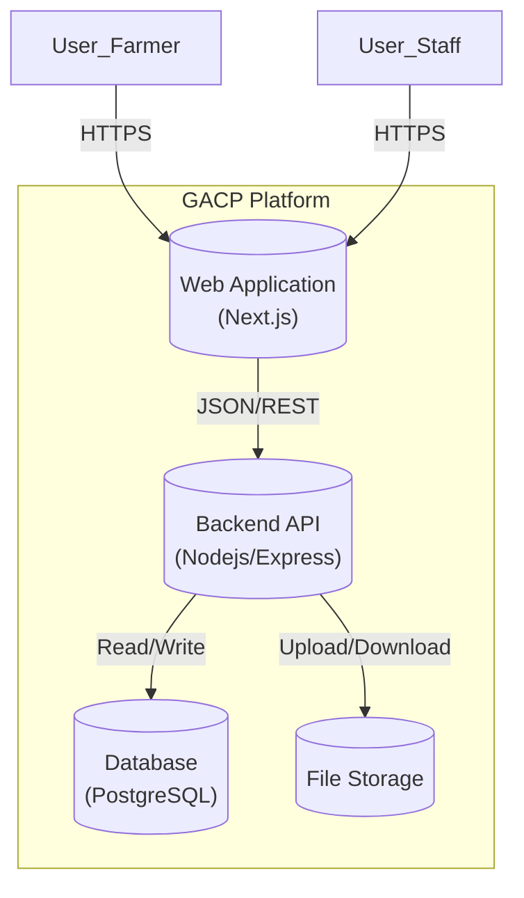
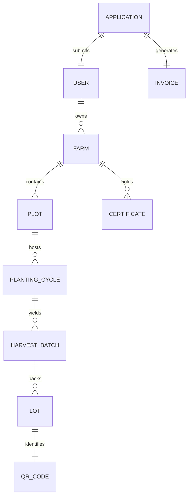

# GACP Certification System: Architecture Overview

## 1. Executive Summary
The **GACP Certification System** is a platform designed to digitalize the Good Agricultural and Collection Practices (GACP) certification process. It connects **Farmers** (Applicants) and **DTAM Staff** (Regulators) through a seamless, automated workflow encompassing Registration, Verification, Auditing, and Traceability.

---

## 2. Technology Stack

### Frontend Application (Web App)
*   **Framework**: Next.js 14 (App Router)
*   **Language**: TypeScript
*   **Styling**: Tailwind CSS + Lucide Icons
*   **State Management**: Zustand
*   **Key Features**:
    *   Responsive Design (Mobile-First for Farmers)
    *   Dynamic Form Wizard (8-Step Application)
    *   Real-time Status Dashboard

### Backend Services (API)
*   **Runtime**: Node.js
*   **Framework**: Express.js
*   **Architecture**: Modular Monolith (Routes -> Controllers -> Services)
*   **Database ORM**: Prisma (PostgreSQL)
*   **Key Features**:
    *   RESTful API Design
    *   JWT Authentication & Role-Based Access Control (RBAC)
    *   Automated PDF Generation (Puppeteer)
    *   QR Code Generation Engine

### Database & Infrastructure
*   **Database**: PostgreSQL
*   **Storage**: Local/Cloud File Storage (for Documents)
*   **Hosting**: supports Docker / PM2 deployment

---

## 3. System Architecture (C4 Model)

### Level 1: System Context Diagram
Shows how the system interacts with external entities.

```mermaid
graph TD
    User_Farmer[Farmer] -->|Submits Application| GACP_System
    User_Staff[DTAM Staff] -->|Reviews & Audits| GACP_System
    Consumer[Public Consumer] -->|Scans QR Code| GACP_System
    
    GACP_System[("GACP System")] 
    
    GACP_System -->|Sends Emails| Email_Gateway[Email Service]
    GACP_System -->|Updates Payment| Payment_Gateway[Payment Gateway (Ksher)]
```

### Level 2: Container Diagram
Shows the high-level software containers and their interactions.



---

## 4. Key Domain Models (ER Diagram - High Level)



### Core Entities:
1.  **User**: Central identity (Farmer or Staff).
2.  **Application**: The lifecycle of a request (Draft -> Submitted -> Paid -> Approved).
3.  **Certificate**: The digital asset granted upon approval.
4.  **Traceability Chain**: Plot -> Cycle -> Batch -> Lot.
