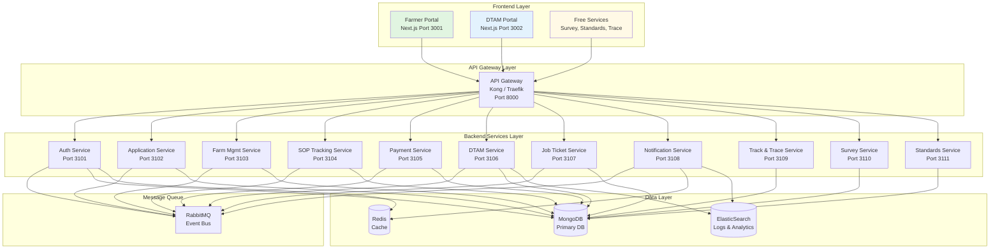

# 1. System Overview

**Document**: GACP / DTAM Platform - System Overview  
**Version**: 1.0  
**Date**: October 15, 2025  
**Status**: ✅ Official Documentation

---

## 1.1 Purpose

**GACP / DTAM Platform** เป็นระบบบริหารจัดการการขอรับรองมาตรฐาน **GACP (Good Agricultural and Collection Practice)** และการติดตามกระบวนการเพาะปลูกกัญชาทางการแพทย์ ภายใต้การกำกับของ **กรมการแพทย์แผนไทย (DTAM - Department of Thai Traditional and Alternative Medicine)**

### Main Objectives

1. **รองรับการยื่นขอใบรับรอง GACP** - เกษตรกรยื่นคำขออิเล็กทรอนิกส์
2. **ติดตามกระบวนการตรวจสอบ** - DTAM ตรวจสอบและอนุมัติ
3. **บริหารจัดการฟาร์ม** - บันทึก SOP ตามมาตรฐาน GACP (Seed to Sale)
4. **ตรวจสอบย้อนกลับ** - ผู้บริโภคตรวจสอบผลิตภัณฑ์ผ่าน QR Code
5. **บริการสาธารณะ** - Survey, Standards Comparison, Track & Trace

---

## 1.2 System Scope

### Core Systems (2 Builds)

#### **BUILD 1: Farmer Portal** (Port 3001)

- **Login 1**: License Application System (ยื่นเอกสารขออนุญาต)
- **Login 2**: Farm Management System (บริหารฟาร์ม + SOP Tracking)

#### **BUILD 2: Government Portal (DTAM)** (Port 3002)

- Single portal for DTAM staff
- 4 Role dashboards (Reviewer, Inspector, Approver, Admin)

### Free Public Services

1. **Survey System** - แบบสอบถามสาธารณะ
2. **Standards Comparison** - เปรียบเทียบมาตรฐาน GACP vs WHO vs ASEAN
3. **Track & Trace** - ตรวจสอบ QR Code ย้อนกลับ

---

## 1.3 Users & Roles

### 1.3.1 Farmer Portal Users

| Role                 | Description                     | Authentication           | Access                                                                      |
| -------------------- | ------------------------------- | ------------------------ | --------------------------------------------------------------------------- |
| **Farmer (Login 1)** | เกษตรกรยื่นคำขอใบรับรอง GACP    | JWT-based SSO            | - Application submission<br>- Payment (Phase 1+2)<br>- Certificate download |
| **Farmer (Login 2)** | เกษตรกรบริหารฟาร์มและบันทึก SOP | JWT-based SSO (Separate) | - Farm management<br>- SOP tracking (Seed to Sale)<br>- QR Code generation  |

**Note**: Login 1 และ Login 2 เป็นระบบแยกกัน แต่อยู่ใน Portal เดียวกัน

### 1.3.2 DTAM Portal Users

| Role          | Description                | Authentication             | Access                                                                                 |
| ------------- | -------------------------- | -------------------------- | -------------------------------------------------------------------------------------- |
| **Reviewer**  | ตรวจสอบเอกสารความครบถ้วน   | DTAM Portal Login (AES256) | - Review queue<br>- Document verification<br>- Approve/Reject/Request Info             |
| **Inspector** | ตรวจสอบฟาร์ม               | DTAM Portal Login (AES256) | - Inspection queue<br>- Farm inspection<br>- Submit report                             |
| **Approver**  | อนุมัติใบรับรองขั้นสุดท้าย | DTAM Portal Login (AES256) | - Approval queue<br>- Final decision<br>- Issue certificate                            |
| **Admin**     | ดูแลระบบทั้งหมด            | DTAM Portal Login (AES256) | - Full system access<br>- Team management<br>- SOP monitoring<br>- Reports & analytics |

### 1.3.3 Public Users

| Role            | Description | Authentication    | Access                                                                 |
| --------------- | ----------- | ----------------- | ---------------------------------------------------------------------- |
| **Public User** | บุคคลทั่วไป | No login required | - Survey system<br>- Standards comparison<br>- Track & Trace (QR scan) |

---

## 1.4 System Architecture Overview

### 1.4.1 High-Level Architecture



### 1.4.2 Technology Stack

#### **Frontend**

```yaml
Framework: Next.js 15
Styling: TailwindCSS + Material-UI
State Management: Zustand / Context API
Form Handling: React Hook Form + Zod
HTTP Client: Axios
Authentication: JWT-based SSO
Real-time: Socket.io Client
```

#### **Backend**

```yaml
Runtime: Node.js 20 LTS
Framework: Express.js (Modular Microservices)
Database: MongoDB 7.x (Primary)
Cache: Redis 7.x
Search: ElasticSearch 8.x
Message Queue: RabbitMQ 3.x
API Gateway: Kong / Traefik
Authentication: JWT + Passport.js
Encryption: AES-256 + bcrypt
```

#### **Infrastructure**

```yaml
Containerization: Docker
Orchestration: Kubernetes / Docker Compose
CI/CD: GitHub Actions / GitLab CI
Monitoring: Prometheus + Grafana
Logging: ELK Stack (ElasticSearch, Logstash, Kibana)
File Storage: AWS S3 / MinIO
```

---

## 1.5 Key Features Overview

### 1.5.1 BUILD 1: Farmer Portal

#### **Login 1: License Application**

- ✅ Member registration & management
- ✅ GACP certificate application (5 steps wizard)
- ✅ Payment Phase 1 (5,000฿) - After submission
- ✅ Application tracking with timeline
- ✅ Real-time notifications
- ✅ Payment Phase 2 (25,000฿) - After approval
- ✅ Certificate download (PDF)

#### **Login 2: Farm Management**

- ✅ Farm registration & data management
- ✅ Planting cycle management
- ✅ **SOP Tracking (Seed to Sale)** ⭐ MAIN FEATURE:
  - Step 1: Seed Preparation
  - Step 2: Germination/Seedling
  - Step 3: Planting
  - Step 4: Cultivation & Maintenance (Irrigation, Fertilization, Pest Control, Pruning, Health Check)
  - Step 5: Harvesting (จบ!)
- ✅ QR Code generation for products
- ✅ Photo upload for each step
- ✅ GPS location tracking

### 1.5.2 BUILD 2: Government Portal (DTAM)

#### **Reviewer Dashboard**

- ✅ Application queue management
- ✅ Document verification
- ✅ Decision making (Approve/Reject/Request Info)
- ✅ Real-time notifications
- ✅ Comment system

#### **Inspector Dashboard**

- ✅ Inspection queue management
- ✅ Farm inspection checklist
- ✅ Photo evidence upload
- ✅ GPS verification
- ✅ Inspection report submission

#### **Approver Dashboard**

- ✅ Approval queue management
- ✅ Final decision (Approve/Reject)
- ✅ Certificate issuance
- ✅ Approval history

#### **Admin Dashboard**

- ✅ System overview & statistics
- ✅ Team management (DTAM staff)
- ✅ Workload distribution
- ✅ **SOP Monitoring** (NEW!)
- ✅ Reports & analytics
- ✅ System settings

#### **Job Ticket System**

- ✅ Automatic job creation on submission
- ✅ Auto-assignment to Reviewer
- ✅ Workflow automation (Reviewer → Inspector → Approver)
- ✅ Status tracking
- ✅ Real-time updates (WebSocket)

### 1.5.3 Free Public Services

#### **Survey System** 🆓

- ✅ Public access (no login)
- ✅ Multiple choice, text input, rating scale
- ✅ Survey results viewing
- ✅ Statistics & analytics

#### **Standards Comparison** 🆓

- ✅ GACP standards (กรมการแพทย์แผนไทย)
- ✅ WHO/FDA standards
- ✅ ASEAN standards
- ✅ Comparison tool
- ✅ Checklist download

#### **Track & Trace** 🆓

- ✅ QR Code scanning
- ✅ Serial number verification
- ✅ Complete timeline (Seed → Harvest)
- ✅ Photo gallery
- ✅ GPS location view
- ✅ Certificate verification

---

## 1.6 Business Logic Overview

### 1.6.1 Application Workflow

```
Farmer Registration (Login 1)
  ↓
Submit Application (5 steps)
  ├─ Step 1: Farmer Information
  ├─ Step 2: Farm Information
  ├─ Step 3: Document Upload
  ├─ Step 4: Payment Phase 1 (5,000฿)
  └─ Step 5: Confirmation
  ↓
Create Job Ticket → Assign to Reviewer
  ↓
Reviewer: Document Verification
  ├─ ✅ Approve → Send to Inspector
  ├─ ❌ Reject → Back to Farmer
  └─ ❓ Request Info → Wait for Update
  ↓
Inspector: Farm Inspection
  ├─ Schedule inspection
  ├─ Conduct inspection
  └─ Submit report → Send to Approver
  ↓
Approver: Final Decision
  ├─ ✅ Approve → Issue Certificate
  └─ ❌ Reject → Back to Farmer
  ↓
Notify Farmer → Payment Phase 2 (25,000฿)
  ↓
Certificate Ready → Download PDF
```

**Total Fee**: 30,000฿ (5,000฿ + 25,000฿)  
**Re-submission Fee**: 5,000฿ (ครั้งที่ 3+)

### 1.6.2 SOP Tracking Workflow (Seed to Sale)

```
Farmer Login 2 (Farm Management)
  ↓
Create Planting Cycle
  ↓
Step 1: Record Seed Preparation
  ↓
Step 2: Record Germination
  ↓
Step 3: Record Planting + GPS
  ↓
Step 4: Record Maintenance (Continuous)
  ├─ Irrigation (Daily/Weekly)
  ├─ Fertilization (As needed)
  ├─ Pest Control (When found)
  ├─ Pruning (As needed)
  └─ Health Check (Weekly)
  ↓
Step 5: Record Harvest (FINAL)
  ├─ Fresh weight
  ├─ Dry weight
  ├─ Photos
  └─ Generate QR Code
  ↓
End (No further steps)
```

**Note**: จบที่ Harvest ไม่มี Processing, Storage, Distribution

### 1.6.3 DTAM Workflow (3 Departments)

```
Job Ticket Created
  ↓
Reviewer Department
  ├─ Receive notification
  ├─ Review documents
  └─ Decision: Approve/Reject/Request Info
  ↓
Inspector Department
  ├─ Receive notification
  ├─ Schedule inspection
  ├─ Conduct inspection
  └─ Submit report
  ↓
Approver Department
  ├─ Receive notification
  ├─ Review report + application
  └─ Final decision: Approve/Reject
  ↓
Certificate Issued (if approved)
```

**Communication**: Job Tickets + Real-time Notifications (WebSocket)

### 1.6.4 Payment Workflow

```
Application Submitted
  ↓
Payment Phase 1: 5,000฿
  ├─ Payment methods:
  │   ├─ Credit Card
  │   ├─ Internet Banking
  │   ├─ Mobile Banking
  │   ├─ QR Code (PromptPay)
  │   ├─ Bank Transfer
  │   └─ Counter Service
  ├─ Payment gateway integration
  └─ Payment verification
  ↓
DTAM Review Process
  ↓
Approved
  ↓
Notify Farmer → Payment Phase 2: 25,000฿
  ↓
Payment verified
  ↓
Certificate ready for download
```

### 1.6.5 Track & Trace Workflow

```
Consumer receives product with QR Code
  ↓
Scan QR Code (Public access)
  ↓
System displays:
  ├─ Farm information
  ├─ GACP certificate (verified)
  ├─ Complete timeline:
  │   ├─ Seed preparation
  │   ├─ Germination
  │   ├─ Planting (GPS location)
  │   ├─ Maintenance activities (all records)
  │   └─ Harvest (weight, quality)
  ├─ Photo gallery (all steps)
  └─ Certificate verification
  ↓
Consumer confident in product quality ✅
```

---

## 1.7 Integration Points

### 1.7.1 Internal Integrations

| From          | To                      | Method               | Purpose                |
| ------------- | ----------------------- | -------------------- | ---------------------- |
| Farmer Portal | Auth Service            | REST API             | Authentication         |
| Farmer Portal | Application Service     | REST API             | Submit application     |
| Farmer Portal | Payment Service         | REST API             | Process payment        |
| Farmer Portal | Farm Management Service | REST API             | Manage farm data       |
| Farmer Portal | SOP Tracking Service    | REST API             | Record SOP activities  |
| DTAM Portal   | DTAM Service            | REST API             | Review/Inspect/Approve |
| DTAM Portal   | Job Ticket Service      | REST API + WebSocket | Manage workflow        |
| All Services  | Notification Service    | RabbitMQ             | Send notifications     |
| All Services  | Audit Service           | RabbitMQ             | Log activities         |

### 1.7.2 External Integrations

| Service               | Provider           | Purpose                  |
| --------------------- | ------------------ | ------------------------ |
| **Payment Gateway**   | Omise / 2C2P       | Credit card, banking     |
| **SMS Service**       | Twilio / AWS SNS   | SMS notifications        |
| **Email Service**     | SendGrid / AWS SES | Email notifications      |
| **File Storage**      | AWS S3 / MinIO     | Document & photo storage |
| **Maps Service**      | Google Maps API    | GPS verification         |
| **QR Code Generator** | qrcode.js          | Generate QR codes        |

---

## 1.8 System Constraints & Assumptions

### 1.8.1 Constraints

- **Farmer Portal**: ต้องใช้ Internet (ไม่รองรับ Offline)
- **DTAM Portal**: รองรับเฉพาะ Desktop browsers (Chrome, Edge, Firefox)
- **File Upload**: ไฟล์สูงสุด 10 MB ต่อไฟล์, รองรับ PDF, JPG, PNG
- **QR Code**: ใช้ได้เฉพาะผลิตภัณฑ์ที่บันทึก SOP ครบถ้วน
- **Payment**: รองรับเฉพาะสกุลเงินบาท (THB)

### 1.8.2 Assumptions

- เกษตรกรมีสมาร์ทโฟนและอินเทอร์เน็ต
- DTAM staff มี desktop/laptop และอินเทอร์เน็ต
- Payment gateway มี uptime 99.9%
- SMS/Email service มี uptime 99.9%
- ผู้บริโภคสามารถสแกน QR Code ได้

---

## 1.9 Success Metrics (KPIs)

### 1.9.1 User Adoption

```yaml
Year 1 Targets:
  - Farmers registered: 500+
  - Applications submitted: 1,000+
  - Certificates issued: 100+
  - Farms tracking SOP: 250+
  - QR Codes scanned: 10,000+
```

### 1.9.2 System Performance

```yaml
Performance Targets:
  - System uptime: 99.9%
  - Page load time: < 2 seconds
  - API response time: < 100ms (avg)
  - Job ticket processing: < 24 hours (avg)
  - Certificate issuance: < 7 days (avg)
```

### 1.9.3 User Satisfaction

```yaml
Satisfaction Targets:
  - User rating: > 4.5/5
  - Task completion rate: > 90%
  - Error rate: < 5%
  - Support tickets: < 50/month
```

### 1.9.4 Compliance

```yaml
Compliance Targets:
  - GACP standard compliance: 100%
  - Traceability: 100%
  - Security breaches: 0
  - Data loss incidents: 0
  - Audit findings: 0 critical
```

---

## 1.10 Document References

| Document              | Location                                  | Description                        |
| --------------------- | ----------------------------------------- | ---------------------------------- |
| Frontend Structure    | `docs/02_Frontend_Structure.md`           | Frontend modules & UI components   |
| Backend Architecture  | `docs/03_Backend_Architecture.md`         | Backend services & APIs            |
| Data Flow & API       | `docs/04_DataFlow_and_API.md`             | Workflows & API specifications     |
| Security & Compliance | `docs/05_Security_Compliance_ISO27001.md` | Security measures & ISO compliance |
| Deployment Guide      | `docs/06_Deployment_Guide.md`             | Deployment procedures              |
| Glossary              | `docs/07_Glossary.md`                     | Technical terms & definitions      |

---

**Approved by**: PM + SA + Technical Lead  
**Status**: ✅ OFFICIAL DOCUMENTATION  
**Version**: 1.0  
**Last Updated**: October 15, 2025
