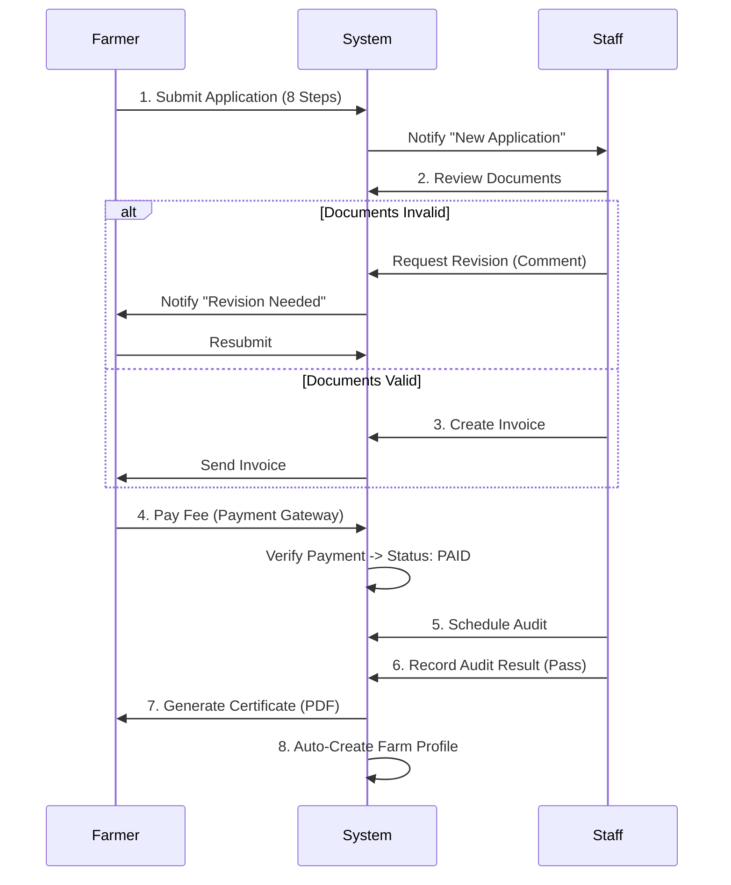
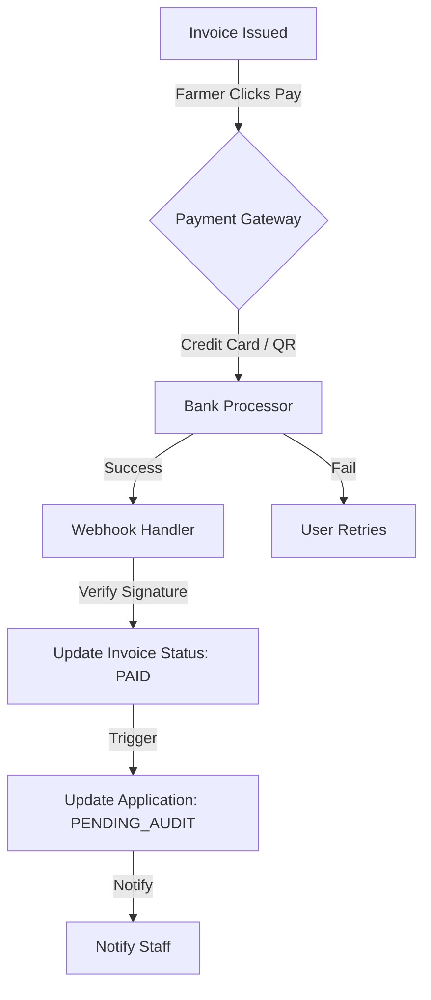
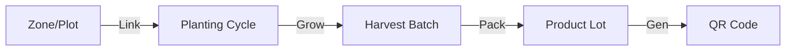

# GACP System: Business Workflows & Logic

## 1. Pillar 1: Licensing & Certification Workflow
The core process of obtaining a GACP certificate.

### Workflow Diagram

### Key Logic
*   **Step Logic**: Application saves as Draft until Step 8 is verified.
*   **Auto-Farm**: Upon `Generate Certificate`, the system automatically provisions a `Farm` record and locks its `cultivationType` (Outdoor/Indoor) based on the certificate scope.

---

## 2. Pillar 2: Payment & Financial Flow
Handling secure payments via Ksher Gateway.

### Payment Flowchart

### Security Measures
*   **Signature Verification**: All webhooks verify the `sign` parameter using the Secret Key.
*   **Idempotency**: Webhook handles duplicate calls safely (checks if already PAID).

---

## 3. Pillar 3: Traceability & QR Quota (Strict Mode)
Ensuring product authenticity and limiting supply to capacity.

### Traceability Loop (The Golden Loop)

### Logic: Quota Enforcement
The system enforces a **Physical Constraint** to prevent fraud (e.g., claiming 100 tons from a 1-rai farm).

1.  **Harvest Input**: Farmer records `Actual Yield` (e.g., 500 kg) for a Batch.
2.  **Lot Creation**: When creating a product Lot (e.g., 1kg packs).
3.  **Validation Rule**:
    $$ \sum (ExistingLots_{weight}) + NewLot_{weight} \le HarvestBatch_{limit} $$
4.  **Result**: If user attempts to generate QR codes exceeding the remaining yield, the system **BLOCKS** the request (HTTP 400).

### Yield Prediction (Early Warning)
*   **Input**: Plot Area x 70% Usage x Spacing.
*   **Warning**: If `Harvest Batch` input exceeds the theoretical maximum capacity of the plot, a warning flag is raised for Audit.
