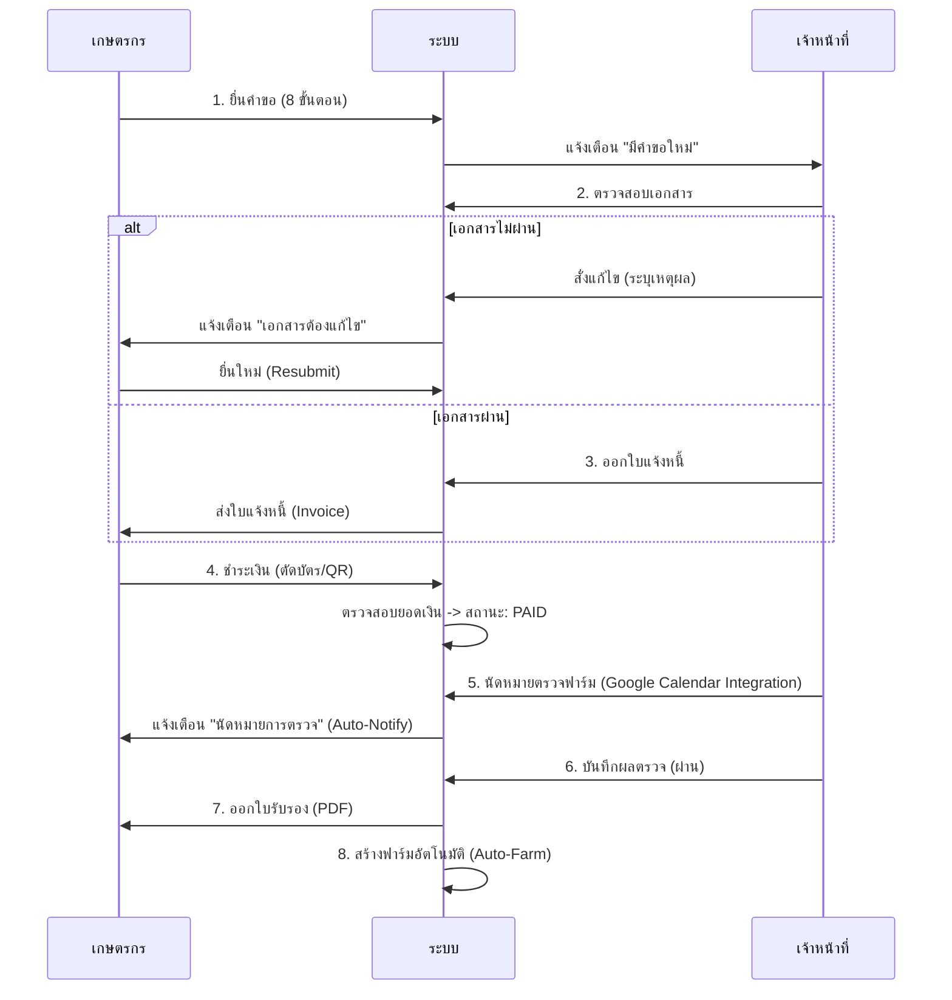
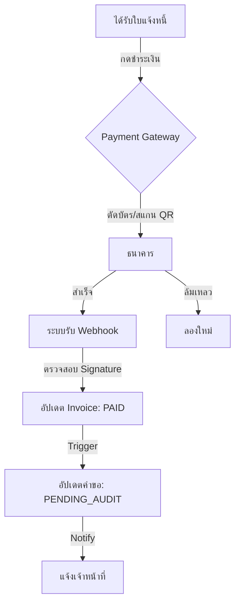
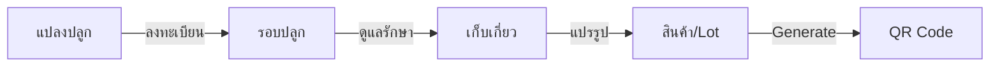

# ระบบ GACP: กระบวนการทำงานทางธุรกิจ (Business Workflows)

เอกสารนี้อธิบาย 3 หัวใจหลัก (3 Key Pillars) ของระบบ GACP

## 1. เสาหลักที่ 1: การขอใบอนุญาต (Licensing Workflow)
ขั้นตอนหลักในการเปลี่ยน "ผู้ขอ" ให้เป็น "ผู้ได้รับรอง"

### แผนผังลำดับเหตุการณ์ (Sequence Diagram)

### การควบคุมระบบ (Key Logic)
*   **Smart Logic (Land Ownership)**: ระบบตรวจสอบสิทธิ์ที่ดิน
    *   ถ้าเลือก "เช่า" หรือ "ยินยอม" -> ระบบบังคับแนบ "สัญญาเช่า/หนังสือยินยอม" อัตโนมัติ
    *   ถ้าไม่แนบ -> ไม่สามารถส่งคำขอได้
*   **Pre-Submission Protocol**: ก่อนส่งคำขอ เกษตรกรต้องผ่าน Checklist ยืนยันความจริง, ยินยอมให้ตรวจ, และรับทราบโทษทางกฎหมาย
*   **Auto-Farm**: ทันทีที่กด "ออกใบรับรอง" ระบบจะสร้างข้อมูล Farm ให้เกษตรกรทันที เพื่อนำไปใช้ต่อในระบบ Traceability
*   **Scope Lock**: ประเภทโรงเรือนของฟาร์มจะถูกล็อกตามใบรับรอง (เช่น ถ้าขอ Outdoor จะสร้าง Indoor ไม่ได้)

---

## 2. เสาหลักที่ 2: การจ่ายเงิน (Financial Flow)
ระบบการชำระเงินที่ปลอดภัยและตรวจสอบได้

### กระบวนการชำระเงิน

---

## 3. เสาหลักที่ 3: ระบบตรวจสอบย้อนกลับ (Traceability & Quota)
การป้องกันการปลอมปนสินค้าและการควบคุมปริมาณ (Anti-Fraud)

### วงจรทองคำ (The Golden Loop)

### ระบบโควต้า (Quota Enforcement)
หัวใจสำคัญของการป้องกันการสวมสิทธิ์:

1.  **บันทึกผลผลิต**: เกษตรกรบันทึกน้ำหนักจริงที่เก็บเกี่ยวได้ (Harvest Yield) เช่น 500 กก.
2.  **สร้าง Lot**: เมื่อนำมาแบ่งบรรจุเป็นสินค้าขายจริง
3.  **เงื่อนไขการตรวจสอบ (Validation Logic)**:
    $$ ผลรวมน้ำหนักที่ออก QR แล้ว + น้ำหนัก Lot ใหม่ \le น้ำหนักที่เก็บเกี่ยวได้ $$
4.  **ผลลัพธ์**: หากพยายามออก QR Code เกินโควต้าที่มีอยู่ ระบบจะ **ปฏิเสธทันที (Block)**

### ระบบทำนายผลผลิต (Yield Prediction)
*   **ก่อนเริ่มปลูก**: ระบบคำนวณ "ผลผลิตสูงสุดทางทฤษฎี" จากพื้นที่ x ระยะปลูก
*   **แจ้งเตือน**: หากเกษตรกรกรอกตัวเลขเก็บเกี่ยว สูงเกินค่ามาตรฐาน ระบบจะติด Flag ให้เจ้าหน้าที่เข้าตรวจสอบพิเศษ
