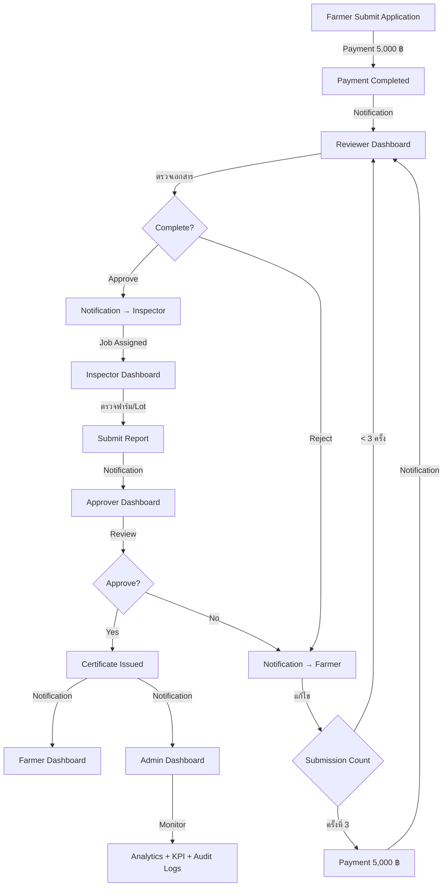

# 📋 DTAM Staff Workflow & Dashboard Standard (OFFICIAL)

**Version**: 3.0  
**Last Updated**: October 14, 2025  
**Status**: ✅ **OFFICIAL STANDARD**  
**Authority**: GACP Platform Architecture Team

---

## 🎯 Purpose

This document defines the **OFFICIAL STANDARD** for DTAM staff workflow and dashboard design. All implementations **MUST** follow this specification.

---

## 1️⃣ Overall Workflow Diagram (Event Driven + Notification + KPI)



### Event Bus Architecture

**Technology**: RabbitMQ / Kafka

**Events**:

1. `application.submitted` - When farmer submits application
2. `payment.completed` - When payment is successful
3. `document.reviewed` - When reviewer completes review
4. `inspection.assigned` - When inspector is assigned
5. `inspection.completed` - When inspection is done
6. `certificate.issued` - When certificate is generated
7. `application.rejected` - When application is rejected

### KPI Tracking Requirements

**For Every Job Request**:

- บันทึก `taskId` (UUID)
- บันทึก `startTime` (ISO 8601)
- บันทึก `endTime` (ISO 8601)
- บันทึก `status` (pending / in_progress / completed / delayed)
- บันทึก `comments` (Text)
- คำนวณ `processingTime` (minutes)

**Metrics to Track**:

- Average Processing Time (by role)
- Completion Rate (%)
- Delay Count (tasks > SLA)
- Feedback Score (1-5 stars)

---

## 2️⃣ Reviewer Dashboard

### Route

`/dashboard/reviewer`

### Summary Cards (Required)

| Card                  | Metric                                    | Color  |
| --------------------- | ----------------------------------------- | ------ |
| Pending Applications  | Count of `status: pending_review`         | Blue   |
| Returned for Revision | Count of applications sent back to farmer | Orange |
| Payment Status        | Count pending payments (highlight in red) | Red    |
| Reviewed Today        | Count completed today                     | Green  |

### Notifications Panel (Required)

**Real-time Notifications** (WebSocket/SSE):

- 🔔 New Job Requests (when `application.submitted` event fires)
- 💰 Payment Alerts (when farmer completes payment)
- ⚠️ Overdue Tasks (> 3 days pending)

**Format**:

```json
{
  "id": "notif-uuid",
  "type": "job_assigned",
  "title": "New Application Received",
  "message": "APP-2025-1234 from สมชาย ใจดี",
  "timestamp": "2025-10-14T10:30:00Z",
  "read": false
}
```

### Application Queue Table (Required)

| Column               | Description                               | Type   | Required |
| -------------------- | ----------------------------------------- | ------ | -------- |
| Application ID       | APP-YYYY-XXXX                             | String | ✅ Yes   |
| Farmer               | ชื่อเกษตรกร                               | String | ✅ Yes   |
| Farm Name            | ชื่อฟาร์ม                                 | String | ✅ Yes   |
| **Submission Count** | จำนวนครั้งที่ส่ง (1, 2, 3+)               | Number | ✅ Yes   |
| **Payment Status**   | Badge: Paid / Pending / Overdue           | Badge  | ✅ Yes   |
| Status               | pending / in_review / approved / rejected | Badge  | ✅ Yes   |
| Submitted Date       | วันที่ส่งเอกสาร                           | Date   | ✅ Yes   |
| Action               | Button: "ตรวจสอบ"                         | Button | ✅ Yes   |

**Example**:

```
| APP-2025-001 | สมชาย ใจดี | ฟาร์มอินทรีย์ | 1 ครั้ง | ✅ Paid | Pending | 14/10/2025 | [ตรวจสอบ] |
| APP-2025-002 | สมหญิง รักษ์ดี | ฟาร์มภูผา | 3 ครั้ง | ⏳ Pending | In Review | 12/10/2025 | [ตรวจสอบ] |
```

### Action Modal (Required)

**When clicking "ตรวจสอบ" button**:

**Modal Components**:

1. **Document Preview**
   - PDF viewer or image gallery
   - List of all uploaded documents

2. **Feedback Form**
   - Text area for comments
   - Checklist for required documents
   - Star rating (1-5)

3. **Action Buttons**:
   - ✅ **Approve** - Forward to Inspector
   - ❌ **Reject** - Send back to Farmer (with reason)
   - 💬 **Request More Info** - Ask farmer for clarification

**Business Logic**:

- If `submissionCount >= 3` and action = Reject
  - Trigger payment flow (5,000 ฿)
  - Send notification to farmer
  - Lock application until payment completed

### Menu Items (Required)

```typescript
[
  { title: 'หน้าหลัก', path: '/dashboard/reviewer', icon: Dashboard },
  { title: 'รอตรวจสอบ', path: '/dashboard/reviewer/pending', icon: Assignment, badge: 12 },
  { title: 'กำลังดำเนินการ', path: '/dashboard/reviewer/inprogress', icon: RateReview, badge: 5 },
  { title: 'ตรวจสอบแล้ว', path: '/dashboard/reviewer/completed', icon: CheckCircle }
];
```

---

## 3️⃣ Inspector Dashboard

### Route

`/dashboard/inspector`

### Summary Cards (Required)

| Card                     | Metric                         | Color  |
| ------------------------ | ------------------------------ | ------ |
| Farms Pending Inspection | Count assigned but not started | Orange |
| Inspections Completed    | Count completed today          | Green  |
| Video Call Scheduled     | Count video call appointments  | Blue   |
| Onsite Visits Today      | Count onsite inspections       | Purple |

### Notifications Panel (Required)

**Real-time Notifications**:

- 📋 Job Assigned (when reviewer approves application)
- 💰 Payment Received Alerts (when farmer pays for 3rd rejection)
- 📅 Schedule Reminder (1 hour before inspection)

### Inspection Queue Table (Required)

| Column         | Description                        | Type   | Required |
| -------------- | ---------------------------------- | ------ | -------- |
| Farm Name      | ชื่อฟาร์ม                          | String | ✅ Yes   |
| **Lot ID**     | รหัส Lot (LOT-2025-XXXX)           | String | ✅ Yes   |
| Application ID | APP-YYYY-XXXX                      | String | ✅ Yes   |
| Farmer         | ชื่อเกษตรกร                        | String | ✅ Yes   |
| Province       | จังหวัด                            | String | ✅ Yes   |
| Type           | Video Call / Onsite                | Badge  | ✅ Yes   |
| Scheduled Date | วันนัดตรวจ                         | Date   | ✅ Yes   |
| Status         | assigned / in_progress / completed | Badge  | ✅ Yes   |
| Action         | Button: "เริ่มตรวจ"                | Button | ✅ Yes   |

**Example**:

```
| ฟาร์มอินทรีย์ | LOT-2025-001 | APP-2025-001 | สมชาย ใจดี | เชียงใหม่ | 🎥 Video | 14/10/2025 09:00 | Assigned | [เริ่มตรวจ] |
| ฟาร์มภูผา | LOT-2025-002 | APP-2025-005 | สมหญิง รักษ์ดี | ลำพูน | 🚗 Onsite | 14/10/2025 13:00 | In Progress | [ดำเนินการ] |
```

### Action Modal (Required)

**When clicking "เริ่มตรวจ" button**:

**Modal Components**:

1. **Video Inspection** (if type = Video Call)
   - Start video call button
   - Screen recording toggle

2. **Upload Evidence**
   - Photo upload (max 10 photos)
   - Video upload (max 100MB)
   - GPS coordinates (auto-capture)

3. **Inspection Checklist**
   - GACP standards checklist (50+ items)
   - Pass/Fail toggle for each item
   - Score calculation (auto)

4. **Submit Result**
   - Final score (0-100)
   - Overall finding (text area)
   - Action: Submit → Notify Approver

### Menu Items (Required)

```typescript
[
  { title: 'หน้าหลัก', path: '/dashboard/inspector', icon: Dashboard },
  { title: 'ตารางตรวจฟาร์ม', path: '/dashboard/inspector/schedule', icon: Schedule, badge: 3 },
  { title: 'Video Call', path: '/dashboard/inspector/videocall', icon: VideoCall },
  { title: 'รายงานการตรวจ', path: '/dashboard/inspector/reports', icon: Search },
  { title: 'แผนที่ฟาร์ม', path: '/dashboard/inspector/map', icon: Map }
];
```

---

## 4️⃣ Approver Dashboard

### Route

`/dashboard/approver`

### Summary Cards (Required)

| Card                  | Metric                          | Color  |
| --------------------- | ------------------------------- | ------ |
| Pending Certificates  | Count awaiting approval         | Purple |
| Approved Today        | Count approved today            | Green  |
| Rejected Applications | Count rejected                  | Red    |
| Avg Approval Time     | Average processing time (hours) | Blue   |

### Notifications Panel (Required)

**Real-time Notifications**:

- 📋 Job Assigned (when inspection completed)
- ⚠️ High Priority (score >= 95)
- 🔔 Alerts (overdue > 24 hours)

### Application Table (Required)

| Column                | Description                  | Type    | Required |
| --------------------- | ---------------------------- | ------- | -------- |
| Application ID        | APP-YYYY-XXXX                | String  | ✅ Yes   |
| Farmer                | ชื่อเกษตรกร                  | String  | ✅ Yes   |
| Farm Name             | ชื่อฟาร์ม                    | String  | ✅ Yes   |
| **Payment Status**    | Paid / Pending               | Badge   | ✅ Yes   |
| **Review Status**     | Approved / Pending           | Badge   | ✅ Yes   |
| **Inspection Status** | Completed / Pending          | Badge   | ✅ Yes   |
| Inspection Score      | คะแนนจากการตรวจ (0-100)      | Number  | ✅ Yes   |
| Submitted Date        | วันที่ส่งเอกสาร              | Date    | ✅ Yes   |
| Action                | Button: "อนุมัติ" / "ปฏิเสธ" | Buttons | ✅ Yes   |

**Example**:

```
| APP-2025-001 | สมชาย ใจดี | ฟาร์มอินทรีย์ | ✅ Paid | ✅ Approved | ✅ Completed | 95/100 | 10/10/2025 | [อนุมัติ] [ปฏิเสธ] |
| APP-2025-002 | สมหญิง รักษ์ดี | ฟาร์มภูผา | ⏳ Pending | ✅ Approved | ✅ Completed | 88/100 | 08/10/2025 | [อนุมัติ] [ปฏิเสธ] |
```

### Action Modal (Required)

**When clicking "อนุมัติ" or "ปฏิเสธ" button**:

**Modal Components**:

1. **Application Summary**
   - Farmer information
   - Farm details
   - All uploaded documents

2. **Review History**
   - Reviewer comments
   - Inspection report
   - Score breakdown

3. **Action Options**:
   - ✅ **Approve** - Generate certificate
   - ❌ **Reject** - Send back with reason
   - ↩️ **Send Back** - Request re-inspection

4. **Certificate Preview** (if approve)
   - Certificate number (auto-generated)
   - Validity period (1 year)
   - QR code for track & trace

### Menu Items (Required)

```typescript
[
  { title: 'หน้าหลัก', path: '/dashboard/approver', icon: Dashboard },
  { title: 'รออนุมัติ', path: '/dashboard/approver/pending', icon: Verified, badge: 8 },
  { title: 'อนุมัติแล้ว', path: '/dashboard/approver/approved', icon: CardMembership },
  { title: 'ปฏิเสธ', path: '/dashboard/approver/rejected', icon: Cancel },
  { title: 'รายงาน', path: '/dashboard/approver/reports', icon: Assessment }
];
```

---

## 5️⃣ Admin Dashboard

### Route

`/dashboard/admin`

### Summary Cards (Required)

| Card                | Metric                               | Color  |
| ------------------- | ------------------------------------ | ------ |
| Total Applications  | Count all applications               | Blue   |
| Pending Reviews     | Count in review stage                | Orange |
| Pending Inspections | Count awaiting inspection            | Purple |
| **Payments Status** | Total payment amount + pending count | Green  |

### Notifications Panel (Required)

**Real-time Notifications**:

- 📋 Job Requests (all roles)
- ⏰ Delays (tasks > SLA)
- ⚠️ Alerts (system issues)
- 💰 Payment Alerts

### User Management Table (Required)

| Column     | Description                                      | Type    | Required |
| ---------- | ------------------------------------------------ | ------- | -------- |
| Name       | ชื่อ-นามสกุล                                     | String  | ✅ Yes   |
| Email      | อีเมล                                            | String  | ✅ Yes   |
| Role       | Farmer / Reviewer / Inspector / Approver / Admin | Badge   | ✅ Yes   |
| Status     | Active / Inactive                                | Badge   | ✅ Yes   |
| Last Login | วันที่ล็อกอินล่าสุด                              | Date    | ✅ Yes   |
| Action     | Edit / Delete / Reset Password                   | Buttons | ✅ Yes   |

### Audit Logs Table (Required)

| Column         | Description                                  | Type     | Required    |
| -------------- | -------------------------------------------- | -------- | ----------- |
| Timestamp      | วันเวลาที่เกิดเหตุการณ์                      | DateTime | ✅ Yes      |
| User           | ผู้ทำ action                                 | String   | ✅ Yes      |
| Role           | บทบาทของผู้ทำ                                | Badge    | ✅ Yes      |
| Action         | submit / review / inspect / approve / reject | String   | ✅ Yes      |
| Application ID | APP-YYYY-XXXX                                | String   | ✅ Yes      |
| Status         | success / failed                             | Badge    | ✅ Yes      |
| Duration       | เวลาที่ใช้ (minutes)                         | Number   | ✅ Yes      |
| Details        | รายละเอียดเพิ่มเติม                          | Text     | ⚠️ Optional |

### Analytics Charts (Required)

**KPI Metrics by Role**:

1. **Average Processing Time** (Line Chart)
   - X-axis: Date
   - Y-axis: Time (hours)
   - Lines: Reviewer, Inspector, Approver

2. **Completion Rate** (Bar Chart)
   - X-axis: Week
   - Y-axis: Percentage (%)
   - Bars: Completed / Delayed

3. **Delay Count** (Pie Chart)
   - Reviewer delays
   - Inspector delays
   - Approver delays

4. **Feedback Score** (Rating Chart)
   - Average score per role
   - Trend over time

### Menu Items (Required)

```typescript
[
  { title: 'หน้าหลัก', path: '/dashboard/admin', icon: Dashboard },
  { title: 'ผู้ใช้งาน', path: '/dashboard/admin/users', icon: People },
  { title: 'ตั้งค่าระบบ', path: '/dashboard/admin/settings', icon: Settings },
  { title: 'รายงาน', path: '/dashboard/admin/reports', icon: Assessment },
  { title: 'Audit Logs', path: '/dashboard/admin/audit', icon: History },
  { title: 'ความปลอดภัย', path: '/dashboard/admin/security', icon: Security },
  { title: 'สำรองข้อมูล', path: '/dashboard/admin/backup', icon: Backup },
  { title: 'Analytics', path: '/dashboard/admin/analytics', icon: Analytics }, // NEW
  { title: 'Payments', path: '/dashboard/admin/payments', icon: Payment } // NEW
];
```

---

## 6️⃣ Dashboard Features Integration

| Feature                | Technology        | Notes                                                  |
| ---------------------- | ----------------- | ------------------------------------------------------ |
| **Notification**       | WebSocket / SSE   | Real-time, auto-refresh every 30s                      |
| **Job Assignment**     | Auto-generate     | Based on workflow state                                |
| **KPI Tracking**       | Background worker | Log start/end time, status, comments                   |
| **Payment Milestones** | Payment Gateway   | Trigger next step, send notification                   |
| **Conditional Logic**  | Business rules    | Step 3: Payment 5,000 ฿ if Reviewer Rejects ครั้งที่ 3 |

---

## 7️⃣ Payment Logic (Detailed)

### Initial Submission Payment

```typescript
// When farmer submits application
if (application.status === 'submitted') {
  const payment = await PaymentService.createPayment({
    applicationId: application.id,
    farmerId: farmer.id,
    amount: 5000,
    type: 'initial',
    status: 'pending'
  });

  // Send notification to farmer
  await NotificationService.notify({
    userId: farmer.id,
    type: 'payment_required',
    message: 'กรุณาชำระค่าธรรมเนียม 5,000 บาท'
  });

  // Publish event
  await EventBus.publish('payment.required', { payment });
}
```

### 3rd Rejection Payment

```typescript
// When reviewer rejects application
if (application.status === 'rejected' && application.submissionCount >= 3) {
  const payment = await PaymentService.createPayment({
    applicationId: application.id,
    farmerId: farmer.id,
    amount: 5000,
    type: 'resubmission',
    status: 'pending',
    submissionCount: application.submissionCount
  });

  // Send notification to farmer
  await NotificationService.notify({
    userId: farmer.id,
    type: 'payment_required',
    message: 'เนื่องจากถูกปฏิเสธครั้งที่ 3 กรุณาชำระค่าธรรมเนียมเพิ่มเติม 5,000 บาท'
  });

  // Lock application until payment
  await ApplicationService.lock(application.id);

  // Publish event
  await EventBus.publish('payment.required', { payment });
}
```

---

## 8️⃣ Notification Templates

### For Reviewer

```json
{
  "new_job": {
    "title": "มีใบสมัครใหม่รอตรวจสอบ",
    "message": "{{applicationId}} จาก {{farmerName}}",
    "priority": "high"
  },
  "payment_completed": {
    "title": "ได้รับการชำระเงินแล้ว",
    "message": "{{applicationId}} สามารถดำเนินการต่อได้",
    "priority": "medium"
  }
}
```

### For Inspector

```json
{
  "job_assigned": {
    "title": "มีงานตรวจฟาร์มใหม่",
    "message": "{{farmName}} ({{applicationId}})",
    "priority": "high"
  },
  "payment_received": {
    "title": "ได้รับการชำระเงินแล้ว",
    "message": "{{applicationId}} สามารถเริ่มตรวจได้",
    "priority": "medium"
  }
}
```

### For Approver

```json
{
  "job_assigned": {
    "title": "มีใบสมัครรออนุมัติ",
    "message": "{{applicationId}} คะแนนตรวจ {{score}}/100",
    "priority": "high"
  }
}
```

### For Admin

```json
{
  "all_jobs": {
    "title": "{{action}} โดย {{userName}}",
    "message": "{{applicationId}} - {{details}}",
    "priority": "low"
  },
  "delay_alert": {
    "title": "งานล่าช้า",
    "message": "{{applicationId}} ค้างที่ {{role}} เกิน 3 วัน",
    "priority": "critical"
  }
}
```

---

## 9️⃣ Database Schema (MongoDB)

### Payment Collection

```javascript
{
  _id: ObjectId,
  applicationId: String (indexed),
  farmerId: String (indexed),
  amount: Number, // 5000
  type: String, // 'initial' | 'resubmission'
  status: String, // 'pending' | 'completed' | 'failed'
  submissionCount: Number, // For 3rd rejection
  paymentMethod: String, // 'credit_card' | 'bank_transfer' | 'qr_code'
  transactionId: String, // From payment gateway
  paidAt: Date,
  createdAt: Date,
  updatedAt: Date
}
```

### Notification Collection

```javascript
{
  _id: ObjectId,
  userId: String (indexed),
  type: String, // 'job_assigned' | 'payment_alert' | 'status_update' | 'delay_alert'
  title: String,
  message: String,
  priority: String, // 'low' | 'medium' | 'high' | 'critical'
  read: Boolean,
  readAt: Date,
  createdAt: Date
}
```

### KPI Collection

```javascript
{
  _id: ObjectId,
  taskId: String (indexed),
  applicationId: String (indexed),
  role: String, // 'reviewer' | 'inspector' | 'approver'
  userId: String (indexed),
  startTime: Date,
  endTime: Date,
  status: String, // 'completed' | 'delayed' | 'pending'
  processingTime: Number, // in minutes
  comments: String,
  feedbackScore: Number, // 1-5
  createdAt: Date,
  updatedAt: Date
}
```

### Job Assignment Collection

```javascript
{
  _id: ObjectId,
  applicationId: String (indexed),
  assignedTo: String (indexed), // userId
  role: String, // 'reviewer' | 'inspector' | 'approver'
  assignedAt: Date,
  acceptedAt: Date,
  completedAt: Date,
  status: String, // 'assigned' | 'in_progress' | 'completed'
  priority: String, // 'low' | 'medium' | 'high'
  createdAt: Date,
  updatedAt: Date
}
```

### Application Collection (Updated)

```javascript
{
  _id: ObjectId,
  applicationId: String, // APP-2025-XXXX
  farmerId: String (indexed),
  farmerName: String,
  farmName: String,
  status: String,
  submissionCount: Number, // NEW: Track revisions
  payments: [
    {
      paymentId: ObjectId (ref: Payment),
      amount: Number,
      type: String,
      status: String,
      paidAt: Date
    }
  ], // NEW
  assignments: [
    {
      assignmentId: ObjectId (ref: JobAssignment),
      role: String,
      assignedTo: String,
      assignedAt: Date
    }
  ], // NEW
  kpiMetrics: [
    {
      kpiId: ObjectId (ref: KPI),
      role: String,
      processingTime: Number,
      feedbackScore: Number
    }
  ], // NEW
  // ... existing fields
}
```

---

## 🔟 API Endpoints (Required)

### Payment Endpoints

```
POST   /api/payments                      # Create payment
GET    /api/payments/:id                  # Get payment details
PUT    /api/payments/:id/complete         # Mark payment as completed
GET    /api/payments/application/:appId   # Get payments for application
```

### Notification Endpoints

```
GET    /api/notifications                 # Get user notifications
POST   /api/notifications                 # Create notification
PUT    /api/notifications/:id/read        # Mark as read
DELETE /api/notifications/:id             # Delete notification
GET    /api/notifications/unread          # Get unread count
```

### KPI Endpoints

```
POST   /api/kpi                           # Create KPI record
GET    /api/kpi/metrics                   # Get metrics dashboard
GET    /api/kpi/role/:role                # Get KPI by role
GET    /api/kpi/user/:userId              # Get KPI by user
```

### Job Assignment Endpoints

```
POST   /api/assignments                   # Create assignment
GET    /api/assignments/user/:userId      # Get user assignments
PUT    /api/assignments/:id/accept        # Accept assignment
PUT    /api/assignments/:id/complete      # Complete assignment
```

---

## 1️⃣1️⃣ Next Steps for Implementation

### Phase 1: Backend Infrastructure (Week 1-2)

- [ ] Setup RabbitMQ or Kafka
- [ ] Create PaymentService
- [ ] Create NotificationService (WebSocket)
- [ ] Create EventBusService
- [ ] Create KPIService
- [ ] Create JobAssignmentService

### Phase 2: Database Updates (Week 2)

- [ ] Add Payment collection
- [ ] Add Notification collection
- [ ] Add KPI collection
- [ ] Add JobAssignment collection
- [ ] Update Application schema
- [ ] Create indexes

### Phase 3: API Development (Week 3)

- [ ] Payment API endpoints
- [ ] Notification API endpoints
- [ ] KPI API endpoints
- [ ] Job Assignment API endpoints
- [ ] Update Application API

### Phase 4: Frontend Components (Week 3-4)

- [ ] NotificationPanel component
- [ ] PaymentStatusBadge component
- [ ] PaymentModal component
- [ ] ReviewActionModal component
- [ ] InspectionActionModal component
- [ ] ApprovalActionModal component
- [ ] KPIDashboard component
- [ ] SubmissionCountBadge component

### Phase 5: Dashboard Updates (Week 4)

- [ ] Update Reviewer Dashboard (add payment status, submission count)
- [ ] Update Inspector Dashboard (add lot ID, job assignment)
- [ ] Update Approver Dashboard (add payment/review/inspection status)
- [ ] Update Admin Dashboard (add KPI charts, user management, audit logs)

### Phase 6: Testing & Deployment (Week 5)

- [ ] Unit tests for all services
- [ ] Integration tests for workflows
- [ ] E2E tests for dashboards
- [ ] Performance testing (load testing)
- [ ] Security audit
- [ ] Deploy to staging
- [ ] User acceptance testing
- [ ] Deploy to production

---

## 1️⃣2️⃣ Success Criteria

### Must Have (100% Required):

- ✅ Payment system working (5,000 ฿ initial + 3rd rejection)
- ✅ Real-time notifications in all dashboards
- ✅ Event bus publishing/subscribing events
- ✅ KPI tracking all workflow steps
- ✅ Job assignment automatic
- ✅ Submission count tracked and displayed
- ✅ Action modals for all workflows
- ✅ Payment status in all relevant tables

### Should Have (80% Required):

- ✅ User management in admin
- ✅ Audit logs with filtering
- ✅ Analytics charts
- ✅ Lot ID tracking

### Nice to Have (Optional):

- ✅ Advanced filtering in tables
- ✅ Export to Excel/PDF
- ✅ SMS notifications
- ✅ Mobile app notifications

---

## 1️⃣3️⃣ Validation Checklist

Before marking implementation as complete, validate:

### Reviewer Dashboard:

- [ ] Summary cards show correct counts
- [ ] Notifications panel displays real-time updates
- [ ] Application table includes submission count
- [ ] Application table includes payment status
- [ ] Action modal opens on "ตรวจสอบ" click
- [ ] Approve action forwards to inspector
- [ ] Reject action triggers 3rd payment if needed

### Inspector Dashboard:

- [ ] Summary cards show correct counts
- [ ] Notifications panel displays job assignments
- [ ] Inspection table includes lot ID
- [ ] Action modal opens on "เริ่มตรวจ" click
- [ ] Evidence upload works (photos/videos)
- [ ] Checklist calculates score correctly
- [ ] Submit result notifies approver

### Approver Dashboard:

- [ ] Summary cards show correct counts
- [ ] Notifications panel displays job assignments
- [ ] Application table includes payment status
- [ ] Application table includes review status
- [ ] Application table includes inspection status
- [ ] Action modal opens on button click
- [ ] Approve action generates certificate
- [ ] Reject action sends back to reviewer

### Admin Dashboard:

- [ ] Summary cards include payment status
- [ ] Notifications panel shows all events
- [ ] User management table displays all users
- [ ] Audit logs table tracks all actions
- [ ] Analytics charts display KPI metrics
- [ ] Can manage users (CRUD operations)

### Payment System:

- [ ] Initial payment created on submission
- [ ] 3rd rejection triggers payment
- [ ] Payment status updates in real-time
- [ ] Payment gateway integration works
- [ ] Payment notifications sent correctly

### Notification System:

- [ ] WebSocket connection established
- [ ] Real-time notifications delivered
- [ ] Notification bell shows unread count
- [ ] Mark as read functionality works
- [ ] Notification preferences can be set

### Event Bus:

- [ ] Events published on actions
- [ ] Event subscribers receive events
- [ ] Event handlers process correctly
- [ ] Event logs stored for debugging

### KPI Tracking:

- [ ] Task start time recorded
- [ ] Task end time recorded
- [ ] Processing time calculated
- [ ] Metrics aggregated correctly
- [ ] Charts display data accurately

---

## 1️⃣4️⃣ Maintenance & Support

### Monitoring:

- Monitor WebSocket connections
- Track event bus health
- Monitor payment gateway uptime
- Track KPI metrics
- Alert on delays > SLA

### Backup:

- Daily database backups
- Event logs backup
- Payment transaction logs

### Security:

- Role-based access control (RBAC)
- JWT authentication
- HTTPS only
- Payment PCI compliance
- Audit logs for all actions

---

**Document Version**: 3.0  
**Last Updated**: October 14, 2025  
**Next Review**: After Phase 1 Implementation  
**Document Owner**: GACP Platform Architecture Team  
**Approved By**: Technical Lead, Product Owner

---

**⚠️ IMPORTANT**: This is the OFFICIAL STANDARD. All implementations MUST follow this specification. Any deviations require approval from the Architecture Team.
