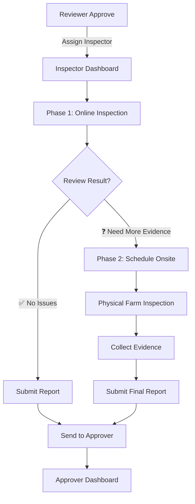

# 🔍 Inspector Workflow - 2-Phase Inspection Model

**Version**: 1.0  
**Date**: October 15, 2025  
**Status**: ✅ OFFICIAL WORKFLOW

---

## 🎯 Overview

Inspector มีหน้าที่ตรวจสอบฟาร์ม **2 ระยะ**:

1. **Phase 1: Online Inspection** (ตรวจออนไลน์ก่อน) - บังคับทุกครั้ง
2. **Phase 2: Onsite Inspection** (ตรวจ Onsite) - เฉพาะเมื่อจำเป็น

---

## 📋 Workflow Diagram



---

## 📝 Phase 1: Online Inspection (บังคับ)

### Purpose

ตรวจสอบเอกสาร + ภาพถ่ายที่ Farmer อัปโหลดมาก่อน เพื่อประหยัดเวลาและค่าใช้จ่าย

### Checklist

- [ ] ตรวจสอบเอกสารประกอบ (PDF)
- [ ] ดูภาพถ่ายฟาร์ม (Farm photos)
- [ ] ตรวจสอบพิกัด GPS (ถ้ามี)
- [ ] ดูประวัติการยื่นคำขอ (ถ้าเคยถูก reject)
- [ ] Video call กับ Farmer (Optional)

### Decision Points

#### ✅ **Approve (ผ่านการตรวจ)**

**เงื่อนไข**:

- เอกสารครบถ้วน และชัดเจน
- ภาพถ่ายแสดงฟาร์มตรงตามมาตรฐาน
- ไม่มีข้อสงสัยใดๆ

**Action**: Submit Report → Send to Approver

---

#### ❓ **Need Onsite (ต้องตรวจ Onsite)**

**เงื่อนไข** (อย่างใดอย่างหนึ่ง):

- ภาพถ่ายไม่ชัดเจน หรือไม่ครอบคลุม
- ข้อมูลไม่สอดคล้องกัน (เช่น ขนาดพื้นที่ไม่ตรงกับภาพ)
- ฟาร์มอยู่ในพื้นที่เสี่ยง (ต้องตรวจสอบจริง)
- เคยถูก reject มาก่อน (ต้องยืนยัน)
- มีข้อสงสัยที่จำเป็นต้องตรวจสอบจริง

**Action**: Schedule Onsite Inspection

---

#### ❌ **Reject (ไม่ผ่าน - ล็อกระบบ 1 สัปดาห์)**

**เงื่อนไข**:

- เอกสารไม่ครบ หรือผิดพลาดร้ายแรง
- ภาพถ่ายแสดงว่าไม่ตรงมาตรฐานอย่างชัดเจน
- ข้อมูลเท็จ

**Action**:

1. Reject → แจ้ง Farmer พร้อมเหตุผล
2. **ล็อกไม่ให้ยื่นใหม่ภายใน 1 สัปดาห์**
3. Status: `rejected_locked_until` (Date + 7 days)
4. Email/SMS: "คำขอถูกปฏิเสธ สามารถยื่นใหม่ได้หลังวันที่ XX/XX/XXXX"

**Business Rule**:

```javascript
rejectedAt = new Date();
lockedUntil = new Date(rejectedAt.getTime() + 7 * 24 * 60 * 60 * 1000);
canResubmit = new Date() >= lockedUntil;
```

---

## 📝 Phase 2: Onsite Inspection (เฉพาะเมื่อจำเป็น)

### Trigger

เมื่อ Inspector ตัดสินใจว่า **"Need Onsite"** จาก Phase 1

### Scheduling

**Inspector fills form**:

```typescript
interface OnsiteSchedule {
  applicationId: string;
  inspectionDate: Date; // วันที่ตรวจ
  inspectionTime: string; // เวลา (09:00 - 16:00)
  inspectorTeam: string[]; // รายชื่อ Inspector ที่ไป
  farmAddress: string; // ที่อยู่ฟาร์ม
  gpsLocation: {
    lat: number;
    lng: number;
  };
  estimatedDuration: number; // ชั่วโมง
  notes: string; // หมายเหตุ
}
```

**Notification**:

- ✉️ Email/SMS to Farmer: "นัดหมายตรวจฟาร์ม วันที่ XX/XX/XXXX"
- 🔔 Inspector Dashboard: Show in "Onsite Scheduled" list
- 📅 Calendar Event created

---

### Onsite Checklist

**เมื่อถึงฟาร์ม**:

1. **Verify Location** ✅
   - เช็ค GPS ตรงกับที่ยื่น
   - ถ่ายภาพป้ายชื่อฟาร์ม (ถ้ามี)

2. **Physical Inspection** 🔍
   - ตรวจสอบขนาดพื้นที่จริง
   - ดูประเภทพืช และการจัดการ
   - ตรวจสอบระบบ Lot (ถ้ามี)
   - ดูการเก็บรักษาเอกสาร

3. **Photo Evidence** 📸
   - ถ่ายภาพรวมฟาร์ม (4 มุม)
   - ถ่ายรายละเอียดที่สำคัญ
   - ถ่าย GPS tracker บนมือถือ
   - ถ่ายรูปร่วมกับเกษตรกร (Optional)

4. **Interview Farmer** 💬
   - สัมภาษณ์เกษตรกร
   - ถามเรื่องกระบวนการทำฟาร์ม
   - ตรวจสอบความรู้เรื่อง GACP

5. **Document** 📝
   - บันทึกผลการตรวจสอบ
   - กรอก Inspection Form
   - ระบุข้อบกพร่อง (ถ้ามี)

---

### Onsite Form

```typescript
interface OnsiteInspectionReport {
  inspectionId: string;
  applicationId: string;
  inspectionDate: Date;
  inspectorName: string;

  // Location Verification
  gpsVerified: boolean;
  actualLocation: { lat: number; lng: number };

  // Farm Details
  actualFarmSize: number; // ตรวจวัดจริง (ไร่)
  cropType: string[];
  farmCondition: 'excellent' | 'good' | 'fair' | 'poor';

  // GACP Compliance
  complianceChecklist: {
    item: string;
    status: 'pass' | 'fail' | 'n/a';
    notes: string;
  }[];

  // Photos
  photos: {
    url: string;
    description: string;
    timestamp: Date;
    gpsLocation: { lat: number; lng: number };
  }[];

  // Final Assessment
  recommendation: 'approve' | 'reject';
  overallNotes: string;
  improvements: string[]; // ข้อเสนอแนะ

  // Signature
  inspectorSignature: string;
  farmerSignature: string;
  completedAt: Date;
}
```

---

## 📊 Submit Report

### After Online or Onsite

**Inspector fills final report**:

```typescript
interface InspectionReport {
  reportId: string;
  applicationId: string;
  inspectionType: 'online' | 'onsite';

  // Summary
  status: 'pass' | 'fail';
  summary: string;

  // Details
  strengths: string[]; // จุดแข็ง
  weaknesses: string[]; // จุดอ่อน
  recommendations: string[]; // ข้อเสนอแนะ

  // Attachments
  documents: string[]; // เอกสารประกอบ
  photos: string[]; // รูปภาพ

  // Decision
  finalDecision: 'approve' | 'reject';
  reason: string;

  // Inspector Info
  inspectorId: string;
  inspectorName: string;
  submittedAt: Date;
}
```

---

## 🔔 Notification Flow

### Phase 1 (Online)

**When Inspector starts**:

- 🔔 Farmer: "Inspector กำลังตรวจสอบคำขอของคุณ"

**When Inspector decides**:

- ✅ Approve:
  - 🔔 Farmer: "ผ่านการตรวจสอบ! กำลังส่งไปยังผู้อนุมัติ"
  - 🔔 Approver: "คำขอใหม่รอการอนุมัติ"
- ❓ Need Onsite:
  - 🔔 Farmer: "จำเป็นต้องตรวจสอบ Onsite - รอการนัดหมาย"
- ❌ Reject:
  - 🔔 Farmer: "คำขอถูกปฏิเสธ - กรุณาแก้ไขและยื่นใหม่"

### Phase 2 (Onsite)

**When schedule is set**:

- ✉️ Farmer (Email/SMS): "นัดหมายตรวจฟาร์ม วันที่ XX/XX เวลา XX:XX"
- 📅 Calendar: Add event (with reminder 1 day before)

**1 day before**:

- 🔔 Reminder: "พรุ่งนี้มีการตรวจฟาร์ม"

**When onsite completed**:

- 🔔 Farmer: "ตรวจฟาร์มเสร็จแล้ว - กำลังประมวลผล"

**When report submitted**:

- Same as Phase 1 (Approve/Reject)

---

## 📈 KPI Tracking

### Inspector Performance Metrics

```typescript
interface InspectorKPI {
  inspectorId: string;
  period: string; // เช่น "2025-10"

  // Productivity
  totalInspections: number;
  onlineInspections: number;
  onsiteInspections: number;
  avgInspectionTime: number; // minutes

  // Quality
  approvalRate: number; // %
  onsiteNeedRate: number; // % ที่ต้อง onsite
  farmerSatisfaction: number; // 1-5 stars

  // Efficiency
  avgResponseTime: number; // hours (from assigned to started)
  slaCompliance: number; // % (onsite within 7 days)
}
```

---

## ⚙️ Business Rules

### Online Inspection

- ✅ Inspector ต้องตรวจ online ภายใน **3 วันทำการ**
- ✅ ถ้าไม่ดำเนินการภายใน 3 วัน → Escalate to DTAM Admin

### Onsite Inspection

- ✅ ต้อง schedule ภายใน **7 วันทำการ**
- ✅ Farmer ต้อง confirm appointment ภายใน 2 วัน
- ✅ ถ้า Farmer ไม่ confirm → Auto reject (with notification)

### Report Submission

- ✅ หลัง onsite ต้อง submit report ภายใน **2 วันทำการ**
- ✅ Report ต้องมีรูปภาพอย่างน้อย **4 ภาพ** (4 มุม)

---

## 🎯 Success Criteria

### For Inspector

- ✅ Complete inspection within SLA (3 days online / 7 days onsite)
- ✅ Approval rate > 70% (not too strict / not too lenient)
- ✅ Farmer satisfaction > 4.0 stars
- ✅ Report quality score > 80%

### For System

- ✅ 80% of applications pass online inspection (ไม่ต้อง onsite)
- ✅ Average online inspection time < 2 hours
- ✅ Average onsite inspection time < 4 hours
- ✅ Onsite appointment confirmation rate > 90%

---

**Approved by**: PM + SA  
**Implementation**: DTAM Portal - Inspector Dashboard
