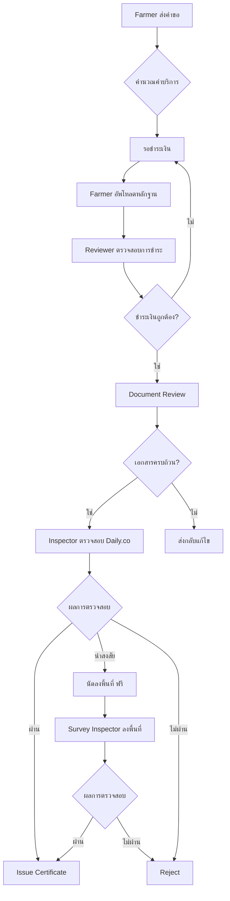

# 💰 GACP Payment Workflow Analysis

## 📊 Current State (ปัญหา)

### ❌ Missing Components:

1. **No Payment Gateway Integration**
2. **No Payment Status Tracking**
3. **No Payment Receipt Upload**
4. **No Payment Confirmation**

---

## 🎯 Required Payment Workflow

### Phase 2: Payment Process

```typescript
enum ApplicationStatus {
  DRAFT = 'ร่าง',
  SUBMITTED = 'ส่งคำขอแล้ว',

  // ⬇️ MISSING STATES ⬇️
  PENDING_PAYMENT = 'รอชำระเงิน', // ← ต้องเพิ่ม!
  PAYMENT_UPLOADED = 'อัพโหลดหลักฐานแล้ว', // ← ต้องเพิ่ม!
  PAYMENT_VERIFIED = 'ยืนยันการชำระแล้ว', // ← ต้องเพิ่ม!

  UNDER_REVIEW = 'กำลังตรวจสอบเอกสาร',
  PENDING_INSPECTION = 'รอตรวจสอบออนไลน์',
  INSPECTION_SCHEDULED = 'นัดตรวจสอบแล้ว',
  INSPECTION_COMPLETED = 'ตรวจสอบเสร็จสิ้น',
  REQUIRES_ONSITE = 'ต้องลงพื้นที่ตรวจสอบ',
  APPROVED = 'อนุมัติ',
  CERTIFICATE_ISSUED = 'ออกใบรับรองแล้ว',
  REJECTED = 'ไม่อนุมัติ'
}
```

---

## 💳 Payment Service Architecture

### 1. Payment Information Schema

```typescript
interface PaymentInfo {
  applicationId: string;
  amount: number;
  currency: 'THB';
  feeType: 'INSPECTION_FEE' | 'CERTIFICATE_FEE' | 'RENEWAL_FEE';

  // Payment Details
  paymentMethod: 'BANK_TRANSFER' | 'PROMPTPAY' | 'CREDIT_CARD';
  bankAccount?: {
    bankName: string;
    accountNumber: string;
    accountName: string;
  };

  // Receipt Upload
  receiptImage?: string;
  receiptUploadedAt?: Date;

  // Verification
  status: PaymentStatus;
  verifiedBy?: string;
  verifiedAt?: Date;
  rejectionReason?: string;

  // Metadata
  createdAt: Date;
  updatedAt: Date;
}

enum PaymentStatus {
  PENDING = 'รอชำระเงิน',
  RECEIPT_UPLOADED = 'อัพโหลดหลักฐานแล้ว',
  UNDER_VERIFICATION = 'กำลังตรวจสอบ',
  VERIFIED = 'ยืนยันแล้ว',
  REJECTED = 'ไม่ถูกต้อง'
}
```

### 2. Payment Fee Structure

```typescript
interface FeeStructure {
  inspectionFee: {
    online: 500; // Daily.co inspection
    onsite: 0; // ฟรี ถ้า Inspector ตัดสินให้ลงพื้นที่
    remote: 500; // Blizz Visual (Phase 2)
  };

  certificateFee: {
    issuance: 200; // ค่าออกใบรับรอง
    renewal: 150; // ค่าต่ออายุ
    replacement: 100; // ค่าออกใบรับรองใหม่ (สูญหาย)
  };

  totalFee: number; // รวมทั้งหมด
}
```

### 3. Payment API Endpoints

```typescript
// Farmer Portal APIs
POST   /api/payment/calculate        // คำนวณค่าบริการ
GET    /api/payment/:applicationId   // ดูข้อมูลการชำระเงิน
POST   /api/payment/upload-receipt   // อัพโหลดหลักฐานการโอน

// Admin Portal APIs (DTAM Reviewer)
GET    /api/payment/pending          // รายการรอตรวจสอบ
POST   /api/payment/verify           // ยืนยันการชำระเงิน
POST   /api/payment/reject           // ปฏิเสธการชำระเงิน
```

---

## 🔄 Updated Workflow with Payment

### Complete Application Workflow



---

## 📋 Implementation Tasks

### Sprint 1-2: Payment Module (Week 1-2)

#### Task 1.1: Database Schema

- [ ] สร้าง Payment collection ใน MongoDB
- [ ] เพิ่ม payment status ใน Application
- [ ] สร้าง Payment History tracking

#### Task 1.2: Backend APIs

- [ ] Payment calculation service
- [ ] Receipt upload endpoint
- [ ] Payment verification endpoint
- [ ] Payment notification service

#### Task 1.3: Farmer Portal Integration

- [ ] Payment information page
- [ ] Receipt upload form
- [ ] Payment status tracking
- [ ] Payment history view

#### Task 1.4: Admin Portal Integration (DTAM)

- [ ] Payment verification dashboard
- [ ] Receipt image viewer
- [ ] Approve/Reject payment UI
- [ ] Payment report generation

---

## 💡 Phase 2 Enhancements

### Future Features:

1. **PromptPay QR Code Generation**
   - Auto-generate PromptPay QR
   - Real-time payment notification
2. **Credit Card Payment**
   - Integrate payment gateway (Omise/2C2P)
   - Instant payment verification

3. **Automatic Receipt OCR**
   - Extract transaction details from receipt image
   - Auto-verify payment amount

4. **Payment Reminders**
   - Email/SMS reminder for pending payment
   - Auto-cancel after X days

---

## 🎯 Success Criteria

### Payment Module Complete When:

✅ Farmer can see payment amount
✅ Farmer can upload payment receipt
✅ DTAM Reviewer can verify payment
✅ Application status updates automatically
✅ Payment history is tracked
✅ Email notifications sent

---

## 📊 Database Schema Updates

### Updated Application Schema

```typescript
interface Application {
  // ... existing fields ...

  // ⬇️ NEW PAYMENT FIELDS ⬇️
  payment?: {
    required: boolean;
    amount: number;
    status: PaymentStatus;
    receiptUrl?: string;
    receiptUploadedAt?: Date;
    verifiedBy?: string;
    verifiedAt?: Date;
    rejectionReason?: string;
  };

  // Updated status field
  status: ApplicationStatus; // includes new payment statuses
}
```

---

## 🚀 Deployment Strategy

### Phase 1 (Current Sprint):

- Implement basic payment tracking
- Manual receipt upload
- Manual verification by admin

### Phase 2 (Next Quarter):

- PromptPay integration
- Automatic verification
- Payment gateway

### Phase 3 (Future):

- AI receipt OCR
- Multi-currency support
- Refund system

---

**Generated by: PM Analysis**
**Date: October 15, 2025**
**Status: ⚠️ CRITICAL - Payment System Missing**
