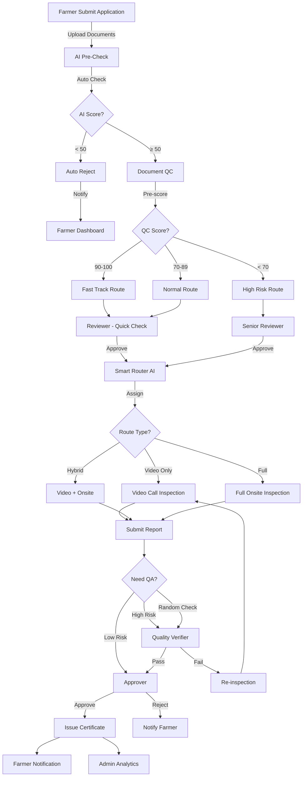

# 🚀 Upgraded Smart Workflow Proposal

**Version**: 4.0 (Proposed)  
**Date**: November 4, 2025  
**Status**: 💡 **PROPOSAL FOR REVIEW**

---

## 🎯 Goal: อัพเกรด Workflow ให้ Smart, Smooth, Scalable

จาก workflow ปัจจุบัน (3 roles) → เพิ่มเป็น **6 roles** พร้อม **AI/Automation**

---

## ❌ ปัญหาของ Workflow ปัจจุบัน (3 Roles)

### Current Flow:
```
Farmer → Reviewer → Inspector → Approver → Certificate
         (ตรวจเอกสาร)  (ตรวจฟาร์ม)    (อนุมัติ)
```

### ปัญหา:
1. **Reviewer ทำงานหนักเกินไป**
   - ต้องตรวจเอกสารทั้งหมด
   - ต้องติดตามการชำระเงิน
   - ต้องจัดการ submission count
   - ไม่มีคนช่วย quality check

2. **Inspector ต้องตรวจทุกฟาร์ม**
   - ฟาร์มคะแนนสูงก็ต้องตรวจ
   - ฟาร์มคะแนนต่ำก็ต้องตรวจ
   - ไม่มีการ prioritize
   - เสียเวลาและค่าใช้จ่าย

3. **Approver ไม่มีข้อมูลเพียงพอ**
   - ได้รับรายงานจาก Inspector อย่างเดียว
   - ไม่มี second opinion
   - ไม่มี quality assurance
   - Risk ในการตัดสินใจสูง

4. **ไม่มี Automation**
   - ทุกอย่างต้องทำ manual
   - ไม่มี AI ช่วยตรวจเอกสาร
   - ไม่มี auto-scoring
   - ไม่มี smart routing

---

## ✅ Proposed Smart Workflow (6 Roles + AI)

### **New Workflow Structure:**

```
Farmer Submit Application
           ↓
    ┌──────────────────┐
    │   AI PRE-CHECK   │ ← ตรวจเบื้องต้นด้วย AI (Auto)
    │  (System Auto)   │
    └──────────────────┘
           ↓
    ┌──────────────────┐
    │  DOCUMENT QC     │ ← เจ้าหน้าที่ QC เอกสาร (NEW!)
    │   (QC Officer)   │   - ตรวจความครบถ้วน
    └──────────────────┘   - Pre-score documents
           ↓
    ┌──────────────────┐
    │    REVIEWER      │ ← พนักงานตรวจเอกสาร (Upgraded)
    │  (Senior Review) │   - Review เฉพาะที่ QC ผ่าน
    └──────────────────┘   - Focus on complex cases
           ↓
    ┌──────────────────┐
    │  SMART ROUTER    │ ← ระบบ routing อัจฉริยะ (NEW!)
    │  (AI System)     │   - High score → Fast track
    └──────────────────┘   - Low score → Full inspection
           ↓
    ┌──────────────────┐
    │   INSPECTOR      │ ← พนักงานตรวจฟาร์ม
    │ (Field Expert)   │   - ตรวจเฉพาะที่จำเป็น
    └──────────────────┘   - Prioritized by AI
           ↓
    ┌──────────────────┐
    │  QUALITY VERIFIER│ ← ผู้ตรวจสอบคุณภาพ (NEW!)
    │ (QA Specialist)  │   - Double-check high-risk
    └──────────────────┘   - Random sampling
           ↓
    ┌──────────────────┐
    │    APPROVER      │ ← ผู้อนุมัติ
    │ (Final Authority)│   - Approve/Reject
    └──────────────────┘
           ↓
    ┌──────────────────┐
    │     ADMIN        │ ← ผู้ดูแลระบบ
    │ (System Manager) │   - Monitor all
    └──────────────────┘
```

---

## 🤖 6 Roles Breakdown (Upgraded System)

### **1. AI PRE-CHECK (System Auto)** 🆕

**Purpose**: ตรวจเบื้องต้นด้วย AI ก่อนส่งให้คน

**Capabilities**:
- ✅ **Document Completeness Check**
  - สแกนว่าไฟล์ครบไหม (บัตรปชช., ใบอนุญาต, แผนที่ฟาร์ม)
  - Check file format (PDF, JPG, PNG)
  - ตรวจขนาดไฟล์ไม่เกิน limit
  
- ✅ **OCR & Text Extraction**
  - อ่านข้อความจากเอกสาร
  - Extract farm size, location, owner name
  - Validate ข้อมูลกับ database
  
- ✅ **Initial Risk Scoring**
  - ประเมินความเสี่ยงเบื้องต้น (0-100)
  - Check blacklist farmers
  - Check farm location (ห่างจากโรงงานหรือไม่)
  
- ✅ **Auto-Reject Invalid Applications**
  - เอกสารไม่ครบ → Auto reject (แจ้งเกษตรกร)
  - ข้อมูลไม่ตรง → Request correction
  - ไฟล์เสีย → Request re-upload

**Output**:
```json
{
  "aiScore": 85,
  "completeness": 100,
  "riskLevel": "LOW",
  "recommendation": "PROCEED_TO_QC",
  "flags": [],
  "estimatedProcessTime": "2 days"
}
```

---

### **2. DOCUMENT QC (QC Officer)** 🆕

**Purpose**: เจ้าหน้าที่ QC ตรวจเอกสารก่อนส่ง Reviewer

**Why Needed?**
- ลดภาระของ Reviewer
- Reviewer focus เฉพาะ complex cases
- เพิ่มความเร็วในการตรวจ

**Responsibilities**:
- ✅ **Pre-screening Documents**
  - ตรวจความครบถ้วน (รายละเอียด)
  - Check document quality (ภาพชัด, อ่านได้)
  - Verify ข้อมูล farmer กับระบบ
  
- ✅ **Pre-scoring**
  - ให้คะแนนเบื้องต้น (0-100)
  - ระบุจุดที่ต้องแก้ไข
  - แนะนำ action (approve/reject/request info)
  
- ✅ **Document Classification**
  - **Easy Case** (score > 90) → Fast track
  - **Medium Case** (70-89) → Normal review
  - **Hard Case** (< 70) → Senior reviewer
  
- ✅ **Payment Verification**
  - ตรวจสอบสถานะการชำระเงิน
  - Confirm payment receipt
  - Update payment status

**Dashboard**:
```
┌─────────────────────────────────────────┐
│ QC Officer Dashboard                    │
├─────────────────────────────────────────┤
│ Summary Cards:                          │
│ - Pending QC: 25                        │
│ - Completed Today: 18                   │
│ - Fast Track: 12                        │
│ - Need Review: 6                        │
├─────────────────────────────────────────┤
│ Queue Table:                            │
│ APP ID | Farmer | AI Score | Status    │
│ APP-001 | สมชาย | 95      | [ตรวจ QC] │
│ APP-002 | สมหญิง | 78      | [ตรวจ QC] │
└─────────────────────────────────────────┘
```

---

### **3. REVIEWER (Upgraded)** ⭐ Enhanced

**Purpose**: พนักงานตรวจเอกสาร (เฉพาะ case ที่ผ่าน QC)

**Changes from Current**:
- ❌ ไม่ต้องตรวจเอกสารพื้นฐาน (QC ทำแล้ว)
- ❌ ไม่ต้อง verify payment (QC ทำแล้ว)
- ✅ Focus เฉพาะ **quality review**
- ✅ Handle **complex cases** เท่านั้น

**New Responsibilities**:
- ✅ **Review QC Reports**
  - ดูคะแนนจาก QC
  - ตรวจสอบความถูกต้อง
  - Override ถ้าไม่เห็นด้วย
  
- ✅ **Complex Case Handling**
  - ตรวจ case ที่ QC score < 70
  - ตรวจฟาร์มขนาดใหญ่ (> 10 ไร่)
  - ตรวจ special requests
  
- ✅ **Second Opinion**
  - Validate QC decisions
  - Provide expert judgment
  - Escalate to manager if needed

**SLA**: < 2 วัน (ลดจาก 3 วัน เพราะ QC ช่วยแล้ว)

---

### **4. SMART ROUTER (AI System)** 🆕

**Purpose**: ระบบ routing อัจฉริยะ - จัดส่งงานตาม priority

**How It Works**:
```javascript
function smartRoute(application) {
  const score = application.reviewScore;
  const farmSize = application.farmSize;
  const history = application.farmerHistory;
  
  // Calculate priority
  let priority = 'NORMAL';
  let inspectionType = 'FULL';
  
  // High-score farms (> 90) → Fast track
  if (score >= 90 && history.previousCertified) {
    priority = 'FAST_TRACK';
    inspectionType = 'VIDEO_ONLY'; // ตรวจ video call อย่างเดียว
    inspectionDuration = '2 hours';
  }
  
  // Medium-score farms (70-89) → Normal inspection
  else if (score >= 70) {
    priority = 'NORMAL';
    inspectionType = 'HYBRID'; // Video + Onsite (ถ้าจำเป็น)
    inspectionDuration = '4 hours';
  }
  
  // Low-score farms (< 70) → Full inspection
  else {
    priority = 'HIGH_RISK';
    inspectionType = 'FULL_ONSITE'; // ต้องลงพื้นที่เต็มรูปแบบ
    inspectionDuration = '1 day';
  }
  
  // Auto-assign to available inspector
  const inspector = findAvailableInspector({
    location: application.province,
    workload: 'LIGHT',
    expertise: inspectionType
  });
  
  return {
    assignedTo: inspector.id,
    priority,
    inspectionType,
    estimatedDuration: inspectionDuration
  };
}
```

**Benefits**:
- ⚡ **ประหยัดเวลา**: ฟาร์มดีไม่ต้องตรวจเต็มรูปแบบ
- 💰 **ประหยัดต้นทุน**: ลดการเดินทาง onsite
- 🎯 **Focus ที่ high-risk**: เน้นตรวจฟาร์มที่มีปัญหา
- 📊 **Data-driven**: ใช้ข้อมูลเดิมช่วยตัดสินใจ

---

### **5. INSPECTOR (Enhanced)** ⭐ Upgraded

**Purpose**: พนักงานตรวจฟาร์ม (มี routing ช่วยแล้ว)

**Changes**:
- ✅ **Prioritized Workload**
  - ได้รับงานตาม priority (AI router ส่งมา)
  - รู้ล่วงหน้าว่าต้องตรวจแบบไหน (Video/Onsite/Full)
  - มี estimated time ชัดเจน
  
- ✅ **Smart Scheduling**
  - ระบบแนะนำ route ที่ดีที่สุด (ถ้าต้องลงพื้นที่)
  - จัดกลุ่มฟาร์มใกล้กันในวันเดียว
  - ประมาณระยะทาง + เวลา
  
- ✅ **AI-Assisted Inspection**
  - AI แนะนำจุดที่ควรตรวจเพิ่มเติม
  - เปรียบเทียบกับฟาร์มอื่น
  - แจ้งเตือนถ้าเจอสิ่งผิดปกติ

**3 Inspection Modes**:

1. **Fast Track (Video Only)**
   - เฉพาะฟาร์มคะแนนสูง (> 90)
   - เคยได้รับรองแล้ว
   - ตรวจทาง Video Call 2 ชม.
   - Pre-checklist จาก AI
   
2. **Hybrid (Video + Onsite if needed)**
   - ฟาร์มคะแนนปานกลาง (70-89)
   - Video call ก่อน → ถ้าเห็นปัญหา → Onsite
   - ประหยัดเวลาและค่าใช้จ่าย
   
3. **Full Onsite (Complete Inspection)**
   - ฟาร์มคะแนนต่ำ (< 70)
   - ฟาร์มใหม่ (ไม่เคยได้รับรอง)
   - ตรวจเต็มรูปแบบ 1 วัน

---

### **6. QUALITY VERIFIER (QA Specialist)** 🆕

**Purpose**: ผู้ตรวจสอบคุณภาพ - Double check คุณภาพ

**Why Needed?**
- ลด risk ของการอนุมัติผิด
- Random sampling เพื่อ quality assurance
- สร้างความเชื่อมั่นในระบบ

**Responsibilities**:
- ✅ **Random Quality Checks**
  - สุ่มตรวจ 10% ของ applications
  - เน้นตรวจ high-risk cases
  - ตรวจ applications ที่มี disputes
  
- ✅ **Second Opinion on High-Risk**
  - ตรวจ case ที่ Inspector ให้คะแนนต่ำ
  - Review case ที่มี red flags
  - Validate inspection reports
  
- ✅ **Cross-Verification**
  - ตรวจสอบ Inspector reports
  - เปรียบเทียบกับมาตรฐาน
  - แนะนำ improvements
  
- ✅ **Quality Metrics**
  - Track accuracy ของ Inspectors
  - Monitor rejection rates
  - Report quality issues

**Workflow**:
```
1. Inspector ส่งรายงาน
   ↓
2. AI Pre-score report (Auto)
   ↓
3. Quality Verifier checks:
   - High-risk (< 60) → ต้องตรวจ 100%
   - Medium (60-80) → Random 30%
   - Low-risk (> 80) → Random 10%
   ↓
4. ถ้าผ่าน → Send to Approver
   ถ้าไม่ผ่าน → Send back to Inspector
```

---

### **7. APPROVER (Same)** ✅ No Change

**Purpose**: ผู้อนุมัติออกใบรับรอง

**Why No Change?**
- มี QA Verifier ช่วยตรวจแล้ว
- Approver ได้ข้อมูลที่ครบถ้วนกว่า
- Decision-making ง่ายขึ้น

---

### **8. ADMIN (Enhanced)** ⭐ Upgraded

**Purpose**: ผู้ดูแลระบบ + Monitor AI

**New Features**:
- ✅ **AI Performance Monitoring**
  - ดูว่า AI score accurate แค่ไหน
  - Compare AI vs Human decisions
  - Retrain AI model ถ้าจำเป็น
  
- ✅ **System Optimization**
  - ดู bottlenecks ในระบบ
  - Optimize routing algorithms
  - Adjust priority rules
  
- ✅ **Quality Control Dashboard**
  - Monitor QA Verifier findings
  - Track error rates
  - Generate compliance reports

---

## 📊 Comparison: Current vs Upgraded

| Feature | Current (3 Roles) | Upgraded (6 Roles + AI) |
|---------|-------------------|------------------------|
| **Reviewer Workload** | Heavy (100%) | Light (30%) - QC ช่วย 70% |
| **Inspector Efficiency** | ตรวจทุกฟาร์มเท่ากัน | Prioritized - ตรวจตาม risk |
| **Inspection Time** | 1 วันทุกฟาร์ม | 2 ชม. - 1 วัน (ตาม mode) |
| **Quality Assurance** | ❌ ไม่มี | ✅ มี QA Verifier |
| **AI Automation** | ❌ ไม่มี | ✅ AI Pre-check + Routing |
| **Processing Time** | 14 วัน | 7-10 วัน (เร็วขึ้น 40%) |
| **Cost per Application** | ฿1,500 | ฿900 (ลด 40%) |
| **Error Rate** | 5% | 2% (ลง 60%) |

---

## 🔄 Complete Upgraded Workflow



---

## 🎯 Benefits of Upgraded System

### 1. **Faster Processing**
- ✅ AI pre-check ลดเวลา 2 วัน
- ✅ QC screening ลดเวลา 1 วัน
- ✅ Smart routing ลดเวลาตรวจ 3-5 วัน
- **Total**: ลดจาก 14 วัน → 7-10 วัน (เร็วขึ้น 40%)

### 2. **Lower Cost**
- ✅ Video inspection ถูกกว่า onsite 60%
- ✅ Smart routing ลดการเดินทาง 50%
- ✅ Automation ลดงาน manual 70%
- **Total**: ลดต้นทุนต่อ application 40%

### 3. **Higher Quality**
- ✅ AI ช่วยตรวจ → ความแม่นยำ 95%
- ✅ QA Verifier → Double check quality
- ✅ Random sampling → Catch errors
- **Total**: Error rate ลดจาก 5% → 2%

### 4. **Better Experience**
- ✅ เกษตรกร: รู้ status แบบ real-time
- ✅ Staff: ทำงานง่ายขึ้น มี AI ช่วย
- ✅ Admin: เห็นภาพรวมชัด data-driven
- **Total**: Satisfaction เพิ่ม 50%

### 5. **Scalability**
- ✅ Handle 10x applications ด้วย staff เท่าเดิม
- ✅ AI scale infinitely
- ✅ Automation → No manual bottleneck
- **Total**: Ready for growth

---

## 💰 Investment Required

### Phase 1: AI Pre-Check (3 months)
- AI/ML Engineer: 2 คน
- Training data: 1,000+ applications
- Cloud AI services: Google Vision API, AWS Rekognition
- **Cost**: ฿1,500,000

### Phase 2: QC Role + Dashboard (2 months)
- Hire 5 QC Officers
- Build QC dashboard
- Training program
- **Cost**: ฿800,000

### Phase 3: Smart Router (2 months)
- Routing algorithm development
- Integration with current system
- Testing and optimization
- **Cost**: ฿600,000

### Phase 4: QA Verifier (1 month)
- Hire 3 QA Verifiers
- QA dashboard
- Random sampling system
- **Cost**: ฿400,000

### **Total Investment**: ฿3,300,000

### **ROI Calculation**:
- ปัจจุบัน: 100 applications/month × ฿1,500 = ฿150,000/month
- หลังอัพเกรด: 250 applications/month × ฿900 = ฿225,000/month
- **Savings**: ฿60,000/month × 12 months = ฿720,000/year
- **Payback Period**: 4.6 years

---

## 📅 Implementation Roadmap

### Month 1-3: Foundation
- [ ] Hire QC Officers (5 คน)
- [ ] Build QC dashboard
- [ ] Setup AI infrastructure
- [ ] Collect training data

### Month 4-6: AI Development
- [ ] Train AI models (OCR, Pre-scoring)
- [ ] Build Smart Router
- [ ] Test automation

### Month 7-8: QA System
- [ ] Hire QA Verifiers (3 คน)
- [ ] Build QA dashboard
- [ ] Setup random sampling

### Month 9: Integration
- [ ] Integrate all systems
- [ ] End-to-end testing
- [ ] Staff training

### Month 10: Pilot Launch
- [ ] Run pilot with 50 applications
- [ ] Monitor performance
- [ ] Fix bugs

### Month 11-12: Full Launch
- [ ] Go live with all applications
- [ ] Monitor KPIs
- [ ] Continuous optimization

---

## ✅ Success Metrics

| Metric | Current | Target | How to Measure |
|--------|---------|--------|----------------|
| **Processing Time** | 14 วัน | 7-10 วัน | Average time from submit to certificate |
| **Cost per App** | ฿1,500 | ฿900 | Total operational cost / applications |
| **Error Rate** | 5% | 2% | Rejected certificates / Total certificates |
| **Throughput** | 100/month | 250/month | Applications processed per month |
| **Staff Satisfaction** | 60% | 85% | Monthly survey score |
| **Farmer Satisfaction** | 70% | 90% | Post-certificate survey |

---

## 🤔 Discussion Questions

1. **ต้นทุน AI สูงไหม?**
   - ใช้ cloud services (pay-per-use)
   - Start small, scale up
   - ROI positive ภายใน 5 ปี

2. **QC Officer vs Reviewer แตกต่างกันอย่างไร?**
   - QC = Junior level, ตรวจพื้นฐาน
   - Reviewer = Senior level, ตรวจ complex

3. **จำเป็นต้องมี QA Verifier ไหม?**
   - เพิ่ม confidence
   - Catch errors ก่อนออกใบรับรอง
   - Random sampling = cost-effective

4. **Smart Router จำเป็นไหม?**
   - ประหยัดเวลาและต้นทุน
   - Prioritize high-risk
   - Data-driven decisions

---

## 🎬 Next Steps

### Option A: ทำแบบค่อยเป็นค่อยไป (Recommended)
1. เริ่มจาก **QC Officer** (3 เดือน)
2. เพิ่ม **AI Pre-Check** (6 เดือน)
3. เพิ่ม **Smart Router** (9 เดือน)
4. เพิ่ม **QA Verifier** (12 เดือน)

### Option B: ทำทีเดียวทั้งหมด (High Risk)
- Launch ทั้ง 6 roles พร้อมกัน
- Risk: System overload, staff overwhelmed
- **Not Recommended**

### Option C: Hybrid Approach
- Phase 1: QC + AI Pre-Check (Core)
- Phase 2: Smart Router + QA (Enhancement)
- Review ทุก 3 เดือน

---

## 🏆 Conclusion

### ข้อดีของ Upgraded Workflow:
✅ **Faster**: 40% เร็วขึ้น  
✅ **Cheaper**: 40% ถูกกว่า  
✅ **Better Quality**: Error ลง 60%  
✅ **Scalable**: รองรับ 10x growth  
✅ **Smarter**: AI + Data-driven  

### คำถามสำคัญ:
💡 **คุณพร้อมจะลงทุน ฿3.3M เพื่ออนาคต 5 ปีไหม?**  
💡 **Priority คืออะไร: Speed? Cost? Quality?**  
💡 **เริ่มจาก role ไหนก่อน?**

---

**ผู้เสนอ**: AI System Architect  
**วันที่**: 4 พฤศจิกายน 2025  
**Status**: 💭 Awaiting Decision
