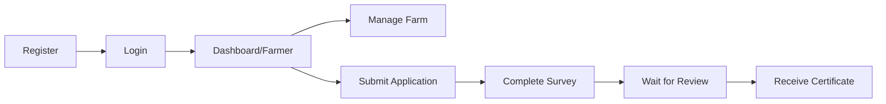
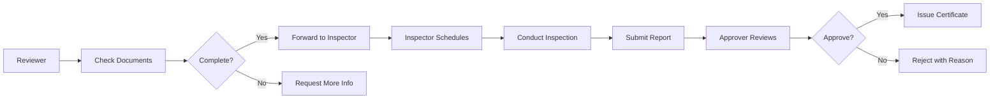
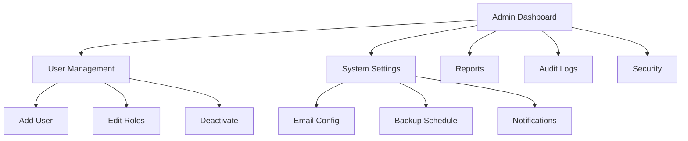

# 🏠 GACP Unified Frontend Sitemap

## Updated with Dashboard/Admin Panel

**Last Updated**: October 14, 2025  
**Version**: 2.0  
**Status**: ✅ Implemented

---

## 📋 Table of Contents

1. [System Overview](#system-overview)
2. [Route Structure](#route-structure)
3. [Role-Based Access](#role-based-access)
4. [Directory Structure](#directory-structure)
5. [Work Process Flow](#work-process-flow)
6. [Implementation Status](#implementation-status)

---

## 🎯 System Overview

GACP Platform is a unified web application that provides role-based dashboards for all stakeholders in the agricultural certification process.

### Key Features:

- ✅ **Role-based Authentication** - JWT with secure session management
- ✅ **Dynamic Dashboard Routing** - Automatic redirect based on user role
- ✅ **Unified Component Library** - Shared UI components with Tailwind CSS
- ✅ **Real-time Updates** - Live notifications and status tracking
- ✅ **Mobile Responsive** - Works on all devices

---

## 🗺️ Route Structure

### Main Landing & Authentication

| Route       | Component     | Description         | Access |
| ----------- | ------------- | ------------------- | ------ |
| `/`         | Landing Page  | Main entry portal   | Public |
| `/login`    | Login Page    | User authentication | Public |
| `/register` | Register Page | New user signup     | Public |

### Role-Based Dashboards

| Role             | Route                  | Description               | Badge Count |
| ---------------- | ---------------------- | ------------------------- | ----------- |
| 👨‍🌾 **Farmer**    | `/dashboard/farmer`    | Farm management dashboard | -           |
| 📋 **Reviewer**  | `/dashboard/reviewer`  | Document review dashboard | 12 pending  |
| 🔍 **Inspector** | `/dashboard/inspector` | Farm inspection dashboard | 3 scheduled |
| ✅ **Approver**  | `/dashboard/approver`  | Approval dashboard        | 8 pending   |
| ⚙️ **Admin**     | `/dashboard/admin`     | System administration     | -           |

### Core System Modules

| Module                      | Route          | Description                         | Accessible By       |
| --------------------------- | -------------- | ----------------------------------- | ------------------- |
| 🌱 **Farm Management**      | `/farm`        | Farm data & production cycles       | Farmer, DTAM, Admin |
| 📄 **Certificate System**   | `/application` | Application submission & tracking   | Farmer, DTAM, Admin |
| 🔗 **Track & Trace**        | `/trace`       | QR code verification & lot tracking | Public, DTAM, Admin |
| 📋 **Survey System**        | `/survey`      | Surveys & readiness assessment      | Farmer, DTAM, Admin |
| ⚖️ **Standards Comparator** | `/comparator`  | Standards comparison tool           | DTAM, Admin         |

---

## 🔐 Role-Based Access Control

### User Roles & Permissions

#### 👨‍🌾 Farmer

**Dashboard**: `/dashboard/farmer`

**Permissions**:

- ✅ View and manage own farms
- ✅ Submit certification applications
- ✅ Complete surveys
- ✅ View application status
- ✅ Track lots via QR codes

**Menu Items**:

- หน้าหลัก (Dashboard)
- จัดการฟาร์ม (Farm Management)
- ยื่นเอกสาร (Applications) - Badge: 2 pending
- แบบสอบถาม (Surveys)
- ตั้งค่า (Settings)

---

#### 📋 Reviewer (DTAM)

**Dashboard**: `/dashboard/reviewer`

**Permissions**:

- ✅ Review submitted applications
- ✅ Add comments & requests
- ✅ Forward to inspectors
- ✅ Verify document completeness
- ❌ Cannot approve/reject

**Menu Items**:

- หน้าหลัก (Dashboard)
- รอตรวจสอบ (Pending Review) - Badge: 12
- กำลังดำเนินการ (In Progress) - Badge: 5
- ตรวจสอบแล้ว (Completed)

---

#### 🔍 Inspector (DTAM)

**Dashboard**: `/dashboard/inspector`

**Permissions**:

- ✅ Schedule farm inspections
- ✅ Conduct video call inspections
- ✅ Submit inspection reports
- ✅ Upload photos/videos
- ✅ Verify lot information

**Menu Items**:

- หน้าหลัก (Dashboard)
- ตารางตรวจฟาร์ม (Schedule) - Badge: 3 today
- Video Call (Remote Inspection)
- รายงานการตรวจ (Reports)
- แผนที่ฟาร์ม (Farm Map)

---

#### ✅ Approver (DTAM)

**Dashboard**: `/dashboard/approver`

**Permissions**:

- ✅ Approve/reject applications
- ✅ Issue certificates
- ✅ Revoke certificates
- ✅ View all inspection reports
- ✅ Generate reports

**Menu Items**:

- หน้าหลัก (Dashboard)
- รออนุมัติ (Pending Approval) - Badge: 8
- อนุมัติแล้ว (Approved)
- ปฏิเสธ (Rejected)
- รายงาน (Reports)

---

#### ⚙️ Admin (System)

**Dashboard**: `/dashboard/admin`

**Permissions**:

- ✅ Full system access
- ✅ User management (CRUD)
- ✅ Role assignment
- ✅ System settings
- ✅ Audit logs
- ✅ Backup & restore

**Menu Items**:

- หน้าหลัก (Dashboard)
- จัดการผู้ใช้ (User Management)
- ตั้งค่าระบบ (System Settings)
- รายงานรวม (Reports)
- Audit Logs
- ความปลอดภัย (Security)
- Backup

---

## 📁 Directory Structure

```
apps/farmer-portal/
├── app/
│   ├── page.tsx                 # Main Landing
│   ├── login/page.tsx           # Login page
│   ├── register/page.tsx        # Registration
│   │
│   ├── dashboard/
│   │   ├── farmer/page.tsx      # ✅ Farmer Dashboard
│   │   ├── reviewer/page.tsx    # ✅ Reviewer Dashboard
│   │   ├── inspector/page.tsx   # ✅ Inspector Dashboard
│   │   ├── approver/page.tsx    # ✅ Approver Dashboard
│   │   └── admin/page.tsx       # ✅ Admin Dashboard
│   │
│   ├── farm/                    # Farm Management
│   ├── application/             # Application System
│   ├── trace/                   # Track & Trace
│   ├── survey/                  # Survey System
│   ├── comparator/              # Standards Comparator
│   │
│   ├── layout.tsx               # Root layout
│   ├── providers.tsx            # Context providers
│   └── globals.css              # Global styles
│
├── components/
│   ├── dashboard/
│   │   ├── DashboardLayout.tsx  # ✅ Unified dashboard layout
│   │   ├── Sidebar.tsx          # Navigation sidebar
│   │   ├── StatCard.tsx         # Statistics card
│   │   └── ActivityFeed.tsx     # Activity timeline
│   │
│   ├── ui/                      # Reusable UI components
│   └── auth/                    # Auth forms
│
├── lib/
│   ├── auth.ts                  # ✅ Authentication logic
│   ├── roles.ts                 # ✅ Role & permission management
│   ├── apiClient.ts             # API client
│   └── utils.ts                 # Helper functions
│
└── tsconfig.json                # ✅ TypeScript config (updated)
```

---

## 🔄 Work Process Flow

### 1️⃣ Farmer Journey



**Steps**:

1. **Register** - Create farmer account
2. **Login** - Redirect to `/dashboard/farmer`
3. **Add Farm** - Enter farm details
4. **Submit Application** - Upload documents
5. **Complete Survey** - Answer questions
6. **Track Status** - Real-time updates
7. **Receive Certificate** - Download PDF

---

### 2️⃣ DTAM Review Process



**Reviewer** (`/dashboard/reviewer`):

- ✅ Check document completeness
- ✅ Request additional information
- ✅ Forward to inspector

**Inspector** (`/dashboard/inspector`):

- ✅ Schedule farm visit (onsite or video call)
- ✅ Conduct inspection
- ✅ Upload photos/videos
- ✅ Submit inspection report with score

**Approver** (`/dashboard/approver`):

- ✅ Review inspection report
- ✅ Check compliance
- ✅ Approve → Issue certificate
- ✅ Reject → Send back with reason

---

### 3️⃣ Admin Management



**Admin Functions**:

- 👥 Manage users (CRUD operations)
- 🔑 Assign roles & permissions
- 📊 View system-wide reports
- 🔍 Audit trail & logs
- 🛡️ Security settings
- 💾 Backup & restore

---

## ✅ Implementation Status

### Completed ✅

- [x] **Auth & Roles System** (`lib/auth.ts`, `lib/roles.ts`)
- [x] **Dashboard Layout** (`components/dashboard/DashboardLayout.tsx`)
- [x] **Farmer Dashboard** (`/dashboard/farmer`)
- [x] **Reviewer Dashboard** (`/dashboard/reviewer`)
- [x] **Inspector Dashboard** (`/dashboard/inspector`)
- [x] **Approver Dashboard** (`/dashboard/approver`)
- [x] **Admin Dashboard** (`/dashboard/admin`)
- [x] **TypeScript Configuration** (Path mappings)
- [x] **Role-based Routing** (Redirect logic)
- [x] **Permission System** (6 roles with specific permissions)

### In Progress 🚧

- [ ] **Login Page** - Implement with role detection
- [ ] **Registration Page** - Role selection
- [ ] **Main Landing** - Update with dashboard links
- [ ] **API Integration** - Connect to backend
- [ ] **Real-time Notifications** - WebSocket integration

### Planned 📅

- [ ] **Video Call Integration** (Inspector dashboard)
- [ ] **QR Code Scanner** (Track & Trace)
- [ ] **PDF Certificate Generator** (Approver)
- [ ] **Email Notifications** (All roles)
- [ ] **Mobile App** (React Native)

---

## 🎨 Design System

### Color Palette (Role-based)

- **Farmer**: `#4caf50` (Green) - 🌱 Agriculture
- **Reviewer**: `#2196f3` (Blue) - 📋 Documents
- **Inspector**: `#ff9800` (Orange) - 🔍 Inspection
- **Approver**: `#9c27b0` (Purple) - ✅ Approval
- **Admin**: `#f44336` (Red) - ⚙️ System

### Components

- **Tailwind CSS 3.4.17** - Utility-first CSS
- **Material-UI v6** - React components
- **Chart.js** - Data visualization
- **Recharts** - Advanced charts

---

## 🚀 Quick Start

### Start Frontend

```powershell
cd apps/farmer-portal
pnpm dev
```

### Access Dashboards

```
Farmer:    http://localhost:3001/dashboard/farmer
Reviewer:  http://localhost:3001/dashboard/reviewer
Inspector: http://localhost:3001/dashboard/inspector
Approver:  http://localhost:3001/dashboard/approver
Admin:     http://localhost:3001/dashboard/admin
```

### Mock Login (Development)

```typescript
import { setMockSession } from '@/lib/auth';
import { UserRole } from '@/lib/roles';

// Set mock session
setMockSession(UserRole.FARMER);
// Then navigate to: /dashboard/farmer
```

---

## 📞 Support

**Documentation**: `SYSTEM_AUDIT_REPORT.md`, `TAILWIND_GUIDE.md`  
**Issues**: Create issue in GitHub repository  
**Email**: support@gacp.platform

---

**Prepared by**: GACP Development Team  
**Date**: October 14, 2025  
**Version**: 2.0  
**Status**: ✅ Dashboard System Implemented
