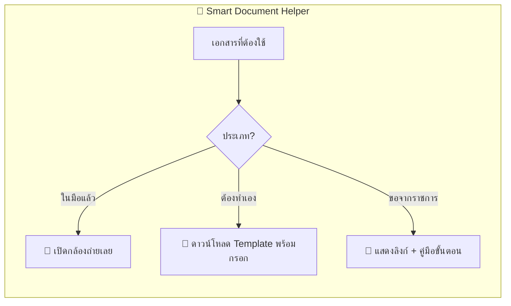
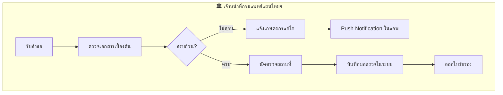

# Smart Workflow Design: Farmer-Friendly Document Collection
## ออกแบบ Workflow ที่เกษตรกรใช้งานง่าย

> **วันที่**: 10 ธันวาคม 2568  
> **หลักการ**: ลดภาระเกษตรกร เพิ่ม Smart Automation

---

## 1. Document Classification by Acquisition Difficulty

### 🟢 ง่าย - ในมือแล้ว (Self-Owned Documents)
เอกสารที่เกษตรกรมีอยู่แล้ว ไม่ต้องไปหาจากที่ไหน

| เอกสาร | ความยาก | Action ในแอพ |
|--------|---------|--------------|
| สำเนาบัตร ปชช. | 🟢 | ถ่ายรูปได้เลย |
| สำเนาทะเบียนบ้าน | 🟢 | ถ่ายรูปได้เลย |
| โฉนดที่ดิน | 🟢 | ถ่ายรูปได้เลย |
| รูปถ่ายสถานที่ | 🟢 | ถ่ายจากมือถือ |
| GPS พิกัด | 🟢 | อัตโนมัติจาก App |

### 🟡 ปานกลาง - ต้องทำเอง (Create Yourself)
เอกสารที่เกษตรกรต้องจัดทำ แต่แอพช่วยได้

| เอกสาร | ความยาก | Action ในแอพ |
|--------|---------|--------------|
| แผนที่ตั้ง | 🟡 | **แอพช่วย Generate จาก GPS** |
| SOP | 🟡 | **ให้ Template พร้อมกรอก** |
| มาตรการความปลอดภัย | 🟡 | **ให้ Template พร้อมกรอก** |
| หนังสือยินยอม | 🟡 | **ให้ Template ที่กรอกชื่อให้แล้ว** |
| แผนการปลูก | 🟡 | **Generate จากข้อมูล Step 6** |

### 🟠 ต้องติดต่อบุคคลอื่น (From Third Party)
เอกสารที่ต้องขอจากคนอื่นหรือหน่วยงาน

| เอกสาร | ความยาก | Action ในแอพ |
|--------|---------|--------------|
| สัญญาเช่า/ยินยอมจากเจ้าของที่ดิน | 🟠 | **ให้ Template + คำแนะนำ** |
| หนังสือสนับสนุนจากหน่วยงาน | 🟠 | **บอกหน่วยงานที่ติดต่อ** |

### 🔴 ต้องติดต่อราชการ (From Government)
เอกสารที่ต้องขอจากหน่วยงานราชการ

| เอกสาร | ความยาก | วิธีขอ | ระยะเวลา | ค่าใช้จ่าย |
|--------|---------|--------|----------|-----------|
| **ผลตรวจประวัติอาชญากรรม** | 🔴 | Online ได้! (criminal.police.go.th) | 5-7 วัน | 100 THB |
| หนังสือรับรองนิติบุคคล | 🔴 | กรมพัฒนาธุรกิจการค้า | 1-2 วัน | ~100 THB |

---

## 2. Smart Workflow Recommendations

### 2.1 In-App Helper System



### 2.2 Proposed UX for Criminal Background Check

แทนที่จะแค่บอกว่า "ต้องมีผลตรวจประวัติอาชญากรรม" ควรแสดง:

```
┌─────────────────────────────────────────────────────┐
│ 📋 ผลตรวจประวัติอาชญากรรม                           │
│ ─────────────────────────────────────                │
│ ⚠️ เอกสารนี้ต้องขอจากสำนักงานตำรวจแห่งชาติ          │
│                                                       │
│ 🌐 ขอออนไลน์ได้ที่:                                  │
│    criminal.police.go.th                              │
│    [เปิดเว็บไซต์]                                    │
│                                                       │
│ 💰 ค่าธรรมเนียม: 100 บาท                             │
│ ⏱️ รอผล: 5-7 วันทำการ                               │
│                                                       │
│ 💡 Tips: ควรทำก่อนเริ่มกรอกใบสมัคร                   │
│                                                       │
│ [ดูคู่มือขั้นตอน] [อัปโหลดผลตรวจ]                    │
└─────────────────────────────────────────────────────┘
```

### 2.3 "Documents to Prepare First" Notification

เมื่อเกษตรกรเลือกพืชและประเภทคำขอ ให้แสดง:

```
┌─────────────────────────────────────────────────────┐
│ 📦 เตรียมเอกสารก่อนเริ่ม (ใช้เวลา 1-2 สัปดาห์)      │
│ ─────────────────────────────────────                │
│                                                       │
│ 🔴 ต้องขอจากหน่วยงาน:                               │
│    ☐ ผลตรวจประวัติอาชญากรรม (5-7 วัน)               │
│    ☐ สัญญาเช่า/ยินยอมจากเจ้าของที่ดิน                │
│                                                       │
│ 🟢 มีในมือแล้ว - ถ่ายรูปใส่โฟลเดอร์รอ:               │
│    ☐ บัตรประชาชน                                     │
│    ☐ ทะเบียนบ้าน                                     │
│    ☐ โฉนดที่ดิน                                      │
│                                                       │
│ [เริ่มกรอกใบสมัคร] [รอเอกสารก่อน]                   │
└─────────────────────────────────────────────────────┘
```

---

## 3. DTAM Staff Workflow Consideration

### 3.1 ระบบตรวจสอบเอกสารฝั่ง Back-office



### 3.2 ประโยชน์ของ Pre-submission Checklist

| สำหรับเกษตรกร | สำหรับเจ้าหน้าที่ |
|--------------|------------------|
| รู้ว่าขาดอะไร ก่อนส่ง | ลดเวลาตรวจเอกสารไม่ครบ |
| ลดการถูกตีกลับ | ลดการติดต่อกลับ-ไป มา |
| เตรียมตัวได้ถูก | ประหยัดเวลาทำงาน |

---

## 4. Updated Implementation Priority

จากการวิเคราะห์ UX ปรับ Priority ใหม่:

### Phase 1A: Smart Helpers First (Priority 🔴) - 2 days
| Item | Rationale |
|------|-----------|
| Document Preparation Notification | ให้รู้ว่าต้องเตรียมอะไรก่อน |
| Criminal Check Helper UI | บอกลิงก์ + ค่าใช้จ่าย + ระยะเวลา |
| Land Ownership Logic | ระบุเอกสารที่ต้องใช้ชัด |

### Phase 1B: Core Document Slots (Priority 🔴) - 1 day
| Item | Rationale |
|------|-----------|
| สำเนาบัตร ปชช./ทะเบียนบ้าน | เพิ่ม Slots ธรรมดา |
| Applicant Type Logic | นิติบุคคล vs บุคคลธรรมดา |

### Phase 2: Photo Slots + Validation (Priority 🟡) - 2 days
| Item | Rationale |
|------|-----------|
| รูปถ่ายแยกหมวด | ลดการถามซ้ำ |
| Inline Validation | GPS format, เบอร์โทร format |

### Phase 3: Pre-submission Checklist (Priority 🔴) - 1 day
| Item | Rationale |
|------|-----------|
| Checklist Widget | Step 8 แสดงรายการขาด |
| Missing Item Highlight | สีเหลือง/แดง บอกชัดเจน |

---

## 5. สรุป: หลักการออกแบบ

1. **ให้ข้อมูลล่วงหน้า** - บอกก่อนว่าต้องเตรียมอะไร
2. **แยกประเภทเอกสาร** - ง่าย/ปานกลาง/ยาก
3. **ให้ Template พร้อมใช้** - ลดการพิมพ์ซ้ำ
4. **Deep Link ไปหน่วยงาน** - ไม่ต้องหาเอง
5. **Pre-check ก่อนส่ง** - ลดการตีกลับ

---

---

## 6. Comparison: herbctrl.dtam.moph.go.th vs Our Smart App

### 6.1 DTAM herbctrl Baseline System

ระบบเดิมที่กรมการแพทย์แผนไทยฯ:

| Feature | herbctrl (Baseline) |
|---------|--------------------|
| Platform | Web only |
| User Types | Individual / Juristic |
| Permit Types | ภ.ท.9, ภ.ท.10, ภ.ท.11 |
| Document Upload | Static list per permit type |
| GPS | Manual input |
| Validation | None before submit |
| Status Tracking | Yes |
| Mobile App | ❌ No |

### 6.2 Our Smart App Improvements

| Feature | herbctrl | Our App | Advantage |
|---------|----------|---------|----------|
| **Platform** | 🖥️ Web only | 📱 Mobile + Web | เกษตรกรใช้งานในแปลงได้ |
| **GPS** | Manual input | 📍 Auto capture | ไม่ต้องพิมพ์พิกัด |
| **Photos** | Upload only | 📸 In-app camera + guide | บอกว่าต้องถ่ายมุมไหน |
| **Documents** | Static list | 🧠 Dynamic by context | แสดงเฉพาะที่ต้องใช้ |
| **Validation** | None | ✅ Real-time check | เจอปัญหาก่อน Submit |
| **Templates** | ❌ None | 📝 Auto-fill templates | กรอกง่าย ไม่ต้องพิมพ์ซ้ำ |
| **Preparation Guide** | ❌ None | 📋 "ต้องเตรียมอะไรก่อน" | รู้ล่วงหน้าว่าต้องทำอะไร |
| **Pre-submit Check** | ❌ None | ⚠️ Missing item alert | ลดการตีกลับ |
| **External Links** | ❌ None | 🔗 Deep links + คู่มือ | หาเอกสารจากหน่วยงานได้ง่าย |
| **Offline Mode** | ❌ None | 📴 Draft saved locally | กรอกในแปลงที่ไม่มี Net |
| **Push Notifications** | ❌ None | 🔔 Status updates | รู้สถานะทันที |

### 6.3 Key Smart Features Summary

```
🧠 SMART FEATURES ที่ทำให้ดีกว่า herbctrl:

1. 📱 Mobile-First → ใช้งานในแปลงปลูกได้จริง
2. 📍 GPS Auto → ไม่ต้อง Copy พิกัดมาเอง  
3. 📸 Photo Guide → บอกว่าถ่ายมุมไหน อะไรบ้าง
4. 🧠 Smart Docs → แสดงเอกสารตามบริบท
5. 📝 Template → SOP/หนังสือยินยอม พร้อมกรอก
6. ⚠️ Pre-Check → เตือนก่อนส่ง ลดตีกลับ
7. 🔗 Helper Links → ลิงก์ไปหน่วยงานราชการ
8. 📴 Offline → บันทึก Draft ได้ไม่มี Net
9. 🔔 Push → แจ้งสถานะทันที
```

---

*Document created for UX optimization | 10 ธันวาคม 2568*
*Reference: herbctrl.dtam.moph.go.th*
