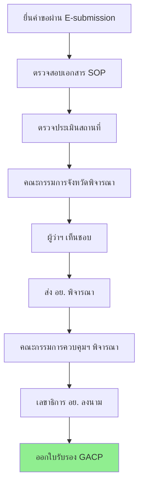

# วิจัยข้อมูล GACP ตามข้อมูลทางการจากกรมการแพทย์แผนไทยและการแพทย์ทางเลือก
## Official GACP Requirements Research - DTAM

> **วันที่วิจัย**: 10 ธันวาคม 2568  
> **แหล่งข้อมูล**: กรมการแพทย์แผนไทยและการแพทย์ทางเลือก (DTAM), กระทรวงสาธารณสุข  
> **อ้างอิง**: พ.ร.บ. คุ้มครองและส่งเสริมภูมิปัญญาการแพทย์แผนไทย พ.ศ. 2542

---

## 📋 สารบัญ
1. [มาตรฐาน GACP 14 หมวด](#1-มาตรฐาน-gacp-14-หมวด)
2. [ขั้นตอนการขอใบรับรอง](#2-ขั้นตอนการขอใบรับรอง)
3. [เอกสารประกอบการยื่นขอ](#3-เอกสารประกอบการยื่นขอ)
4. [ค่าใช้จ่าย](#4-คาใชจาย)
5. [Gap Analysis กับแอพปัจจุบัน](#5-gap-analysis-กับแอพปจจุบน)
6. [ข้อเสนอปรับปรุง Priority ใหม่](#6-ขอเสนอปรบปรง-priority-ใหม)

---

## 1. มาตรฐาน GACP 14 หมวด

กรมการแพทย์แผนไทยฯ กำหนดมาตรฐาน GACP 14 หมวดที่ต้องปฏิบัติตาม:

| # | หมวด (TH) | Category (EN) | คำอธิบาย |
|---|-----------|---------------|----------|
| 1 | **การประกันคุณภาพ** | Quality Assurance | ควบคุมทุกขั้นตอนการผลิต |
| 2 | **สุขลักษณะส่วนบุคคล** | Personal Hygiene | ความรู้, การแต่งกาย, ห้ามสูบบุหรี่ |
| 3 | **การบันทึกเอกสาร** | Documentation | SOP, ประวัติการผลิต, ใบรับรอง |
| 4 | **อุปกรณ์** | Equipment | สะอาด, สอบเทียบ, ป้องกันปนเปื้อน |
| 5 | **พื้นที่ปลูก** | Cultivation Site | ปราศจากโลหะหนัก/สารเคมี |
| 6 | **น้ำ** | Water | วิเคราะห์คุณภาพ, เหมาะสม |
| 7 | **ปุ๋ย** | Fertilizer | ขึ้นทะเบียน, ไม่ใช้สิ่งขับถ่ายคน |
| 8 | **เมล็ดพันธุ์** | Seeds & Propagation | แหล่งที่มาชัดเจน, ปลอดโรค |
| 9 | **การเพาะปลูก** | Cultivation Practices | เกษตรเชิงอนุรักษ์, IPM |
| 10 | **การเก็บเกี่ยว** | Harvesting | ระยะเวลาเหมาะสม, สะอาด |
| 11 | **แปรรูปเบื้องต้น** | Primary Processing | ควบคุมอุณหภูมิ/ความชื้น |
| 12 | **สถานที่แปรรูป** | Processing Facilities | แข็งแรง, สะอาด, แยกโซน |
| 13 | **การบรรจุ** | Packaging & Labeling | Food Grade, ฉลากชัดเจน |
| 14 | **การจัดเก็บ/ขนส่ง** | Storage & Distribution | ควบคุมสภาพแวดล้อม |

> ✅ **หมายเหตุ**: แอพปัจจุบันมี Step 1 แสดงมาตรฐาน 14 ข้อนี้ครบถ้วนแล้ว

---

## 2. ขั้นตอนการขอใบรับรอง

### 2.1 Flow การยื่นขอ GACP

### 2.2 รายละเอียดสำคัญ

| รายการ | รายละเอียด |
|--------|------------|
| **ระยะเวลาดำเนินการ** | ~120 วัน นับจากเอกสารครบ |
| **อายุใบรับรอง** | 1-3 ปี |
| **การตรวจประเมินประจำปี** | Annual Surveillance Audit |
| **ระบบยื่นคำขอ** | E-submission (dtam.moph.go.th) |
| **เก็บเอกสาร** | อย่างน้อย 5 ปี |

### 2.3 ประเภทการตรวจประเมิน

1. **Initial Inspection** - ครั้งแรกเมื่อยื่นคำขอ
2. **Annual Inspection** - ตรวจประจำปี
3. **Special Inspection** - กรณีร้องเรียน/สงสัย (อาจไม่แจ้งล่วงหน้า)

---

## 3. เอกสารประกอบการยื่นขอ

### 3.1 แบบฟอร์มหลัก

| แบบฟอร์ม | คำอธิบาย | สถานะในแอพ |
|----------|----------|------------|
| **แบบ กัญชา กทล 1** | ลงทะเบียนยื่นคำขอรับรองแหล่งผลิต | ⚠️ ขาด |
| **แบบ ภ.ท.12** | คำขอรับอนุญาตจำหน่าย/มีไว้ใน ครอบครอง | ⚠️ ขาด |
| **แบบ ภ.ท.11** | จำหน่าย/แปรรูปสมุนไพรควบคุม | ⚠️ ขาด |
| **คู่มือ SOP** | Standard Operating Procedure | ✅ Step 7 |

### 3.2 เอกสารประกอบ (บุคคลธรรมดา)

| # | เอกสาร | บังคับ | สถานะในแอพ |
|---|--------|--------|------------|
| 1 | สำเนาบัตรประจำตัวประชาชน | ✅ | ⚠️ เก็บ idCard แต่ไม่อัปโหลดภาพ |
| 2 | สำเนาทะเบียนบ้าน | ✅ | ❌ ขาด |
| 3 | แผนที่ + พิกัด GPS + รูปถ่าย | ✅ | ⚠️ มี GPS แต่ขาดรูปถ่ายสถานที่ชัด |
| 4 | หนังสือแสดงกรรมสิทธิ์ที่ดิน | ✅ | ⚠️ มี แต่ไม่ถาม Land Ownership |
| 5 | **สัญญาเช่า** (กรณีเช่า) | ⚠️ | ❌ ขาด Logic |
| 6 | **หนังสือยินยอมใช้ที่ดิน** (กรณีขอใช้) | ⚠️ | ❌ ขาด Logic |
| 7 | แผนการปลูกและแผนการใช้ประโยชน์ | ✅ | ✅ Step 6 |
| 8 | มาตรการรักษาความปลอดภัย | ✅ | ✅ Step 5 |
| 9 | **ผลตรวจสอบประวัติอาชญากรรม** | ✅ | ❌ ขาด |
| 10 | หนังสือสนับสนุนจากหน่วยงาน (กรณี วิสาหกิจ/บุคคลธรรมดา) | ⚠️ | ❌ ขาด |
| 11 | รายงานผลการดำเนินการที่ผ่านมา | ⚠️ | ❌ ขาด (สำหรับ Renewal) |

### 3.3 เอกสารเพิ่มเติม (นิติบุคคล)

| # | เอกสาร | สถานะในแอพ |
|---|--------|------------|
| 1 | หนังสือรับรองนิติบุคคล (อายุไม่เกิน 6 เดือน) | ❌ ขาด |
| 2 | หนังสือสำคัญแสดงการจดทะเบียนวิสาหกิจชุมชน | ❌ ขาด |
| 3 | สำเนาหนังสือสำคัญสหกรณ์การเกษตร | ❌ ขาด |

---

## 4. ค่าใช้จ่าย

### 4.1 ค่าธรรมเนียมใบอนุญาต (อย.)

| ประเภทใบอนุญาต | ค่าธรรมเนียม (THB) |
|----------------|------------------:|
| ผลิต (ปลูก/สกัด) | 50,000 |
| นำเข้า | 900,000 |
| ส่งออก | 90,000 |
| จำหน่าย | 4,000 |
| ค่าคำขออื่นๆ | 1,000 |

### 4.2 ค่าตรวจประเมิน GACP (กรมการแพทย์แผนไทยฯ)

| รายการ | ค่าใช้จ่าย (THB) |
|--------|----------------:|
| ค่าตรวจเอกสาร SOP (ต่อระบบ) | 5,000 |
| ค่าตรวจประเมินแปลงปลูก (ต่อครั้ง) | 30,000 |
| *ค่าเดินทางและที่พัก Auditor 3 ท่าน* | *ผู้ยื่นรับผิดชอบ* |

---

## 5. Gap Analysis กับแอพปัจจุบัน

### 5.1 Summary: พบ Gap เพิ่มเติม

จากการวิจัยข้อมูลทางการพบ Gap ใหม่ที่ต้องเพิ่มเติม:

| # | Gap | Priority | Action |
|---|-----|----------|--------|
| 1 | ❌ ไม่มีอัปโหลดสำเนาบัตร ปชช. | 🔴 | เพิ่มใน Step 7 |
| 2 | ❌ ไม่มีสำเนาทะเบียนบ้าน | 🔴 | เพิ่มใน Step 7 |
| 3 | ❌ **ไม่มีผลตรวจประวัติอาชญากรรม** | 🔴 *NEW* | เพิ่มใน Step 7 |
| 4 | ❌ ไม่มี Land Ownership Logic | 🔴 | เพิ่มใน Step 5 |
| 5 | ❌ ไม่มี Applicant Type Logic (นิติบุคคล) | 🔴 | เพิ่มใน Step 4, 7 |
| 6 | ❌ **ไม่มีหนังสือสนับสนุนจากหน่วยงาน** | 🟡 *NEW* | เพิ่มใน Step 7 (Conditional) |
| 7 | ⚠️ รูปถ่ายไม่แยกหมวด | 🟡 | แยก Slots |
| 8 | ❌ ไม่มี Pre-submission Check | 🔴 | เพิ่ม Step 8 Widget |
| 9 | ⚠️ **ไม่มีรายงานผลดำเนินการ (สำหรับ Renewal)** | 🟡 *NEW* | เพิ่มใน Step 7 (Renewal) |

### 5.2 Mapping ข้อกำหนด 14 หมวด กับ Wizard Steps

| GACP หมวด | Wizard Step | Coverage |
|-----------|-------------|----------|
| 1. Quality Assurance | Step 1 (Standards) | ✅ |
| 2. Personal Hygiene | Step 6 (Production) | ⚠️ partial |
| 3. Documentation | Step 7 (Docs) | ✅ |
| 4. Equipment | Step 6 (Production) | ⚠️ partial |
| 5. Cultivation Site | Step 5 (Security) | ✅ |
| 6. Water | Step 6 (Production) | ⚠️ partial |
| 7. Fertilizer | Step 6 (Farm Inputs) | ✅ |
| 8. Seeds/Propagation | Step 6 (Sourcing) | ✅ |
| 9. Cultivation Practices | Step 6 (Production) | ✅ |
| 10. Harvesting | Step 6 (Production Cycle) | ⚠️ partial |
| 11. Primary Processing | Step 6 (Post-Harvest) | ✅ |
| 12. Processing Facilities | Step 5 (Site) | ⚠️ partial |
| 13. Packaging & Labeling | Step 6 (Post-Harvest) | ✅ |
| 14. Storage & Distribution | Step 6 (Post-Harvest) | ✅ |

---

## 6. ข้อเสนอปรับปรุง Priority ใหม่

จากข้อมูลทางการ ปรับ Priority ดังนี้:

### Phase 1: Critical Legal Compliance (Priority 🔴) - 3 days

| Item | Action |
|------|--------|
| สำเนาบัตร ปชช. + ทะเบียนบ้าน | เพิ่ม Document Slots ใน Step 7 |
| **ผลตรวจประวัติอาชญากรรม** | เพิ่ม Document Slot (ใบรับรองจาก สตช.) |
| Land Ownership Logic | เพิ่ม Radio ใน Step 5 |
| Applicant Type Logic | เพิ่ม Conditional ใน Step 4 → 7 |

### Phase 2: Enhanced Document Management (Priority 🟡) - 2 days

| Item | Action |
|------|--------|
| รูปถ่ายแยกหมวด | 4 Slots: ภายนอก, ภายใน, คลัง, ป้าย |
| หนังสือสนับสนุนจากหน่วยงาน | Conditional: วิสาหกิจ/บุคคลธรรมดา |
| รายงานผลดำเนินการ | Conditional: Renewal Only |

### Phase 3: User Experience (Priority 🔴) - 1 day

| Item | Action |
|------|--------|
| Pre-submission Checklist | Widget ใน Step 8 แสดงรายการขาด |
| Validation Helpers | Inline hints + format validation |

---

## 7. แหล่งอ้างอิง

- กรมการแพทย์แผนไทยและการแพทย์ทางเลือก: https://dtam.moph.go.th
- E-submission ระบบยื่นขออนุญาต: https://privus.fda.moph.go.th
- พ.ร.บ. กัญชา กัญชง (ร่าง 2567)
- คู่มือ GACP มาตรฐานกัญชาทางการแพทย์

---

*Document compiled from official DTAM sources | 10 ธันวาคม 2568*
