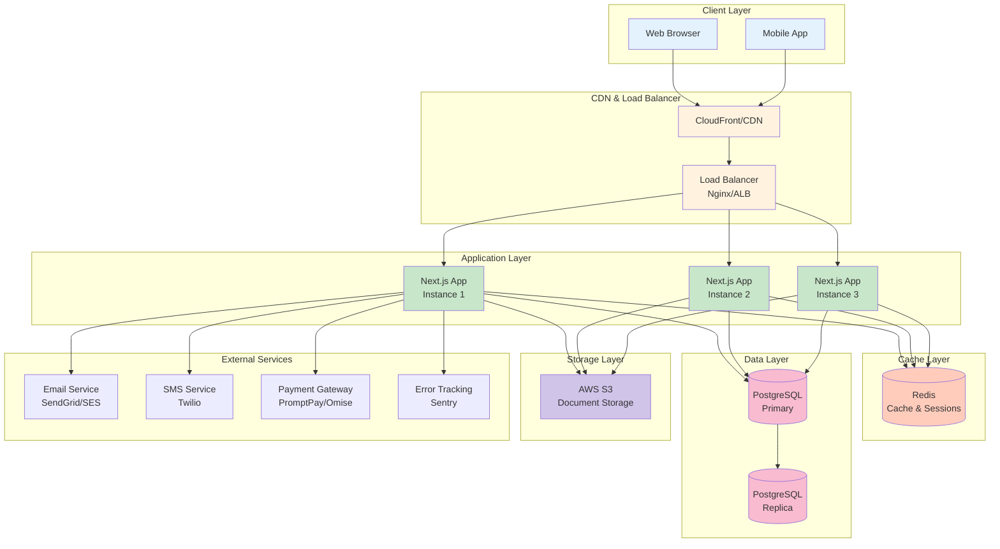
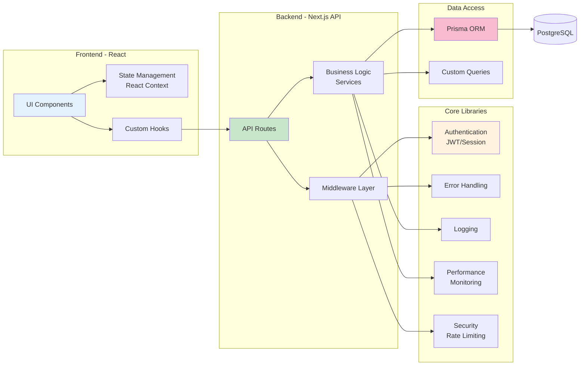
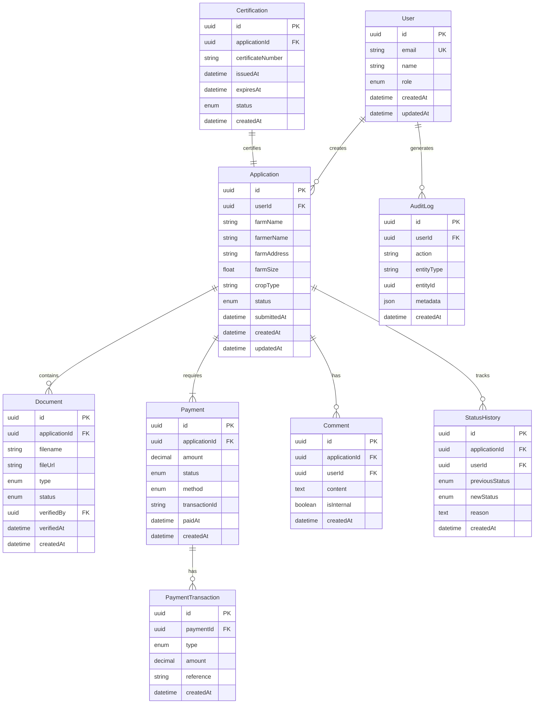
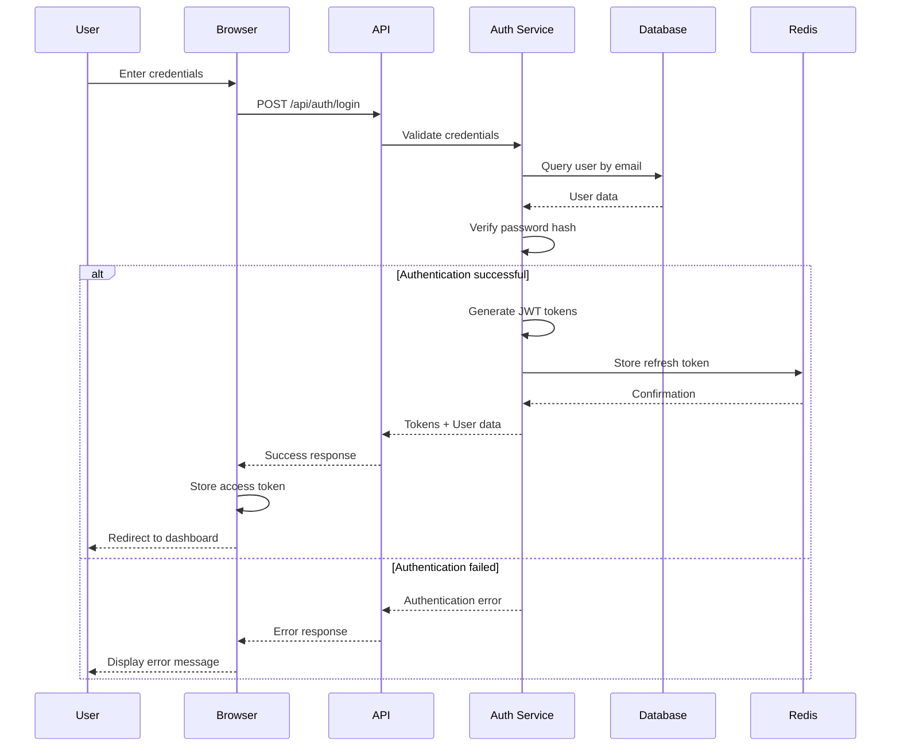
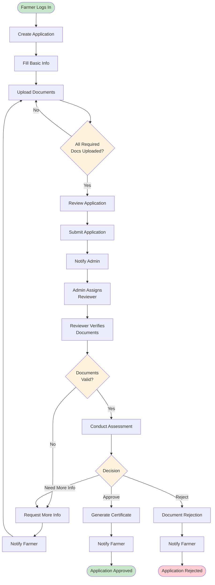
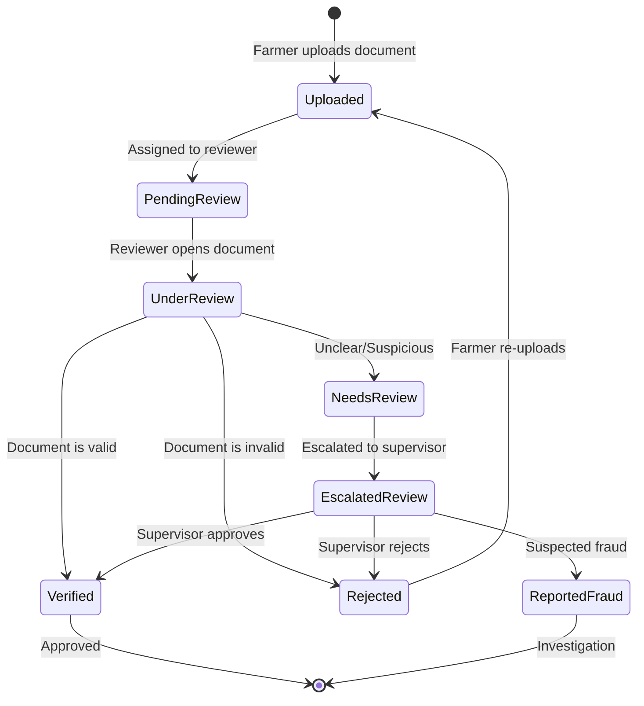
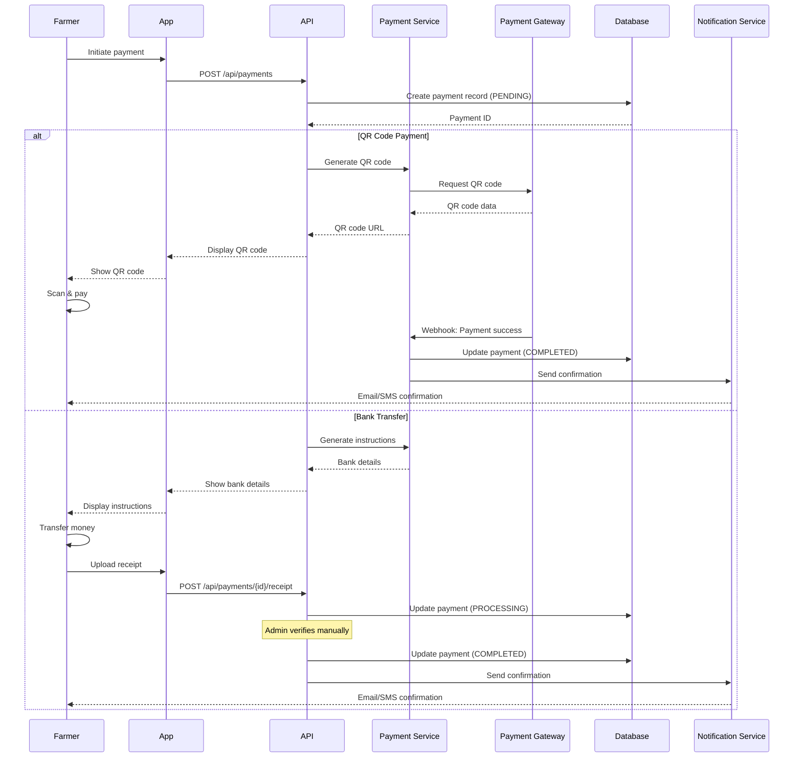
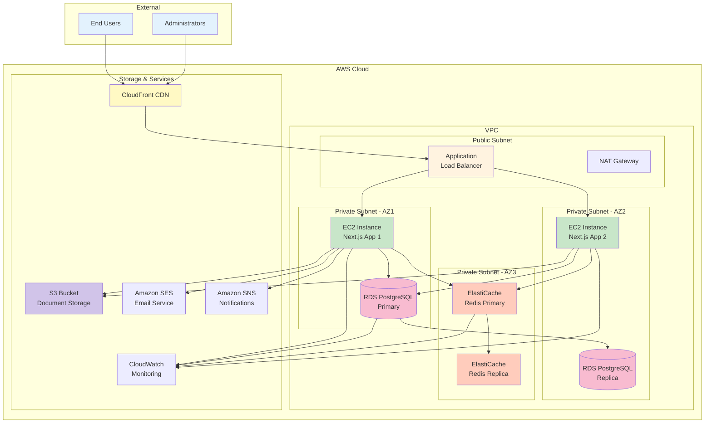
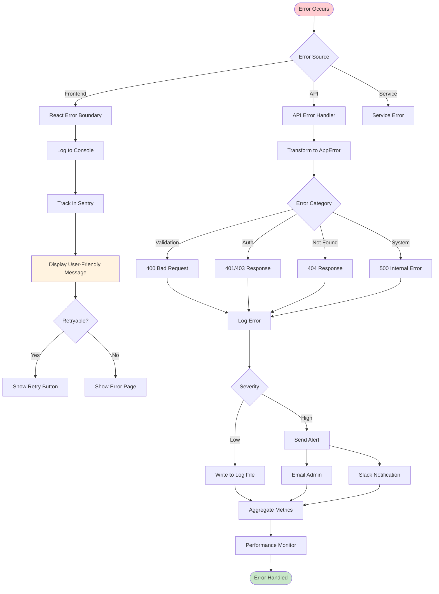

# System Architecture Diagrams

## GACP Certify Flow Admin Portal

This document contains visual architecture diagrams created with Mermaid.js to help understand the system structure, data flow, and deployment topology.

---

## Table of Contents

1. [System Architecture Overview](#system-architecture-overview)
2. [Application Architecture](#application-architecture)
3. [Database Schema](#database-schema)
4. [Authentication Flow](#authentication-flow)
5. [Application Submission Flow](#application-submission-flow)
6. [Document Verification Flow](#document-verification-flow)
7. [Payment Processing Flow](#payment-processing-flow)
8. [Deployment Architecture](#deployment-architecture)
9. [CI/CD Pipeline](#cicd-pipeline)

---

## System Architecture Overview

High-level view of the entire system:



---

## Application Architecture

Internal structure of the Next.js application:



---

## Database Schema

Entity Relationship Diagram:



---

## Authentication Flow

User authentication process:



---

## Application Submission Flow

End-to-end application submission process:



---

## Document Verification Flow

Document verification process:



---

## Payment Processing Flow

Payment processing sequence:



---

## Deployment Architecture

Production deployment on AWS:



---

## CI/CD Pipeline

Continuous Integration and Deployment pipeline:

```mermaid
flowchart LR
    DEV[Developer] -->|git push| GITHUB[GitHub Repository]

    GITHUB -->|Webhook| GH_ACTIONS[GitHub Actions]

    subgraph "CI Pipeline"
        GH_ACTIONS --> LINT[Lint & Format Check]
        LINT --> TYPE[TypeScript Check]
        TYPE --> TEST[Run Unit Tests]
        TEST --> BUILD[Build Application]
        BUILD --> SCAN[Security Scan]
    end

    SCAN -->|Success| DOCKER[Build Docker Image]
    DOCKER --> PUSH[Push to ECR/Docker Hub]

    subgraph "CD Pipeline - Staging"
        PUSH -->|Auto Deploy| STAGE_DEPLOY[Deploy to Staging]
        STAGE_DEPLOY --> STAGE_MIGRATE[Run Migrations]
        STAGE_MIGRATE --> STAGE_TEST[Integration Tests]
        STAGE_TEST --> STAGE_SMOKE[Smoke Tests]
    end

    STAGE_SMOKE -->|Manual Approval| PROD_DEPLOY[Deploy to Production]

    subgraph "CD Pipeline - Production"
        PROD_DEPLOY --> PROD_BACKUP[Backup Database]
        PROD_BACKUP --> PROD_MIGRATE[Run Migrations]
        PROD_MIGRATE --> PROD_BLUE[Deploy Blue/Green]
        PROD_BLUE --> PROD_HEALTH[Health Check]
        PROD_HEALTH --> PROD_SWITCH[Switch Traffic]
        PROD_SWITCH --> PROD_MONITOR[Monitor Metrics]
    end

    PROD_MONITOR -->|Issues Detected| ROLLBACK[Automatic Rollback]
    ROLLBACK --> PROD_BLUE

    PROD_MONITOR -->|Success| COMPLETE([Deployment Complete])

    style DEV fill:#e3f2fd
    style GITHUB fill:#333,color:#fff
    style GH_ACTIONS fill:#2088FF,color:#fff
    style DOCKER fill:#2496ED,color:#fff
    style COMPLETE fill:#c8e6c9
    style ROLLBACK fill:#ffcdd2
```



---

## Component Interaction Diagram

How different components interact:

```mermaid
graph TB
    subgraph "Frontend Components"
        PAGE[Page Component]
        FORM[Form Component]
        TABLE[Table Component]
        MODAL[Modal Component]
    end

    subgraph "State Management"
        CONTEXT[React Context]
        HOOKS[Custom Hooks]
    end

    subgraph "API Client"
        FETCH[Fetch Wrapper]
        AUTH_INT[Auth Interceptor]
        ERROR_INT[Error Interceptor]
    end

    subgraph "API Routes"
        AUTH_API[/api/auth]
        APP_API[/api/applications]
        DOC_API[/api/documents]
        PAY_API[/api/payments]
    end

    subgraph "Middleware"
        AUTH_MW[Auth Middleware]
        RATE_MW[Rate Limit MW]
        VALID_MW[Validation MW]
        ERROR_MW[Error MW]
    end

    subgraph "Services"
        AUTH_SVC[Auth Service]
        APP_SVC[Application Service]
        DOC_SVC[Document Service]
        PAY_SVC[Payment Service]
    end

    PAGE --> FORM
    PAGE --> TABLE
    FORM --> MODAL

    FORM --> HOOKS
    TABLE --> HOOKS
    HOOKS --> CONTEXT
    HOOKS --> FETCH

    FETCH --> AUTH_INT
    AUTH_INT --> ERROR_INT
    ERROR_INT --> AUTH_API
    ERROR_INT --> APP_API
    ERROR_INT --> DOC_API
    ERROR_INT --> PAY_API

    AUTH_API --> AUTH_MW
    APP_API --> AUTH_MW
    DOC_API --> AUTH_MW
    PAY_API --> AUTH_MW

    AUTH_MW --> RATE_MW
    RATE_MW --> VALID_MW
    VALID_MW --> ERROR_MW

    ERROR_MW --> AUTH_SVC
    ERROR_MW --> APP_SVC
    ERROR_MW --> DOC_SVC
    ERROR_MW --> PAY_SVC

    AUTH_SVC --> DB[(Database)]
    APP_SVC --> DB
    DOC_SVC --> DB
    PAY_SVC --> DB

    DOC_SVC --> S3[(S3 Storage)]

    style PAGE fill:#e3f2fd
    style CONTEXT fill:#fff3e0
    style FETCH fill:#c8e6c9
    style AUTH_MW fill:#ffccbc
    style AUTH_SVC fill:#f8bbd0
    style DB fill:#d1c4e9
```

---

## Error Handling Flow

How errors are handled throughout the system:



---

## Viewing These Diagrams

These Mermaid diagrams can be viewed in:

1. **GitHub**: Automatically renders in markdown files
2. **VS Code**: Install "Markdown Preview Mermaid Support" extension
3. **Mermaid Live Editor**: [https://mermaid.live](https://mermaid.live)
4. **Documentation Sites**: Docusaurus, MkDocs, GitBook (with plugins)

---

**Last Updated:** October 15, 2025  
**Version:** 1.0.0
