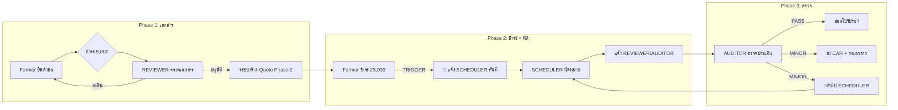

# Scope of Work (SOW): บุคลากรประจำระบบ GACP

> **หมายเหตุ**: Role ในระบบ Backend คือ `REVIEWER_AUDITOR`, `SCHEDULER`, `ACCOUNTANT`, `ADMIN`, `SUPER_ADMIN`

> [!CAUTION]
> **นโยบายสำคัญของระบบ:**
> 1. **ไม่มีทีม Support** - ทุกอย่างทำผ่านแพลตฟอร์มเท่านั้น ไม่มีการรับเรื่องทางโทรศัพท์/อีเมล
> 2. **ไม่มีการอุทธรณ์** - ผลการพิจารณาเป็นที่สิ้นสุด หากไม่ผ่านต้องยื่นใหม่
> 3. **กฎ 3 ครั้ง** - ตรวจฟาร์มไม่ผ่าน 3 ครั้ง = ต้องยื่นเอกสารใหม่ตั้งแต่ต้น + ชำระเงินใหม่

---

## 1. ตำแหน่ง: ผู้ตรวจสอบเอกสารและผู้ตรวจประเมิน (Reviewer / Auditor)
**Role ในระบบ**: `REVIEWER_AUDITOR`  
**บทบาทหลัก**: ทีมเดียวกันที่ทำหน้าที่ทั้งคัดกรองเอกสารและลงพื้นที่ตรวจประเมิน

### 📋 หน้าที่ที่ 1: ตรวจสอบเอกสาร (Document Review)
**เป้าหมาย**: คัดกรองความถูกต้องของเอกสาร ก่อนเข้าสู่กระบวนการจ่ายเงินงวดที่ 2

1. **ตรวจสอบคำขอรายใหม่/ต่ออายุ**:
    - ตรวจสอบความครบถ้วนถูกต้องของ แบบฟอร์ม 09, 10 และ 11 (ถ้ามี)
    - ตรวจสอบความถูกต้องของ เอกสารแนบ 22 รายการ (เช่น โฉนดที่ดิน, SOP, ผลแล็บ, ภาพถ่ายโรงเรือน) ว่าตรงตามมาตรฐาน GACP หรือไม่
2. **การพิจารณาและแจ้งแก้ไข (Review & Feedback)**:
    - กรณีเอกสารไม่ผ่าน: ต้องระบุจุดที่ผิดพลาดอย่างชัดเจนในระบบ (Comment) เพื่อให้เกษตรกรแก้ไขได้ตรงจุด
    - **เงื่อนไขสำคัญ**: ต้องตระหนักว่าระบบอนุญาตให้แก้ไขฟรีเพียง 2 ครั้ง หากส่งคืนครั้งที่ 3 เกษตรกรต้องเสียเงินใหม่ ดังนั้นการคอมเมนต์ต้องละเอียดและครบถ้วนในรอบเดียว
3. **การอนุมัติเอกสาร (Document Approval)**:
    - กดอนุมัติเอกสารในระบบ เมื่อข้อมูลถูกต้องครบถ้วน เพื่อให้ระบบส่งแจ้งเตือนการชำระเงินงวดที่ 2 (25,000 บาท)
4. **อนุมัติคำขอใบแทน (Replacement Approval)**:
    - ตรวจสอบคำขอ "ใบแทนใบรับรอง" (กรณีสูญหาย/ชำรุด)
    - ตรวจสอบหลักฐาน (ใบแจ้งความ/รูปถ่าย) และสลิปค่าธรรมเนียม
    - กดอนุมัติเพื่อออกใบแทนในระบบทันที (ไม่ต้องนัดตรวจใหม่)

### 🔍 หน้าที่ที่ 2: ตรวจประเมิน (Field Audit)
**เป้าหมาย**: ตรวจสอบการปฏิบัติจริงและตัดสินผลการรับรอง

1. **ดำเนินการตรวจประเมิน (Audit Execution)**:
    - ทำการตรวจประเมินตามมาตรฐาน GACP ผ่านช่องทาง Online (VDO Call) หรือ ลงพื้นที่จริง (On-site) ตามที่ได้รับมอบหมาย
    - ตรวจสอบการปฏิบัติงานจริงเทียบกับ SOP ที่ยื่นมาในระบบ
2. **บันทึกผลและหลักฐาน (Recording)**:
    - บันทึกผลการตรวจ (Checklist) ลงในระบบ
    - แนบหลักฐานประกอบ (เช่น รูปภาพหน้าจอขณะ VDO Call, รูปภาพแปลงปลูกที่พบปัญหา)
3. **ตัดสินผลการรับรอง (Decision Making)**:
    - เลือกผลการประเมินตาม Logic ระบบ:
        - ✅ **ผ่าน (Pass)**: กดอนุมัติเพื่อให้ระบบออกใบรับรอง
        - ⚠️ **แก้ไขเล็กน้อย (Minor)**: แจ้งรายการเอกสารที่ต้องการเพิ่ม (ระบบจะเปิดช่องให้ User อัปโหลดเพิ่ม ไม่ต้องนัดใหม่)
        - ❌ **ไม่ผ่าน/แก้ไขใหญ่ (Major)**: ออกใบ CARs (Corrective Action Request) และส่งเรื่องกลับไปที่ Scheduler เพื่อนัดตรวจใหม่

### 💻 การใช้งานระบบ (Dashboard Features)
**Tab 1: ตรวจเอกสาร (Document Review)**
- เมนู "รายการรอดำเนินการ (Pending Review)"
- เมนู "คำขอใบแทน (Replacement Request)"
- ฟังก์ชัน Preview เอกสาร
- ปุ่ม [ส่งคืนแก้ไข] / [อนุมัติเอกสาร] / [อนุมัติใบแทน]

**Tab 2: ตรวจประเมิน (Field Audit)**
- เมนู "งานตรวจที่ได้รับมอบหมาย (Assigned Audits)"
- ฟังก์ชัน Audit Checklist
- ปุ่ม [อนุมัติผล] / [ขอข้อมูลเพิ่ม] / [ไม่ผ่าน/นัดใหม่]

---

## 2. ตำแหน่ง: เจ้าหน้าที่จัดคิวและบริหารงาน (Scheduler / Operation Officer)
**Role ในระบบ**: `SCHEDULER`  
**บทบาทหลัก**: บริหารจัดการ Workflow และตารางนัดหมายหลังจากการชำระเงินงวดที่ 2 เสร็จสิ้น

### หน้าที่ความรับผิดชอบ (Key Responsibilities)
1. **บริหารตารางนัดหมาย (Scheduling)**:
    - ตรวจสอบรายการงานที่สถานะ "ชำระเงินงวดที่ 2 ครบถ้วน"
    - ประสานงานกับผู้ตรวจประเมิน (Auditor) เพื่อเช็ควันว่าง
    - ลงตารางนัดหมาย (Online/On-site) และกดมอบหมายงาน (Assign) ในระบบ
2. **จัดการกรณีการตรวจซ้ำ (Re-audit Management)**:
    - รับเรื่องกรณี Auditor แจ้งผล "ไม่ผ่าน (Major)"
    - ดำเนินการจัดคิวตรวจรอบใหม่ เมื่อเกษตรกรแจ้งความพร้อม
3. **ติดตามงานค้าง (Workload Tracking)**:
    - ดูภาพรวม Auditor แต่ละคนมีงานกี่คิว
    - จัดสรรงานให้เหมาะสมกับ capacity

### 💻 การใช้งานระบบ (Dashboard Features)
- เมนู "จัดการตารางนัดหมาย (Appointment Manager)"
- ปฏิทินกลาง (Calendar View) เพื่อดู Slot ว่างของ Auditor
- เมนู "งานรอมอบหมาย (Pending Assignment)"
- เมนู "งานตรวจซ้ำ (Re-audit Queue)"

---

## 3. ตำแหน่ง: พนักงานบัญชี (Accountant)
**Role ในระบบ**: `ACCOUNTANT`  
**บทบาทหลัก**: ตรวจสอบเอกสารทางการเงินและออกใบเสร็จรับเงิน

> [!NOTE]
> **ใบเสนอราคาและใบวางบิล** จะถูกสร้างอัตโนมัติจากระบบตาม Workflow 
> เมื่อเกษตรกร Approve แล้ว Accountant มีหน้าที่อัปเดตเลขที่ทางการและออกใบเสร็จเท่านั้น

### หน้าที่ความรับผิดชอบ (Key Responsibilities)
1. **ตรวจสอบและอัปเดตเลขที่เอกสาร (Document Number Update)**:
    - ตรวจสอบใบเสนอราคา/ใบวางบิลที่ระบบสร้างอัตโนมัติ
    - อัปเดตเลขที่เอกสารชั่วคราว → เลขที่ทางการ (ตามระบบบัญชีองค์กร)
    - ยืนยันความถูกต้องก่อนส่งให้เกษตรกร
2. **ออกใบเสร็จรับเงิน (Receipt Issuance)** ⭐:
    - ออกใบเสร็จรับเงินเมื่อได้รับการชำระ (งานหลัก)
    - กำหนดเลขที่ใบเสร็จทางการ
    - ยืนยันการรับเงินในระบบ
    - พิมพ์/ส่งใบเสร็จให้เกษตรกร
3. **รายงานทางการเงิน (Financial Reports)**:
    - ดูรายงานยอดรายได้รายวัน/รายเดือน
    - ดูรายงานใบวางบิลค้างชำระ
    - Export รายงานเป็น Excel/PDF สำหรับฝ่ายบัญชี

### ⚙️ สิ่งที่ระบบทำอัตโนมัติ (ไม่ต้องทำเอง)
| รายการ | ระบบทำ | Accountant ทำ |
|--------|--------|---------------|
| สร้างใบเสนอราคา | ✅ อัตโนมัติ | อัปเดตเลขทางการ |
| ส่งให้เกษตรกร Approve | ✅ อัตโนมัติ | - |
| สร้างใบวางบิล | ✅ อัตโนมัติ (หลัง Approve) | อัปเดตเลขทางการ |
| ออกใบเสร็จ | ❌ | ✅ ต้องทำเอง |

### 💻 การใช้งานระบบ (Dashboard Features)
- เมนู "รอออกใบเสร็จ (Pending Receipts)" - รายการที่ชำระแล้วรอออกใบเสร็จ
- เมนู "ใบเสร็จทั้งหมด (All Receipts)" - ค้นหา/พิมพ์ซ้ำ
- เมนู "อัปเดตเลขเอกสาร (Update Doc Number)" - Quote/Invoice รอเปลี่ยนเลข
- เมนู "รายงาน (Reports)" - สรุปยอดการเงิน
- ปุ่ม [ออกใบเสร็จ] / [อัปเดตเลขที่] / [Export]


---

## 4. ตำแหน่ง: ผู้ดูแลระบบ (Admin)
**Role ในระบบ**: `ADMIN`  
**บทบาทหลัก**: บริหารจัดการผู้ใช้งานและตั้งค่าระบบ

### หน้าที่ความรับผิดชอบ (Key Responsibilities)
1. **จัดการบัญชีพนักงาน (Staff Management)**:
    - สร้างบัญชีพนักงานใหม่ (Reviewer, Scheduler, Accountant)
    - แก้ไขข้อมูลพนักงาน
    - ระงับ/เปิดใช้งานบัญชี
    - กำหนด Region และ Team
2. **จัดการ Master Data**:
    - ข้อมูลพืชและเอกสารที่ต้องยื่น
    - ค่าธรรมเนียมบริการ
    - เทมเพลตเอกสาร
3. **ดูรายงานภาพรวม (Overview Reports)**:
    - จำนวนคำขอในแต่ละสถานะ
    - ประสิทธิภาพการทำงานของพนักงาน
    - ปัญหาที่พบบ่อย

### 💻 การใช้งานระบบ (Dashboard Features)
- เมนู "จัดการพนักงาน (Staff Management)"
- เมนู "ตั้งค่าระบบ (System Settings)"
- เมนู "Master Data"
- เมนู "รายงานภาพรวม (Admin Reports)"

---

## 5. ตำแหน่ง: ผู้ดูแลสูงสุด (Super Admin)
**Role ในระบบ**: `SUPER_ADMIN`  
**บทบาทหลัก**: สิทธิ์สูงสุดในระบบ ดูแลความปลอดภัยและการตั้งค่าระดับองค์กร

### หน้าที่ความรับผิดชอบ (Key Responsibilities)
1. **ทุกอย่างที่ Admin ทำได้** + เพิ่มเติม:
2. **จัดการ Admin**:
    - สร้าง/ลบบัญชี Admin
    - ตรวจสอบ Activity Log ของ Admin
3. **ความปลอดภัย (Security)**:
    - ตรวจสอบ Audit Log ของระบบ
    - จัดการ API Keys
    - ตั้งค่า Security Policies
4. **การตั้งค่าระดับองค์กร**:
    - ตั้งค่า Email/SMS Providers
    - ตั้งค่า Payment Gateway
    - Backup/Restore ข้อมูล

### 💻 การใช้งานระบบ (Dashboard Features)
- ทุกเมนูของ Admin +
- เมนู "Audit Logs"
- เมนู "Security Settings"
- เมนู "System Configuration"
- เมนู "Backup & Recovery"

---

## 📊 สรุป Roles และสิทธิ์

| Role | ตรวจเอกสาร | ตรวจประเมิน | จัดคิว | บัญชี | จัดการ Staff | ตั้งค่าระบบ |
|:-----|:----------:|:-----------:|:------:|:-----:|:------------:|:-----------:|
| REVIEWER_AUDITOR | ✅ | ✅ | ❌ | ❌ | ❌ | ❌ |
| SCHEDULER | ❌ | ❌ | ✅ | ❌ | ❌ | ❌ |
| ACCOUNTANT | ❌ | ❌ | ❌ | ✅ | ❌ | ❌ |
| ADMIN | 👁️ | 👁️ | 👁️ | 👁️ | ✅ | ✅ |
| SUPER_ADMIN | 👁️ | 👁️ | 👁️ | 👁️ | ✅ | ✅+ |

**Legend**: ✅ = ทำได้ | ❌ = ทำไม่ได้ | 👁️ = ดูได้อย่างเดียว | ✅+ = สิทธิ์พิเศษเพิ่ม

---

## 🔔 Notification Matrix (ใครได้รับแจ้งเตือนอะไร)

| เหตุการณ์ (Event) | FARMER | REVIEWER | SCHEDULER | ACCOUNTANT | ADMIN |
|:------------------|:------:|:--------:|:---------:|:----------:|:-----:|
| ยื่นคำขอใหม่ | ✅ | ✅ | ❌ | ❌ | ❌ |
| เอกสารถูกส่งคืนแก้ไข | ✅ 📧 | ❌ | ❌ | ❌ | ❌ |
| เอกสารอนุมัติ + ใบเสนอราคา | ✅ 📧 | ❌ | ❌ | ✅ | ❌ |
| เกษตรกร Approve Quote | ❌ | ❌ | ❌ | ✅ | ❌ |
| ชำระเงิน Phase 1 สำเร็จ | ✅ | ✅ | ❌ | ✅ | ❌ |
| ชำระเงิน Phase 2 สำเร็จ | ✅ | ❌ | ✅ 🚨 | ✅ | ❌ |
| นัดหมายตรวจประเมิน | ✅ 📧 | ✅ | ❌ | ❌ | ❌ |
| เกษตรกรขอเลื่อนวัน | ❌ | ❌ | ✅ 🚨 | ❌ | ❌ |
| ผลตรวจ: PASS | ✅ 📧🎉 | ❌ | ❌ | ❌ | ❌ |
| ผลตรวจ: MINOR (CAR) | ✅ 📧 | ❌ | ❌ | ❌ | ❌ |
| ผลตรวจ: MAJOR | ✅ 📧 | ❌ | ✅ | ❌ | ❌ |
| เกษตรกรส่งหลักฐาน CAR | ❌ | ✅ 🚨 | ❌ | ❌ | ❌ |
| ใบรับรองหมดอายุ (30 วัน) | ✅ 📧 | ❌ | ❌ | ❌ | ✅ |
| งานค้างเกิน SLA | ❌ | ✅ 🚨 | ✅ 🚨 | ✅ 🚨 | ✅ 🚨 |

**Legend**: ✅ = In-app | 📧 = Email | 🚨 = Priority/Urgent | 🎉 = Success celebration

---

## ⏱️ SLA (Service Level Agreement)

| กระบวนการ | ผู้รับผิดชอบ | SLA | Escalation |
|:----------|:------------|:----|:-----------|
| ตรวจสอบเอกสาร | REVIEWER | **≤ 5 วันทำการ** | แจ้ง Admin หลังวันที่ 3 |
| นัดหมายหลังชำระ Phase 2 | SCHEDULER | **≤ 3 วันทำการ** | แจ้ง Admin หลังวันที่ 2 |
| ทำรายงานหลังตรวจ | REVIEWER | **≤ 7 วัน** | แจ้ง Admin หลังวันที่ 5 |
| ออกใบเสร็จหลังชำระเงิน | ACCOUNTANT | **≤ 1 วันทำการ** | Auto-alert หลัง 4 ชม. |
| ตรวจ CAR หลังเกษตรกรส่ง | REVIEWER | **≤ 3 วันทำการ** | แจ้ง Admin หลังวันที่ 2 |
| ออกใบรับรองหลัง PASS | ระบบ | **ทันที (Auto)** | - |

> [!WARNING]
> **Escalation Rule**: หากงานค้างเกิน SLA โดยไม่มี Action, ระบบจะ:
> 1. แจ้งเตือน Admin อัตโนมัติ
> 2. แสดงสถานะ "OVERDUE" บน Dashboard
> 3. หลัง 2x SLA → Admin สามารถ Re-assign งานได้

---

## 🔗 Workflow Trigger (การเชื่อมโยงระหว่าง Roles)



### 🔑 Key Triggers

| Trigger | เงื่อนไข | Action | ผู้รับ |
|:--------|:--------|:-------|:------|
| **PAYMENT_PHASE2_COMPLETED** | เกษตรกรชำระ 25,000 สำเร็จ | สร้าง Task ใน Dashboard | SCHEDULER |
| **DOCUMENT_APPROVED** | Reviewer อนุมัติเอกสาร | สร้าง Quote อัตโนมัติ | FARMER, ACCOUNTANT |
| **AUDIT_COMPLETED_MAJOR** | Auditor กด "ไม่ผ่าน" | สร้างงานนัดใหม่ | SCHEDULER |
| **CAR_SUBMITTED** | เกษตรกร Upload หลักฐาน | สร้าง Review Task | REVIEWER |
| **CERTIFICATE_EXPIRING** | ใบรับรองจะหมดอายุใน 30 วัน | แจ้งเตือน Renewal | FARMER |

---

## 👨‍🌾 Farmer Journey (มุมมองเกษตรกร)

### Dashboard ของเกษตรกร

```
┌─────────────────────────────────────────────────────────────┐
│ 🌿 สวัสดี คุณสมชาย | ฟาร์มสมุนไพรเชียงใหม่                    │
├─────────────────────────────────────────────────────────────┤
│                                                             │
│ ┌─ คำขอปัจจุบัน ───────────────────────────────────────────┐ │
│ │ 📋 APP-2025-000123                                       │ │
│ │ สถานะ: 🟡 รอนัดหมายตรวจประเมิน                           │ │
│ │ ขั้นตอนถัดไป: รอ Scheduler นัดวัน (ภายใน 3 วัน)          │ │
│ │                                                         │ │
│ │ Progress: ████████████████░░░░░░░░ 70%                   │ │
│ │ [1.ยื่น ✓] [2.ชำระ ✓] [3.ตรวจเอกสาร ✓]                   │ │
│ │ [4.ชำระงวด2 ✓] [5.นัดตรวจ ◯] [6.ตรวจประเมิน ◯] [7.ผล ◯] │ │
│ └─────────────────────────────────────────────────────────┘ │
│                                                             │
│ ┌─ การแจ้งเตือน ─────────────────────────────────────────┐  │
│ │ 🔔 2 ชม.ที่แล้ว - ชำระเงินสำเร็จ 25,000 บาท             │  │
│ │ 📧 วานนี้ - เอกสารผ่านการตรวจสอบแล้ว                    │  │
│ └─────────────────────────────────────────────────────────┘  │
│                                                             │
│ [📝 ดูรายละเอียดคำขอ] [❓ คำถามที่พบบ่อย] [📜 ดูเอกสารแนะนำ]      │
└─────────────────────────────────────────────────────────────┘
```

### สิ่งที่เกษตรกรทำได้ในแต่ละสถานะ

| สถานะ | เกษตรกรเห็น | เกษตรกรทำได้ |
|:------|:-----------|:-------------|
| รอตรวจเอกสาร | Progress bar, Estimated time | ดูรายละเอียด, ดู FAQ |
| ส่งคืนแก้ไข | Comment จาก Reviewer | แก้ไข + Re-submit |
| รอชำระ Phase 2 | ใบเสนอราคา, ปุ่มชำระเงิน | Approve Quote, ชำระเงิน |
| นัดหมายแล้ว | วันเวลา, ชื่อ Auditor | **ขอเลื่อนวัน** (ก่อน 3 วัน) |
| รอแก้ไข (CAR) | รายการที่ต้องแก้, Deadline | Upload หลักฐาน |
| ผ่าน | ใบรับรอง (PDF), QR Code | ดาวน์โหลด, แชร์ |


